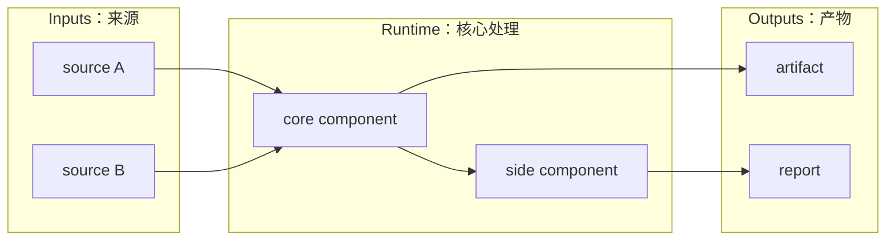

# XiaoBa-CLI Agent Instructions

This repository uses spec-driven engineering. When working on a module, keep its design and execution plan together so humans can quickly understand both the target architecture and current progress.

## Module Docs Rule

Each substantial module should maintain:

- `SPEC.md`: direction, scope, architecture, data contracts, boundaries, and design decisions.
- `PLAN.md`: current status, completed work, remaining work, owners, priority, milestones, and acceptance criteria.

Examples of modules, not an exhaustive list:

- `benchmarks/`
- `roles/`
- `roles/<role-name>/`
- future runtime, harness, skill, dashboard, adapter, logging, replay, verifier, or other durable subsystems when they grow large enough.

Small utilities do not need their own spec/plan unless they become a durable subsystem.

## SPEC.md Expectations

`SPEC.md` should answer:

- What problem does this module solve?
- What is in scope and out of scope?
- What are the main concepts and boundaries?
- What is the target architecture?
- What data contracts, schemas, APIs, or file layouts matter?
- How does this module interact with other modules?

Each substantial `SPEC.md` should include at least one simple Mermaid architecture diagram. Prefer readable modular diagrams over one giant diagram.

Preferred diagram style:

Keep diagrams simple, horizontal, and uncolored unless there is a strong reason otherwise.

## PLAN.md Expectations

`PLAN.md` should answer:

- What is already done?
- What is partially done?
- What is not started?
- What is the recommended next step?
- Who owns each class of work?
- What are the acceptance criteria?
- What changed since the last major planning update?

`PLAN.md` should include a current-state architecture or progress diagram when helpful. The plan diagram should emphasize status and progress, not ideal design only.

Suggested sections:

- Current Status
- Milestones
- Next Steps
- Owners
- Acceptance Criteria
- Risks / Open Questions
- Status Maintenance Rules

## Spec / Plan Coupling

Specs and plans must stay in sync:

- If `SPEC.md` adds a concept, field, boundary, component, or phase, update `PLAN.md`.
- If `PLAN.md` marks a milestone complete, update the relevant `SPEC.md` current-status section.
- If implementation deviates from `SPEC.md`, either adjust implementation or update the spec with the new decision.
- Do not leave a plan item marked done unless code, docs, and verification evidence support it.

## Benchmark Module Convention

For `benchmarks/`:

- `benchmarks/SPEC.md` defines the generic trace -> episode -> case -> replay -> verifier -> scorecard architecture.
- `benchmarks/PLAN.md` maintains current progress and next implementation milestones.
- Each benchmark folder can add its own `SPEC.md` and `EVALUATION.md`.
- Do not call a trace catalog a complete replay benchmark until replay cases, verifiers, and scorecards exist.

## Role Module Convention

For `roles/` and `roles/<role-name>/`:

- Role docs should clearly describe responsibility boundaries.
- `InspectorCat` discovers issues and routes them.
- `EngineerCat` implements fixes.
- `ReviewerCat` owns replay, verification, scorecard, and closed/reopened decisions.
- `ResearcherCat` owns long-running research workflow state, not runtime benchmark replay.

## Working Rule

Before major code changes, check the relevant `SPEC.md` and `PLAN.md`. After major code changes, update both if the design, state, or next steps changed.
