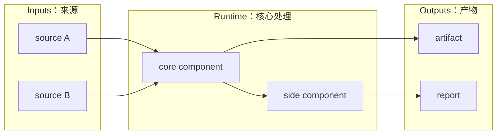

# XiaoBa-CLI Agent Instructions

This repository uses spec / plan driven engineering. Development is gated by architecture clarity: keep the repository and each durable module's design, target architecture, execution plan, and verification status together so humans can quickly understand what exists now, what is being built next, and why.

## Module Docs Rule

The project-level source of truth lives under `docs/`:

- `docs/SPEC.md`: repository-wide architecture, boundaries, core concepts, data contracts, and module relationships.
- `docs/PLAN.md`: repository-wide current status, milestones, completed work, remaining work, next steps, owners, acceptance criteria, risks, and verification evidence.

Each substantial long-lived module must maintain:

- `SPEC.md`: direction, scope, architecture, data contracts, boundaries, and design decisions.
- `PLAN.md`: current status, completed work, remaining work, owners, priority, milestones, and acceptance criteria.

Examples of modules, not an exhaustive list:

- `eval/benchmarks/`
- `roles/`
- `roles/<role-name>/`
- future runtime, harness, skill, dashboard, adapter, logging, replay, verifier, or other durable subsystems when they grow large enough.

Small utilities do not need their own spec/plan unless they become a durable subsystem.

## SPEC.md Expectations

`SPEC.md` should answer:

- What problem does this module solve?
- What is in scope and out of scope?
- What are the main concepts and boundaries?
- What is the target architecture?
- What data contracts, schemas, APIs, or file layouts matter?
- How does this module interact with other modules?

Each substantial `SPEC.md` must include two simple Mermaid architecture diagrams:

1. `Current Architecture`
   - Describe the architecture that the current code actually implements.
   - Keep it consistent with the implementation.
   - Do not turn it into an aspirational design.

2. `Target Architecture`
   - Describe the architecture the current development effort is moving toward.
   - Make it clear enough to guide implementation decisions.
   - If the target architecture is unclear or disputed, stop and clarify it before writing production code.

Prefer readable modular diagrams over one giant diagram. Keep diagrams simple, horizontal, and uncolored unless there is a strong reason otherwise.

Preferred diagram style:

## PLAN.md Expectations

`PLAN.md` should answer:

- What is already done?
- What is partially done?
- What is not started?
- What is the recommended next step?
- Who owns each class of work?
- What are the acceptance criteria?
- What changed since the last major planning update?

`PLAN.md` should include a current-state architecture or progress diagram when helpful. The plan diagram should emphasize status and progress, not ideal design only.

Suggested sections:

- Current Status
- Milestones
- Next Steps
- Owners
- Acceptance Criteria
- Risks / Open Questions
- Status Maintenance Rules

## Spec / Plan Coupling

Specs and plans must stay in sync:

- If `SPEC.md` adds a concept, field, boundary, component, or phase, update `PLAN.md`.
- If `PLAN.md` marks a milestone complete, update the relevant `SPEC.md` current-status section.
- If implementation deviates from `SPEC.md`, either adjust implementation or update the spec with the new decision.
- Do not leave a plan item marked done unless code, docs, and verification evidence support it.

## Development Gate

Before substantial code changes:

- Check `docs/SPEC.md` and `docs/PLAN.md`.
- Check the relevant module `SPEC.md` and `PLAN.md` when the change touches a long-lived module.
- Confirm that the relevant `SPEC.md` has both `Current Architecture` and `Target Architecture` Mermaid diagrams.
- Confirm that the `Target Architecture` matches the user's requested direction.

If there is no clear `Target Architecture` Mermaid diagram, or if the target diagram does not match the requested work, update or discuss the target architecture first. Do not proceed into production implementation until the target Mermaid architecture is clear.

After substantial code changes:

- Update `Current Architecture` in the relevant `SPEC.md` if the implemented architecture changed.
- Update `Target Architecture` if the intended direction changed or if the target has been reached and needs to be reset.
- Update `PLAN.md` with completed work, remaining work, next steps, acceptance criteria, risks, and verification evidence.

## Benchmark Module Convention

For `eval/benchmarks/`:

- `eval/benchmarks/SPEC.md` defines the generic trace -> episode -> case -> replay -> verifier -> scorecard architecture.
- `eval/benchmarks/PLAN.md` maintains current progress and next implementation milestones.
- Each benchmark folder can add its own `SPEC.md` and `EVALUATION.md`.
- Do not call a trace catalog a complete replay benchmark until replay cases, verifiers, and scorecards exist.

## Role Module Convention

For `roles/` and `roles/<role-name>/`:

- Role docs should clearly describe responsibility boundaries.
- `InspectorCat` discovers issues and routes them.
- `EngineerCat` implements fixes.
- `ReviewerCat` owns replay, verification, scorecard, and closed/reopened decisions.
- `ResearcherCat` owns long-running research workflow state, not runtime benchmark replay.

## Working Rule

Architecture first, then implementation. A substantial change should not begin until the relevant target Mermaid architecture is understood well enough to guide the work.
