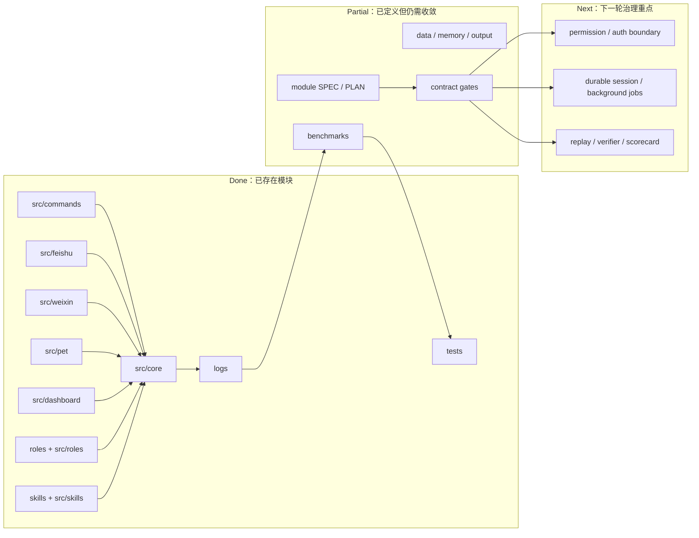

# XiaoBa-CLI PLAN

状态：Active
最后更新：2026-05-30
Owner：XiaoBa maintainers

本文维护 XiaoBa-CLI 仓库级执行计划。根目录 `SPEC.md` 定义项目级架构和 contract，本文维护当前状态、下一步、验收条件和验证证据。五个顶层模块的状态继续放在各自的小 `PLAN.md`；更细的 durable 子模块可以继续维护自己的 `SPEC.md` / `PLAN.md`。

## Current Status

XiaoBa-CLI 当前是一套本地优先、message-native 的 agent harness runtime。CLI、Feishu、Weixin、Pet、Dashboard 等入口都收敛到同一套核心 runtime；roles 和 skills 提供行为策略；session log、data、memory 和 output 构成当前证据与状态资产；benchmarks 和 tests 是回归反馈入口。文档治理口径现在固定为一个根级大 `SPEC.md` 加五个顶层模块小 spec：Surfaces、Harness Runtime、Roles & Skills、State & Evidence、Evaluation Gates。

已完成：

- 根 `SPEC.md` 定义 harness 边界、三层状态模型、message-native runtime、logging/evidence、evaluation 和 hard contracts。
- 五个顶层模块 spec/plan 已建立或对齐：`surfaces/`、`harness/`、`roles/`、`state-evidence/`、`benchmarks/`。
- `dashboard/` 已有 Room、Pet Chat visible history、service control 和 config control 的模块文档。
- `benchmarks/` 已有 trace -> episode -> case -> replay -> verifier -> scorecard 的目标规范和 BioBench 计划。
- `roles/engineer-cat/` 和 `roles/reviewer-cat/` 已有角色级 SPEC/PLAN。
- `roles/inspector-cat/` 和 `roles/researcher-cat/` 已有 README、role.json、prompt 和 role skills。

部分完成：

- 文档治理已补齐根 `PLAN.md` 和主要 SPEC 的 Current/Target 架构图，但后续实现改动仍需持续维护。
- session log 已是 benchmark 的主要输入方向，但结构化 artifact evidence、tool status 和 transcript verifier 仍不完整。
- Role runtime 已支持多角色，但 role policy、tool policy、global active role 和 room role-scoped runtime 仍需进一步统一。
- Dashboard Room 可运行多 role agents，但 durable room trace、Reviewer eval 和外部 A2A 仍未完成。
- Memory 正在从“session archive 自动 recall”收敛为“`data/sessions` 恢复上下文 + `memory/sessions/*/MEMORY.md` 按需长期记忆”。

未开始或未闭环：

- 权限、Dashboard/Pet 鉴权、skill install 安全边界。
- durable background job / subagent persistence。
- contract / invariant CI hard gate。
- all-roles release gate。

## Milestones

1. M0：Spec / Plan governance baseline：completed for root and the five top-level module specs.
2. M1：Permission and control-plane security boundary：not started.
3. M2：Structured tool result and delivery evidence：not started.
4. M3：Durable session / background job state：not started.
5. M4：Contract replay and verifier gate：partial through benchmarks spec, implementation not started.
6. M5：All-roles release gate：not started.

## Next Steps

- Fix permission and auth boundaries before expanding network-exposed Dashboard/Pet control surfaces.
- Promote `ToolResult` and outbound delivery evidence from string-derived logs to structured runtime facts.
- Split provider transcript, working trace, and durable session persistence so replay and crash recovery share one evidence model.
- Finish the memory refactor so `data/sessions` remains the only default restore path and `memory/sessions/*/MEMORY.md` stores concise on-demand long-term notes.
- Implement contract / invariant cases for transcript completeness, redaction, artifact evidence, timeout, retry budget, and JSONL compatibility.
- Add all-roles release gate that runs or blocks EngineerCat, ReviewerCat, InspectorCat, and ResearcherCat with explicit evidence.

## Owners

- Runtime harness：`src/core/**`
- Surfaces：`src/commands/**`, `src/feishu/**`, `src/weixin/**`, `src/pet/**`, `src/dashboard/**`
- Provider adapters：`src/providers/**`
- Tool boundary：`src/tools/**`, `src/types/tool.ts`
- Roles：`roles/**`, `src/roles/**`
- Skills：`skills/**`, `src/skills/**`
- Evaluation：`benchmarks/**`, `tests/**`
- Documentation governance：root `SPEC.md` / `PLAN.md` and module SPEC/PLAN owners.

## Acceptance Criteria

- Root `SPEC.md` and `PLAN.md` exist and stay in sync.
- The five top-level module specs exist and stay discoverable from root `SPEC.md`: `surfaces/SPEC.md`, `harness/SPEC.md`, `roles/SPEC.md`, `state-evidence/SPEC.md`, and `benchmarks/SPEC.md`.
- Every substantial long-lived module has `SPEC.md` and `PLAN.md`, or a documented reason why it is still a small utility.
- Every substantial `SPEC.md` includes `Current Architecture` and `Target Architecture` Mermaid diagrams.
- Any production architecture change updates the relevant current diagram and plan status in the same change.
- A milestone is marked complete only when code, docs, and verification evidence support it.
- Security-sensitive surfaces have explicit auth, permission, and command/path validation boundaries before being treated as network-ready.

## Verification Log

- 2026-05-29：Created root `PLAN.md` and aligned root `SPEC.md` with Current/Target architecture diagrams using module-level nodes.
- 2026-05-29：Reviewed existing module docs for dashboard, benchmarks, roles, EngineerCat, ReviewerCat, InspectorCat, and ResearcherCat before updating governance docs.
- 2026-05-29：Unified explicit surface delivery for Feishu, Weixin, Pet, and Dashboard Room; `npm run build` and targeted runner/session/surface tests passed.
- 2026-05-29：Tightened message-native delivery contract so channel surfaces treat `send_text` / `send_file` as the normal user-visible path and final direct replies as logged fallback only; the delivery instruction is injected once by `AgentSession` for channel surfaces instead of being copied into base/role prompts. Verification：`npm run build` passed; targeted runner/session/pet/feishu tests passed. Full `npm test` reached 193/194 passing and still fails at `tests/dashboard-skills-api.test.ts:135` (`restored` is undefined), which also fails in isolation.
- 2026-05-30：Started memory architecture refactor target: session context restore stays in `data/sessions`; long-term per-session/person notes move to Markdown under `memory/sessions/*/MEMORY.md` and are not default-injected into provider prompts.
- 2026-05-30：Aligned top-level governance to one root spec plus five module specs; added missing Surfaces, Harness Runtime, and State/Evidence module SPEC/PLAN files and linked all five from root `SPEC.md`.

## Risks / Open Questions

- Existing code still has security and evidence gaps; this plan documents them but does not claim they are fixed.
- Some modules have aspirational target architecture that is not implemented yet; plans must keep those gaps visible.
- Memory extraction must stay conservative: only stable user preferences, habits, default behavior and explicit remember-style facts should enter long-term MD memory.
- CI does not yet enforce the spec/plan gate, so doc drift remains possible without reviewer discipline.

## Status Maintenance Rules

- Update this file whenever root `SPEC.md` adds, removes, or changes a top-level module, contract, or boundary.
- Module owners update their own `PLAN.md` when module `SPEC.md` changes.
- Do not use a single root Mermaid diagram to hide module-level complexity; root diagrams should remain module-name maps, and module specs should carry the details.
- Do not mark release readiness from README claims alone; use verification evidence from tests, benchmarks, logs, or explicit blocked reasons.
