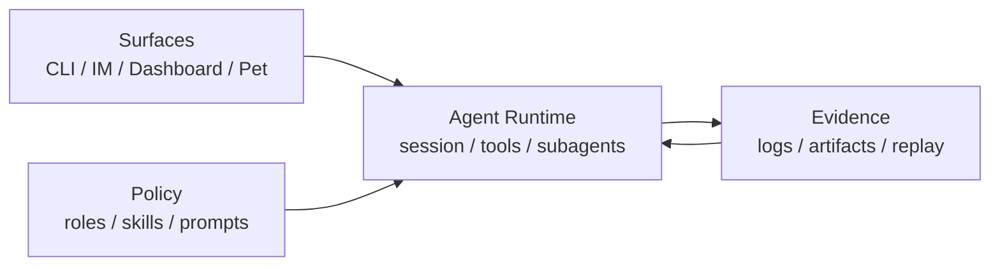

<div align="center">
  

  # XiaoBa

  **A local-first AI colleague runtime for chats, tools, and long-running context.**

  XiaoBa puts agents where work actually starts: IM, Dashboard, files, tools, and local state.

  [](LICENSE)
  [](package.json)
  [](https://github.com/fightheyyy/XiaoBa-CLI)

  [简体中文](README.md) · [Quickstart](#quickstart) · [Default Package](#default-package) · [Docs](#docs)
</div>

---

## What Is XiaoBa?

XiaoBa is not another terminal chat wrapper, and it is not just a bot that replies in a group chat.

It is closer to a local-first **agent OS / AI colleague runtime**:

- One shared agent loop across CLI, Dashboard, Feishu, Weixin, desktop pet, and future surfaces.
- Agents can read files, run commands, call tools, and deliver messages or files.
- Roles, skills, subagents, long-running context, logs, and replayable evidence are first-class.
- Long tasks can keep running in the background while the main conversation stays responsive.

In short: **XiaoBa gives AI agents a colleague-shaped body that can work, deliver, and adapt to you.**

## Why?

Real work often starts in a message, not in an IDE:

- "Can you look at this bug?"
- "Please organize this file."
- "Run this in the background and tell me when it finishes."
- "Make this agent behave more like my own style over time."

XiaoBa is the middle layer that connects chats, files, local tools, role identity, and runtime evidence, so an agent can do more than answer.

## Quickstart

```bash
git clone https://github.com/fightheyyy/XiaoBa-CLI.git
cd XiaoBa-CLI
npm install
cp .env.example .env
```

Add your model config to `.env`:

```env
XIAOBA_LLM_PROVIDER=openai
XIAOBA_LLM_API_BASE=https://api.openai.com/v1
XIAOBA_LLM_API_KEY=your_api_key
XIAOBA_LLM_MODEL=your_model
```

Start local chat:

```bash
npm run dev -- chat -i
```

Start the desktop Dashboard:

```bash
npm run electron:dev
```

Build a macOS installer:

```bash
npm run electron:build:mac
```

The generated installer is written to `release/XiaoBa-<version>-mac.dmg`.

## Default Package

The default Electron package is intentionally clean:

- No roles are preinstalled.
- Only 5 base skills are bundled: `remember`, `role-publish`, `self-evolution`, `skill-publish`, and `agent-browser`.
- `spawn_subagent`, file tools, shell, grep, message/file delivery, and related capabilities are runtime tools, not bundled skills.

The development repository can still contain roles and experimental capabilities; the default user package does not force them into the install.

## Common Commands

| Goal | Command |
| --- | --- |
| Interactive chat | `npm run dev -- chat -i` |
| One-shot message | `npm run dev -- chat -m "Summarize this project"` |
| Dashboard | `npm run electron:dev` |
| Build | `npm run build` |
| Test | `npm test` |
| macOS package | `npm run electron:build:mac` |

## Core Concepts



- **Surface**: user entry points such as CLI, Feishu, Weixin, Dashboard, and desktop pet.
- **Runtime**: the shared agent loop for providers, tools, context, subagents, and delivery.
- **Roles / Skills**: colleague identities and reusable workflows kept separate from runtime mechanics.
- **Evidence**: logs, artifacts, traces, and evals that make behavior reviewable and improvable.

## Docs

- [Project Architecture](docs/SPEC.md)
- [Project Plan](docs/PLAN.md)
- [Agent Runtime](docs/agent-runtime/SPEC.md)
- [Surface](docs/surface/SPEC.md)
- [Roles & Skills](docs/roles-skills/SPEC.md)
- [Observability & Evidence](docs/observability-evidence/SPEC.md)
- [Skills Guide](skills/README.md)
- [Roles Guide](roles/README.md)

## Status

XiaoBa is still moving quickly. Current focus areas are desktop distribution, IM-native runtime, role/skill ecosystem, and verifiable background task loops.

## License

Apache-2.0
