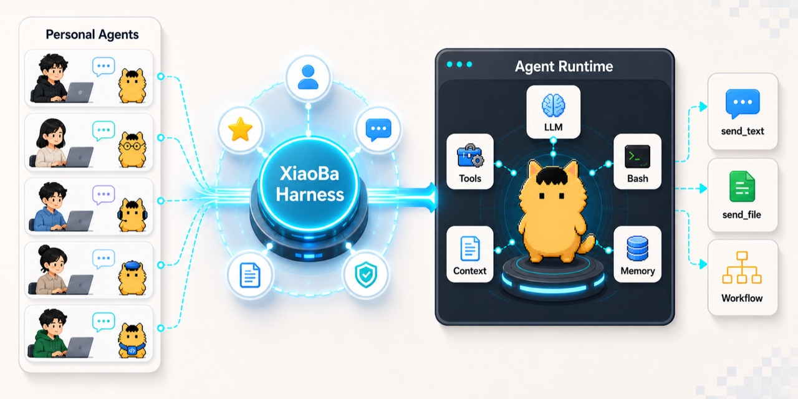
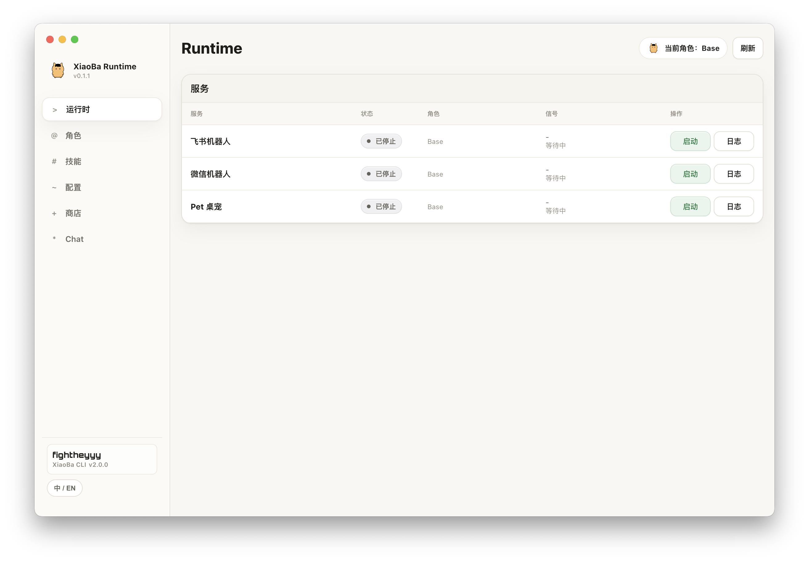
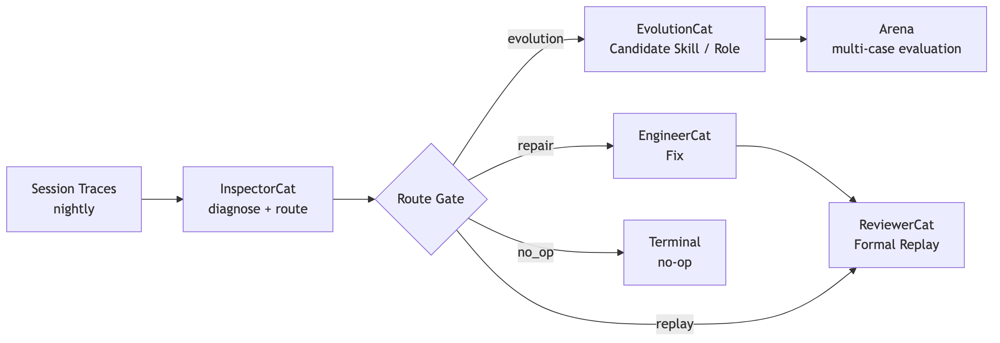

<div align="center">
  

  # XiaoBa-CLI

  **An IM-native AI coworker runtime built to keep evolving.**

  Send work to XiaoBa. It owns the conversation and dispatch, lets role agents execute in the background, then returns deliverables with replayable evidence.

  <em>Message your work. XiaoBa works like a teammate.</em>

  [](https://github.com/fightheyyy/XiaoBa-CLI/releases/tag/v0.1.1)
  [](https://github.com/fightheyyy/XiaoBa-CLI/releases/tag/v0.1.1)
  [](package.json)
  [](LICENSE)

  [Download macOS Preview](https://github.com/fightheyyy/XiaoBa-CLI/releases/tag/v0.1.1) · [Quick Start](#quick-start) · [How It Works](#how-it-works) · [Self-Evolution](#self-evolution-workflow) · [Evidence & Evaluation](#evidence--evaluation) · [简体中文](README.md)

  <sub>The current desktop package is an Apple Silicon technical preview. It is ad-hoc signed and not yet Apple-notarized.</sub>
</div>

---

## Send Work to XiaoBa

XiaoBa-CLI is not another chatbot that only produces more text. It is an **AI coworker harness runtime** designed around real workflows: the Base Main Agent is the only user-facing conversation and dispatch layer, specialist roles take over long-running work, and one shared runtime owns tool execution, recovery, delivery, and evidence.

| What you need done | How XiaoBa takes over | What comes back |
| --- | --- | --- |
| Change code, fix a bug, verify a build | EngineerCat works inside the repository and engineering environment | Code changes, test results, and artifact evidence |
| Browse sites, collect research, verify a page | BrowserCat works through a bounded browser driver | Structured results, sources, and page evidence |
| Operate a desktop application | GuiCat works through a macOS GUI driver | Action results and GUI evidence |
| Work with Feishu calendars, messages, tasks, and docs | SecretaryCat delegates workflows to the official `lark-cli` | Feishu results, files, and delivery evidence |
| Review a new skill or role | The independent Arena runs UserCat scenarios, Inspector evidence extraction, and multi-attempt replay/compare | An Arena scorecard and an explicit decision |

Runtime state, traces, and artifact evidence stay local by default. Model providers can be configured through OpenAI-compatible, Anthropic, Ollama, or other compatible endpoints.

## How It Works

```text
CLI / Feishu / WeChat / Pet / Dashboard
                    |
                    v
    Base Main Agent: conversation and dispatch
                    |
                    v
     Role Subagent: specialist background work
                    |
                    v
        Tools / Drivers / Files / Messages
                    |
                    v
      Deliverables + Trace + Replay + Scorecard
```

- **One control plane**: Base is the only user-facing main agent; four functional Roles and four internal continuous-improvement Roles reuse the same XiaoBa Agent loop.
- **Two role groups**: functional Roles take over user work; internal continuous-improvement Roles participate on demand in trace production, diagnosis, capability generation, and independent replay rather than forming a second always-on system.
- **Deterministic capability boundaries**: browser, GUI, and Feishu drivers provide capabilities without starting another Chat, Agent, or MCP loop.
- **Deliverable-first completion**: files, messages, and tool results become structured evidence; “the model said it finished” is not completion.
- **Local replayability**: traces, artifacts, deliveries, replay, and scorecards form an inspectable evidence chain.

## Runtime Dashboard

<p align="center">
  
</p>

<p align="center"><sub>The Electron Dashboard brings runtime services, roles, skills, configuration, the store, and Chat into one local entry point.</sub></p>

## Eight Default Roles: 4 Functional + 4 Internal Continuous-Improvement

The Base Main Agent owns user communication, judgment, and dispatch. The eight Roles are specialist profiles on one shared Runtime, not eight independent agent frameworks. Base ships with zero persistent default Skills.

### Four Functional Roles

These Roles directly take over user work and own the tools, permissions, and delivery boundary for their domain.

| Role | Responsibility |
| --- | --- |
| EngineerCat | Owns code, repositories, and builds; it can also implement explicitly handed-off Inspector/Reviewer repairs |
| BrowserCat | Takes over browser tasks through bounded, verifiable page operations |
| GuiCat | Takes over macOS desktop GUI tasks |
| SecretaryCat | Takes over Feishu workflows; `FeishuCat` is an alias and official `lark-cli` supplies domain capabilities |

### Four Internal Continuous-Improvement Roles

These Roles serve evaluation and self-evolution workflows. They start only when needed and do not run together as four always-on agents.

| Role | Responsibility |
| --- | --- |
| UserCat | Acts as an internal evaluation actor, pressures candidates with low-information realistic behavior, and produces candidate traces; it is not the fixed upstream source for nightly traces |
| InspectorCat | Finds problems across real session traces, tool facts, and artifacts; preserves evidence and emits a typed route |
| EvolutionCat | Turns Inspector-identified reusable patterns into candidate Skills/Roles and owns explicit publishing workflows; `remember` is its deterministic runtime tool |
| ReviewerCat | Formally replays one Replay Case in a clean session and returns `closed / next_run / blocked`; Arena independently aggregates capability scorecards |

This is a responsibility split, not two Runtimes. The four internal Roles do not form a linear chain that always runs end to end: nightly processing starts with InspectorCat, EvolutionCat and ReviewerCat participate by route, UserCat is mainly used for on-demand testing and Arena scenarios, and `repair` may call the functional EngineerCat.

## Self-Evolution Workflow

XiaoBa does not evolve by asking Base to improvise a reflection inside a conversation. It uses a deterministic cross-role DAG started nightly by the runtime. InspectorCat is always the first internal role: it scans session traces and produces evidence-backed findings with typed routes. Internal continuous-improvement Roles participate by route rather than all starting every night.

<p align="center">
  
</p>

The `evolution` route lets EvolutionCat produce candidate Skills/Roles for multi-case evaluation in the independent Arena. The `repair` route goes through EngineerCat and then formal replay by ReviewerCat, `replay` goes directly to ReviewerCat, and `no_op` terminates explicitly when there is no sufficient signal. Candidates never mutate the default bundle automatically; publishing remains explicit.

## Quick Start

### macOS Desktop Preview

[Download XiaoBa v0.1.1 for macOS](https://github.com/fightheyyy/XiaoBa-CLI/releases/tag/v0.1.1)

- The current DMG targets Apple Silicon (arm64).
- It is a public technical preview, not a signed and notarized stable release.
- See the release notes for the checksum, source commit, and known limitations.

### CLI / Source

Node.js 18 or newer is required:

```bash
git clone https://github.com/fightheyyy/XiaoBa-CLI.git
cd XiaoBa-CLI
npm install
cp .env.example .env
```

Configure a model in `.env`:

```env
XIAOBA_LLM_PROVIDER=openai
XIAOBA_LLM_API_BASE=https://api.openai.com/v1
XIAOBA_LLM_API_KEY=your_api_key
XIAOBA_LLM_MODEL=your_model
```

Start the interactive CLI:

```bash
npm run dev -- chat -i
```

Start with a specific role:

```bash
npm run dev -- chat -r engineer-cat -i
```

Start the Electron Dashboard:

```bash
npm run electron:dev
```

See [`requirement.txt`](requirement.txt) for role-specific CLI and platform dependencies used by BrowserCat, GuiCat, SecretaryCat, and other roles. Install and authorize them only when you need the corresponding role.

## Evidence & Evaluation

XiaoBa turns “done” into inspectable facts instead of relying on a plausible-looking response.

| Evidence layer | Current purpose |
| --- | --- |
| Trace | Records model, tool, failure, delivery, and runtime-event facts for one user request |
| Artifact / Delivery Evidence | Records files, messages, external receipts, and actual delivery outcomes |
| Trace Replay | Drives the current runtime from historical user intent to observe behavioral changes |
| Live Agent Eval | Fresh-runs the current runtime on curated cases and applies hard verifiers |
| Arena | Reviews candidate skills and roles in a clean runtime and emits an auditable scorecard |

BaseRuntime currently maintains 11 fresh-run live cases. Arena also calibrates UserCat, InspectorCat, and ReviewerCat against seven SkillsBench-derived controlled cases. This supports only a narrow claim about those controlled samples; it is not evidence that every provider, skill, or future version is stable.

```bash
npm test
npm run replay:trace
npm run eval:base-runtime
npm run check:benchmarks
```

See the [Evaluation SPEC](docs/evaluation/SPEC.md) and [Arena Calibration Evidence](docs/arena/SPEC.md#calibration-evidence) for the claim boundaries. Recent verification status lives only in the [Project PLAN](docs/PLAN.md), so README numbers do not become a stale changelog.

## Arena: Review Capabilities Before Trusting Them

Arena does not trust a skill because its instructions look convincing. A candidate enters an isolated clean runtime and goes through UserCat scenarios, Inspector evidence extraction, and Arena-owned multi-attempt replay/compare before receiving a `pass`, `unstable`, `reopened`, `blocked`, or `unsafe` decision. ReviewerCat is reserved for formal replay of one DAG Replay Case.

```bash
xiaoba arena skill <skill-name>
```

Arena supports exactly three review modes: `base + skill`, `role + skill`, and `role`. Promotion is an explicit human action; Arena does not automatically mutate production `skills/` or role registration.

## Current Boundaries

- The macOS Electron DMG remains an unnotarized Apple Silicon preview.
- BrowserCat, GuiCat, and SecretaryCat depend on pinned or official external drivers/CLIs and require the corresponding installation, permissions, or login state.
- Dashboard, Pet, and Bridge control surfaces are currently intended for local use and do not yet have complete authentication and Owner authorization for untrusted networks.
- Trace Replay can execute current real side effects. Do not batch-replay arbitrary historical traces without review until side-effect isolation is complete.

## Common Commands

| Goal | Source development | CLI bin |
| --- | --- | --- |
| Interactive chat | `npm run dev -- chat -i` | `xiaoba chat -i` |
| Single message | `npm run dev -- chat -m "summarize this repo"` | `xiaoba chat -m "summarize this repo"` |
| Role chat | `npm run dev -- chat -r engineer-cat -i` | `xiaoba chat -r engineer-cat -i` |
| Review a skill | `npm run dev -- arena skill <skill-name>` | `xiaoba arena skill <skill-name>` |
| Run nightly evolution | `npm run dev -- evolution sleep` | `xiaoba evolution sleep` |
| Install the macOS 03:17 schedule | `npm run dev -- evolution schedule install` | `xiaoba evolution schedule install` |
| Dashboard | `npm run electron:dev` | - |
| Build | `npm run build` | - |
| Test | `npm test` | - |

## Docs & Community

- [Project Architecture](docs/SPEC.md)
- [Project Status / Plan](docs/PLAN.md)
- [Roles Guide](roles/README.md)
- [Skills Guide](skills/README.md)
- [Releases](https://github.com/fightheyyy/XiaoBa-CLI/releases)
- [Discussions](https://github.com/fightheyyy/XiaoBa-CLI/discussions)
- [Issues](https://github.com/fightheyyy/XiaoBa-CLI/issues)

## License

[Apache-2.0](LICENSE)
