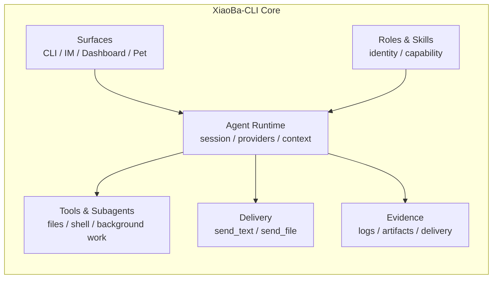
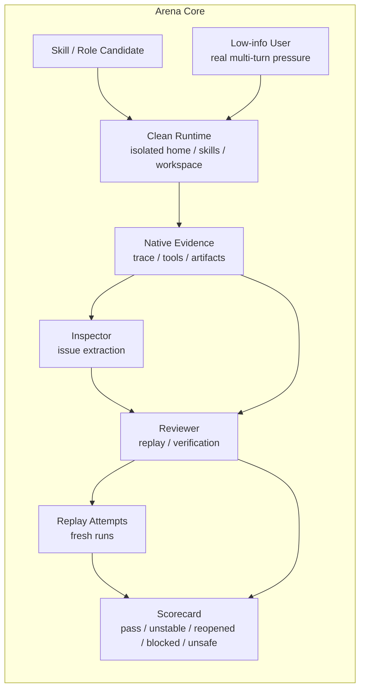

<div align="center">
  

  # XiaoBa-CLI

  **Local-first Personal Agent Runtime with replayable traces & Arena-based capability review.**

  XiaoBa-CLI lets personal agents live where work starts: chat, files, tools, long-running tasks, & delivery.

  It is not just a chatbot shell. XiaoBa gives agents a runtime body, records what they actually did, replays past traces against the current system, & uses Arena to judge whether a skill or role is reliable enough to trust.

  > Agents should not only answer. They should act, leave evidence, replay, & survive review.

  [](LICENSE)
  [](package.json)
  [](https://github.com/fightheyyy/XiaoBa-CLI)

  [简体中文](README.md) · [Quick Start](#quick-start) · [Why XiaoBa](#why-xiaoba) · [Core Concepts](#core-concepts) · [Docs](#docs)

  <br>

  
</div>

---

## Why XiaoBa

### 1. Runtime

Give agents a working body: chat surfaces, roles, skills, tools, subagents, memory, files, & user-visible delivery.

### 2. Replay & Regression

Record real sessions as replayable traces, then rerun them against the current runtime to catch regressions, fake success, missing artifacts, & unstable behavior.

### 3. Arena

Review skills & roles before trusting them: run them in a clean runtime, pressure them with low-information users, inspect native evidence, replay failure cases, & produce scorecards.





---

## What Is XiaoBa?

XiaoBa-CLI is a local-first runtime for personal agents.

XiaoBa is for developers building personal agents, local tool agents, role/skill systems, or long-running AI coworkers that need evidence & regression.

The user sees an AI coworker in chat. Under the hood, XiaoBa connects model providers, tools, roles, skills, subagents, local files, delivery channels, session logs, trace replay, & Arena review gates into one recoverable loop.

Most agent projects stop at "the agent replied." XiaoBa cares about what happened after that:

- Did it call the right tools?
- Did it produce the promised file?
- Did the user actually receive the result?
- Can the same task be replayed later?
- Does the skill still work after the runtime changes?
- Should this role or skill be trusted?

---

## Quick Start

```bash
git clone https://github.com/fightheyyy/XiaoBa-CLI.git
cd XiaoBa-CLI
npm install
cp .env.example .env
```

Configure a model provider in `.env`:

```env
XIAOBA_LLM_PROVIDER=openai
XIAOBA_LLM_API_BASE=https://api.openai.com/v1
XIAOBA_LLM_API_KEY=your_api_key
XIAOBA_LLM_MODEL=your_model
```

Use `npm run dev -- <command>` while developing from source:

```bash
npm run dev -- chat -i
```

Run with a role:

```bash
npm run dev -- chat -r engineer-cat -i
npm run dev -- chat -r reviewer-cat -i
```

If the CLI bin is available through a package install or `npm link`, the equivalent commands are:

```bash
xiaoba chat -i
xiaoba chat -r engineer-cat -i
xiaoba arena skill <skill-name>
```

Start the desktop Dashboard:

```bash
npm run electron:dev
```

---

## Core Concepts

### Runtime

XiaoBa's runtime coordinates user messages, role policy, skill activation, tool calls, subagents, model providers, memory, file artifacts, & delivery evidence. The model decides the next step; the runtime owns the engineering boundary.

### Roles

Roles are bounded agent identities, not just prompt styles. A role can define responsibility, tool visibility, skills, handoff behavior, & review expectations.

Default core roles:

- `user-cat`: low-information end-user pressure for producing realistic usage traces.
- `inspector-cat`: reads logs & evidence, finds failure signals, & extracts issues.
- `engineer-cat`: engineering implementation role with local tools & background task paths.
- `reviewer-cat`: reviews, replays, verifies artifacts, & decides whether work is acceptable.

### Skills

Skills are local instruction packs that teach agents repeatable capabilities. XiaoBa supports base skills, role-local skills, & GitHub-imported skills.

Default base skills:

- `remember`
- `role-publish`
- `self-evolution`
- `skill-publish`
- `agent-browser`

### Delivery

Delivery means user-visible output, not internal final text. XiaoBa distinguishes "the model said it was done" from "the user actually received the result" through `send_text`, `send_file`, file artifacts, & delivery evidence.

### Trace Replay

A real session can become a replayable trace. XiaoBa can rerun historical user inputs against the current runtime to produce fresh evidence & catch regressions, fake success, missing artifacts, & broken tool boundaries.

### Arena

Arena is XiaoBa's local capability review ground. It evaluates skills & roles inside clean runtimes with low-information user pressure, native trace and artifact evidence, replay attempts, & scorecards.

Arena decisions:

```text
pass / unstable / reopened / blocked / unsafe
```

---

## Common Commands

| Goal | Source development | CLI bin |
| --- | --- | --- |
| Interactive chat | `npm run dev -- chat -i` | `xiaoba chat -i` |
| Single message | `npm run dev -- chat -m "summarize this repo"` | `xiaoba chat -m "summarize this repo"` |
| Role chat | `npm run dev -- chat -r engineer-cat -i` | `xiaoba chat -r engineer-cat -i` |
| Dashboard | `npm run electron:dev` | - |
| Build | `npm run build` | - |
| Test | `npm test` | - |
| macOS package | `npm run electron:build:mac` | - |
| Evaluate a skill with Arena | `npm run dev -- arena skill <skill-name>` | `xiaoba arena skill <skill-name>` |

---

## Default Package

The default Electron package is intentionally clean: it bundles 4 core roles (`user-cat`, `inspector-cat`, `engineer-cat`, `reviewer-cat`) & 5 base skills (`remember`, `role-publish`, `self-evolution`, `skill-publish`, `agent-browser`). More roles & skills enter through explicit installation.

---

## Status

XiaoBa-CLI is moving quickly. Current focus areas are the local-first runtime, IM / Dashboard surfaces, roles & skills, trace replay, Arena-based capability admission, & verifiable background task loops.

Arena currently has live proof on the SkillsBench-derived `offer-letter-generator` dev seed and `citation-check` holdout seed. Broader generalization still requires 4-10 additional holdout cases before making large benchmark claims.

---

## Arena Proof

Arena's evidence is not only self-reported. The current dev + holdout SkillsBench-derived live proofs are:

- `skillsbench.offer-letter-generator.v1`: hidden verifier `pass`, replay 1 pass / 2 fail, Arena correctly decided `unstable`.
- `skillsbench.citation-check.v1`: hidden verifier `pass`, replay 1 pass / 1 fail, Arena correctly decided `unstable`.

This proves that the `UserCat -> InspectorCat -> ReviewerCat` loop can preserve evidence, extract cases, run fresh replay, and decide `unstable` when the external verifier passes but replay is mixed. It does not claim that all skills are already stable.

Full proof boundaries:

- [Cat Effectiveness Technical Report](docs/arena/CAT_EFFECTIVENESS_REPORT.md)
- [Arena Effectiveness Experiment](docs/arena/ARENA_EFFECTIVENESS_EXPERIMENT.md)

---

## Docs

- [Docs Index](docs/README.md)
- [Project SPEC](docs/SPEC.md)
- [Project PLAN](docs/PLAN.md)
- [Agent Runtime SPEC](docs/agent-runtime/SPEC.md)
- [Trace Replay SPEC](docs/trace-replay/SPEC.md)
- [Arena SPEC](docs/arena/SPEC.md)
- [Arena PLAN](docs/arena/PLAN.md)
- [Skills Guide](skills/README.md)
- [Roles Guide](roles/README.md)

## License

Apache-2.0
