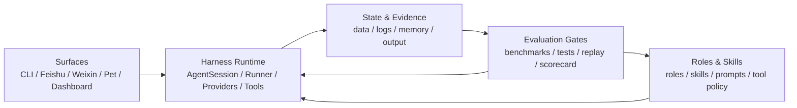
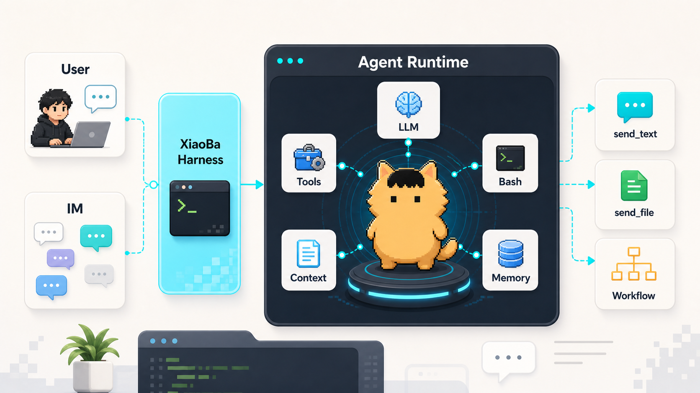

<div align="center">
  

  # XiaoBa

  **XiaoBa: an IM-native AI colleague.**

  **It lives where work starts: chats, files, tasks, tools, and long-running context.**

  **Under the hood, XiaoBa is a local-first AI role runtime for colleagues that grow with you.**

  [](https://github.com/fightheyyy/XiaoBa-CLI/actions/workflows/ci.yml)
  [](LICENSE)
  [](package.json)
  [](https://github.com/fightheyyy/XiaoBa-CLI)

  [简体中文](README.md)

  [Quickstart](#quickstart) · [Why XiaoBa](#why-xiaoba) · [Roles](#roles) · [IM Surfaces](#im-surfaces) · [Architecture](#architecture) · [Docs](#docs)
</div>

---

## What Is XiaoBa?

XiaoBa is not another terminal chat wrapper, and it is not just a bot that replies in a group.

XiaoBa is an **IM-native AI colleague**: a long-lived role that can stay in your chats, understand group/private context, receive files and tasks, call tools or coding agents in the background, and report progress back where the work started.

The product face is a colleague in chat. The technical base is a **local-first AI role runtime**: roles, skills, tools, subagents, logs, memory, and feedback loops shaped around your real environment.

```text
IM message / CLI prompt
  -> XiaoBa colleague
  -> Role runtime
  -> Skills + tools + subagents
  -> Computer / files / projects / shell / Codex / Claude Code / AutoDev
  -> Natural reply, file delivery, progress update, or case handoff
```

The core idea:

> XiaoBa gives AI agents an IM-native body and a colleague-shaped role inside your real environment.

---

## Colleague Runtime Vision

AI character products prove that roles can live in chat. XiaoBa's bet is that useful AI colleagues should also live in your real environment: your computer, files, projects, tools, chats, logs, and long-term memory.

A colleague can be an engineer, reviewer, inspector, researcher, teacher, student, creative partner, family-like companion, or something entirely personal. The visible identity can change; the runtime's understanding of your environment and habits keeps growing.

The first slice is practical: **an IM-native work colleague** that can take tasks from chats, use tools, dispatch Codex or Claude Code, and report back with progress, files, and evidence.

---

## Quickstart

XiaoBa is currently best run from source. Packaged desktop releases are prepared through GitHub Releases, but the fastest path for now is local development mode.

```bash
git clone https://github.com/fightheyyy/XiaoBa-CLI.git
cd XiaoBa-CLI
npm install
cp .env.example .env
```

Add your model config to `.env`, or run `npm run dev -- config` later for the interactive config wizard.

```bash
# OpenAI-compatible endpoint
XIAOBA_LLM_PROVIDER=openai
XIAOBA_LLM_API_BASE=https://api.openai.com/v1
XIAOBA_LLM_API_KEY=your_api_key
XIAOBA_LLM_MODEL=your_model

# Or Anthropic
# XIAOBA_LLM_PROVIDER=anthropic
# XIAOBA_LLM_API_BASE=https://api.anthropic.com
# XIAOBA_LLM_API_KEY=your_api_key
# XIAOBA_LLM_MODEL=claude-sonnet-4-20250514
```

Start a local chat:

```bash
npm run dev -- chat -i
```

Send one message:

```bash
npm run dev -- chat -m "Summarize this project's structure"
```

Use a role:

```bash
npm run dev -- chat -r engineer-cat -i
npm run dev -- chat -r reviewer-cat -i
```

Launch the desktop Dashboard:

```bash
npm run electron:dev
```

Windows PowerShell:

```powershell
Copy-Item .env.example .env
npm run dev -- chat -i
```

---

## Why XiaoBa

Most AI coding tools live in a terminal or editor. Real work often starts somewhere else: a Feishu thread, a private chat, a team group, a bug report, a file someone dropped into a conversation.

XiaoBa is built for that messy middle layer. It gives terminal-native agents a colleague who can live in the message surface where requests, files, follow-ups, and decisions already happen.

| Ordinary coding agent | XiaoBa |
| --- | --- |
| Starts when you open a terminal | Can live in IM surfaces and react to messages |
| Optimized for one local repo | Optimized for conversations, files, roles, tasks, and follow-up |
| Returns text to the terminal | Can send messages, deliver files, and report progress back to chats |
| Usually one persona | Has colleague identities with different duties and tool boundaries |
| Memory is often a note store | Harness behavior, logs, tools, roles, and delivery style all become user-shaped |

XiaoBa does not try to replace Codex, Claude Code, or other coding agents. It treats them as tools an IM-native colleague can dispatch, judge, summarize, and report back from.

---

## Core Capabilities

### IM-native Runtime

- CLI, Feishu, Weixin, Dashboard, and Pet entry points share one runtime.
- Group chat, private chat, and local sessions keep their own surface context.
- User-visible output is handled through message/file tools instead of plain model text.
- Long-running work can continue while the main conversation stays responsive.

### Role System

- Roles are colleague identities, not just prompt styles.
- Each role can define its own prompt, skills, tools, and operating boundaries.
- Current built-in roles cover engineering, review, inspection, and research workflows.
- Role-specific tools only load when the matching role is active.
- The same runtime can grow beyond work colleagues into personal roles, while keeping each role's boundaries explicit.

### Skills + Tools

- Built-in file, shell, grep, edit, send text, send file, log ingest, and subagent tools.
- Skills are local instruction packs stored under `skills/` or `roles/<role>/skills/`.
- GitHub skill installation is supported through `xiaoba skill install-github owner/repo`.
- Claude Code style skill frontmatter is supported by the parser.

### Background Work

- `spawn_subagent` starts background skill work.
- `check_subagent`, `stop_subagent`, and `resume_subagent` manage task state.
- `ask_parent` lets a child agent pause and ask the main session for confirmation.
- Reviewer role includes Codex job tools for background engineering verification.

### User-shaped Harness

- Session JSONL, runtime logs, tool traces, token usage, and artifacts are kept for replay.
- Memory finalization can extract facts, preferences, and working habits from sessions.
- Context compression keeps recent high-value turns while reducing stale history.
- AutoDev integration can turn logs into inspect -> engineer -> review feedback loops.

---

## Roles

| Role | Colleague identity | Typical Work |
| --- | --- | --- |
|  `engineer-cat` | Engineering colleague | Read code, split tasks, call external coding agents, implement, verify, report |
|  `reviewer-cat` | Review and acceptance colleague | Ask for evidence, run checks, inspect artifacts, request rework |
|  `inspector-cat` | Runtime inspection colleague | Read logs, detect failures, create or route fix cases |
|  `researcher-cat` | Long-running research colleague | Read papers, track experiments, maintain evidence and deliverables |

Run with a role:

```bash
npm run dev -- chat -r inspector-cat -i
```

Role definitions live in [`roles/`](roles/README.md).

---

## IM Surfaces

XiaoBa ships adapters for local CLI and multiple message surfaces.

| Surface | Command | Notes |
| --- | --- | --- |
| CLI chat | `npm run dev -- chat -i` | Fast local development loop |
| Feishu | `npm run dev -- feishu` | Requires `FEISHU_APP_ID` and `FEISHU_APP_SECRET` |
| Weixin | `npm run dev -- weixin` | Requires `WEIXIN_TOKEN` |
| Dashboard | `npm run dev -- dashboard` | Local service/status/log management |
| Desktop Pet | `npm run dev -- pet` | Local desktop companion entry |

Minimal IM runtime topic design: [`docs/reference/message-runtime.md`](docs/reference/message-runtime.md).

---

## Architecture

Canonical architecture source: [`SPEC.md`](SPEC.md).



Top-level module specs: [`surfaces`](surfaces/SPEC.md), [`harness`](harness/SPEC.md), [`roles`](roles/SPEC.md), [`state-evidence`](state-evidence/SPEC.md), and [`benchmarks`](benchmarks/SPEC.md).



```text
src/index.ts
  -> commands/*
  -> AgentSession
  -> AIService provider chain
  -> Role-aware ToolManager
  -> Skills + tools + subagents
  -> Session store / logs / memory finalizer
```

Important modules:

- [`src/core/agent-session.ts`](src/core/agent-session.ts) coordinates messages, commands, skills, memory, and cleanup.
- [`src/tools/tool-manager.ts`](src/tools/tool-manager.ts) registers file, shell, messaging, skill, and subagent tools.
- [`src/bootstrap/tool-manager.ts`](src/bootstrap/tool-manager.ts) injects role-aware tool sets.
- [`src/utils/ai-service.ts`](src/utils/ai-service.ts) handles provider selection, retries, and model failover.
- [`src/commands/feishu.ts`](src/commands/feishu.ts) and [`src/commands/weixin.ts`](src/commands/weixin.ts) expose IM adapters.

---

## Configuration

Base model config:

```env
XIAOBA_LLM_PROVIDER=openai
XIAOBA_LLM_API_BASE=https://api.openai.com/v1
XIAOBA_LLM_API_KEY=your_api_key
XIAOBA_LLM_MODEL=your_model
```

Optional backup models:

```env
XIAOBA_LLM_BACKUP_1_PROVIDER=openai
XIAOBA_LLM_BACKUP_1_API_BASE=https://backup.example/v1
XIAOBA_LLM_BACKUP_1_API_KEY=backup_key
XIAOBA_LLM_BACKUP_1_MODEL=backup_model
```

IM adapters:

```env
FEISHU_APP_ID=your_app_id
FEISHU_APP_SECRET=your_app_secret
FEISHU_BOT_OPEN_ID=
FEISHU_BOT_ALIASES=小八,xiaoba

WEIXIN_TOKEN=your_token
```

AutoDev / inspection loop:

```env
AUTODEV_SERVER_URL=http://127.0.0.1:8090
AUTODEV_API_KEY=
LOG_INGEST_AUTO_ENABLED=true
```

Full sample: [`.env.example`](.env.example).

---

## Skills

List skills:

```bash
npm run dev -- skill list
```

Install a skill from GitHub:

```bash
npm run dev -- skill install-github owner/repo
```

Create a local skill:

```text
skills/my-skill/
  SKILL.md
```

```markdown
---
name: my-skill
description: Use this when XiaoBa should follow my workflow.
invocable: user
---

# My Skill

Instructions go here.
```

See [`skills/README.md`](skills/README.md).

---

## Development

```bash
npm install
npm run build
npm test
```

Desktop development:

```bash
npm run electron:dev
```

Build desktop packages:

```bash
npm run electron:build:mac
npm run electron:build:win
npm run electron:build:linux
```

Release workflow notes: [`docs/ops/CD_RELEASE.md`](docs/ops/CD_RELEASE.md).

---

## Project Status

| Area | Status |
| --- | --- |
| Local CLI chat | Available |
| Role runtime | Available |
| Skill loading and GitHub skill install | Available |
| Feishu / Weixin adapters | Available, credentials required |
| Dashboard and desktop shell | Available in development mode |
| Packaged desktop release | GitHub Release workflow prepared |
| npm global package | Not published yet |

---

## Docs

- [Docs Index](docs/README.md)
- [XiaoBa-CLI Architecture Spec](SPEC.md)
- [CD / Release](docs/ops/CD_RELEASE.md)
- [Auto Update](docs/ops/AUTO_UPDATE.md)
- [Reference Docs](docs/README.md#专题参考)
- [Roles Guide](roles/README.md)
- [EngineerCat Spec](roles/engineer-cat/SPEC.md)
- [ReviewerCat Spec](roles/reviewer-cat/SPEC.md)
- [Skill Guide](skills/README.md)

---

## Project History

XiaoBa-CLI started from [`buildsense-ai/XiaoBa-CLI`](https://github.com/buildsense-ai/XiaoBa-CLI). This repository continues the runtime independently under [`fightheyyy/XiaoBa-CLI`](https://github.com/fightheyyy/XiaoBa-CLI), with new experiments around IM-native agents, role-based work, data flywheels, and desktop distribution.

Changes in this fork do not affect the original `buildsense-ai` version.

---

## License

Apache-2.0 © CatCompany

<div align="center">
  Built by CatCompany for agents that do not just answer, but show up where work happens.
</div>
