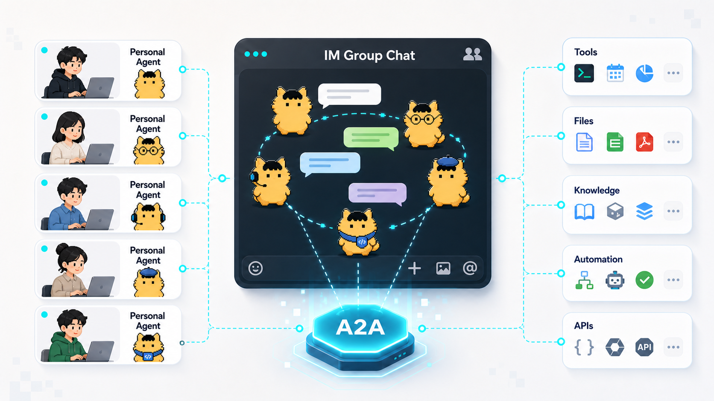
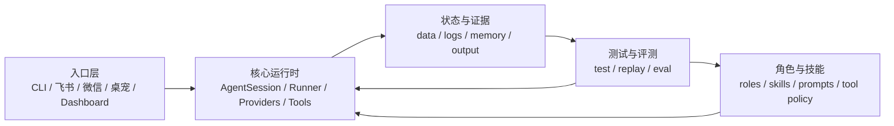
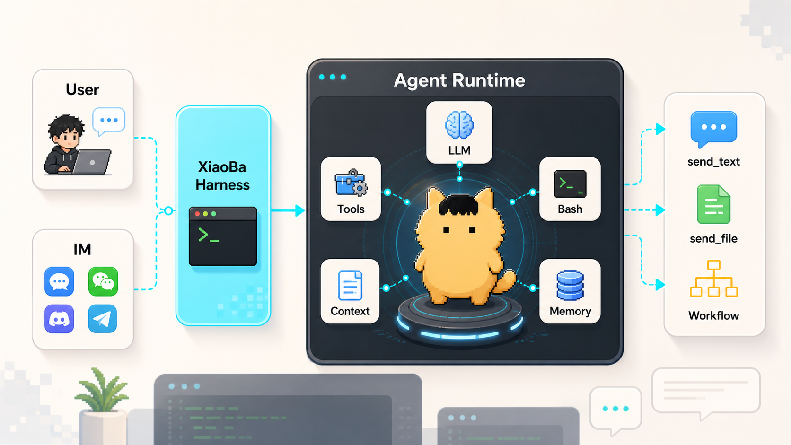

<div align="center">
  

  # XiaoBa

  **小八：一个活在 IM 里的 AI 同事。**

  **它待在工作真正开始的地方：聊天、文件、任务、工具和长期上下文。**

  **底层是一个本地优先的 AI 角色 runtime，让不同 AI 同事围绕你持续生长。**

  [](LICENSE)
  [](package.json)
  [](https://github.com/fightheyyy/XiaoBa-CLI)

  [English](README.en.md)

  [快速开始](#快速开始) · [为什么是-xiaoba](#为什么是-xiaoba) · [角色体系](#角色体系) · [IM 入口](#im-入口) · [架构](#架构) · [文档](#文档)
</div>

---

## XiaoBa 是什么？

XiaoBa 不是另一个终端聊天壳子，也不只是一个会在群里回复消息的机器人。

它是一个 **活在 IM 里的 AI 同事**：一个可以长期待在聊天里的角色。它能理解群聊 / 私聊上下文，接收文件和任务，调用工具；在 `engineer-cat` 角色下可以调度本机 Codex CLI 到后台干活，并把进度和产物发回工作开始的地方。

用户看到的是聊天里的同事；底层支撑它的是一个 **本地优先的 AI 角色 runtime**：角色、skills、tools、subagents、日志、记忆和反馈闭环都会围绕你的真实环境被塑形。

```text
IM 消息 / CLI 输入
  -> AI 同事
  -> 角色 Runtime
  -> Skills + tools + subagents
  -> 电脑 / 文件 / 项目 / shell / legacy artifacts
  -> EngineerCat 可调度本机 Codex CLI
  -> 自然回复、文件交付、进度汇报或 case 流转
```

一句话：

> XiaoBa 给 AI agent 一个 IM-native 的身体，也给它一个像同事一样协作和交付的身份。

---

## AI 同事 Runtime 愿景

AI 角色产品已经证明：角色可以长期活在聊天里。XiaoBa 想做的是下一步：让有用的 AI 同事也活在你的真实环境里，包括你的电脑、文件、项目、工具、聊天、日志和长期记忆。

这个同事可以是工程师、审查员、督察员、研究员、老师、学生、创作搭子、家人式陪伴，也可以是只属于你的某种身份。可见身份可以变化，但 runtime 对你的环境和习惯的理解会持续生长。

每个人的目标应该很简单：搭建一个和自己一样品味的 agent，让它活在各个社交平台里。



第一步先从实用场景切入：**活在 IM 里的工作同事**。它能从聊天里接任务、调用工具；其中 EngineerCat 可以调度本机 Codex CLI，并回到聊天里汇报进度、文件和证据。

---

## 快速开始

当前最推荐从源码启动。桌面安装包发布流程已经准备好，但在正式 release 之前，本地开发模式是最快路径。

```bash
git clone https://github.com/fightheyyy/XiaoBa-CLI.git
cd XiaoBa-CLI
npm install
cp .env.example .env
```

把模型配置写进 `.env`，也可以之后用 `npm run dev -- config` 打开交互式配置。

```bash
# OpenAI-compatible endpoint
XIAOBA_LLM_PROVIDER=openai
XIAOBA_LLM_API_BASE=https://api.openai.com/v1
XIAOBA_LLM_API_KEY=your_api_key
XIAOBA_LLM_MODEL=your_model

# 或 Anthropic
# XIAOBA_LLM_PROVIDER=anthropic
# XIAOBA_LLM_API_BASE=https://api.anthropic.com
# XIAOBA_LLM_API_KEY=your_api_key
# XIAOBA_LLM_MODEL=claude-sonnet-4-20250514

# 或本地 Ollama（不需要 API key）
# XIAOBA_LLM_PROVIDER=ollama
# XIAOBA_LLM_API_BASE=http://localhost:11434
# XIAOBA_LLM_API_KEY=
# XIAOBA_LLM_MODEL=qwen3:8b
# XIAOBA_LLM_MAX_TOKENS=1024
# XIAOBA_OLLAMA_THINK=false
# XIAOBA_OLLAMA_KEEP_ALIVE=30m
# XIAOBA_OLLAMA_NUM_CTX=8192
```

启动本地对话：

```bash
npm run dev -- chat -i
```

发送单条消息：

```bash
npm run dev -- chat -m "帮我总结这个项目的结构"
```

选择职业角色：

```bash
npm run dev -- chat -r engineer-cat -i
npm run dev -- chat -r reviewer-cat -i
```

启动桌面 Dashboard：

```bash
npm run electron:dev
```

Windows PowerShell：

```powershell
Copy-Item .env.example .env
npm run dev -- chat -i
```

---

## 为什么是 XiaoBa

大多数 AI coding 工具都活在终端或 IDE 里。但真实工作常常从别的地方开始：一条飞书消息、一个私聊、一个群里的 bug 报告、一个别人顺手丢过来的文件。

XiaoBa 做的是中间这层。它给终端里的 coding agent 一个可以活在 IM 入口里的 AI 同事，让需求、文件、跟进和决策都留在本来发生的消息场景里。

| 普通 coding agent | XiaoBa |
| --- | --- |
| 你打开终端才开始工作 | 可以活在 IM 入口里，响应真实消息 |
| 通常围绕一个本地仓库 | 围绕对话、文件、角色、任务和后续汇报组织工作 |
| 把结果打印在终端 | 可以发消息、发文件、回群汇报进度 |
| 通常只有一个 persona | 有不同 AI 同事身份，每个身份有自己的职责和工具边界 |
| Memory 多是静态笔记 | 日志、工具、角色、交付口径和 runtime 行为一起被用户塑形 |

XiaoBa 不试图替代 Codex 或其他 coding agent。当前 EngineerCat 只承诺已验证的本机 Codex CLI 后台任务链路，再由运行证据、ReviewerCat 和用户反馈来判断、整合和验收。

---

## 核心能力

### IM-native Runtime

- CLI、飞书、微信、Dashboard、桌宠入口共用同一套 runtime。
- 群聊、私聊、本地会话分别保留自己的 surface context。
- 用户可见输出通过消息 / 文件工具交付，而不是依赖普通模型文本。
- 长任务可以在后台继续，主会话仍然保持响应。

### 角色体系

- Roles 是 AI 同事身份，不只是 prompt 风格。
- 每个角色可以定义自己的 prompt、skills、tools 和行为边界。
- 当前内置工程、审查、督察、研究等工作流角色。
- 角色专属工具只会在对应角色激活时加载。
- 同一套 runtime 未来可以承载工作同事和个人角色，但每个角色的边界都应该清楚可控。

### Skills + Tools

- 内置文件、shell、grep、edit、send text、send file、subagent 等工具。
- Skills 是本地 instruction packs，存放在 `skills/` 或 `roles/<role>/skills/`。
- 支持通过 `xiaoba skill install-github owner/repo` 从 GitHub 安装 skill。
- Skill parser 支持 Claude Code 风格 frontmatter。

### 后台任务

- `spawn_subagent` 可以启动后台 role / skill / no-skill 工作。
- `check_subagent`、`stop_subagent`、`resume_subagent` 管理任务状态。
- `ask_parent` 允许子智能体暂停并向主会话请求确认。
- Reviewer 角色负责复核 EngineerCat / Codex job 的证据和产物，不直接调度外部 coding agent。

### User-shaped Harness

- 保留 session JSONL、runtime log、tool trace、token usage 和 artifacts，便于回放。
- memory finalization 可以从 session 中提取事实、偏好和工作习惯。
- context compression 保留近期高价值轮次，减少过期历史。
- 生产闭环应走 inspect -> engineer -> review / PR handoff。

---

## 角色体系

| Role | AI 同事身份 | 典型工作 |
| --- | --- | --- |
|  `engineer-cat` | 工程同事 | 读代码、拆任务、调用本机 Codex runner、实现、验证、汇报 |
|  `reviewer-cat` | 审查与验收同事 | 追问证据、跑检查、审查产物、要求返工 |
|  `inspector-cat` | Runtime 督察同事 | 读日志、发现失败、创建或流转修复 case |
|  `researcher` / `researcher-cat` | 长周期研究同事 | auto research、读论文、跟实验、维护证据和交付件 |

用角色启动：

```bash
npm run dev -- chat -r inspector-cat -i
```

角色定义在 [`roles/`](roles/README.md)。

---

## IM 入口

XiaoBa 提供本地 CLI 和多个消息入口 adapter。

| 入口 | 命令 | 说明 |
| --- | --- | --- |
| CLI chat | `npm run dev -- chat -i` | 最快的本地开发循环 |
| Feishu | `npm run dev -- feishu` | 需要 `FEISHU_APP_ID` 和 `FEISHU_APP_SECRET` |
| Weixin | `npm run dev -- weixin` | 需要 `WEIXIN_TOKEN` |
| Dashboard | `npm run dev -- dashboard` | 本地服务、状态和日志管理 |
| Desktop Pet | `npm run dev -- pet` | 本地桌宠入口 |

---

## 架构

整体架构真相源见 [`docs/SPEC.md`](docs/SPEC.md)，执行计划见 [`docs/PLAN.md`](docs/PLAN.md)。





核心架构 spec：[`surface`](docs/surface/SPEC.md)、[`agent runtime`](docs/agent-runtime/SPEC.md)、[`roles & skills`](docs/roles-skills/SPEC.md)、[`observability & evidence`](docs/observability-evidence/SPEC.md)、[`trace replay`](docs/trace-replay/SPEC.md)、[`evaluation`](docs/evaluation/SPEC.md)。持久化证据子合同见 [`state-evidence`](docs/observability-evidence/state-evidence/SPEC.md)，deterministic verification boundary 见 [`test`](test/SPEC.md)。

当前本地 replay / eval 入口：

```bash
npm run replay:trace -- --trace logs/sessions/.../traces.jsonl
npm run eval:gate
npm run test:contract-smoke
npm run eval:base-runtime
npm run check:benchmarks
```

常用直跑入口：

```bash
npm run test:contract-boundary
npm run test:surface-runtime
npm run test:surface-runtime-file
npm run test:red-team
npm run test:resilience
npm run eval:base-runtime
```

`test/` 负责 unit / integration / deterministic contract smoke；`replay:trace` 负责从历史 trace 复跑同款用户输入并产出 fresh trace 对比；`eval/` 只负责 live agent eval benchmark：curated 输入、setup、runtime replay、tool/result verifier 和 scorecard。Observability 只保留本地证据，不拥有 pass/fail 或 benchmark admission。

```text
src/index.ts
  -> commands/*
  -> AgentSession
  -> AIService provider chain
  -> Role-aware ToolManager
  -> Skills + tools + subagents
  -> Session store / logs / memory finalizer
```

关键模块：

- [`src/core/agent-session.ts`](src/core/agent-session.ts) 协调消息、命令、skills、memory 和 cleanup。
- [`src/tools/tool-manager.ts`](src/tools/tool-manager.ts) 注册文件、shell、消息、skill、subagent 工具。
- [`src/bootstrap/tool-manager.ts`](src/bootstrap/tool-manager.ts) 注入 role-aware tool sets。
- [`src/utils/ai-service.ts`](src/utils/ai-service.ts) 处理 provider 选择、重试和模型 failover。
- [`src/commands/feishu.ts`](src/commands/feishu.ts)、[`src/commands/weixin.ts`](src/commands/weixin.ts) 提供 IM adapter。

---

## 配置

基础模型配置：

```env
XIAOBA_LLM_PROVIDER=openai # openai / anthropic / ollama
XIAOBA_LLM_API_BASE=https://api.openai.com/v1
XIAOBA_LLM_API_KEY=your_api_key
XIAOBA_LLM_MODEL=your_model
```

本地 Ollama 推荐使用 native provider：

```env
XIAOBA_LLM_PROVIDER=ollama
XIAOBA_LLM_API_BASE=http://localhost:11434
XIAOBA_LLM_API_KEY=
XIAOBA_LLM_MODEL=qwen3:8b
XIAOBA_LLM_MAX_TOKENS=1024
XIAOBA_OLLAMA_THINK=false
XIAOBA_OLLAMA_KEEP_ALIVE=30m
XIAOBA_OLLAMA_NUM_CTX=8192
```

可选备份模型：

```env
XIAOBA_LLM_BACKUP_1_PROVIDER=openai
XIAOBA_LLM_BACKUP_1_API_BASE=https://backup.example/v1
XIAOBA_LLM_BACKUP_1_API_KEY=backup_key
XIAOBA_LLM_BACKUP_1_MODEL=backup_model
```

可选 OpenTelemetry 观测出口，默认关闭：

```env
XIAOBA_OTEL_ENABLED=false
XIAOBA_OBSERVABILITY_LOCAL_ENABLED=true
OTEL_EXPORTER_OTLP_ENDPOINT=http://localhost:4318
OTEL_TRACES_EXPORTER=otlp
OTEL_METRICS_EXPORTER=otlp
OTEL_LOGS_EXPORTER=otlp
XIAOBA_OTEL_TRACE_SAMPLE_RATIO=1
XIAOBA_OTEL_CONCURRENCY_LIMIT=10
```

开启后会通过官方 OpenTelemetry JS SDK 导出脱敏后的 metrics / logs / traces，包含 batch、sampling、privacy-safe resource detector 和 latency histogram；prompt、tool args、file content、raw provider payload、tool call id、raw session id 和容易泄露本机身份的 host/process/env resource attributes 默认不会外发。Dashboard Runtime 的本地观测摘要不需要外部 Collector，默认只保留 allowlisted 聚合事实。

开发者本地 Collector smoke 示例见 [docs/observability-evidence/COLLECTOR.md](docs/observability-evidence/COLLECTOR.md)。该示例仍需显式设置 `XIAOBA_OTEL_ENABLED=true`，不会改变普通用户默认行为。

IM adapter：

```env
FEISHU_APP_ID=your_app_id
FEISHU_APP_SECRET=your_app_secret
FEISHU_BOT_OPEN_ID=
FEISHU_BOT_ALIASES=小八,xiaoba

WEIXIN_TOKEN=your_token
```

完整示例见 [`.env.example`](.env.example)。

---

## Skills

查看 skills：

```bash
npm run dev -- skill list
```

从 GitHub 安装 skill：

```bash
npm run dev -- skill install-github owner/repo
```

创建本地 skill：

```text
skills/my-skill/
  SKILL.md
```

```markdown
---
name: my-skill
description: Use this when XiaoBa should follow my workflow.
invocable: user
---

# My Skill

Instructions go here.
```

详见 [`skills/README.md`](skills/README.md)。

---

## 开发

```bash
npm install
npm run build
npm test
```

桌面开发：

```bash
npm run electron:dev
```

构建桌面安装包：

```bash
npm run electron:build:mac
npm run electron:build:win
npm run electron:build:linux
```

---

## 项目状态

| 模块 | 状态 |
| --- | --- |
| 本地 CLI chat | 可用 |
| Role runtime | 可用 |
| Skill loading 和 GitHub skill install | 可用 |
| 飞书 / 微信 adapters | 可用，需要凭证 |
| Dashboard 和桌面 shell | 开发模式可用 |
| 桌面安装包发布 | 本地 Electron 打包脚本保留，GitHub workflow 已移除 |
| npm global package | 暂未发布 |

---

## 文档

- [Docs Index](docs/README.md)
- [Project SPEC](docs/SPEC.md)
- [Project PLAN](docs/PLAN.md)
- [Root Folder Structure](docs/ROOT_STRUCTURE.md)
- [Surface SPEC](docs/surface/SPEC.md)
- [Agent Runtime SPEC](docs/agent-runtime/SPEC.md)
- [Roles & Skills SPEC](docs/roles-skills/SPEC.md)
- [Observability & Evidence SPEC](docs/observability-evidence/SPEC.md)
- [State & Evidence SPEC](docs/observability-evidence/state-evidence/SPEC.md)
- [Evaluation SPEC](docs/evaluation/SPEC.md)
- [Test Harness SPEC](test/SPEC.md)
- [Agent Evaluation Strategy](eval/README.md)
- [BaseRuntime Benchmark](eval/benchmarks/BaseRuntime/README.md)
- [Roles Guide](roles/README.md)
- [EngineerCat Spec](roles/engineer-cat/SPEC.md)
- [ReviewerCat Spec](roles/reviewer-cat/SPEC.md)
- [Skill Guide](skills/README.md)

---

## 项目历史

XiaoBa-CLI 最初来自 [`buildsense-ai/XiaoBa-CLI`](https://github.com/buildsense-ai/XiaoBa-CLI)。当前仓库在 [`fightheyyy/XiaoBa-CLI`](https://github.com/fightheyyy/XiaoBa-CLI) 下独立继续推进，重点探索 IM-native agent、角色化工作、数据飞轮和桌面分发。

本 fork 的变更不会影响原 `buildsense-ai` 版本。

---

## License

Apache-2.0 © CatCompany

<div align="center">
  Built by CatCompany for agents that do not just answer, but show up where work happens.
</div>
