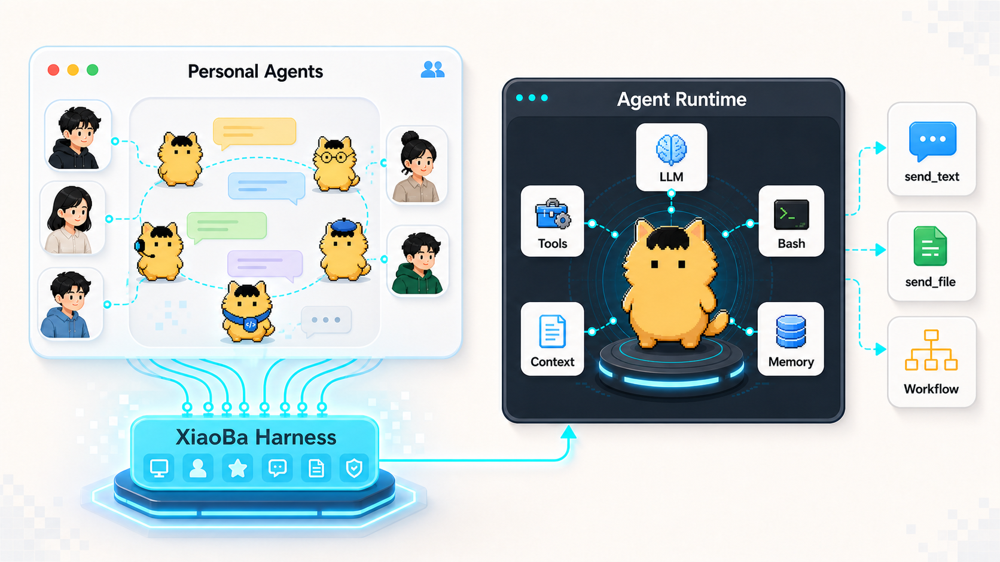
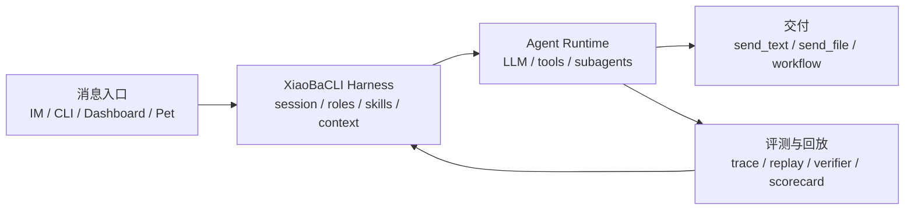

<div align="center">
  

  # XiaoBaCLI

  **让 Personal Agents 活在聊天里，并接上本机工具、文件和长期上下文。**

  XiaoBaCLI 是一个本地优先的 AI Harness：把 IM、CLI、Dashboard、角色、skills、subagents、工具调用和运行证据接到同一套 agent runtime 里。

  [](LICENSE)
  [](package.json)
  [](https://github.com/fightheyyy/XiaoBa-CLI)

  [English](README.en.md) · [快速开始](#快速开始) · [文档](#文档)

  <br>

  
</div>

---

## XiaoBaCLI 是什么？

XiaoBaCLI 不是另一个终端聊天壳，也不是只会回群消息的 bot。

它做的是中间这一层：**把聊天里的 Personal Agents，变成能调用本机工具、能跑后台任务、能交付文件、能留下证据的 AI 同事 runtime。**



## 关键点

- **评测与回放层**：XiaoBaCLI 会记录本地 trace 证据，包括用户输入、工具调用、文件产物、异常恢复和最终交付。
- **历史任务可重跑**：可以从历史 trace 抽取 replay case，重新驱动当前 runtime 生成 fresh trace。
- **长期回归可验证**：通过 verifier / scorecard 检查 agent 行为是否真的稳定，而不是只看一次演示。
- **消息场景即控制面**：需求、追问、进度和交付可以从 IM、CLI、Dashboard 或桌宠进入同一套 runtime。
- **Personal Agents 有运行身体**：roles、skills、tools、context、memory、subagents 和 delivery 共同组成可工作的 agent。

## 快速开始

```bash
git clone https://github.com/fightheyyy/XiaoBa-CLI.git
cd XiaoBa-CLI
npm install
cp .env.example .env
```

在 `.env` 写入模型配置：

```env
XIAOBA_LLM_PROVIDER=openai
XIAOBA_LLM_API_BASE=https://api.openai.com/v1
XIAOBA_LLM_API_KEY=your_api_key
XIAOBA_LLM_MODEL=your_model
```

启动聊天：

```bash
npm run dev -- chat -i
```

启动 Dashboard：

```bash
npm run electron:dev
```

## 常用命令

| 目标 | 命令 |
| --- | --- |
| 交互聊天 | `npm run dev -- chat -i` |
| 单条消息 | `npm run dev -- chat -m "帮我总结这个项目"` |
| 指定角色 | `npm run dev -- chat -r engineer-cat -i` |
| Dashboard | `npm run electron:dev` |
| 构建 | `npm run build` |
| 测试 | `npm test` |
| macOS 打包 | `npm run electron:build:mac` |

## 默认安装包

默认 Electron 包刻意保持干净：只带 4 个核心 roles（`user-cat`、`inspector-cat`、`engineer-cat`、`reviewer-cat`）和 5 个 base skills（`remember`、`role-publish`、`self-evolution`、`skill-publish`、`agent-browser`）。更多角色和 skills 通过显式安装进入。

## 文档

- [Docs Index](docs/README.md)

## License

Apache-2.0
