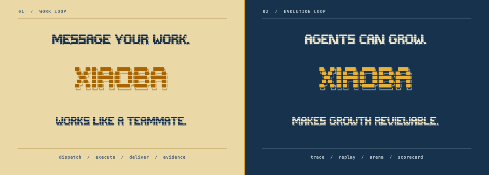
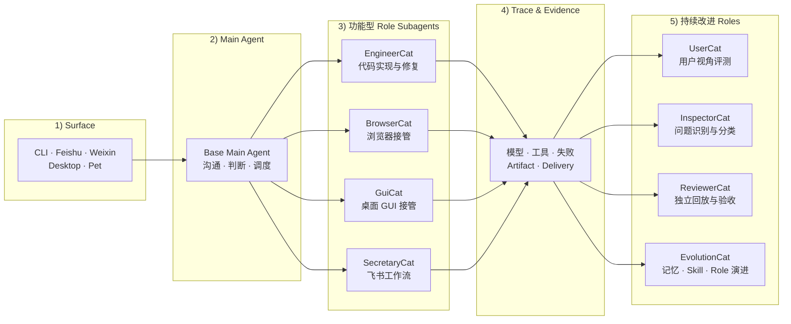

<div align="center">
  

  # xiaobaOS

  **会交付、可复盘、能受控进化的 IM-native AI 同事 Runtime。**

  把任务发进 CLI、IM 或桌面端。Base 负责沟通与派工，专业 Role 接管执行，再把文件、消息和可检查证据交付回来；真实 trace 可以沉淀候选能力，但只有经过 Arena 验收并由人显式晋升后才进入生产。

  <em>像同事一样完成工作，像软件一样验收进化。</em>

  [](https://github.com/fightheyyy/xiaobaOS/releases)
  [](https://github.com/fightheyyy/xiaobaOS/releases/tag/v0.2.0)
  [](package.json)
  [](LICENSE)

  [源码快速开始](#快速开始) · [macOS v0.2.0 Preview](https://github.com/fightheyyy/xiaobaOS/releases/tag/v0.2.0) · [工作方式](#工作与进化) · [受控进化](#受控进化) · [English](README.en.md)

  <sub>v0.2.0 Preview 包含当前八角色与受控进化主线，面向 Apple Silicon（arm64）。该包采用 ad-hoc 签名、尚未完成 Apple notarization，桌面子服务仍需要系统 Node.js 18.19+。</sub>
</div>

---

## 工作与进化

XiaoBa 把用户可见的工作闭环和系统内部的改进闭环接在同一套 Agent Runtime 上，但不把“自进化”变成无边界的自动改写。



这张图表达责任拓扑，不表示四个改进 Role 每次都会顺序执行；真实进化流程按 trace 证据和类型化 route 选择参与者。

| 工作闭环 | 进化闭环 |
| --- | --- |
| 消息 → Base 派工 → 专业 Role 接管 → 工具执行 → 文件 / 消息交付 | 真实 trace → Inspector 诊断 → Candidate Skill / Role → Arena 复跑与 scorecard → 人显式晋升 |

- **证据优先**：模型调用、工具结果、artifact、delivery 和失败进入 trace；角色自述不等于完成证据。
- **职责分离**：诊断、生成候选、工程修复、正式回放和 Arena 验收由不同责任边界承担。
- **候选不自动上线**：证据不足可以 `no_op`，评测失败可以阻断；Arena `pass` 也不会自动修改生产资产。

## 能做什么

| 任务 | 接管者 | 交付 |
| --- | --- | --- |
| 修改代码、修复问题、验证构建 | EngineerCat | 代码改动、测试结果和 artifact evidence |
| 浏览网页、收集资料、核验页面 | BrowserCat | 结构化结果、来源和页面证据 |
| 操作 macOS 桌面应用 | GuiCat | 操作结果和 GUI evidence |
| 处理飞书消息、日历、任务和文档 | SecretaryCat | 飞书侧结果、文件和 delivery evidence |

运行状态、trace 和 artifact evidence 默认保存在本地；模型可以按配置连接 OpenAI-compatible、Anthropic、Ollama 或其他兼容端点。

## 运行界面

<p align="center">
  
</p>

<p align="center"><sub>Electron Dashboard 把运行服务、角色、技能、配置、商店和 Chat 收在同一个入口。</sub></p>

## 快速开始

> **macOS Desktop Preview**：可下载 [XiaoBa v0.2.0](https://github.com/fightheyyy/xiaobaOS/releases/tag/v0.2.0)。该 DMG 面向 Apple Silicon（arm64），包含当前八角色与受控进化主线；它采用 ad-hoc 签名、尚未 notarize，桌面启动的 CLI / Pet / IM 子服务需要系统 Node.js 18.19+。

源码运行需要 Node.js 18.19 或更高版本：

```bash
git clone https://github.com/fightheyyy/xiaobaOS.git
cd xiaobaOS
npm install
cp .env.example .env
```

在 `.env` 中配置模型：

```env
XIAOBA_LLM_PROVIDER=openai
XIAOBA_LLM_API_BASE=https://api.openai.com/v1
XIAOBA_LLM_API_KEY=your_api_key
XIAOBA_LLM_MODEL=your_model
```

```bash
# 检查模型、角色、Driver、权限和平台配置
npm run dev -- doctor

# 交互式 CLI
npm run dev -- chat -i

# 开发 / 调试：绕过 Base，直接启动指定角色
npm run dev -- chat -r engineer-cat -i

# Electron Dashboard
npm run electron:dev
```

BrowserCat、GuiCat 和 SecretaryCat 的外部 CLI / 平台依赖见 [`requirement.txt`](requirement.txt)；只在使用对应角色时安装和授权。

## 八个默认角色

Base Main Agent 是唯一面向用户的沟通和调度入口。八个 Role 复用同一套 XiaoBa Agent loop；Base 不预装默认 Skills，独立 Skill 需要显式安装或挂载到 Arena。

| 类型 | Role | 责任 |
| --- | --- | --- |
| 执行 | EngineerCat | 共享 XiaoBa Agent loop 的原生 coding Role；负责代码、仓库、构建和工程修复 |
| 执行 | BrowserCat | 受限、可验证的浏览器接管 |
| 执行 | GuiCat | macOS 桌面 GUI 接管 |
| 执行 | SecretaryCat | 飞书工作流；`FeishuCat` 是别名，领域能力来自官方 `lark-cli` |
| 改进 | UserCat | 用低信息、真实用户式交互给候选能力施压并产出 trace |
| 改进 | InspectorCat | 从 trace、工具事实和 artifact 中诊断问题并输出类型化 route |
| 改进 | EvolutionCat | 把可泛化模式沉淀为候选 Skill / Role；持有 `remember` 与发布工作流 |
| 改进 | ReviewerCat | 在干净 session 正式回放单个 Replay Case，输出终态结论 |

Browser、GUI 和飞书 driver 只提供确定性能力，不启动第二套 Chat、Agent 或 MCP loop。详细用法见 [Roles Guide](roles/README.md) 和 [Skills Guide](skills/README.md)。

EngineerCat 同样不包装第二套 coding-agent runtime：Base 在外部管理它的 SubAgent 生命周期，EngineerCat 只使用受限 coding / Skill 工具和子侧 `ask_parent` 完成实现与验证。

## 受控进化

夜间 workflow 先由 Runtime 从真实 session trace 生成只读 Digest，再以 InspectorCat 作为第一个模型角色做证据诊断，并将 finding 路由到 `evolution`、`repair`、`replay` 或 `no_op`。内部 Role 按 route 参与，不是每晚固定跑一条“八猫流水线”。

<p align="center">
  
</p>

| Route | 执行 | 验收终点 |
| --- | --- | --- |
| `evolution` | EvolutionCat 生成 Skill / Role，并落入隔离 Candidate | Arena 在 clean runtime 中做多场景能力验收；通过后仍需人显式执行 Candidate → Active |
| `repair` | EngineerCat 生成隔离 Patch Candidate | ReviewerCat 执行 Frozen Replay 并返回 `closed / next_run / blocked`；影响 Agent 行为时再进入 Arena 复审 |
| `replay` | ReviewerCat 直接执行冻结的 Replay Case | 返回 `closed / next_run / blocked`，同一次 DAG 不回跳修复 |
| `no_op` | 信号不足时不生成改进 | 显式终止，不伪装成进化 |

```bash
# 运行一次夜间演化
xiaoba evolution sleep

# 在隔离 Arena 中验收一个已安装或已导入的 skill
xiaoba arena skill <skill-name>

# Arena 通过后，显式晋升同日 DAG 绑定的不可变 Candidate
xiaoba evolution promote --date YYYY-MM-DD --confirm <candidate-name>
```

Arena 固定支持 `base + skill`、`role + skill` 和 `role` 三种 review mode。Candidate 可以保持候选或被阻断；生产晋升始终需要明确的人类动作。
声明固定逐行合同的 Candidate，只有 native / replay 的每个 turn 都绑定同一 subject 且全轮通过，才可能得到 `pass`。

## 证据与验收

| 证据层 | 作用 |
| --- | --- |
| Trace | 保存一次请求中的模型、工具、失败、交付和 runtime event |
| Artifact / Delivery Evidence | 记录文件、消息、外部回执和实际交付结果 |
| Trace Replay | 用历史用户意图重新驱动当前 runtime，观察行为是否变化 |
| Live Agent Eval | 对 curated case fresh-run 当前 runtime，并运行 hard verifier |
| Arena | 在 clean runtime 中验收候选能力，输出可审计 scorecard |

```bash
npm test
npm run replay:trace
npm run eval:base-runtime
npm run check:benchmarks
```

XiaoBa 可以把同一组 session / model / tool span 通过 OTLP/HTTP protobuf 发给 Barena、LangWatch 或普通 OTel Collector。导出默认关闭，本地 `traces.jsonl` 仍是权威证据；prompt、tool args、file content 和自由文本错误不会进入外部 span。

```bash
XIAOBA_OBSERVABILITY_ENABLED=true \
OTEL_EXPORTER_OTLP_ENDPOINT=http://127.0.0.1:4318 \
xiaoba chat
```

可验证范围、最近结果和风险只维护在 [Project PLAN](docs/PLAN.md)；合同边界见 [Evaluation SPEC](docs/evaluation/SPEC.md) 与 [Arena SPEC](docs/arena/SPEC.md)。

## 当前边界

- macOS Electron DMG 是 Apple Silicon arm64 Preview，采用 ad-hoc 签名且尚未 notarize。
- 桌面子服务不内嵌 Node，当前需要系统 Node.js 18.19 或更高版本；若 Finder 无法发现 Homebrew / nvm 的 Node，请用 `XIAOBA_NODE_EXE` 指向绝对可执行路径。
- BrowserCat、GuiCat 和 SecretaryCat 依赖对应 driver / CLI，以及必要的安装、权限或登录状态；可先运行 `xiaoba doctor` 检查。
- Preview 默认关闭尚未完成端到端验证的自动更新通道，新版本通过 GitHub Release 手动安装。
- Dashboard、Pet 和 Bridge 主要面向本机使用，尚未完成不可信网络下的完整认证与 Owner 授权。
- Trace Replay 可能执行当前真实 side effect；在隔离完成前，不应无审查批量复跑任意历史 trace。

## 文档与社区

- [Architecture](docs/SPEC.md) · [Status / Plan](docs/PLAN.md)
- [Roles](roles/README.md) · [Skills](skills/README.md)
- [Releases](https://github.com/fightheyyy/xiaobaOS/releases) · [Discussions](https://github.com/fightheyyy/xiaobaOS/discussions) · [Issues](https://github.com/fightheyyy/xiaobaOS/issues)

## License

[Apache-2.0](LICENSE)
