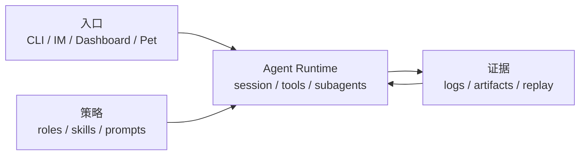

<div align="center">
  

  # XiaoBa

  **一个活在聊天和本机环境里的 AI 同事 runtime。**

  XiaoBa 把 agent 放回工作真正开始的地方：IM、Dashboard、文件、工具和长期上下文。

  [](LICENSE)
  [](package.json)
  [](https://github.com/fightheyyy/XiaoBa-CLI)

  [English](README.en.md) · [快速开始](#快速开始) · [默认安装包](#默认安装包) · [文档](#文档)
</div>

---

## XiaoBa 是什么？

XiaoBa 不是另一个终端聊天壳，也不是只会回群消息的 bot。

它更像一个本地优先的 **agent OS / AI 同事运行时**：

- 在 CLI、Dashboard、飞书、微信、桌宠等入口里复用同一套 agent loop。
- 让 agent 能读文件、跑命令、调用工具、交付消息和文件。
- 支持 roles、skills、subagents、长期上下文、日志和可回放证据。
- 让长任务在后台跑，主会话还能继续响应。

一句话：**XiaoBa 给 AI agent 一个能长期协作、能交付、能被你塑形的身体。**

## 为什么做这个？

真实工作经常不是从 IDE 开始，而是从一条消息开始：

- “这个 bug 帮我看下。”
- “这个文件整理一下。”
- “这个任务先在后台跑，完成了告诉我。”
- “这个 agent 的行为越来越像我一点。”

XiaoBa 做的是中间层：把聊天、文件、本机工具、角色身份和运行证据接在一起，让 agent 不只是回答，而是能持续参与工作。

## 快速开始

```bash
git clone https://github.com/fightheyyy/XiaoBa-CLI.git
cd XiaoBa-CLI
npm install
cp .env.example .env
```

在 `.env` 写入模型配置：

```env
XIAOBA_LLM_PROVIDER=openai
XIAOBA_LLM_API_BASE=https://api.openai.com/v1
XIAOBA_LLM_API_KEY=your_api_key
XIAOBA_LLM_MODEL=your_model
```

本地聊天：

```bash
npm run dev -- chat -i
```

启动桌面 Dashboard：

```bash
npm run electron:dev
```

构建 macOS 安装包：

```bash
npm run electron:build:mac
```

生成结果在 `release/XiaoBa-<version>-mac.dmg`。

## 默认安装包

默认 Electron 包刻意保持干净：

- 不预装任何 roles。
- 只带 5 个 base skills：`remember`、`role-publish`、`self-evolution`、`skill-publish`、`agent-browser`。
- `spawn_subagent`、文件读写、shell、grep、发送消息/文件等是 runtime tools，不作为 skill 打包。

开发仓库里仍保留 roles 和更多实验能力，默认包不把它们塞给用户。

## 常用命令

| 目标 | 命令 |
| --- | --- |
| 交互聊天 | `npm run dev -- chat -i` |
| 单条消息 | `npm run dev -- chat -m "帮我总结这个项目"` |
| Dashboard | `npm run electron:dev` |
| 构建 | `npm run build` |
| 测试 | `npm test` |
| macOS 打包 | `npm run electron:build:mac` |

## 核心概念



- **Surface**：用户入口，例如 CLI、飞书、微信、Dashboard、桌宠。
- **Runtime**：统一 agent loop，负责 provider、工具、上下文、subagent 和交付。
- **Roles / Skills**：角色身份和可复用工作流，不和 runtime 混在一起。
- **Evidence**：日志、产物、trace 和 eval，让行为能复盘、能改进。

## 文档

- [项目架构](docs/SPEC.md)
- [当前计划](docs/PLAN.md)
- [Agent Runtime](docs/agent-runtime/SPEC.md)
- [Surface](docs/surface/SPEC.md)
- [Roles & Skills](docs/roles-skills/SPEC.md)
- [Observability & Evidence](docs/observability-evidence/SPEC.md)
- [Skills 指南](skills/README.md)
- [Roles 指南](roles/README.md)

## 状态

XiaoBa 仍在快速迭代中。当前重点是桌面分发、IM-native runtime、role/skill 生态和可验证的后台任务闭环。

## License

Apache-2.0
