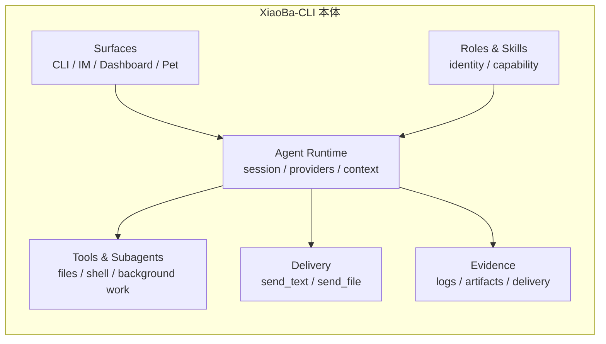
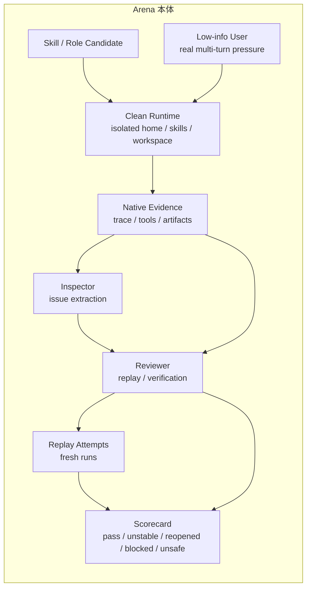

<div align="center">
  

  # XiaoBa-CLI

  **带自我验证能力的本地 Personal Agent Runtime。**

  XiaoBa-CLI 让 personal agents 活在工作真正开始的地方：聊天、文件、工具、长期任务和用户可见交付。

  它不是另一个聊天壳。XiaoBa 给 agent 一个能行动的 runtime，记录它真实做过什么，把历史 trace 变成可重放回归，并用 Arena 判断 skill / role 是否值得被信任。

  > Agent 不应该只会回答；它应该能行动、能留证、能重放、能经得起审判。

  [](LICENSE)
  [](package.json)
  [](https://github.com/fightheyyy/XiaoBa-CLI)

  [English](README.en.md) · [快速开始](#快速开始) · [为什么是-xiaoba](#为什么是-xiaoba) · [核心概念](#核心概念) · [文档](#文档)

  <br>

  
</div>

---

## 为什么是 XiaoBa

### 1. Runtime

给 agent 一个能工作的身体：聊天入口、角色、skills、tools、subagents、memory、文件和用户可见交付。

### 2. Replay & Regression

把真实会话记录成可重放 trace，再用当前 runtime 重新运行，抓出回归、假成功、缺失产物和不稳定行为。

### 3. Arena

在信任一个 skill 或 role 之前先审判它：放进干净 runtime，用低信息用户施压，检查原生证据，重放失败 case，并产出 scorecard。





---

## XiaoBa-CLI 是什么？

XiaoBa-CLI 是一个本地优先的 personal agent runtime。

XiaoBa 面向正在构建 personal agents、本地工具 agents、role / skill systems，或需要 evidence & regression 的长期 AI coworkers 的开发者。

用户看到的是一个活在聊天里的 AI 同事；底层支撑它的是一套可恢复、可观测、可评测的运行系统：model providers、tools、roles、skills、subagents、本地文件、delivery channels、session logs、trace replay 和 Arena review gates 都被接到同一条 agent loop 里。

很多 agent 项目停在“模型回复了”。XiaoBa 更关心回复之后发生了什么：

- 它有没有调用正确的工具？
- 它有没有产出承诺的文件？
- 用户是否真的收到了结果？
- 同一个历史任务之后还能不能重跑？
- runtime 改了以后 skill 是否仍然稳定？
- 这个 role 或 skill 是否值得被信任？

---

## 快速开始

```bash
git clone https://github.com/fightheyyy/XiaoBa-CLI.git
cd XiaoBa-CLI
npm install
cp .env.example .env
```

在 `.env` 写入模型配置：

```env
XIAOBA_LLM_PROVIDER=openai
XIAOBA_LLM_API_BASE=https://api.openai.com/v1
XIAOBA_LLM_API_KEY=your_api_key
XIAOBA_LLM_MODEL=your_model
```

源码开发模式用 `npm run dev -- <command>`：

```bash
npm run dev -- chat -i
```

使用指定角色：

```bash
npm run dev -- chat -r engineer-cat -i
npm run dev -- chat -r reviewer-cat -i
```

如果已经通过正式安装或 `npm link` 暴露了 CLI bin，等价命令是：

```bash
xiaoba chat -i
xiaoba chat -r engineer-cat -i
xiaoba arena skill <skill-name>
```

启动桌面 Dashboard：

```bash
npm run electron:dev
```

---

## 核心概念

### Runtime

XiaoBa 的 runtime 协调用户消息、角色策略、skill 激活、工具调用、subagents、模型 provider、memory、文件产物和交付证据。模型负责下一步推理，runtime 负责工程边界。

### Roles

Roles 是有职责边界的 agent 身份，不只是 prompt 风格。一个 role 可以定义自己的责任、工具可见性、skills、handoff 行为和验收口径。

默认核心 roles：

- `user-cat`：低信息终端用户压力，用来产生真实使用 trace。
- `inspector-cat`：读取日志和 evidence，发现失败信号并抽取 issue。
- `engineer-cat`：工程实现角色，可调用本机工具和后台任务链路。
- `reviewer-cat`：复核、重跑、验证产物并给出验收判断。

### Skills

Skills 是本地 instruction packs，用来教 agent 执行可复用能力。XiaoBa 支持 base skills、role-local skills 和 GitHub 导入的 skills。

默认 base skills：

- `remember`
- `role-publish`
- `self-evolution`
- `skill-publish`
- `agent-browser`

### Delivery

Delivery 指用户可见交付，而不是模型内部 final text。XiaoBa 区分“模型说完成了”和“用户真的收到了结果”，并通过 `send_text`、`send_file`、文件 artifact 和 delivery evidence 记录交付事实。

### Trace Replay

真实会话可以变成可重放 trace。XiaoBa 能用历史用户输入重新驱动当前 runtime，生成 fresh trace，从而发现行为回归、假成功、缺失产物和工具边界问题。

### Arena

Arena 是 XiaoBa 的本地能力审判场。它会把 skill 或 role 放进干净 runtime，用低信息用户进行多轮使用，基于原生 trace 和 artifact evidence 抽取问题，再通过 replay 和 scorecard 判断是否可信。

Arena decision：

```text
pass / unstable / reopened / blocked / unsafe
```

---

## 常用命令

| 目标 | 源码开发 | CLI bin |
| --- | --- | --- |
| 交互聊天 | `npm run dev -- chat -i` | `xiaoba chat -i` |
| 单条消息 | `npm run dev -- chat -m "帮我总结这个项目"` | `xiaoba chat -m "帮我总结这个项目"` |
| 指定角色 | `npm run dev -- chat -r engineer-cat -i` | `xiaoba chat -r engineer-cat -i` |
| Dashboard | `npm run electron:dev` | - |
| 构建 | `npm run build` | - |
| 测试 | `npm test` | - |
| macOS 打包 | `npm run electron:build:mac` | - |
| 用 Arena 评测 skill | `npm run dev -- arena skill <skill-name>` | `xiaoba arena skill <skill-name>` |

---

## 默认安装包

默认 Electron 包刻意保持干净：只带 4 个核心 roles（`user-cat`、`inspector-cat`、`engineer-cat`、`reviewer-cat`）和 5 个 base skills（`remember`、`role-publish`、`self-evolution`、`skill-publish`、`agent-browser`）。更多角色和 skills 通过显式安装进入。

---

## 当前状态

XiaoBa-CLI 仍在快速迭代。当前重点是本地优先 runtime、IM / Dashboard 入口、roles & skills、trace replay、Arena 能力准入和可验证后台任务闭环。

Arena 当前已经在 SkillsBench-derived `offer-letter-generator` dev seed 和 `citation-check` holdout seed 上跑通 live proof；更大的泛化结论仍需要 4-10 条 holdout case 支撑。

---

## Arena Proof

Arena 的证明材料不只来自自评。当前已经完成 dev + holdout 两条 SkillsBench-derived live proof：

- `skillsbench.offer-letter-generator.v1`：hidden verifier `pass`，replay 1 pass / 2 fail，Arena 正确判为 `unstable`。
- `skillsbench.citation-check.v1`：hidden verifier `pass`，replay 1 pass / 1 fail，Arena 正确判为 `unstable`。

这证明的是 `UserCat -> InspectorCat -> ReviewerCat` loop 能在外部 verifier 通过但 replay 不稳定时保留证据、抽 case、fresh replay，并给出 `unstable`；不是证明所有 skill 都已经稳定。

完整证明边界见：

- [Cat Effectiveness Technical Report](docs/arena/CAT_EFFECTIVENESS_REPORT.md)
- [Arena Effectiveness Experiment](docs/arena/ARENA_EFFECTIVENESS_EXPERIMENT.md)

---

## 文档

- [Docs Index](docs/README.md)
- [Project SPEC](docs/SPEC.md)
- [Project PLAN](docs/PLAN.md)
- [Agent Runtime SPEC](docs/agent-runtime/SPEC.md)
- [Trace Replay SPEC](docs/trace-replay/SPEC.md)
- [Arena SPEC](docs/arena/SPEC.md)
- [Arena PLAN](docs/arena/PLAN.md)
- [Skills Guide](skills/README.md)
- [Roles Guide](roles/README.md)

## License

Apache-2.0
