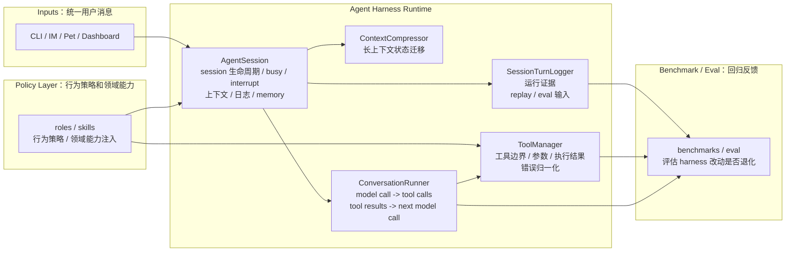
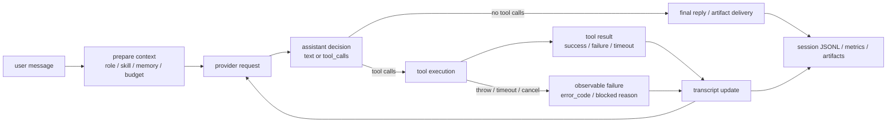

# XiaoBa-CLI SPEC

状态：Draft
最后更新：2026-05-22
适用范围：`XiaoBa-CLI` 整体架构、agent harness 边界、核心状态机、运行证据和评测闭环。

本文是 `XiaoBa-CLI` 的项目级架构真相源。专题文档可以解释某个角色、benchmark、运维流程或历史方案，但不能替代本文的整体边界定义。

## 1. 核心定位

XiaoBa-CLI 是一个本地优先、message-native 的 agent harness runtime。它的核心不是把 LLM 接到几个工具上，而是把模型、工具、角色、skill、memory、context、artifact 和日志组织成一个可控、可观测、可恢复、可评测的运行时状态机。

关键判断：

```text
Model is not the runtime.
Harness is the runtime.
```

模型负责下一步推理，harness 负责工程边界：

- provider transcript 必须合法。
- tool execution 必须闭环。
- session state 必须隔离、可恢复、可清理。
- context compression 不能丢当前任务和硬约束。
- artifact 生成与发送必须有 evidence。
- 日志必须可解析、可脱敏、可 replay。
- 失败必须能归因到 runtime、skill、role 或外部系统。

## 2. Harness 架构图

根 spec 只表达 harness 的顶层组件和职责边界。入口、工具实现、provider、role、benchmark 的细节放到对应模块 spec 或专题文档。



## 3. 核心组件边界

| 组件 | 职责 | 不能承担的职责 |
| --- | --- | --- |
| `AgentSession` | 管 session 生命周期、busy/interrupt、上下文压缩触发、skill 激活、session log、memory cleanup | 不直接实现 tool 业务；不直接适配某个平台 API |
| `ConversationRunner` | 管 agent loop：model call -> tool calls -> tool results -> next model call；保证 transcript 合法 | 不保存长期 session；不决定角色配置 |
| `ToolManager` | 管工具定义、参数解析、执行边界、结果归一化、错误码和 retryable 信号 | 不参与模型推理；不维护多轮对话状态 |
| `ContextCompressor` | 管长上下文状态迁移，在压缩后保留任务目标、约束、artifact 状态和最近上下文 | 不做业务总结；不替代 memory |
| `SessionTurnLogger` | 管运行证据：turn、tool call、tool result、tokens、runtime event、artifact clues | 不做最终质量评分；不作为业务数据库 |
| `roles/*` | 定义角色身份、职责、工具注入和验收边界 | 不复制 runtime loop |
| `skills/*` | 定义领域流程和操作策略 | 不保存 runtime 状态；不绕过工具边界 |
| `benchmarks/*` | 评估 harness/role/skill 改动是否退化或变好 | 不保存原始私密 trace |

## 4. Agent Loop 状态机

Agent harness 的核心是状态机，不是单次请求。



状态机不变量：

- 每个 assistant tool call 必须进入一个合法终态：success、failure、timeout、cancel 或 blocked。
- 每个 tool call id 必须有 matching tool result，不能把 dangling tool call 送进下一轮 provider request。
- provider-visible transcript、runtime-visible trace、user-visible message 三者可以不同，但必须可关联。
- outbound tools 例如 `reply` / `send_file` 的成功必须进入 artifact / delivery evidence。
- 已经对用户可见的消息不能因为后续 provider 失败而被 runtime 当作未发生。

## 5. 三层状态模型

XiaoBa 的状态不能只用一个 `messages[]` 描述。需要区分三层：

| 层 | 内容 | 作用 |
| --- | --- | --- |
| Durable Session | session key、持久化上下文、memory archive、active skill、长期偏好 | 跨 turn / restart 恢复 |
| Working Trace | 当前 run 的 user input、thinking、tool calls、tool results、artifacts、runtime events | debug、replay、scorecard 证据 |
| Provider Transcript | 真正发送给模型 provider 的 system/user/assistant/tool messages | 保证 provider 协议合法和 token budget |

设计原则：

- Durable session 不能直接等同于 provider transcript。
- Working trace 是事实证据，不一定全部进入下一次 provider request。
- Context compression 应该迁移状态，而不是简单裁剪文本。
- Session log 是 replay/eval 的输入资产，但 `episode_id`、`case_id`、`scorecard` 属于后处理或评测产物。

## 6. Message-Native Runtime

XiaoBa 面向 IM、桌宠和 CLI 多入口，但 runtime 统一收敛到 `AgentSession`。

入口边界：

- CLI 可以直接返回文本。
- IM / Pet 以用户可见消息和文件交付为准。
- `reply` / `send_file` 属于 outbound side effect，不能只当作普通工具文本。
- 各入口只负责鉴权、消息解析、文件上传下载、channel callback，不复制 agent loop。

新增入口必须定义：

- session key 规则。
- channel callbacks。
- 用户可见输出语义。
- 文件和图片处理语义。
- TTL、cleanup、wakeup 行为。

## 7. Role 与 Skill

Role 是用户可见身份和工程边界，不只是 prompt。

一个 role 可以包含：

- role prompt
- role-private skills
- role-specific tools
- runtime API routes
- background workers
- evaluation / review boundary

Skill 是 instruction pack，用于注入领域流程和工作策略。Skill 不拥有 runtime loop，不能绕过工具和日志边界。

当前边界：

- `engineer-cat`：实现修复和工程交付。
- `reviewer-cat`：复跑、验收、证据判断、closed/reopened。
- `inspector-cat`：日志分析、case mining、失败归因、反馈入口。
- `researcher-cat`：研究和资料整理。

## 8. Evidence And Logging

日志不是 debug 附属品，而是 harness 的运行证据层。

当前主线：

```text
logs/sessions/<session_type>/<date>/<session_type>_<session_id>.jsonl
```

稳定记录：

- `schema_version`
- `entry_type`
- `session_id`
- `session_type`
- `turn_id`
- `user.text`
- `assistant.text`
- `assistant.tool_calls`
- `tokens.prompt`
- `tokens.completion`
- runtime event

辅助或推断字段：

- `tool_call_id`
- `status`
- `error_code`
- `artifact_manifest`
- `skill_id`

日志设计目标：

- 可逐行 parse。
- 可脱敏。
- 可关联 turn / tool / artifact / token。
- 可被 Inspector 分析。
- 可被 benchmark ingestion 消费。
- 可反哺 runtime schema。

## 9. Evaluation System

XiaoBa 的评测不是单一 benchmark，而是 harness evolution loop。

```text
Agent Evaluation System
├── trace-derived eval
├── requirement-driven eval
└── contract / invariant eval
```

三类 eval：

- Trace-derived eval：从真实 trace 抽 episode/case，回答真实历史场景有没有退化。
- Requirement-driven eval：从产品需求或用户任务构造 case，回答新能力能不能端到端完成。
- Contract / invariant eval：验证 runtime/harness 永远不能破的协议和状态机不变量。

评估顺序：

```text
contract hard gate
  -> replay / e2e run
  -> hard gate verifier
  -> domain verifier
  -> LLM / VLM judge
  -> human review for high-value or disputed cases
  -> quality / efficiency scorecard
  -> baseline vs candidate A/B
```

质量原则：

- contract fail 直接 block。
- 必需 artifact 缺失直接 fail。
- privacy leak 直接 fail。
- quality 先过门槛，efficiency 再排序。
- LLM/VLM judge 只做语义评估和初筛，不能替代程序化 evidence。

## 10. Agent Harness Contracts

这些 contract 是 release hard gate，不是业务加分项：

- Transcript completeness：每个 tool call 必须有 matching tool result。
- Failure observability：timeout、cancel、throw 必须转成可观测 `status/error_code`。
- Retry budget：失败重试必须有上限，重复失败后要变更策略或报告 blocked reason。
- Privacy boundary：reply、log、artifact、scorecard 不得泄漏 credential、token、私有 host。
- Artifact evidence：生成、更新、发送用户文件必须有 manifest 或 delivery evidence。
- Context continuity：restore/compaction 后保留当前任务目标、硬约束、关键路径和 artifact 状态。
- JSONL compatibility：session log 必须逐行可解析，schema 变更必须兼容 ingestion。

## 11. Extension Rules

新增 runtime 能力时，必须回答四个问题：

- 它接入哪一层：surface、control plane、agent session、runner、tool、state/evidence、eval？
- 它改变哪个状态机边界？
- 它产生什么证据，能否进入 `logs/sessions/**/*.jsonl`？
- 它应该由 trace-derived、requirement-driven 还是 contract eval 覆盖？

新增工具必须定义：

- tool name / description / args schema。
- transcript mode。
- side effect 边界。
- error code。
- retryable 语义。
- artifact evidence。

新增角色必须定义：

- 用户可见职责。
- runtime 权限。
- skills / tools。
- 验收边界。
- 与 Engineer / Reviewer / Inspector 的协作方式。

## 12. 文档边界

- 根目录 `SPEC.md` 是项目级总 spec。
- `benchmarks/SPEC.md` 定义 agent evaluation / benchmark 资产结构。
- `roles/*/SPEC.md` 定义单个角色的职责、工具和验收边界。
- `docs/reference/*` 是专题背景，不是总架构真相源。
- 如果实现改变了本文定义的组件边界、状态机、日志 schema 或 eval contract，必须同步更新本文。
