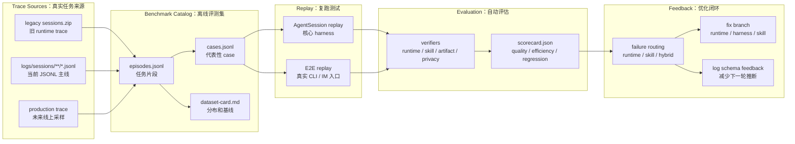
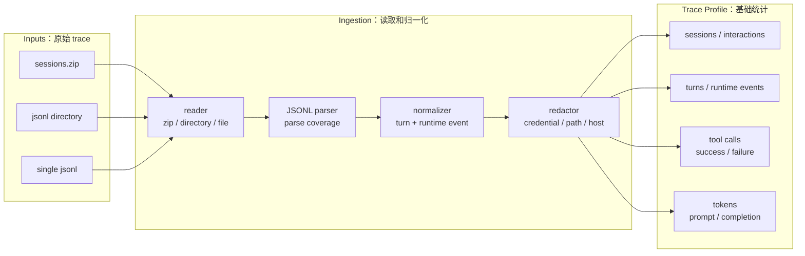
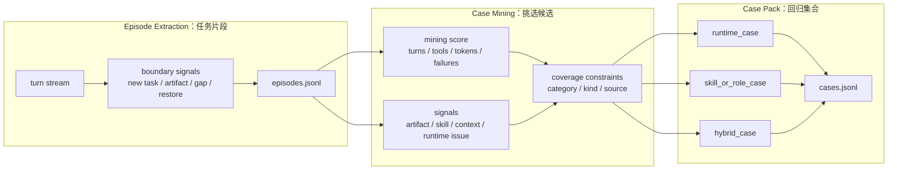
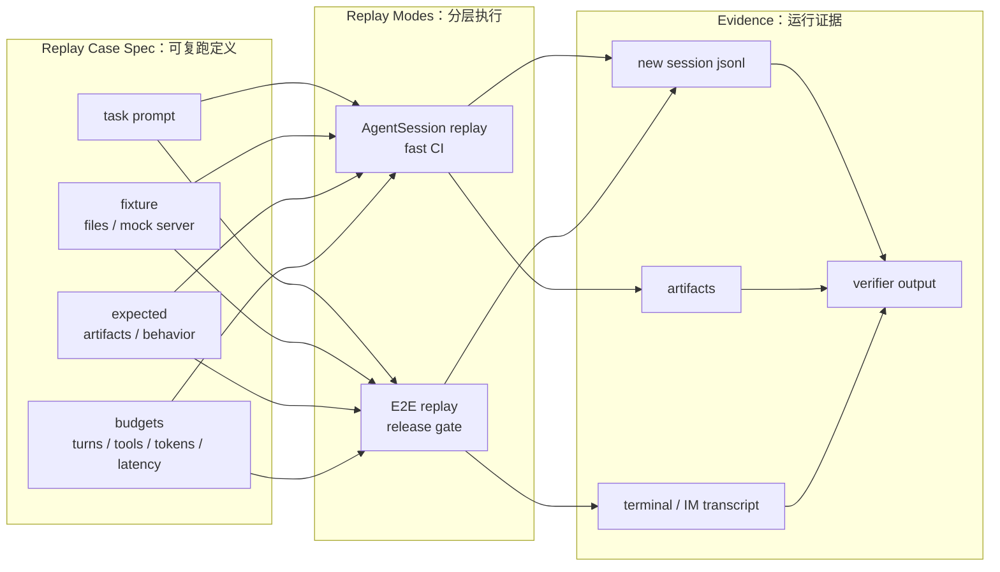
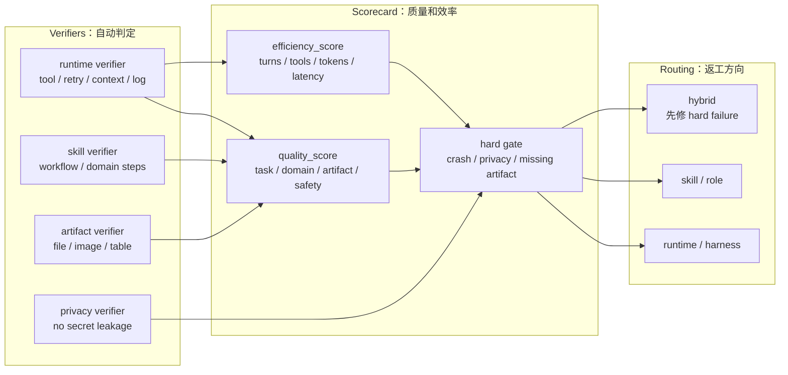

# XiaoBa Trace Benchmark Catalog SPEC

本文定义 `benchmarks/` 目录下所有 trace-derived benchmark 的通用工程规范。每个具体 benchmark 可以有自己的领域说明，但必须遵守这套通用模型。

工程推进计划见 [`PLAN.md`](PLAN.md)。`SPEC.md` 负责定义目标和 contract，`PLAN.md` 负责维护状态、优先级、owner 和验收条件。

核心原则：

> 按 session 接入 trace，按 episode 切任务，按 case 做评测，按 metadata 路由优化 runtime 或 skill。

## 1. Catalog 目标

`benchmarks/` 保存的是可长期复用的评测资产，不是原始日志归档。

每个 benchmark 应该从真实 trace 中抽取：

- 真实任务分布
- 多轮交互结构
- 工具链行为
- skill 触发情况
- artifact 生成和交付
- 失败模式
- runtime 可观测信号

然后加工成：

- 脱敏 trace profile
- episode-level dataset
- benchmark cases
- replay fixtures
- verifier specs
- scorecards
- regression gates

## 2. 通用层级模型

所有 benchmark 使用四层颗粒度：

```text
Session -> Episode -> Turn -> Tool Call
```

### Session

Session 是日志/系统会话边界。

常见来源：

- 一个 session_id
- 一个 JSONL 文件
- 一个 IM user/group channel
- 一次 restore / TTL 管理的上下文
- 一段 runtime 生命周期

Session 是 trace ingestion 边界，不是评测边界。一个 session 里可能包含多个任务，一个任务也可能跨多个 session。

### Episode

Episode 是任务边界，是从 session 中切出来的可复用任务级 trace 单元。

一个 episode 应该对应一个明确目标，例如：

- 读文件并总结
- 修改脚本并运行
- 生成图表并发送
- 排查错误并给出修复
- 把重复流程沉淀成 skill

Catalog 约定：

```text
1 episode -> 1 benchmark case
```

更精确地说：

```text
episode = trace 中的原始任务单元
case = episode 清洗、脱敏、补 fixture、补 verifier 后的评测用例
```

### Turn

Turn 是单轮用户-助手交互。

一个 turn 包含：

- user input
- assistant output
- 0 个或多个 tool call
- tool results
- tokens
- errors / warnings
- artifacts

注意：

```text
turn != tool call
```

### Tool Call

Tool Call 是 turn 内部的执行动作。

需要记录：

- tool name
- redacted args
- result summary
- success / failure
- duration
- error code
- artifact references

## 3. 通用数据流

```text
raw trace
  -> session-level ingestion
  -> normalized turns/runtime events
  -> episode extraction
  -> case metadata generation
  -> fixture/replay case construction
  -> verifier execution
  -> scorecard
  -> runtime/skill optimization routing
```

其中：

- trace ingestion 负责规范化和脱敏。
- episode extraction 负责切任务。
- case metadata 负责分层统计和优化路由。
- fixture/replay 负责可复现运行。
- verifier/scorecard 负责自动评估。
- routing 负责把失败定位到 runtime、skill 或 hybrid。

### 模块化流程图

总览图只表达主链路，细节拆到后面的模块图里。



#### 模块 1：Trace 清洗



#### 模块 2：Episode 到 Case



#### 模块 3：Replay 与验收



#### 模块 4：Scorecard 与闭环



### 当前差距与推进计划

| 层级 | 当前状态 | 距离 goal 架构还差什么 | 下一步 |
| --- | --- | --- | --- |
| Trace 来源 | `sessions.zip`、`logs/sessions/**/*.jsonl` 已可接入 | 线上 trace 还需要固定 schema 版本和采集策略 | 固定 `schema_version` 并把生产 trace 接入同一入口 |
| 日志 schema | 已记录 turn/runtime、tool、token，并开始写 `turn_id`、`tool_call_id`、`status`、`error_code`、`artifact_manifest` | `episode_id`、`skill_id` 覆盖率、context budget、runtime state 还不完整 | 在 runtime/skill/tool executor 中继续补结构化字段 |
| Episode dataset | harness 可在本地输出 `episodes.jsonl` 和 dataset card；trace-derived artifacts 默认不提交 | episode 边界仍部分依赖启发式 | 优先消费 runtime 写入的 `episode_id` / artifact / skill 信号 |
| Case metadata | harness 可在本地生成 runtime/skill/hybrid case 和 token/tool/failure metadata | 还没有 replay fixture 和 verifier id；公开仓库只提交已审查的 spec / evaluation | 为每类 case 绑定 fixture plan 与 verifier plan |
| Testing | 当前主要是离线 ingest 单测和 CLI 集成测试 | 还没有用当前 runtime 复跑 case | 实现 replay runner，支持 selected cases 和 CI 回测 |
| Evaluation | 已有 baseline profile、case category、token/tool 指标 | 还没有 artifact/script/runtime/privacy verifier 和 scorecard | 实现 verifier runner 与 `scorecard.json` |

## 4. Episode Extraction 规范

Episode extraction 的输入是按时间排序的 session turns。

### 通用切分信号

- 用户提出新的目标
- 工作对象或路径变化
- task mode 变化：查看、修改、运行、发送、总结、打包 skill
- artifact 生成或发送完成
- 用户确认/纠错后进入新目标
- 长时间间隔或跨天
- session restore 后开始新任务
- turn 编号重置
- active skill 变化

### Episode Manifest Schema

每个 benchmark 应输出 `episodes.jsonl`，一行一个 episode：

```json
{
  "episode_id": "benchmark.ep.000001",
  "benchmark": "BenchmarkName",
  "source_session_hash": "hash",
  "source_paths": ["sessions/platform/date/trace-0001.jsonl"],
  "start_turn": 1,
  "end_turn": 4,
  "turn_count": 4,
  "task_summary": "脱敏后的任务摘要",
  "task_type": "plot_generation",
  "domain": "bioinformatics",
  "domain_subtype": "single_cell_seurat",
  "tools_used": ["read_file", "write_file", "execute_shell"],
  "skills_triggered": ["skill-name"],
  "tool_call_count": 12,
  "successful_tool_calls": 10,
  "failed_tool_calls": 2,
  "tool_success_rate": 0.8333,
  "total_tokens": 17342,
  "prompt_tokens": 16200,
  "completion_tokens": 1142,
  "artifacts_observed": ["redacted/output.ext"],
  "failure_modes_observed": ["tool_timeout"],
  "context_pressure": false,
  "requires_artifact": true,
  "requires_remote_fixture": false,
  "privacy_level": "redacted"
}
```

## 5. Case Metadata 规范

一个 episode 生成一个 benchmark case。Case metadata 必须足够支持分层统计、回归、失败归因和优化路由。

### Required Fields

```json
{
  "case_id": "benchmark.case.000001",
  "source_episode_id": "benchmark.ep.000001",
  "benchmark": "BenchmarkName",
  "case_category": "runtime_case | skill_case | hybrid_case",
  "task_type": "plot_generation",
  "domain": "bioinformatics",
  "domain_subtype": "single_cell_seurat",
  "turn_count": 4,
  "tool_call_count": 12,
  "successful_tool_calls": 10,
  "failed_tool_calls": 2,
  "tool_success_rate": 0.8333,
  "total_tokens": 17342,
  "prompt_tokens": 16200,
  "completion_tokens": 1142,
  "tools_used": ["read_file", "write_file", "execute_shell"],
  "skills_triggered": ["skill-name"],
  "failure_modes_observed": ["tool_timeout"],
  "expected_artifacts": ["output/result.ext"],
  "requires_artifact": true,
  "requires_long_context": false,
  "requires_remote_fixture": false,
  "privacy_level": "redacted"
}
```

### Optional Fields

```json
{
  "difficulty": "easy | medium | hard",
  "expected_runtime_behavior": ["bounded retry", "valid tool transcript"],
  "expected_skill_behavior": ["domain-specific workflow step"],
  "verifier_ids": ["file_exists", "privacy_scan"],
  "baseline": {
    "score": 0,
    "tool_success_rate": 0,
    "latency_ms": 0,
    "total_tokens": 0,
    "prompt_tokens": 0,
    "completion_tokens": 0
  }
}
```

## 6. Case Categories

### runtime_case

主要评 XiaoBa runtime 编排能力。

典型评测点：

- context compression
- session restore
- tool transcript 合法性
- retry / timeout
- platform compatibility
- artifact delivery
- log redaction
- long task state

### skill_case

主要评某个领域 skill 或工作流能力。

典型评测点：

- skill 是否被正确触发
- skill prompt / workflow 是否正确
- 领域步骤是否完整
- 输出是否满足任务要求
- 可复用产物是否合格

### hybrid_case

同时评 runtime 和 skill。

例如：

- 长上下文下执行领域 skill
- tool 超时后继续完成 skill 任务
- restore 后继续 skill workflow

## 7. 优化路由规范

评测失败后必须能给出优化方向。

| 失败现象 | 优化方向 |
| --- | --- |
| tool transcript 非法、dangling tool call | runtime |
| context 压缩后丢任务目标 | runtime |
| restore 状态不透明 | runtime |
| retry 无上限或无 blocked reason | runtime |
| artifact 已生成但未记录/未发送 | runtime |
| 日志泄漏敏感信息 | runtime / logger |
| skill 未触发或触发错误 | skill |
| 领域步骤缺失 | skill |
| skill 生成产物不可复用 | skill |
| 长上下文 + 领域逻辑同时失败 | hybrid，先看 hard failure 属于哪层 |

## 8. 日志系统要求

评测体系和日志系统必须相辅相成。日志 schema 固定后，trace 清洗和 episode extraction 才能规模化。

当前主线日志文件只保留 `SessionTurnLogger` 写入的 `logs/sessions/**/*.jsonl`。`Logger` 不再生成按日期散落的普通 `.log` 文件；没有绑定 session context 的 runtime/debug 输出只走控制台，不进入 benchmark trace。

### Current Log Contract

Benchmark v0 必须围绕当前 XiaoBa JSONL 日志设计，不能假设日志里已经有完整 replay case 信息。

当前 `SessionTurnLogger` 的稳定输入层是：

- `entry_type`
- `timestamp`
- `session_id`
- `session_type`
- `turn`
- `user.text`
- `assistant.text`
- `assistant.tool_calls`
- `tool_calls.id`
- `tool_calls.name`
- `tool_calls.arguments`
- `tool_calls.result`
- `tokens.prompt`
- `tokens.completion`

这些字段足够做基础 trace profile、episode mining、tool 成功率、token 成本和任务类型归类。

当前 logger 还会写入或推断一组 benchmark-friendly 字段，但它们在 v0 里应被视为辅助信号，不应被当成强 ground truth：

- `turn_id`：logger 生成的稳定 turn id。
- `runtime.event_id`：logger 生成的 runtime event id。
- `tool_calls.tool_call_id`：优先使用模型/tool id，缺失时由 logger 生成。
- `tool_calls.status`：如果 tool executor 没显式传入，则由 result 文本推断。
- `tool_calls.error_code`：如果 tool executor 没显式传入，则由 result 文本推断。
- `tool_calls.artifact_manifest`：如果 tool executor 没显式传入，则由 tool name、arguments、result 路径启发式推断。
- `tool_calls.skill_id`：字段已支持，但依赖 skill/runtime 显式传入；覆盖率不能默认假设完整。

### Benchmark 派生字段

这些字段不要求日志直接写入，由 ingestion / case construction / replay 生成：

- `episode_id`：v0 由离线切分生成；未来可以由 runtime 辅助写入。
- `case_id`：由 benchmark catalog 生成。
- `case_category`：由 task type、failure mode、skill/artifact 信号推导。
- `expected_artifacts`：由 case authoring 或 fixture spec 定义，不从历史日志强推为真值。
- `verifier_ids`：由 case spec 绑定。
- `quality_score` / `efficiency_score` / `scorecard`：由 replay + verifier 运行生成。

### 推荐后续增强字段

```json
{
  "episode_id": "optional runtime hint, still validated by ingestion",
  "skill_id": "activated skill name supplied by skill runtime",
  "active_skill_name": "current active skill",
  "artifact_manifest": [
    {
      "path": "redacted/path",
      "type": "png|pdf|script|table|report|archive",
      "action": "created|sent|updated"
    }
  ],
  "error_code": "TOOL_TIMEOUT|RATE_LIMIT|PATH_DENIED|PROVIDER_ERROR",
  "runtime_state": {
    "busy": false,
    "restored": true,
    "compacted": false
  },
  "context_budget": {
    "prompt_tokens": 0,
    "budget_tokens": 128000,
    "pressure": false
  },
  "redaction_status": {
    "checked": true,
    "hits": 0
  }
}
```

增强字段的目标是减少 ingestion 推断，不是让当前 benchmark 脱离现有日志系统。

### 日志字段如何反哺评测

```text
skill_id -> skill_case 分类
artifact_manifest -> episode 完成边界
error_code -> failure taxonomy
context_budget -> context pressure case
runtime_state -> restore/compaction case
redaction_status -> privacy gate
```

## 9. 每个 Benchmark 目录要求

每个 benchmark 目录至少包含：

```text
README.md
benchmark.json
episodes.jsonl
cases.jsonl
dataset-card.md
summary.md
```

建议逐步补充：

```text
SPEC.md                 # 领域特化规范，可引用本文件
EVALUATION.md           # 领域评测解释
cases/                  # replay case specs
fixtures/               # deterministic fixtures
verifiers/              # benchmark-specific verifier configs
runs/                   # local ignored replay results
```

## 10. 实现阶段

### Phase 1: Trace Profile

目标：从 raw trace 生成基础 profile。

指标：

- sessions
- turns
- runtime events
- tool calls
- successful / failed tool calls
- tool success rate
- token usage
- issue distribution
- redaction hits

### Phase 2: Episode Dataset

目标：生成 episode-level dataset。

输出：

- `episodes.jsonl`
- episode count
- avg / p50 / p90 turns per episode
- avg / p50 / p90 tool calls per episode
- total / prompt / completion tokens
- avg / p50 / p90 / max tokens per episode
- task type distribution
- skill trigger distribution
- failure mode distribution

### Phase 3: Case Metadata & Routing

目标：一个 episode 生成一个 case，补全 metadata，并分类为：

- runtime_case
- skill_case
- hybrid_case

### Phase 4: Replay & Verifier

目标：将 case 转成可复跑评测用例。

需要：

- fixture setup
- runtime launch
- tool sandbox / mock
- verifier runner
- artifact capture

Replay lane 策略：

| 场景 | 默认 replay | 说明 |
| --- | --- | --- |
| 普通 runtime / skill / verifier 改动 | `agent_session` | 快、稳定、适合高频回归 |
| `AgentSession` / `ConversationRunner` / `ToolManager` 改动 | `agent_session` | 直接覆盖核心 harness 风险 |
| domain skill / workflow 改动 | `agent_session` | 重点看领域产物和 verifier |
| CLI / IM / dashboard / pet adapter 改动 | `agent_session` + selected `e2e` | adapter 风险必须走真实入口 |
| RoleResolver / prompt loading 改动 | selected `e2e` | 直接 runtime replay 可能绕过 role 激活问题 |
| `send_file` / artifact delivery 改动 | `agent_session` + `e2e` | 必须证明用户可见交付成立 |
| nightly / release gate | selected suite + `e2e` gate | 平衡覆盖面和真实用户路径 |

默认规则：

```text
1. 能用 AgentSession replay 稳定捕获的问题，不先跑 E2E。
2. 涉及入口、role、session、channel、文件交付的问题，必须补 E2E。
3. AgentSession replay 失败时，先修核心 harness，再考虑扩大 E2E。
4. AgentSession replay 通过但 E2E 失败时，优先归因到 adapter / role / channel / session / packaging。
```

### Phase 5: Scorecard & CI Gate

目标：评估改动是否变好或退化。

输出：

- `scorecard.json`
- `report.md`
- regression diff

CI gate 示例：

- hard failure = 0
- privacy failure = 0
- pass rate 不下降超过阈值
- tool failure rate 不上升超过阈值
- context-pressure cases 必须通过
- artifact cases 必须有 verifier evidence

## 11. 与具体 Benchmark 的关系

根目录 `SPEC.md` 定义通用工程规范。

具体 benchmark 可以有自己的领域补充，例如：

- `BioBench/SPEC.md`：生信工程师工作流，R/Seurat、远程服务器、图表产物、cluster annotation。
- 未来 `PaperBench/SPEC.md`：论文阅读、引用抽取、实验表格复核。
- 未来 `CodeBench/SPEC.md`：代码修改、测试、PR review。

具体 benchmark 不应重复定义通用层级，只需要补充：

- domain taxonomy
- task taxonomy
- verifier 细节
- fixture 设计
- 特定 failure modes

## 12. 总结

通用闭环：

```text
structured runtime log
  -> trace ingestion
  -> episode extraction
  -> case metadata
  -> runtime/skill/hybrid routing
  -> fixture replay
  -> verifier scorecard
  -> runtime or skill optimization
  -> better structured runtime log
```

一句话：

> Episode 是可复用的任务级 trace，Case 是可执行的评测用例；case metadata 记录 turn、tool call、成功率、失败率、skill、artifact 和 failure mode，用来区分 runtime case 与 skill case，并把评测结果路由到对应优化方向。
