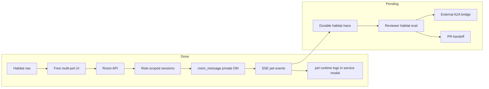

# Dashboard Plan

## Current Status

Dashboard Habitat is now a visual multi-agent pet workspace. A user can pull multiple role pets into the habitat, see them as free working pet nodes, and send a result target either to one pet or to every pet currently present. Each pet is backed by its own role-scoped `AgentSession`, and agents communicate through a role-neutral private-message primitive.

## Milestones

1. Habitat page MVP: completed.
2. Free multi-pet visual workspace: completed.
3. Backend Habitat API: completed on the current `/api/room/*` route namespace.
4. Role-scoped prompt/skills/tools per room pet: completed.
5. SSE event stream per room pet: completed.
6. Role-neutral private-message primitive: completed.
7. Durable room trace and replay: not started.
8. Feishu room bridge / external A2A: not started.

## Next Steps

- Add durable habitat trace files so a run can be replayed and reviewed.
- Add Habitat-specific tests with a fake AI service so message streaming can be verified without external model credentials.
- Add ReviewerCat eval cases for Habitat-driven EngineerCat tasks.
- Continue polishing the spatial pet surface: drag positions, richer movement, and compact status bubbles.

## Owners

- Frontend surface: `dashboard/index.html`.
- Dashboard API: `src/dashboard/routes/api.ts`.
- Habitat runtime: `src/dashboard/room-channel.ts`.
- Role-scoped prompt/skills/tools: `src/utils/prompt-manager.ts`, `src/skills/skill-manager.ts`, `src/bootstrap/tool-manager.ts`, `src/roles/runtime-role-registry.ts`.

## Acceptance Criteria

- `npm run build` passes.
- `GET /api/navigation/open?page=room` is accepted.
- `GET /api/room/roles` returns role pets and current `cwd`.
- Habitat page can pull multiple role pets into the workspace.
- Each pet renders as a free spatial pet node with an animated spritesheet, status dot, speech bubble, and selectable detail panel.
- Every Habitat agent exposes the same `room_message` tool for private natural-language messages to another agent.
- `POST /api/room/messages` can deliver a private message, publish `room_message` events to sender and recipient, and wake the recipient agent.
- Mobile viewport does not horizontally overflow.
- Missing model credentials fail visibly as a room pet error instead of pretending success.
- The `pet` service log modal shows in-process Dashboard chat runtime logs for `pet:*` sessions, matching the child-process log behavior of Feishu and Weixin.

## Verification Log

- 2026-05-25: `npm run build` passed after adding role-scoped Room runtime.
- 2026-05-25: Playwright opened `/?page=room`, verified 4 role buttons, pulled EngineerCat and InspectorCat into the room, confirmed both pet canvases had nonblank pixels, and found no mobile overflow at 390px.
- 2026-05-25: Local room message smoke reached the Room agent SSE path; current dashboard process lacked model credentials, so the pet stayed in `failed` state in both UI and `/api/room/agents` instead of pretending success.
- 2026-05-25: `npm test -- tests/roles.test.ts tests/tool-manager-roles.test.ts tests/pet-channel.test.ts tests/engineer-cat-omc-caller.test.ts` passed, covering 193 tests in the current run.
- 2026-05-25: Habitat communication design corrected from role-specific workflow verbs to a single IM-style private-message primitive.
- 2026-05-25: Browser smoke confirmed `POST /api/room/messages` publishes `DM to` on the sender pet, `DM from` on the recipient pet, keeps both pet canvases nonblank, and reports no console errors.
- 2026-05-25: Frontend was reshaped from card-like agent panels into a Habitat surface with free pet nodes and a selected-pet detail log.
- 2026-05-25: Playwright verified the user-facing title is `Habitat`, the page renders 2 `.habitat-pet` nodes on a `.habitat-floor`, no `.room-pet-card` nodes remain, private-message bubbles render, pet canvases are nonblank, and 390px mobile has no horizontal overflow.
- 2026-05-25: `node --import tsx --test tests/dashboard-service-logs.test.ts tests/logger.test.ts` verified the `pet` service logs include in-process `pet:*` runtime lines while excluding Feishu and unscoped Dashboard logs.

## Risks / Open Questions

- Habitat state is process-local; refresh can recover active agents from the current process but not from a restart.
- Habitat message success depends on local model credentials.
- Long-running Habitat tasks need durable trace, cancel/resume UI, and validation summaries before they can be treated like AutoDev cases.

## Status Maintenance Rules

- If Habitat gains durable trace, update `SPEC.md` data contracts.
- If Habitat starts creating PRs or AutoDev cases, add acceptance criteria for those handoffs.
- Do not add role-specific Habitat protocol verbs; encode collaboration intent as natural-language private messages.
- Do not claim Habitat is a complete external A2A system until cross-process protocol and replay evidence exist.
