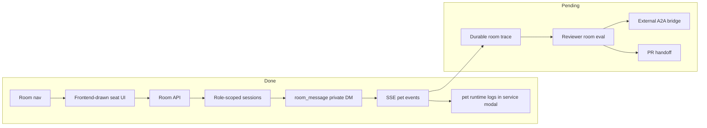

# Dashboard Plan

## Current Status

Dashboard Room is now the multi-agent workspace in the local dashboard. A user can pull multiple role agents into the Room, see them seated around a large frontend-drawn meeting table in a white cyber-office meeting room, and send a result target either to one agent or to every agent currently present. Each agent is backed by its own role-scoped `AgentSession`, and agents communicate through a role-neutral private-message primitive.

## Milestones

1. Room page MVP: completed.
2. Free multi-agent visual workspace: completed.
3. Backend Room API: completed on the current `/api/room/*` route namespace.
4. Role-scoped prompt/skills/tools per room agent: completed.
5. SSE event stream per room agent: completed.
6. Role-neutral private-message primitive: completed.
7. Frontend-drawn meeting-table Room visual refresh: completed.
8. Durable room trace and replay: not started.
9. Feishu room bridge / external A2A: not started.

## Next Steps

- Add durable room trace files so a run can be replayed and reviewed.
- Add Room-specific tests with a fake AI service so message streaming can be verified without external model credentials.
- Add ReviewerCat eval cases for Room-driven EngineerCat tasks.
- Continue polishing the spatial Room surface: drag positions, richer movement, and compact status bubbles.

## Owners

- Frontend surface: `dashboard/index.html`.
- Dashboard API: `src/dashboard/routes/api.ts`.
- Room runtime: `src/dashboard/room-channel.ts`.
- Role-scoped prompt/skills/tools: `src/utils/prompt-manager.ts`, `src/skills/skill-manager.ts`, `src/bootstrap/tool-manager.ts`, `src/roles/runtime-role-registry.ts`.

## Acceptance Criteria

- `npm run build` passes.
- `GET /api/navigation/open?page=room` is accepted.
- `GET /api/room/roles` returns role agents and current `cwd`.
- Room page can pull multiple role agents into the workspace.
- The Room floor shows a frontend-drawn white cyber-office meeting room with a large meeting table.
- The visible chair count equals the supported maximum multi-agent count, currently 8, and the backend rejects more agents once all seats are occupied.
- Each added agent occupies one seat and renders as an animated pet with a status dot, speech bubble, and selectable detail panel.
- Every Room agent exposes the same `room_message` tool for private natural-language messages to another agent.
- `POST /api/room/messages` can deliver a private message, publish `room_message` events to sender and recipient, and wake the recipient agent.
- Mobile viewport does not horizontally overflow.
- Missing model credentials fail visibly as a room agent error instead of pretending success.
- The `pet` service log modal shows in-process Dashboard chat runtime logs for `pet:*` sessions, matching the child-process log behavior of Feishu and Weixin.

## Verification Log

- 2026-05-25: `npm run build` passed after adding role-scoped Room runtime.
- 2026-05-25: Playwright opened `/?page=room`, verified 4 role buttons, pulled EngineerCat and InspectorCat into the room, confirmed both pet canvases had nonblank pixels, and found no mobile overflow at 390px.
- 2026-05-25: Local room message smoke reached the Room agent SSE path; current dashboard process lacked model credentials, so the pet stayed in `failed` state in both UI and `/api/room/agents` instead of pretending success.
- 2026-05-25: `npm test -- tests/roles.test.ts tests/tool-manager-roles.test.ts tests/pet-channel.test.ts tests/engineer-cat-omc-caller.test.ts` passed, covering 193 tests in the current run.
- 2026-05-25: Room communication design corrected from role-specific workflow verbs to a single IM-style private-message primitive.
- 2026-05-25: Browser smoke confirmed `POST /api/room/messages` publishes `DM to` on the sender agent, `DM from` on the recipient agent, keeps both pet canvases nonblank, and reports no console errors.
- 2026-05-25: Frontend was reshaped from card-like agent panels into a Room surface with free agent nodes and a selected-agent detail log.
- 2026-05-25: `node --import tsx --test tests/dashboard-service-logs.test.ts tests/logger.test.ts` verified the `pet` service logs include in-process `pet:*` runtime lines while excluding Feishu and unscoped Dashboard logs.
- 2026-05-25: `npm run build` and `git diff --check -- dashboard/index.html dashboard/SPEC.md dashboard/PLAN.md` passed after the Room white cyber-office refresh.
- 2026-05-25: Browser verified `/?page=room` at 1470x900 and 390x844: visible Room copy uses the new naming, old workspace selectors are absent, 4 role buttons render, the Room floor/detail panels render, and neither viewport has horizontal overflow.
- 2026-05-25: Browser rechecked the Room visual language after replacing the dark cyber treatment with white glass panels, light grid lines, blue/warm accents, and dashboard-matching surfaces; desktop 1470x900 and mobile 390x844 still have no horizontal overflow.
- 2026-05-25: `npm run build` and `git diff --check -- dashboard/index.html dashboard/SPEC.md dashboard/PLAN.md src/dashboard/room-channel.ts` passed after replacing the image background with a frontend-drawn meeting room.
- 2026-05-25: Playwright verified `/?page=room` at 1470x900 and 390x844: 8 seats render, 1 occupied seat matches 1 room agent, no image background is used, the round table exists, the label shows `1/8`, and neither viewport has horizontal overflow.
- 2026-05-25: API smoke created 8 room agents successfully and confirmed the 9th `POST /api/room/agents` returns 400, matching the frontend seat count.
- 2026-05-26: Removed the redundant Room hero strip; `npm run build`, browser verification, and Playwright checks at 1470x900 and 390x844 confirmed the page now starts at `.room-shell`, keeps 8 seats and the round table, and has no horizontal overflow.
- 2026-05-26: Compacted the Room Agent Bay on narrow layouts; browser verification and Playwright checks at 599x837, 390x844, and 1470x900 confirmed the role dock becomes a two-column compact tray, keeps all 4 role buttons usable, preserves 8 room seats, and has no horizontal overflow.
- 2026-05-26: Reworked the Room floor visual from a heavy blueprint-style scene into a quieter white meeting table surface; browser verification and Playwright checks with 5 active agents at 599x837, 390x844, and 1470x900 confirmed no window/console placeholder elements render, narrow screens show only the selected agent label, all 8 seats remain, and there is no horizontal overflow.
- 2026-05-26: Rebalanced the Room layout so Agent Bay is a 58px top tray at narrow widths, the Room floor renders before the dispatch input, and the table/seat geometry no longer overlaps; `npm run build`, browser verification, and Playwright checks at 692x663, 390x844, and 1470x900 passed with 5 active agents and no horizontal overflow.
- 2026-05-26: Confirmed the Room backend and frontend still support 8 agents; API smoke created 8 agents and the 9th `POST /api/room/agents` returned 400. The Room floor was simplified into a cleaner meeting-table seat canvas with no fake decor or foreground table occlusion; Playwright checks at 692x663, 390x844, and 1470x900 covered empty, 5-agent, and 8-agent states with no horizontal overflow.
- 2026-05-26: Removed the white framed backgrounds from Room pet stages so role pets render on transparent hit areas with only soft state shadows; `npm run build` passed and Playwright verified 5-agent and 8-agent states at 692x663, 390x844, and 1470x900 with transparent stage backgrounds, no label overlap, and no horizontal overflow.

## Risks / Open Questions

- Room state is process-local; refresh can recover active agents from the current process but not from a restart.
- Room message success depends on local model credentials.
- Long-running Room tasks need durable trace, cancel/resume UI, and validation summaries before they can be treated like AutoDev cases.

## Status Maintenance Rules

- If Room gains durable trace, update `SPEC.md` data contracts.
- If Room starts creating PRs or AutoDev cases, add acceptance criteria for those handoffs.
- Do not add role-specific Room protocol verbs; encode collaboration intent as natural-language private messages.
- Do not claim Room is a complete external A2A system until cross-process protocol and replay evidence exist.
