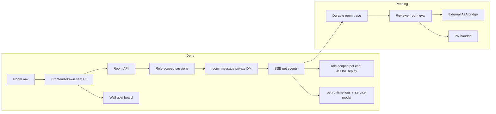

# Dashboard Plan

## Current Status

Dashboard Room is now the multi-agent workspace in the local dashboard. A user can pull multiple role agents into the Room, see them seated around a large frontend-drawn meeting table in a white cyber-office meeting room, and send a result target either to one agent or to every agent currently present. A broadcast task becomes the current Room goal and appears on the wall board. Each agent is backed by its own role-scoped `AgentSession`, and agents communicate through a role-neutral private-message primitive.

Dashboard pet Chat now has role-scoped JSONL history for work-trace replay. The history stores decorated SSE events for the Chat page and is intentionally separate from IM-platform records and `AgentSession` provider context. Product-wise, the Chat page presents one local colleague; internally each active role gets one durable work trace. The base role uses the default `pet:<petId>` runtime key so the desktop widget and Dashboard Chat show the same conversation.

Dashboard managed services now cover the maintained Feishu, Weixin, and Pet entries. The retired CatsCompany IM service is no longer exposed in service control, config editing, or service logs.

Dashboard no longer renders the local observability summary or action controls in the user-facing Runtime page. `/api/observability/summary` and `/api/observability/review` remain available as developer read APIs, but `/api/observability/actions` has been removed from the current product path.

## Milestones

1. Room page MVP: completed.
2. Free multi-agent visual workspace: completed.
3. Backend Room API: completed on the current `/api/room/*` route namespace.
4. Role-scoped prompt/skills/tools per room agent: completed.
5. SSE event stream per room agent: completed.
6. Role-neutral private-message primitive: completed.
7. Frontend-drawn meeting-table Room visual refresh: completed.
8. Broadcast task rendered as current Room goal on the wall board: completed.
9. Durable room trace and replay: not started.
10. Feishu room bridge / external A2A: not started.
11. Dashboard pet Chat visible JSONL replay: completed.
12. Dashboard pet Chat role-scoped single trace: completed.
13. Dashboard SPEC Current/Target architecture split: completed.
14. Local observability summary on Runtime page: removed from user-facing Dashboard; summary API remains developer read-only.
15. Hash-only local trace timeline on Runtime page: removed from user-facing Dashboard.
16. Dashboard observability action controls: removed from user-facing Dashboard and backend API.

## Next Steps

- Add durable room trace files so a run can be replayed and reviewed.
- Add UI affordances for clearing, searching, or filtering the current role's Dashboard pet Chat work trace if the visible JSONL grows beyond simple replay.
- Add Room-specific tests with a fake AI service so message streaming can be verified without external model credentials.
- Add ReviewerCat eval cases for Room-driven EngineerCat tasks.
- Continue polishing the spatial Room surface: drag positions, richer movement, and compact status bubbles.
- Keep observability read-only in Dashboard; use `xiaoba replay --trace` for historical replay and `eval:*` for live agent eval.

## Owners

- Frontend surface: `dashboard/index.html`.
- Dashboard API: `src/dashboard/routes/api.ts`.
- Developer observability API: `src/dashboard/routes/api.ts`, `src/dashboard/observability-actions.ts`, `src/observability`.
- Dashboard pet chat API and visible history: `src/pet/channel.ts`, `src/pet/chat-history-store.ts`, `dashboard/pet-runtime.js`.
- Room runtime: `src/dashboard/room-channel.ts`.
- Role-scoped prompt/skills/tools: `src/utils/prompt-manager.ts`, `src/skills/skill-manager.ts`, `src/bootstrap/tool-manager.ts`, `src/roles/runtime-role-registry.ts`.

## Acceptance Criteria

- `npm run build` passes.
- `GET /api/navigation/open?page=room` is accepted.
- `GET /api/room/roles` returns role agents and current `cwd`.
- Room page can pull multiple role agents into the workspace.
- The Room floor shows a frontend-drawn white cyber-office meeting room with a large meeting table.
- Dispatching a task to Room updates the wall board to show that task as the current Room goal before agents begin work.
- The visible chair count equals the supported maximum multi-agent count, currently 8, and the backend rejects more agents once all seats are occupied.
- Each added agent occupies one seat and renders as an animated pet with a status dot, speech bubble, and selectable detail panel.
- Every Room agent exposes the same `room_message` tool for private natural-language messages to another agent.
- `POST /api/room/messages` can deliver a private message, publish `room_message` events to sender and recipient, and wake the recipient agent.
- Mobile viewport does not horizontally overflow.
- Missing model credentials fail visibly as a room agent error instead of pretending success.
- The `pet` service log modal shows in-process Dashboard chat runtime logs for `pet:*` sessions, matching the child-process log behavior of Feishu and Weixin.
- Dashboard service control and config screens do not expose the retired CatsCompany IM adapter.
- Saving model config from the Dashboard config page updates the running Dashboard process environment immediately, so new pet and Room agent calls use the saved provider/model without a restart.
- Dashboard pet Chat writes visible replay events to `data/chat/sessions/pet_<petId>.jsonl` for the base role and `data/chat/sessions/pet_<petId>_role-<roleName>.jsonl` for non-base roles.
- `GET /api/pet/events?sessionKey=...&replay=1` can restore the current role's Dashboard pet Chat work trace after a process restart.
- Dashboard pet Chat visible history remains separate from IM-platform canonical chat records and `data/sessions` provider context.
- Multiple `send_text` / channel reply events in one episode render as multiple visible assistant messages instead of replacing earlier messages.
- `GET /api/observability/summary` returns local-only SLO and drilldown facts and preserves explicitly recorded local previews as local evidence.
- Runtime page does not render the local observability summary panel, hash-only trace timeline, queue state, or Generate/Sign/Patch observability controls.
- `GET /api/observability/review` returns local evidence state with redacted paths and no raw home path.
- `POST /api/observability/actions` is not exposed.

## Verification Log

- 2026-06-25: Main Dashboard pet Chat now passes the active role-scoped `sessionKey` to SSE replay and message sends, and message-mode `send_text` / channel replies append separate assistant bubbles instead of overwriting prior visible replies. Verification: `node --test -r tsx test/dashboard-pet-runtime.test.ts` (4/4); `npm run build`; `npm test` (358/358); `npm run test:contract-smoke` (6/6 items, 23/23 cases); `npm run eval:gate` (1/1 item, 11/11 cases); `git diff --check`.
- 2026-06-23: Removed Dashboard observability action API from the current product path. `/api/observability/summary` and readonly `/api/observability/review` remain; trace proposal / trace continuity generation is no longer exposed through Dashboard. Verification: `node --test -r tsx test/dashboard-observability-api.test.ts` (3/3); `npm run build`.
- 2026-06-09: Removed the user-facing Dashboard observability panel and action controls. `dashboard/index.html` no longer contains observability summary, SLO, trace timeline, review queue, or Generate/Sign/Patch UI code; `/api/observability/*` remains the developer/eval surface, and the aggregate scorecard contract now checks local summary/review/action API wiring instead of Dashboard HTML panel wiring. Verification: `rg -n "observability|Observability" dashboard/index.html` (no matches); `node --test --test-concurrency=1 -r tsx tests/dashboard-observability-api.test.ts tests/eval-schema-validation.test.ts tests/observability-regression-runner.test.ts` (99/99); `npm run build`; `npm run observability:scorecard -- --sample --allow-review` (quarantine, failed=0); `npm run observability:review-packet -- --allow-review` (quarantine, failed=0); `npm run eval:schema` (7310/7311 passed, 0 failed, 1 skipped); `git diff --check`.
- 2026-06-08: Added Dashboard Sign Privacy observability action evidence. `/api/observability/actions` includes `sign-privacy`, `/api/observability/review` reports `signed_privacy_ready`, and the later user-facing Dashboard cleanup removed the Runtime UI controls while keeping the API path. Verification: `npm run build`; `node --test --test-concurrency=1 -r tsx tests/observability-privacy-governance.test.ts tests/dashboard-observability-api.test.ts tests/eval-schema-validation.test.ts` (74/74); `npm run observability:privacy-approval -- --sign --allow-review` (pass, signedPrivacyReady=true); `npm run eval:schema` (7232/7233 passed, 0 failed, 1 skipped); `git diff --check`.
- 2026-05-25: `npm run build` passed after adding role-scoped Room runtime.
- 2026-05-25: Playwright opened `/?page=room`, verified 4 role buttons, pulled EngineerCat and InspectorCat into the room, confirmed both pet canvases had nonblank pixels, and found no mobile overflow at 390px.
- 2026-05-25: Local room message smoke reached the Room agent SSE path; current dashboard process lacked model credentials, so the pet stayed in `failed` state in both UI and `/api/room/agents` instead of pretending success.
- 2026-05-25: role, tool-manager, pet-channel, and EngineerCat role-contract tests passed, covering 193 tests in that run.
- 2026-05-25: Room communication design corrected from role-specific workflow verbs to a single IM-style private-message primitive.
- 2026-05-25: Browser smoke confirmed `POST /api/room/messages` publishes `DM to` on the sender agent, `DM from` on the recipient agent, keeps both pet canvases nonblank, and reports no console errors.
- 2026-05-25: Frontend was reshaped from card-like agent panels into a Room surface with free agent nodes and a selected-agent detail log.
- 2026-05-25: `node --import tsx --test tests/dashboard-service-logs.test.ts tests/logger.test.ts` verified the `pet` service logs include in-process `pet:*` runtime lines while excluding Feishu and unscoped Dashboard logs.
- 2026-05-25: `npm run build` and `git diff --check -- dashboard/index.html dashboard/SPEC.md dashboard/PLAN.md` passed after the Room white cyber-office refresh.
- 2026-05-25: Browser verified `/?page=room` at 1470x900 and 390x844: visible Room copy uses the new naming, old workspace selectors are absent, 4 role buttons render, the Room floor/detail panels render, and neither viewport has horizontal overflow.
- 2026-05-25: Browser rechecked the Room visual language after replacing the dark cyber treatment with white glass panels, light grid lines, blue/warm accents, and dashboard-matching surfaces; desktop 1470x900 and mobile 390x844 still have no horizontal overflow.
- 2026-05-25: `npm run build` and `git diff --check -- dashboard/index.html dashboard/SPEC.md dashboard/PLAN.md src/dashboard/room-channel.ts` passed after replacing the image background with a frontend-drawn meeting room.
- 2026-05-25: Playwright verified `/?page=room` at 1470x900 and 390x844: 8 seats render, 1 occupied seat matches 1 room agent, no image background is used, the round table exists, the label shows `1/8`, and neither viewport has horizontal overflow.
- 2026-05-25: API smoke created 8 room agents successfully and confirmed the 9th `POST /api/room/agents` returns 400, matching the frontend seat count.
- 2026-05-26: Removed the redundant Room hero strip; `npm run build`, browser verification, and Playwright checks at 1470x900 and 390x844 confirmed the page now starts at `.room-shell`, keeps 8 seats and the round table, and has no horizontal overflow.
- 2026-05-26: Compacted the Room Agent Bay on narrow layouts; browser verification and Playwright checks at 599x837, 390x844, and 1470x900 confirmed the role dock becomes a two-column compact tray, keeps all 4 role buttons usable, preserves 8 room seats, and has no horizontal overflow.
- 2026-05-26: Reworked the Room floor visual from a heavy blueprint-style scene into a quieter white meeting table surface; browser verification and Playwright checks with 5 active agents at 599x837, 390x844, and 1470x900 confirmed no window/console placeholder elements render, narrow screens show only the selected agent label, all 8 seats remain, and there is no horizontal overflow.
- 2026-05-26: Rebalanced the Room layout so Agent Bay is a 58px top tray at narrow widths, the Room floor renders before the dispatch input, and the table/seat geometry no longer overlaps; `npm run build`, browser verification, and Playwright checks at 692x663, 390x844, and 1470x900 passed with 5 active agents and no horizontal overflow.
- 2026-05-26: Confirmed the Room backend and frontend still support 8 agents; API smoke created 8 agents and the 9th `POST /api/room/agents` returned 400. The Room floor was simplified into a cleaner meeting-table seat canvas with no fake decor or foreground table occlusion; Playwright checks at 692x663, 390x844, and 1470x900 covered empty, 5-agent, and 8-agent states with no horizontal overflow.
- 2026-05-26: Removed the white framed backgrounds from Room pet stages so role pets render on transparent hit areas with only soft state shadows; `npm run build` passed and Playwright verified 5-agent and 8-agent states at 692x663, 390x844, and 1470x900 with transparent stage backgrounds, no label overlap, and no horizontal overflow.
- 2026-05-26: Added the Room wall goal board. `npm run build` and `git diff --check -- dashboard/index.html dashboard/SPEC.md dashboard/PLAN.md` passed; Browser verified dispatching a Room task renders it as the current goal on the wall board, keeps the composer clear, and has no horizontal overflow at 1280x720 and 390x844.
- 2026-05-26: Dashboard config save now refreshes runtime environment values for non-masked keys, Electron Dashboard startup loads the persisted `.env` with override semantics, and `tests/dashboard-config-api.test.ts` covers immediate model/provider visibility through `/api/status`.
- 2026-05-27: Added Dashboard pet Chat visible JSONL replay under `data/chat/sessions`; `node --import tsx --test tests/pet-channel.test.ts` verified write, API read, and replay after `PetChannel` restart.
- 2026-05-27: Added role-scoped Dashboard pet Chat `sessionKey` support; `node --import tsx --test tests/pet-channel.test.ts` verified role trace history isolation and replay isolation.
- 2026-05-27: Simplified Dashboard pet Chat back to one visible work trace per active role. Browser smoke on `/?page=pet` verified there is no session selector or New Chat button, `/history` replays for `pet:xiaoba:role-base`, and 390x844 plus 1280x720 viewports have no horizontal overflow.
- 2026-05-27: Retired CatsCompany from Dashboard managed services and config UI; `npm run build`, `node --import tsx --test tests/dashboard-service-logs.test.ts tests/anthropic-provider-extra-fields-bug.test.ts`, and browser checks on `/?page=services` plus `/?page=config` passed with no CatsCompany entry.
- 2026-05-29: Split `dashboard/SPEC.md` architecture into Current Architecture and Target Architecture Mermaid diagrams with top-level module names.
- 2026-05-29: Canonicalized Dashboard pet Chat base-role history to `pet:<petId>` so desktop widget messages appear in the Dashboard Chat page; `node --import tsx --test tests/pet-channel.test.ts`, `npm run build`, `git diff --check -- src/pet/channel.ts dashboard/index.html dashboard/pet-widget.html dashboard/pet.html tests/pet-channel.test.ts dashboard/SPEC.md dashboard/PLAN.md`, and a local Dashboard HTTP smoke on `/?page=pet` passed.
- 2026-05-29: Fixed Dashboard Chat text rendering so multiple `send_text` channel replies in one episode render as separate assistant bubbles while `text_stream` chunks still update a draft bubble. Verification: `node --import tsx --test tests/dashboard-pet-runtime.test.ts tests/pet-channel.test.ts`, `npm run build`, `git diff --check -- dashboard/index.html dashboard/pet-runtime.js dashboard/pet.html dashboard/SPEC.md dashboard/PLAN.md tests/dashboard-pet-runtime.test.ts`, and a Playwright DOM smoke on `dashboard/index.html` passed.
- 2026-05-30: Dashboard role introduction source for EngineerCat was aligned with the Codex runner-only role contract; `node --import tsx --test tests/engineer-cat-codex-runner.test.ts` and `npm run build` passed.
- 2026-06-01: Fixed Dashboard/Electron startup unresponsiveness caused by recursive pet manifest normalization in `/api/pet/pets`, and made Electron wait for the Dashboard HTTP listener before loading `127.0.0.1`. Verification: `node --import tsx --test tests/pet-channel.test.ts`, `npm run build`, direct Electron CPU/API smoke, and Playwright Electron nav click smoke passed.
- 2026-06-08: Added local observability summary API backed by `/api/observability/summary`; the API returns allowlisted global/per-dimension SLO facts, recent failure drilldown, blocked reasons and privacy policy engine metadata while external OTel remains optional and disabled by default. The user-facing Runtime page panel was later removed. Verification: `npm run build`; `node --test --test-concurrency=1 -r tsx tests/observability.test.ts tests/dashboard-observability-api.test.ts tests/observability-regression-runner.test.ts tests/eval-schema-validation.test.ts` (78/78); `npm run eval:schema` (6910/6911 passed, 0 failed, 1 skipped).
- 2026-06-08: Added hash-only local trace timeline facts. `/api/observability/summary` includes `traces.rawTraceparentExported=false`, trace/span hashes, parent links, span names, status, duration and allowlisted attributes without raw trace ids, raw span ids or `traceparent`; user-facing Dashboard rendering was later removed. Verification: `npm run build`; `node --test --test-concurrency=1 -r tsx tests/observability.test.ts tests/dashboard-observability-api.test.ts tests/eval-schema-validation.test.ts tests/observability-regression-runner.test.ts` (81/81).
- 2026-06-08: Added Dashboard observability review/action API. `/api/observability/review` reports local evidence readiness; `/api/observability/actions` runs only maintained in-process actions and covers privacy governance, signed privacy approval, candidate generation, promotion, scorecard, review-packet quarantine, signed review and proposal-only benchmark patch. The user-facing Runtime UI controls were later removed. Verification: `npm run build`; `node --test --test-concurrency=1 -r tsx tests/dashboard-observability-api.test.ts` (3/3).
- 2026-06-08: Added Dashboard observability review queue action/status. `/api/observability/actions` now allows `review-queue`, `/api/observability/review` reports candidate and needs-review counts, and developer API action sequences can refresh queue evidence while preserving proposal-only patch behavior. The user-facing Runtime controls were later removed. Verification: `npm run build`; `node --test --test-concurrency=1 -r tsx tests/dashboard-observability-api.test.ts tests/observability-regression-runner.test.ts tests/eval-schema-validation.test.ts` (92/92); `npm run observability:review-queue -- --allow-blocked --allow-review` (quarantine, candidateCount=1, needsReview=1); `npm run eval:schema` (7193/7194 passed, 0 failed, 1 skipped); `git diff --check`.

## Risks / Open Questions

- Room state is process-local; refresh can recover active agents from the current process but not from a restart.
- Room message success depends on local model credentials.
- Long-running Room tasks need durable trace, cancel/resume UI, and validation summaries before they can be treated as durable cases.
- Observability action state is local output-file state. It is suitable for developer evidence generation and proposal review, but production telemetry replay and ReviewerCat curation UI still need broader workflow coverage.

## Status Maintenance Rules

- If Room gains durable trace, update `SPEC.md` data contracts.
- If Room starts creating PRs or durable cases, add acceptance criteria for those handoffs.
- Do not add role-specific Room protocol verbs; encode collaboration intent as natural-language private messages.
- Do not claim Room is a complete external A2A system until cross-process protocol and replay evidence exist.
