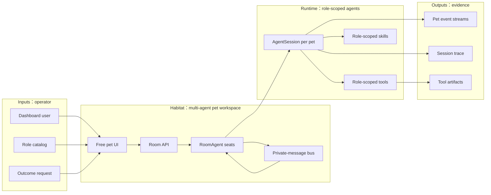

# Dashboard Spec

## Problem

XiaoBa Dashboard is the local operator surface for runtime status, roles, skills, config, pet chat, and multi-agent pet work. The user-facing Habitat page lets a human pull multiple role pets into one free workspace and send outcome-oriented tasks to each pet without turning the experience into a terminal or card wall.

## Scope

In scope:

- Static dashboard pages served by `src/dashboard/server.ts`.
- API routes under `src/dashboard/routes/api.ts`.
- Habitat backend runtime in `src/dashboard/room-channel.ts` using `/api/room/*` as the current internal route namespace.
- Multiple room agent seats, each backed by its own `AgentSession`, role prompt, role skills, role-specific tools, pet sprite, and SSE message stream.
- A role-neutral private-message primitive for Room agent-to-agent communication.
- A visual multi-pet habitat in `dashboard/index.html`: free pet nodes first, detailed logs only after selecting a pet.

Out of scope for the current Habitat:

- Durable room database across process restarts.
- Full AutoDev case lifecycle from the room.
- A networked cross-machine A2A protocol.
- Automatic PR handoff without explicit role/tool support.

## Architecture



## Concepts

- **Habitat**: A local visual workspace for multi-agent coordination, presented as free working pets rather than terminal panes.
- **Role pet**: A room seat backed by a role such as `engineer-cat`, `reviewer-cat`, `inspector-cat`, or `researcher-cat`.
- **Role-scoped runtime**: Each room pet gets its own `AgentSession`, role-specific prompt, role skills, and role tools. This avoids relying on the global active dashboard role.
- **Private message**: The only Habitat agent-to-agent communication primitive. It mirrors a human social app DM: sender, recipient, text, delivery event, and target wake-up.
- **Outcome dispatch**: A user can message one pet or fan out the same outcome request to multiple pets. The fan-out is still just repeated messages, not a special workflow protocol.
- **Pet stream**: Habitat messages use SSE events compatible with the existing pet state model: user message, state, text, tool start/end, file, error, and done.

Habitat deliberately does not define role-specific protocol verbs such as claim, delegate, review, reopen, or complete. Those are ordinary natural-language intents inside private messages or role prompts. The runtime layer only handles delivery, traceable events, and waking the recipient.

## Data Contracts

`GET /api/room/roles`:

```ts
interface RoomRolesResponse {
  cwd: string;
  roles: Array<{
    roleName: string;
    displayName: string;
    description: string;
    petId: string;
    spriteUrl: string;
  }>;
}
```

`POST /api/room/agents`:

```ts
interface CreateRoomAgentRequest {
  roleName: string;
  cwd?: string;
}
```

`RoomAgentInfo`:

```ts
interface RoomAgentInfo {
  id: string;
  roleName: string;
  displayName: string;
  description: string;
  petId: string;
  spriteUrl: string;
  cwd: string;
  status: 'idle' | 'running' | 'done' | 'failed' | 'stopped';
  createdAt: number;
  lastActiveAt: number;
  lastMessage?: string;
}
```

`POST /api/room/agents/:agentId/message` streams SSE room events.

`POST /api/room/messages`:

```ts
interface SendRoomPrivateMessageRequest {
  fromAgentId: string;
  to: string; // agent id, or unique role/display name
  text: string;
}
```

Habitat agents also receive a role-neutral tool:

```ts
interface RoomMessageToolInput {
  to: string;
  text: string;
}
```

The tool publishes a `room_message` event to both the sender and recipient, then enqueues the incoming private message as a normal message for the target agent.

## Boundaries

- Habitat does not mutate files by itself; tools called by a role agent do the work.
- Habitat communication is role-neutral; roles may have different capabilities, but the protocol treats every agent as a peer.
- Habitat is process-local today; durable replay and cross-process A2A are future layers.
