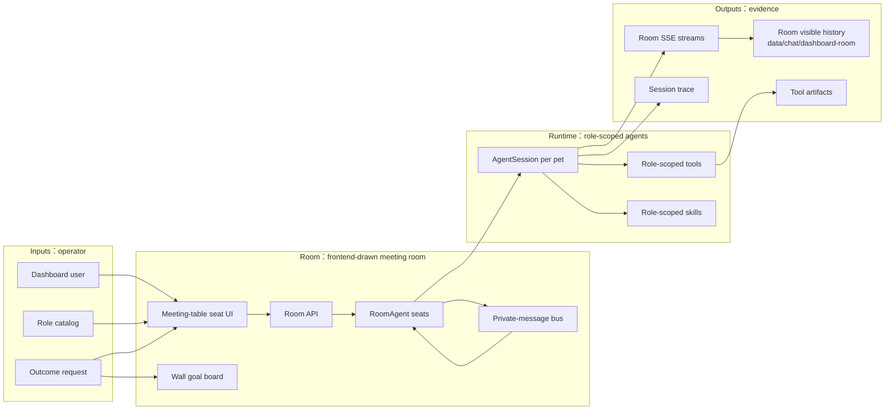
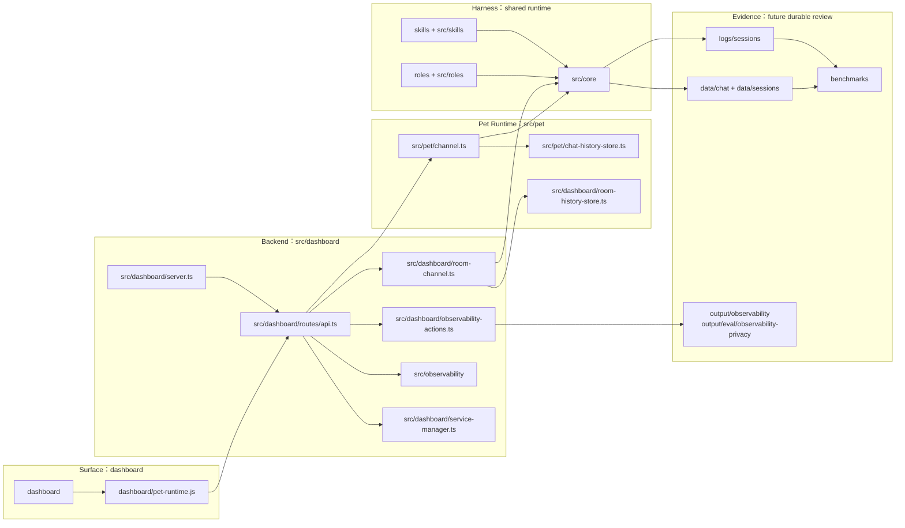

# Dashboard Spec

## Problem

XiaoBa Dashboard is the local operator surface for runtime status, roles, skills, config, pet chat, and multi-agent pet work. The user-facing Room page lets a human pull multiple role agents into one frontend-drawn white cyber-office meeting room with a large meeting table, then send an outcome-oriented task as the current Room goal and broadcast it to seated agents without turning the experience into a terminal or card wall.

## Scope

In scope:

- Static dashboard pages served by `src/dashboard/server.ts`.
- API routes under `src/dashboard/routes/api.ts`.
- Dashboard pet chat in `dashboard/index.html`, backed by `src/pet/channel.ts`, with a visible JSONL event history for Chat work-trace replay.
- Room backend runtime in `src/dashboard/room-channel.ts` using `/api/room/*` as the current internal route namespace, with visible Room event JSONL history in `data/chat/dashboard-room/**`.
- Developer-only observability API endpoints under `/api/observability/*`, backed by the in-process `src/observability` summary and maintained eval runners. Dashboard HTML intentionally does not render a user-facing observability panel.
- Multiple room agent seats, each backed by its own `AgentSession`, role prompt, role skills, role-specific tools, pet sprite, and SSE message stream.
- A role-neutral private-message primitive for Room agent-to-agent communication.
- A visual multi-agent Room in `dashboard/index.html`: a frontend-drawn meeting room first, a wall goal board showing the latest dispatched Room task, a fixed set of supported seats around a large meeting table, role pets occupying seats as agents are added, and detailed logs only after selecting an agent terminal.

Out of scope for the current Room:

- Durable room database across process restarts.
- Full case lifecycle creation from the room.
- A networked cross-machine A2A protocol.
- Automatic PR handoff without explicit role/tool support.

## Current Architecture



## Target Architecture

Dashboard 的目标架构仍保持本地 operator surface，但把 Chat、Room、service control、config control 和 future replay/eval 明确分层。最外层图只放模块名；Pet Chat、Room agent、history store 等细节由本文件的数据契约继续展开。



## Concepts

- **Room**: A local frontend-drawn white cyber-office meeting room for multi-agent coordination, presented as role pets seated around a large meeting table rather than terminal panes.
- **Seat limit**: The visible chair count is the frontend-supported maximum multi-agent count. Adding an agent occupies the next open seat; creation is blocked when every seat is occupied.
- **Role pet**: A room seat backed by a role such as `engineer-cat`, `reviewer-cat`, `inspector-cat`, or `researcher-cat`.
- **Role-scoped runtime**: Each room pet gets its own `AgentSession`, role-specific prompt, role skills, and role tools. This avoids relying on the global active dashboard role.
- **Room goal**: The latest task dispatched from the Room broadcast composer. It is rendered on the wall board as the active goal that the room is working toward.
- **Private message**: The only Room agent-to-agent communication primitive. It mirrors a human social app DM: sender, recipient, text, delivery event, and target wake-up.
- **Outcome dispatch**: A user can message one pet or fan out the same outcome request to multiple pets. The fan-out is still just repeated messages, not a special workflow protocol.
- **Pet stream**: Room messages use SSE events compatible with the existing pet state model: user message, state, text, tool start/end, file, error, and done.
- **Pet text rendering**: A `text` event after `state.reason === 'text_stream'` is a streaming draft chunk and may update the current draft bubble; a `text` event after channel delivery reasons such as `channel_reply` is a complete outbound message and must render as its own visible assistant message.
- **Dashboard role trace**: Dashboard Chat maintains one work-trace timeline per active role. The base role uses the canonical runtime key `pet:<petId>` so the desktop widget and Dashboard Chat share history; non-base roles use `pet:<petId>:role-<roleName>`. The legacy `pet:<petId>:role-base` key is accepted and canonicalized to `pet:<petId>`.
- **Dashboard chat visible history**: Pet Chat stores the decorated SSE events seen by the Dashboard page as append-only JSONL per `sessionKey`. This is a UI replay/work-trace record, not the canonical IM transcript and not the `AgentSession` provider context.
- **Service logs**: Dashboard service log buttons expose child-process stdout/stderr for managed services. The `pet` log also includes in-process `pet:*` runtime logs emitted by Dashboard chat, because that chat runs inside the Dashboard process instead of a spawned child service.
- **Observability API**: Developer-only read APIs for local summary and review state. The user-facing Dashboard HTML does not render observability controls, and the API does not generate candidates, continuity reports, or benchmark source.

Room deliberately does not define role-specific protocol verbs such as claim, delegate, review, reopen, or complete. Those are ordinary natural-language intents inside private messages or role prompts. The runtime layer only handles delivery, traceable events, and waking the recipient.

## Data Contracts

Dashboard pet chat visible history:

`GET /api/observability/summary` returns the local-only observability summary from `src/observability`. It is process-local and aggregate-oriented, and it preserves explicitly recorded local previews because this layer is local evidence, not a privacy/export boundary. The response includes global SLO plus per-role/per-skill/per-tool/per-surface SLO arrays, local drilldown facts for recent failures and blocked reasons, and a local trace timeline.

`GET /api/observability/review` returns readonly local observability state. It reports that no candidate generation, trace-continuity, patch, or benchmark source actions are available. Returned paths are repository/output-relative when possible and must not expose a raw home path.

```ts
// data/chat/sessions/pet_<petId>.jsonl for the base role/default callers.
// data/chat/sessions/pet_<petId>_role-<roleName>.jsonl for non-base Dashboard roles.
interface PetVisibleHistoryEvent {
  type:
    | 'user_message'
    | 'state'
    | 'text'
    | 'thinking'
    | 'tool_start'
    | 'tool_end'
    | 'tool_display'
    | 'retry'
    | 'file'
    | 'error'
    | 'done';
  id: number;
  petId: string;
  sessionKey: string; // pet:<petId>, or non-base role trace pet:<petId>:role-<roleName>
  timestamp: string;
  [key: string]: unknown;
}
```

Dashboard Chat derives its `sessionKey` from the current `petId` and active role. It does not expose arbitrary session creation in the UI; the product model is one local colleague with one work trace per role. The base role intentionally reuses the default pet runtime key so messages sent from the desktop widget are visible when the user opens the Dashboard Chat page.

`GET /api/pet/events?petId=<petId>&sessionKey=<sessionKey>&replay=1` streams a `connected` event, then replays the persisted visible history plus in-memory live events for that role trace with duplicate ids removed.

`GET /api/pet/history?petId=<petId>&sessionKey=<sessionKey>&limit=500` returns the latest visible history events as JSON for Dashboard inspection and future UI tooling.

`DELETE /api/pet/history?petId=<petId>&sessionKey=<sessionKey>` deletes the Dashboard-visible replay file and clears the in-memory replay buffer for that session. `/clear --all` in pet chat also clears the current session's visible history before writing the clear confirmation turn.

`GET /api/room/roles`:

```ts
interface RoomRolesResponse {
  cwd: string;
  maxAgents: number;
  roles: Array<{
    roleName: string;
    displayName: string;
    description: string;
    petId: string;
    spriteUrl: string;
  }>;
}
```

`POST /api/room/agents`:

```ts
interface CreateRoomAgentRequest {
  roleName: string;
  cwd?: string;
}
```

`RoomAgentInfo`:

```ts
interface RoomAgentInfo {
  id: string;
  roleName: string;
  displayName: string;
  description: string;
  petId: string;
  spriteUrl: string;
  cwd: string;
  status: 'idle' | 'running' | 'done' | 'failed' | 'stopped';
  createdAt: number;
  lastActiveAt: number;
  lastMessage?: string;
}
```

`POST /api/room/agents/:agentId/message` streams SSE room events.

`POST /api/room/messages`:

```ts
interface SendRoomPrivateMessageRequest {
  fromAgentId: string;
  to: string; // agent id, or unique role/display name
  text: string;
}
```

Room agents also receive a role-neutral tool:

```ts
interface RoomMessageToolInput {
  to: string;
  text: string;
}
```

The tool publishes a `room_message` event to both the sender and recipient, then enqueues the incoming private message as a normal message for the target agent.

`GET /api/services/:name/logs?lines=200` returns recent display log lines. For `feishu`, `weixin`, and managed `pet` child processes, these come from `ServiceManager` stdout/stderr capture. For in-Dashboard pet chat, `pet` also includes recent `Logger` runtime lines whose session id starts with `pet:`.

`GET /api/config` returns the Dashboard `.env` values with sensitive values masked.

`PUT /api/config` updates the Dashboard `.env` file and immediately applies non-masked string updates to the running Dashboard process environment. This keeps new in-process pet and Room `AgentSession` calls aligned with the config page without requiring a Dashboard restart. Masked sensitive values such as `****1234` are preserved and are not written back into `process.env`.

## Boundaries

- Room does not mutate files by itself; tools called by a role agent do the work.
- Room communication is role-neutral; roles may have different capabilities, but the protocol treats every agent as a peer.
- The Room goal board is currently browser-local UI state; durable goal history belongs in the future room trace layer.
- Room is process-local today; durable replay and cross-process A2A are future layers.
- Room currently supports 8 concurrent room agents, matching the frontend's visible meeting-table seat count.
