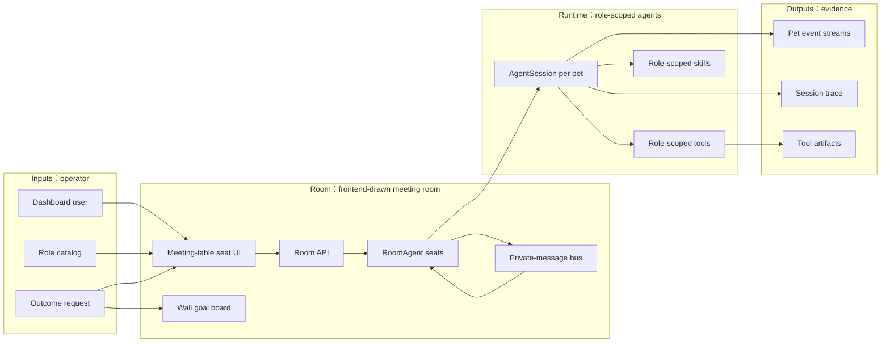

# Dashboard Spec

## Problem

XiaoBa Dashboard is the local operator surface for runtime status, roles, skills, config, pet chat, and multi-agent pet work. The user-facing Room page lets a human pull multiple role agents into one frontend-drawn white cyber-office meeting room with a large meeting table, then send an outcome-oriented task as the current Room goal and broadcast it to seated agents without turning the experience into a terminal or card wall.

## Scope

In scope:

- Static dashboard pages served by `src/dashboard/server.ts`.
- API routes under `src/dashboard/routes/api.ts`.
- Room backend runtime in `src/dashboard/room-channel.ts` using `/api/room/*` as the current internal route namespace.
- Multiple room agent seats, each backed by its own `AgentSession`, role prompt, role skills, role-specific tools, pet sprite, and SSE message stream.
- A role-neutral private-message primitive for Room agent-to-agent communication.
- A visual multi-agent Room in `dashboard/index.html`: a frontend-drawn meeting room first, a wall goal board showing the latest dispatched Room task, a fixed set of supported seats around a large meeting table, role pets occupying seats as agents are added, and detailed logs only after selecting an agent terminal.

Out of scope for the current Room:

- Durable room database across process restarts.
- Full AutoDev case lifecycle from the room.
- A networked cross-machine A2A protocol.
- Automatic PR handoff without explicit role/tool support.

## Architecture



## Concepts

- **Room**: A local frontend-drawn white cyber-office meeting room for multi-agent coordination, presented as role pets seated around a large meeting table rather than terminal panes.
- **Seat limit**: The visible chair count is the frontend-supported maximum multi-agent count. Adding an agent occupies the next open seat; creation is blocked when every seat is occupied.
- **Role pet**: A room seat backed by a role such as `engineer-cat`, `reviewer-cat`, `inspector-cat`, or `researcher-cat`.
- **Role-scoped runtime**: Each room pet gets its own `AgentSession`, role-specific prompt, role skills, and role tools. This avoids relying on the global active dashboard role.
- **Room goal**: The latest task dispatched from the Room broadcast composer. It is rendered on the wall board as the active goal that the room is working toward.
- **Private message**: The only Room agent-to-agent communication primitive. It mirrors a human social app DM: sender, recipient, text, delivery event, and target wake-up.
- **Outcome dispatch**: A user can message one pet or fan out the same outcome request to multiple pets. The fan-out is still just repeated messages, not a special workflow protocol.
- **Pet stream**: Room messages use SSE events compatible with the existing pet state model: user message, state, text, tool start/end, file, error, and done.
- **Service logs**: Dashboard service log buttons expose child-process stdout/stderr for managed services. The `pet` log also includes in-process `pet:*` runtime logs emitted by Dashboard chat, because that chat runs inside the Dashboard process instead of a spawned child service.

Room deliberately does not define role-specific protocol verbs such as claim, delegate, review, reopen, or complete. Those are ordinary natural-language intents inside private messages or role prompts. The runtime layer only handles delivery, traceable events, and waking the recipient.

## Data Contracts

`GET /api/room/roles`:

```ts
interface RoomRolesResponse {
  cwd: string;
  maxAgents: number;
  roles: Array<{
    roleName: string;
    displayName: string;
    description: string;
    petId: string;
    spriteUrl: string;
  }>;
}
```

`POST /api/room/agents`:

```ts
interface CreateRoomAgentRequest {
  roleName: string;
  cwd?: string;
}
```

`RoomAgentInfo`:

```ts
interface RoomAgentInfo {
  id: string;
  roleName: string;
  displayName: string;
  description: string;
  petId: string;
  spriteUrl: string;
  cwd: string;
  status: 'idle' | 'running' | 'done' | 'failed' | 'stopped';
  createdAt: number;
  lastActiveAt: number;
  lastMessage?: string;
}
```

`POST /api/room/agents/:agentId/message` streams SSE room events.

`POST /api/room/messages`:

```ts
interface SendRoomPrivateMessageRequest {
  fromAgentId: string;
  to: string; // agent id, or unique role/display name
  text: string;
}
```

Room agents also receive a role-neutral tool:

```ts
interface RoomMessageToolInput {
  to: string;
  text: string;
}
```

The tool publishes a `room_message` event to both the sender and recipient, then enqueues the incoming private message as a normal message for the target agent.

`GET /api/services/:name/logs?lines=200` returns recent display log lines. For `feishu`, `weixin`, `catscompany`, and managed `pet` child processes, these come from `ServiceManager` stdout/stderr capture. For in-Dashboard pet chat, `pet` also includes recent `Logger` runtime lines whose session id starts with `pet:`.

`GET /api/config` returns the Dashboard `.env` values with sensitive values masked.

`PUT /api/config` updates the Dashboard `.env` file and immediately applies non-masked string updates to the running Dashboard process environment. This keeps new in-process pet and Room `AgentSession` calls aligned with the config page without requiring a Dashboard restart. Masked sensitive values such as `****1234` are preserved and are not written back into `process.env`.

## Boundaries

- Room does not mutate files by itself; tools called by a role agent do the work.
- Room communication is role-neutral; roles may have different capabilities, but the protocol treats every agent as a peer.
- The Room goal board is currently browser-local UI state; durable goal history belongs in the future room trace layer.
- Room is process-local today; durable replay and cross-process A2A are future layers.
- Room currently supports 8 concurrent room agents, matching the frontend's visible meeting-table seat count.
