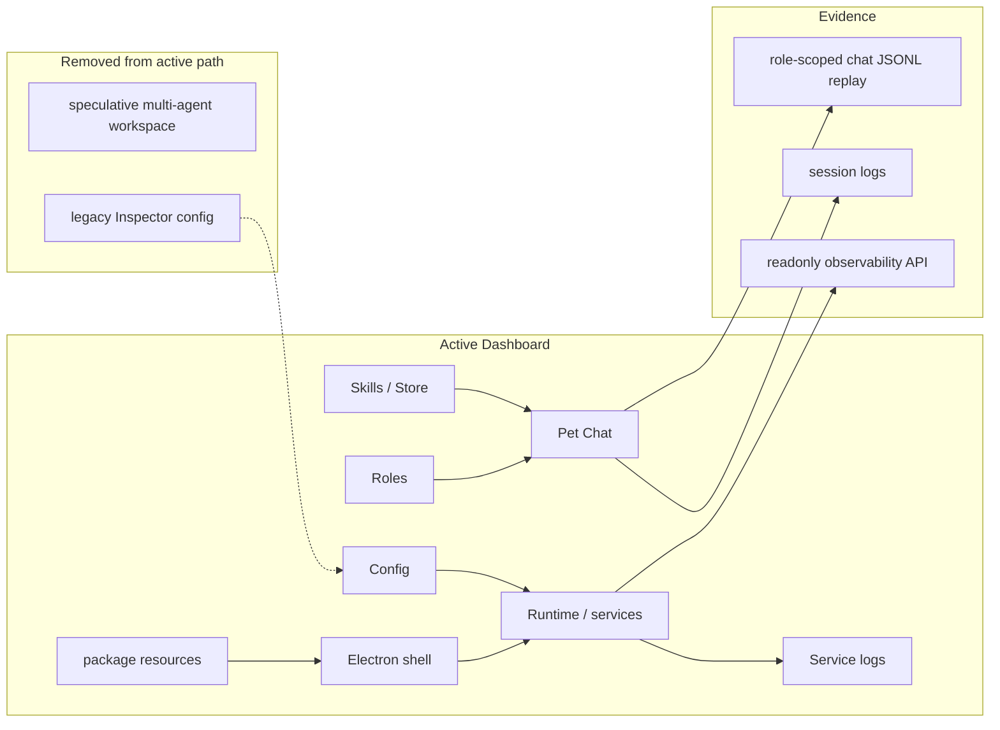

# Desktop Surface Plan

状态：Active
最后更新：2026-07-05
Owner：Surface / Dashboard maintainers

## Current Status

Dashboard, Electron shell, pet widget assets, and desktop packaging resources now live under `desktop/` as one GitHub-visible surface bundle: `desktop/dashboard/**`, `desktop/electron/**`, and `desktop/build-resources/**`. This is a physical repository cleanup only; the architecture module remains Surface, and runtime backend code stays in `src/dashboard` / `src/pet`.

Dashboard is now scoped to maintained local operations: Runtime/service control, one-agent Pet Chat, config editing, role/skill inspection, skill-store installation, and service logs. The speculative multi-agent workspace and embedded Arena page have been removed from the active Dashboard product path so the surface does not accumulate unclear functionality.

Dashboard Pet Chat has role-scoped JSONL history for work-trace replay. The history stores decorated SSE events for the Chat page and is intentionally separate from IM-platform records and `AgentSession` provider context. Product-wise, the Chat page presents one local colleague; internally each active role gets one durable work trace. The base role uses the default `pet:<petId>` runtime key so the desktop widget and Dashboard Chat show the same conversation.

Dashboard managed services cover the maintained Feishu, Weixin, and Pet entries. The retired CatsCompany IM service is not exposed in service control, config editing, or service logs.

Dashboard config no longer exposes the legacy Inspector hook/server/MySQL settings while InspectorCat is being refactored. Inspector-specific runtime configuration must return only after the new Inspector target contract is documented.

Dashboard does not render the local observability summary or action controls in the user-facing Runtime page. `/api/observability/summary` and `/api/observability/review` remain available as developer read APIs.

Arena is now intentionally CLI-driven from `xiaoba arena ...`. Dashboard no longer exposes an Arena page, Arena static assets, or `/api/arena/summary`; clean runtime preparation, UserCat/Inspector/Reviewer work, replay, scorecards, and promotion boundaries stay in the Arena module.

## Milestones

1. Runtime/service page: completed.
2. Config page with immediate runtime env update: completed.
3. Role and skill pages: completed.
4. Skill store page: completed.
5. Dashboard Pet Chat visible JSONL replay: completed.
6. Dashboard Pet Chat role-scoped single trace: completed.
7. Local observability summary on Runtime page: removed from user-facing Dashboard; summary API remains developer read-only.
8. Hash-only local trace timeline on Runtime page: removed from user-facing Dashboard.
9. Dashboard observability action controls: removed from user-facing Dashboard and backend API.
10. Speculative multi-agent workspace UI/API/runtime: removed from active Dashboard.
11. Legacy Inspector hook/server/MySQL config group: removed from active Dashboard.
12. Embedded Arena review-status page: removed from active Dashboard; Arena CLI owns review workflow and evidence.
13. Root directory consolidation: completed for Dashboard static assets, Electron shell, and desktop package resources under `desktop/`.

## Next Steps

- Add UI affordances for clearing, searching, or filtering the current role's Dashboard Pet Chat work trace if visible JSONL grows beyond simple replay.
- Keep observability read-only in Dashboard; use `xiaoba replay --trace` for historical replay and `eval:*` for live agent eval.
- Drive Arena only through `xiaoba arena ...` and role-owned workflows for import, clean runtime preparation, execution, review and promotion.
- Define minimum production auth and permission rules before treating Dashboard/Pet endpoints as network-ready.
- Require a clear product job and updated target architecture before adding any new Dashboard page.
- Keep desktop-only static assets, Electron entrypoints, and package resources under `desktop/`; do not recreate root `dashboard/`, `electron/`, or `build-resources/` directories.

## Owners

- Frontend surface: `desktop/dashboard/index.html`.
- Dashboard API: `src/dashboard/routes/api.ts`.
- Developer observability API: `src/dashboard/routes/api.ts`, `src/dashboard/observability-actions.ts`, `src/observability`.
- Dashboard Pet Chat API and visible history: `src/pet/channel.ts`, `src/pet/chat-history-store.ts`, `desktop/dashboard/pet-runtime.js`.
- Electron shell and desktop packaging: `desktop/electron/**`, `desktop/build-resources/**`, `package.json` electron-builder config.
- Role-scoped prompt/skills/tools: `src/utils/prompt-manager.ts`, `src/skills/skill-manager.ts`, `src/bootstrap/tool-manager.ts`, `src/roles/runtime-role-registry.ts`.

## Acceptance Criteria

- `npm run build` passes.
- Dashboard navigation exposes Runtime, Roles, Skills, Config, Store, and Chat.
- `GET /api/navigation/open?page=pet` is accepted.
- `GET /api/navigation/open?page=arena` returns `400`.
- Unknown or retired page names return `400` from `GET /api/navigation/open`.
- `/api/arena/summary` is not exposed by the Dashboard backend.
- Dashboard has no Arena nav item, no `page-arena` DOM, no Arena frontend fetch path, and no Dashboard-local Arena animation assets.
- No Dashboard backend router exposes the retired multi-agent workspace API.
- Mobile viewport does not horizontally overflow on maintained pages.
- The `pet` service log modal shows in-process Dashboard Chat runtime logs for `pet:*` sessions, matching the child-process log behavior of Feishu and Weixin.
- Dashboard service control and config screens do not expose the retired CatsCompany IM adapter.
- Dashboard config screen does not expose legacy Inspector hook/server/MySQL settings.
- Saving model config from the Dashboard config page updates the running Dashboard process environment immediately, so new Pet Chat calls use the saved provider/model without a restart.
- Dashboard Pet Chat writes visible replay events to `data/chat/sessions/pet_<petId>.jsonl` for the base role and `data/chat/sessions/pet_<petId>_role-<roleName>.jsonl` for non-base roles.
- `GET /api/pet/events?sessionKey=...&replay=1` can restore the current role's Dashboard Pet Chat work trace after a process restart.
- Dashboard Pet Chat visible history remains separate from IM-platform canonical chat records and `data/sessions` provider context.
- Multiple `send_text` / channel reply events in one episode render as multiple visible assistant messages instead of replacing earlier messages.
- `GET /api/observability/summary` returns local-only SLO and drilldown facts and preserves explicitly recorded local previews as local evidence.
- Runtime page does not render the local observability summary panel, hash-only trace timeline, queue state, or Generate/Sign/Patch observability controls.
- `GET /api/observability/review` returns local evidence state with redacted paths and no raw home path.
- `POST /api/observability/actions` is not exposed.
- GitHub root does not track standalone `dashboard/`, `electron/`, or `build-resources/`; those assets live under `desktop/`.

## Verification Log

- 2026-07-05: Consolidated Dashboard static assets, Electron shell, and desktop package resources under `desktop/`; updated runtime static paths, pet bundled asset lookup, Electron entrypoints, electron-builder config, scripts, tests, and Surface docs. Verification: `npm run build`; `node --test -r tsx test/dashboard-pet-runtime.test.ts test/pet-channel.test.ts test/trace-replay-runner.test.ts test/pet-desktop-launcher.test.ts test/default-role-bundle.test.ts` (30/30); `node --test -r tsx test/pet-desktop-launcher.test.ts test/default-role-bundle.test.ts test/dashboard-pet-runtime.test.ts` (12/12); `npm run electron:build:mac`.
- 2026-07-03: Removed the embedded Dashboard Arena page and summary route so Arena is CLI-driven only. Deleted the Dashboard Arena nav/page/styles/scripts, retired `/api/arena/summary`, removed Dashboard-local Arena animation asset directories, and changed navigation tests so `page=arena` returns `400` and `/api/arena/summary` returns `404`. Verification: `node --test -r tsx test/dashboard-observability-api.test.ts` (4/4); `npm run build`; `npm test` (435/435); `git diff --check`.
- 2026-06-27: Removed the speculative multi-agent workspace from Dashboard: deleted the frontend page/nav/styles/scripts, backend router, and active dashboard docs. Verification: `node --test -r tsx test/dashboard-observability-api.test.ts` (4/4); `npm run build`; `git diff --cached --check`.
- 2026-06-27: Removed the legacy Inspector config group from the Dashboard config page while InspectorCat is being refactored. Verification: `node --test -r tsx test/dashboard-skills-api.test.ts`; `node --test -r tsx test/dashboard-pet-runtime.test.ts`; `npm run build`; `git diff --check`.
- 2026-06-25: Main Dashboard Pet Chat now passes the active role-scoped `sessionKey` to SSE replay and message sends, and message-mode `send_text` / channel replies append separate assistant bubbles instead of overwriting prior visible replies. Verification: `node --test -r tsx test/dashboard-pet-runtime.test.ts` (4/4); `npm run build`; `npm test` (358/358); `npm run test:contract-smoke` (6/6 items, 23/23 cases); `npm run eval:gate` (1/1 item, 11/11 cases); `git diff --check`.
- 2026-06-23: Removed Dashboard observability action API from the current product path. `/api/observability/summary` and readonly `/api/observability/review` remain; trace proposal / trace continuity generation is no longer exposed through Dashboard. Verification: `node --test -r tsx test/dashboard-observability-api.test.ts` (3/3); `npm run build`.
- 2026-05-27: Retired CatsCompany from Dashboard managed services and config UI; `npm run build`, `node --import tsx --test tests/dashboard-service-logs.test.ts tests/anthropic-provider-extra-fields-bug.test.ts`, and browser checks on `/?page=services` plus `/?page=config` passed with no CatsCompany entry.

## Risks / Open Questions

- Current local Dashboard service-control endpoints are useful but still need clearer auth and permission boundaries.
- Observability read state is local output-file state. It is suitable for developer evidence inspection, but production telemetry replay and ReviewerCat curation UI need broader workflow coverage.

## Status Maintenance Rules

- If Dashboard adds a new durable page, update `SPEC.md`, this plan, and acceptance criteria in the same change.
- Do not add speculative product surfaces without a concrete user job and target architecture.
- Keep Dashboard observability read-only unless a separate replay/eval workflow owns candidate generation and review.
