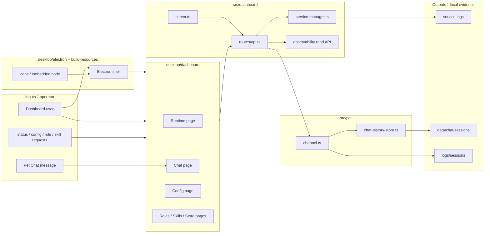
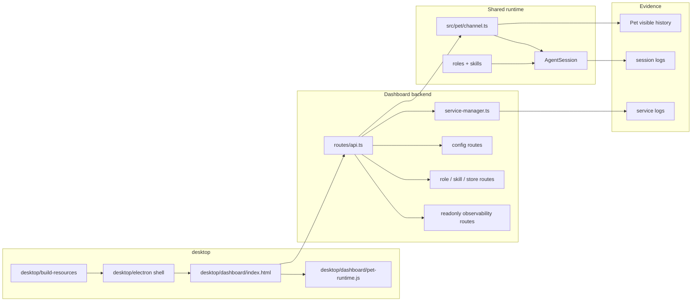

# Desktop Surface Spec

状态：Active
最后更新：2026-07-05

## Problem

`desktop/` is the single GitHub-visible home for XiaoBa's local visual surface: Dashboard static assets, Electron desktop shell, pet widget assets, and desktop packaging resources. It keeps UI and desktop packaging assets together so the repository root does not present Dashboard, Electron, and build resources as three unrelated product modules.

XiaoBa Dashboard is the local operator surface for runtime status, role and skill inspection, config editing, service logs, skill-store installation, and the one-agent Pet Chat workflow. It should stay small and operational: the dashboard helps a maintainer see what is running, adjust local settings, and talk to the local pet runtime without adding speculative multi-agent or Arena review surfaces.

## Scope

In scope:

- Static dashboard pages under `desktop/dashboard/**`, served by `src/dashboard/server.ts`.
- Electron desktop shell under `desktop/electron/**`.
- Desktop package icons and embedded Node resources under `desktop/build-resources/**`.
- API routes under `src/dashboard/routes/api.ts`.
- Runtime/service status, service start/stop/restart, and service log viewing.
- Config editing for maintained local services and model settings.
- Role and skill listing, role switching, skill enable/disable/delete, and skill-store installation.
- Dashboard Pet Chat in `desktop/dashboard/index.html`, backed by `src/pet/channel.ts`, with visible JSONL event history for Chat work-trace replay.
- Developer-only observability read endpoints under `/api/observability/*`, backed by the in-process `src/observability` summary and maintained eval runners. Dashboard HTML intentionally does not render a user-facing observability panel.

Out of scope:

- Speculative multi-agent workspace UI and backend runtime.
- Durable case lifecycle creation from Dashboard.
- Arena pages, Arena summary APIs, subject import, run execution, Reviewer replay orchestration, or promotion writes from Dashboard; Arena is driven from `xiaoba arena ...`.
- Networked cross-machine A2A protocol.
- Automatic PR handoff from Dashboard controls.
- Production-network readiness without explicit auth, permission, and command/path validation.

## Current Architecture



## Target Architecture

Dashboard stays a focused local control plane. New Dashboard work should deepen maintained workflows rather than add new product surfaces without a clear user job.



## Concepts

- **Runtime page**: Shows local service health, active role, recent runtime signals, and service controls.
- **Dashboard Chat**: A one-agent local chat surface using Pet runtime semantics and visible SSE history.
- **Dashboard role trace**: Dashboard Chat maintains one work-trace timeline per active role. The base role uses `pet:<petId>` so the desktop widget and Dashboard Chat share history; non-base roles use `pet:<petId>:role-<roleName>`.
- **Dashboard chat visible history**: Pet Chat stores decorated SSE events as append-only JSONL per `sessionKey`. This is a UI replay/work-trace record, not the canonical IM transcript and not the `AgentSession` provider context.
- **Service logs**: Dashboard service log buttons expose child-process stdout/stderr for managed services. The `pet` log also includes in-process `pet:*` runtime logs emitted by Dashboard Chat.
- **Observability API**: Developer-only read APIs for local summary and review state. The user-facing Dashboard HTML does not render observability controls, and the API does not generate candidates, continuity reports, or benchmark source.
- **Arena boundary**: Dashboard does not render Arena state or expose Arena APIs. Capability review, clean runtime setup, sandboxed execution, Inspector/Reviewer workflow, replay, scorecards, and promotion boundaries belong to `xiaoba arena ...` and the Arena module.

## Data Contracts

Dashboard pet chat visible history:

```ts
// data/chat/sessions/pet_<petId>.jsonl for the base role/default callers.
// data/chat/sessions/pet_<petId>_role-<roleName>.jsonl for non-base Dashboard roles.
interface PetVisibleHistoryEvent {
  type:
    | 'user_message'
    | 'state'
    | 'text'
    | 'thinking'
    | 'tool_start'
    | 'tool_end'
    | 'tool_display'
    | 'retry'
    | 'file'
    | 'error'
    | 'done';
  id: number;
  petId: string;
  sessionKey: string;
  timestamp: string;
  [key: string]: unknown;
}
```

Dashboard Chat derives its `sessionKey` from the current `petId` and active role. It does not expose arbitrary session creation in the UI; the product model is one local colleague with one work trace per role. The base role intentionally reuses the default pet runtime key so messages sent from the desktop widget are visible when the user opens the Dashboard Chat page.

`GET /api/pet/events?petId=<petId>&sessionKey=<sessionKey>&replay=1` streams a `connected` event, then replays the persisted visible history plus in-memory live events for that role trace with duplicate ids removed.

`GET /api/pet/history?petId=<petId>&sessionKey=<sessionKey>&limit=500` returns the latest visible history events as JSON for Dashboard inspection and future UI tooling.

`DELETE /api/pet/history?petId=<petId>&sessionKey=<sessionKey>` deletes the Dashboard-visible replay file and clears the in-memory replay buffer for that session. `/clear --all` in Pet Chat also clears the current session's visible history before writing the clear confirmation turn.

`GET /api/observability/summary` returns the local-only observability summary from `src/observability`.

`GET /api/observability/review` returns readonly local observability state. Returned paths are repository/output-relative when possible and must not expose a raw home path.

`GET /api/services/:name/logs?lines=200` returns recent display log lines. For `feishu`, `weixin`, and managed `pet` child processes, these come from `ServiceManager` stdout/stderr capture. For in-Dashboard Pet Chat, `pet` also includes recent `Logger` runtime lines whose session id starts with `pet:`.

`GET /api/config` returns the Dashboard `.env` values with sensitive values masked.

`PUT /api/config` updates the Dashboard `.env` file and immediately applies non-masked string updates to the running Dashboard process environment. Masked sensitive values such as `****1234` are preserved and are not written back into `process.env`.

## Boundaries

- Dashboard does not implement its own agent loop; maintained chat behavior flows through `src/pet/channel.ts` and shared runtime services.
- Dashboard service-control and config endpoints remain local-control surfaces and must not be treated as network-ready until auth and permission boundaries are explicit.
- Developer observability routes are read-only product surfaces; benchmark/case generation belongs to replay/eval workflows outside the Dashboard UI.
- Dashboard does not expose Arena routes or pages; subject import, clean-runtime prepare, UserCat/Inspector/Reviewer orchestration, replay decisions, and promotion writes remain owned by Arena CLI/runtime and role workflows.
- New Dashboard pages require a clear product job, target architecture update, and acceptance criteria before implementation.
