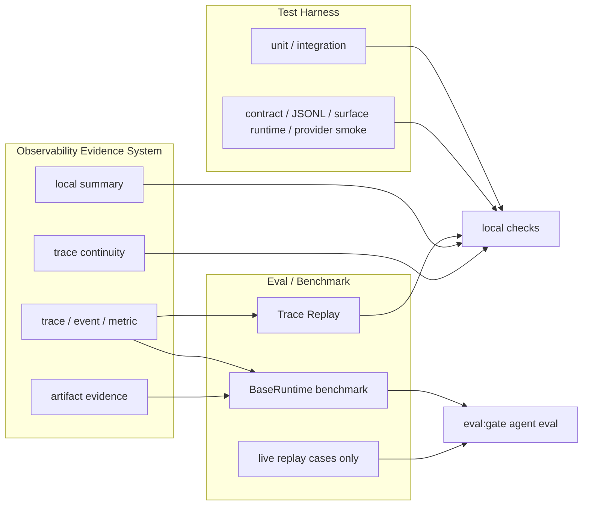

# XiaoBa-CLI PLAN

状态：Active
最后更新：2026-07-02
Owner：XiaoBa maintainers

本文维护 XiaoBa-CLI 仓库级执行计划。`docs/SPEC.md` 定义项目级架构和 contract，本文维护当前状态、下一步、验收条件和验证证据。六个顶层架构模块是 Surface、Agent Runtime、Roles & Skills、Observability & Evidence、Evaluation、Arena；Evaluation 当前只承认两条产品主线：Trace Replay 和 Live Agent Eval。Arena 是 GitHub / 外部 skill 和本地 role 的本地审判场产品模块，v1 固定三种 review mode：`base_skill`、`role_skill`、`role`，不自动进入 Evaluation gate。`test/` 是独立工程验证边界，不是 Evaluation gate。更细的 durable 子模块可以继续维护自己的 `SPEC.md` / `PLAN.md`。

## Current Status

2026-07-02：项目公开定位收敛为“可治理自进化 Agent Runtime / Governed Self-Improving Agent Runtime”。这不是新增架构模块，而是对现有 `self-evolution`、Roles & Skills、Observability & Evidence、Trace Replay 和 Arena 的产品叙事收束：agent 可以沉淀 skill 和扩展 role，但这些成长默认只是候选能力，必须通过 trace evidence、replay、Arena scorecard 或明确人工验收后才值得长期信任。README / README.en 已把该卖点前置为核心宣传口径，并接入 ASCII terminal-style `assets/hero.gif` 作为首屏动画标语；`npm run assets:readme-hero` 可重生成该资产。

2026-07-01：Arena 的 Agentic Eval proof 从 dev + holdout 推进到首批 broad holdout：7 条 SkillsBench-derived 外部 gold case 已 materialized 到 `arena/benchmarks/cat-effectiveness/cases/**`，并真实跑完 UserCat -> clean Runtime -> native Trace -> InspectorCat -> ReviewerCat -> hidden SkillsBench verifier -> Cat / Arena effectiveness scorecard。Baseline runs：`skillsbench-offer-letter-live-20260701-02`、`skillsbench-citation-live-20260701-05`；新增 5 条 broad holdout runs：`skillsbench-dialogue-live-20260701-02`、`skillsbench-xlsx-recover-live-20260701-01`、`skillsbench-lab-harmonization-live-20260701-01`、`skillsbench-sales-pivot-live-20260701-02`、`skillsbench-software-audit-live-20260701-02`。结果：7/7 Cat effectiveness decision = `pass`，7/7 Arena effectiveness decision = `pass`，false pass = 0。新增 5 条的 hidden verifier 都为 `fail`，Arena 正确判为 `reopened` / `unstable` / `unsafe`，证明三只 Cat 能把真实失败和风险关住；这仍不证明 subject skill 本身稳定，也不证明跨 provider / 跨时间窗口完全泛化。

2026-06-30：仓库级架构口径扩展为六个顶层模块：Surface、Agent Runtime、Roles & Skills、Observability & Evidence、Evaluation、Arena。Arena 已从规划/文档推进到可执行 v1：把 GitHub / 外部 skill 和本地 role 放入 XiaoBa 真实 runtime 前，先用三种 review mode 做本地审判索引：`base_skill` 评 Base + skill，`role_skill` 评 role + skill，`role` 评 role 本身；`src/arena` 是代码，`docs/arena` 是设计文档，根目录 `arena/` 是真实评测现场和证据；`xiaoba arena skill <skill-name>` 可直接评测已安装 XiaoBa skill，也可按名字复测已导入 Arena 的 GitHub / 外部 skill，`--role` 切到 role+skill 评测；`xiaoba arena runtime prepare` 能为每个 run 生成干净 `home/`、`skills/`、`roles/`、`workspace/`、`tmp/`、启动 env / command 和可选 macOS Seatbelt command；`xiaoba arena run execute` 会强制默认使用 `sandbox_shell_command` 启动 worker，在 clean workspace 内自动执行 UserCat 真实多轮使用、native trace 留证、Inspector case extraction、Reviewer 多轮 replay / scorecard，并输出 `arena-scorecard.json`。Arena 不替代生产 `SkillManager` 或 role registry，不复制现有 eval benchmark source，也不自动接受 `eval/` benchmark source。

2026-06-23：仓库级架构口径收敛为五个顶层模块：Surface、Agent Runtime、Roles & Skills、Observability & Evidence、Evaluation。Evaluation 不再把所有 trace 相关东西都叫 eval，只保留两条主线：Trace Replay 负责“历史真实用户输入重新跑当前 runtime 并产出 fresh trace 对比”，Live Agent Eval 负责“curated benchmark case + verifier + scorecard”。`test/` 是 unit / integration / deterministic contract smoke 边界，不再通过 `eval-smoke` 二次包装进 eval benchmark portfolio；`eval/` 只负责 live agent eval benchmark。`eval:gate` 默认只聚合 BaseRuntime live agent eval。Observability & Evidence 只保留本地 trace / event / metric / artifact evidence；外部观测导出和本地 trace/log 清洗策略已退出当前实现。

已完成：

- `src/replay` / `scripts/run-trace-replay.ts` 是 Trace Replay 主线：读取历史 `traces.jsonl`，抽取用户输入，重新驱动当前 Pet/Chat runtime，产出 fresh trace 和轻量对比。
- `src/eval/gate-runner.ts` 只保留 BaseRuntime live agent eval item；runtime-harness/test suites 已移出 eval gate，由 `scripts/run-contract-smoke.ts` 和 `scripts/run-test-suite.ts` 承担。
- `package.json` 和 eval contracts 已删除旧中心化 gate / governance / source-acceptance 默认入口；`.github/workflows` 已移除，质量检查现在靠本地脚本/手动运行；`test:*` owns contract-smoke scripts，`eval:*` owns live agent eval scorecards，`eval:base-runtime` 不接受任意 benchmark path override。
- `src/eval` 的 runnable replay 模式只保留 `surface_runtime`；低层 `conversation_runner`、`agent_session` 和 `surface_adapter` replay suites / scripts 已退出当前命令面。
- `eval/benchmarks/eval-smoke` 已删除；`eval/benchmarks/BaseRuntime` 是当前唯一 eval benchmark root，通过单一 `runtime-benchmark.jsonl` 覆盖 11 条 live Pet/runtime cases；旧 100 条 structural trace regression、RoleArena、UserCat、ResearcherCat、EngineerCat、contracts、rubrics 和 schemas 已从 `eval/` 删除。
- 顶层 `tests/` 已迁到 `test/`；`test/contract-smoke/suites` 和 `test/contract-smoke/fixtures` 已收窄为 runtime harness 输入；旧 role behavior suites / fixtures 已从 active `eval/` 边界删除，未来只有重写成 live agent replay 的 role benchmark 才能回到 `eval/benchmarks/<Role>/`。
- Dashboard observability action API 已退出当前产品路径；观测层只保留本地 summary/review 读接口，Trace Replay 和 Live Agent Eval 是唯一评测体系入口。
- Dashboard legacy Inspector hook/server/MySQL 配置面已退出当前产品路径；InspectorCat 保留 `analyze_log` 取证工具，旧 hook runtime/API auto-start 等待 Inspector refactor 重新定义合同。
- 旧中心化 eval/governance/source-acceptance 文件级资产已物理删除。
- Heavy eval schema governance has been removed from the active path; benchmark assets now use `check:benchmarks` for live-only manifest/case/suite preflight.
- Default policy assets are intentionally small: GitHub default tracking and Electron packaging keep only five base skills (`remember`, `role-publish`, `self-evolution`, `skill-publish`, `agent-browser`) and four core roles (`user-cat`, `inspector-cat`, `engineer-cat`, `reviewer-cat`). Non-default roles/skills require explicit install, Role Hub, or local ignored assets.
- Arena module docs have been created at `docs/arena/SPEC.md` and `docs/arena/PLAN.md`; the minimal control plane now exists under `src/arena/**` and `src/commands/arena.ts`, while root `arena/**` is the Arena review-site data root for subject manifests, clean runtimes and run indexes.
- Default Electron role bundle is narrowed to `user-cat`、`inspector-cat`、`engineer-cat`、`reviewer-cat`; role deletion lifecycle is implemented through CLI and Dashboard while non-default roles remain future Role Hub / explicit-install assets.

部分完成：

- 各 role 的旧静态/混合 benchmark assets 已从 `eval/` 删除；后续 role eval 只有重写成 live agent replay 后才能回到 `eval/benchmarks/<Role>/`。
- Observability 现在是本地优先证据系统：session JSONL 投影到 local summary，AgentSession 路径以 session JSONL 作为 local summary 事实源。这些证据可被 Trace Replay、BaseRuntime live eval 或未来 role-owned live benchmark 消费，但不能自动变成 accepted benchmark source。
- Runtime context compaction now leaves first-class evidence: `context_compaction` events are embedded in trace rows, and successful compactions append compact-after snapshots to same-session `context-snapshots/<session-id>.jsonl` for replay/debug anchoring.
- Session/trace/turn 术语已统一到 live log 主路径：`session` 是长期会话，`trace` 是一次用户请求到本次 `ConversationRunner` while-loop 截止，`turn` 保留给 while-loop 内部推进；新 live log 写入 `entry_type="trace"`、`trace_id`、`trace_index`，并把 lifecycle/provider events 嵌入 trace row。
- Surface adapter/runtime/file smoke 仍属于 runtime harness；完整真实入口 E2E 应交给 ReviewerCat / role benchmark 分层推进。
- Arena 可执行 v1 已完成：可导入本地 / GitHub skill、快照 role、按已安装 skill 名一条命令启动评测、准备 clean runtime overlay、复制 benchmark workspace seed、记录三种 review mode inventory、创建 `clean-runtime.json` / `arena-run.json`，也可用 `arena run execute` 自动触发 UserCat / Inspector / Reviewer 并输出 `arena-scorecard.json`；SkillsBench offer-letter dev proof、citation holdout proof 和首批 5 条 broad holdout proof 已通过。Linux bubblewrap / Windows native sandbox adapter、更深 Inspector 规则和多 seed / 多 provider 稳定性 proof 仍需后续补强。

未开始或仍需收敛：

- Dashboard/Pet 网络暴露面的权限、鉴权和 command/path validation 仍需单独加固。
- durable background job / subagent persistence 仍未形成完整 runtime contract。
- ReviewerCat 的统一 ReviewTaskRunner、future role E2E scorecard 合并器和 provider transcript 深度 verifier 仍是后续主线。
- Role benchmark 需要重新按 live agent eval shape 设计，不能把静态 trace fixture 或 rubric-only 文件放回 `eval/`。
- Arena deep safety scanner、Linux / Windows sandbox adapter、ReviewerCat 专用 report 合并器和 promotion workflow 仍未开始或仍是部分实现。

## Milestones

1. M0：Spec / Plan governance baseline：completed for root, top-level module docs, eval docs, benchmark docs and maintained role docs.
2. M1：Test / Eval physical boundary：completed for top-level `test/`, `test:contract-smoke`, `check:benchmarks`, `eval:base-runtime`, local quality command boundaries, and runtime-only `test/contract-smoke/suites` / `test/contract-smoke/fixtures`.
3. M2：Live eval boundary：completed for current `eval/`; only BaseRuntime live replay remains under `eval/benchmarks`.
4. M3：Trace Replay boundary：completed for first-class Pet/Chat trace replay runner and command entrypoint.
5. M4：Observability & Evidence：partial; external exporter mirror and local trace/log policy cleanup have been removed from the current local-first implementation; session-log projection and durable state/evidence docs remain.
6. M5：Surface runtime harness：partial; adapter/runtime/file smokes remain in runtime harness, while production-network full E2E belongs to ReviewerCat / role benchmark ownership.
7. M6：Permission and control-plane security boundary：not started for network-exposed Dashboard/Pet control surfaces.
8. M7：Durable session / background job state：partial for surface-scoped restore and visible-history refs; durable background job persistence remains incomplete.
9. M8：Arena product module：v1 executable path completed for subject manifests, role snapshots, clean runtime prepare, sandboxed runner, automatic UserCat-Inspector-Reviewer orchestration, run indexes and scorecards; deep safety scan and non-macOS sandbox adapters remain pending.

## Next Steps

- Put new deterministic correctness checks in `test/`; put only live agent eval source in `eval/`.
- Use `replay:*` / `xiaoba replay --trace` for historical trace reruns; do not call historical trace rerun `eval`.
- Keep new eval work inside BaseRuntime live eval or a future role-owned live replay benchmark.
- Do not add old central eval/governance/source-acceptance pipelines back into package scripts、GitHub workflows、contracts、schemas、rubrics or default gates.
- Move any future role-specific eval additions into the owning role benchmark directory only after they have input、setup、replay、expected tool/result and verifiers; deterministic runtime harness stays in `test/contract-smoke`.
- Keep observability evidence read-only: accepted benchmark source must be authored explicitly by runtime harness or role benchmark maintainers, not generated by observability.
- Keep unifying Observability & Evidence around session JSONL as the local truth: remaining direct metric writers must be explicit standalone-runner or mirror-only paths.
- Keep historical session-log-v2 fixtures readable while new live logs use the session-log-v3 directory layout.
- Fix permission and auth boundaries before expanding network-exposed Dashboard/Pet control surfaces.
- Keep role-tool artifact checks in test/runtime ownership, not under `eval/contracts`.
- Extend live state-boundary coverage to future maintained surfaces only after each surface has stable persisted visible-history refs.
- Add an explicit long-term memory recall command/tool if product UX needs memory lookup beyond automatic lifecycle extraction.
- Rebuild EngineerCat / all-roles / skill handoff / cross-role eval only as live agent eval cases before reintroducing them under `eval/`.
- Connect ReviewerCat to UserCat run packages as a read-only curation/review workflow; accepted benchmark additions still belong to role benchmark owners.
- Continue Arena in this order: repeat the 7 SkillsBench proof cases across seeds / providers / time windows -> harden blocked scorecards and timeout reporting -> deepen Inspector/safety rules -> add Linux/Windows sandbox adapters -> add ReviewerCat report merging -> optional promotion workflow.

## Owners

- Runtime harness：`src/core/**`
- Surface：`src/commands/**`, `src/feishu/**`, `src/weixin/**`, `src/pet/**`, `src/dashboard/**`
- Provider adapters：`src/providers/**`
- Tool boundary：`src/tools/**`, `src/types/tool.ts`
- Roles：`roles/**`, `src/roles/**`
- Skills：`skills/**`, `src/skills/**`
- Observability & Evidence：`src/observability/**`, `logs/**`, `data/**`, `memory/**`, `output/**`, `docs/observability-evidence/state-evidence/**`
- Evaluation strategy and execution：`eval/**`, `eval/benchmarks/**`
- Arena：`src/arena/**`, `src/commands/arena.ts`, `arena/**`, `docs/arena/**`
- Test verification boundary：`test/**`
- Documentation governance：`docs/SPEC.md` / `docs/PLAN.md` and module SPEC/PLAN owners.

## Acceptance Criteria

- `docs/SPEC.md` and `docs/PLAN.md` exist and stay in sync as the project-level source of truth.
- The architecture module specs exist and stay discoverable from `docs/SPEC.md`: `docs/surface/SPEC.md`, `docs/agent-runtime/SPEC.md`, `docs/roles-skills/SPEC.md`, `docs/observability-evidence/SPEC.md`, `docs/trace-replay/SPEC.md`, `docs/evaluation/SPEC.md`, and `docs/arena/SPEC.md`. `docs/evaluation/SPEC.md` remains a proxy to the real `eval/SPEC.md` control-plane source; `docs/trace-replay/SPEC.md` owns historical trace replay; `docs/observability-evidence/state-evidence/SPEC.md` remains the durable evidence subdocument under Observability & Evidence, `docs/arena/SPEC.md` owns skill / role / subject review product boundaries, and `test/SPEC.md` remains the deterministic verification boundary under Evaluation.
- The `eval/` durable module has `SPEC.md` and `PLAN.md`, and remains clearly scoped as evaluation strategy/control-plane docs rather than raw trace or replay output storage.
- The `test/` durable module has `SPEC.md` and `PLAN.md`, and remains clearly scoped as unit / integration / contract smoke rather than role behavior benchmark.
- Every substantial long-lived module has `SPEC.md` and `PLAN.md`, or a documented reason why it is still a small utility.
- Every substantial `SPEC.md` includes `Current Architecture` and `Target Architecture` Mermaid diagrams.
- Any production architecture change updates the relevant current diagram and plan status in the same change.
- A milestone is marked complete only when code, docs, and verification evidence support it.
- Security-sensitive surfaces have explicit auth, permission, and command/path validation boundaries before being treated as network-ready.
- Default benchmark portfolio sources pass manifest loading and case-reference preflight before becoming gate evidence.
- Arena imported or reviewed subjects remain untrusted / review-required and arena-only until explicit promotion.
- Arena clean runtime preparation records run-local `home/`、`skills/`、`roles/`、`workspace/`、`tmp/` and launch env/commands in `clean-runtime.json` without persisting secret values.
- Arena clean runtime can load project-root `.env` provider config through `DOTENV_CONFIG_PATH`, while keeping production `HOME` out of the clean overlay and avoiding secret values in persisted JSON.
- Arena non-dry-run execution preflights provider config and fails before UserCat / Inspector / Reviewer when clean runtime has no usable `.env` or explicit provider env.
- Arena executable runs declare and use lightweight execution sandbox policy before subject overlay: temp workspace, no inherited production env, network off by default for untrusted subjects, default `sandbox_shell_command`, and hard timeout.
- Arena runs record exact review mode inventory: mode `base_skill|role_skill|role`, active role, default packaged base skills, arena subject skill when present, role-local skills when present, registered tools, provider-visible tools and surface.
- Arena normal eval profile defaults to 3 UserCat scenarios and max 4 adaptive turns per scenario; Reviewer replays only Inspector-extracted cases, default 3 attempts per case, and scorecards record the actual `arena_eval_profile`.
- Trace evidence records context compaction discontinuities with same-session compact-after snapshot refs; replay/debug consumers must treat snapshots as evidence anchors, not as automatic benchmark source.
- Arena scorecard evidence stays compact: default `trace_refs` point to native runtime `logs/sessions/**/traces.jsonl`, while UserCat controller logs and Inspector / Reviewer internals are drill-down `debug_refs` under the per-run `debug/` directory.
- Arena scorecards include stochastic replay outcomes: `pass`, `unstable`, `reopened`, `blocked` and `unsafe`; one lucky fresh replay cannot erase a prior failure, and replay attempt counts / trace refs must be recorded.
- Arena Cat effectiveness proof must keep external gold verifier evidence separate from target runtime evidence. The current 7-run SkillsBench proof proves the current materialized case family only; larger claims require repeated seeds / providers / time windows and more side-effect / network / role cases.
- Default package role contents are allowlisted to the four core review-loop roles; additional roles require explicit install / Role Hub flow and installed roles remain removable.

## Verification Log

- 2026-07-01：Expanded Arena Agentic Eval proof by 5 additional SkillsBench-derived broad holdout runs. Passing runs：`skillsbench-dialogue-live-20260701-02`（hidden verifier fail -> Arena `reopened`）、`skillsbench-xlsx-recover-live-20260701-01`（hidden verifier fail -> Arena `unsafe`）、`skillsbench-lab-harmonization-live-20260701-01`（hidden verifier fail -> Arena `reopened`）、`skillsbench-sales-pivot-live-20260701-02`（hidden verifier fail + mixed replay -> Arena `unstable`）、`skillsbench-software-audit-live-20260701-02`（hidden verifier fail -> Arena `reopened`）。All five produced `cat_effectiveness_decision=pass` and `arena_effectiveness_decision=pass`; false pass = 0. Verification：real proof commands for all five runs；`node --test -r tsx test/arena-skillsbench-live-proof.test.ts test/arena-cat-effectiveness-data.test.ts test/arena-cat-effectiveness-scorer.test.ts test/arena-effectiveness-scorer.test.ts`（24/24）；`npm run build`；`git diff --check`。
- 2026-07-01：Final Arena Agentic Eval dev + holdout proof verification completed. Both promoted SkillsBench live proof runs re-scored from real evidence with `cat_effectiveness_decision=pass` and `arena_effectiveness_decision=pass`: `skillsbench-offer-letter-live-20260701-02` and `skillsbench-citation-live-20260701-05`. Final test sweep passed after code/docs sync. Verification：`node --test -r tsx test/user-trace-run-tool.test.ts test/arena-runner.test.ts test/arena-skillsbench-live-proof.test.ts test/arena-cat-effectiveness-data.test.ts test/arena-cat-effectiveness-scorer.test.ts test/arena-effectiveness-scorer.test.ts test/arena-command.test.ts test/arena-manager.test.ts`（57/57）；`npm run build`；`npx tsx scripts/run-arena-skillsbench-proof.ts --case-id skillsbench.offer-letter-generator.v1 --run-id skillsbench-offer-letter-live-20260701-02 --skip-execute`；`npx tsx scripts/run-arena-skillsbench-proof.ts --case-id skillsbench.citation-check.v1 --run-id skillsbench-citation-live-20260701-05 --skip-execute`；`npm test`（434/434）；`git diff --check`。
- 2026-07-01：Completed SkillsBench citation holdout live proof for Arena Cat effectiveness. Run `skillsbench-citation-live-20260701-05` produced a correct `answer.json` with expected `fake_citations`, hidden verifier `pass`, Cat effectiveness decision `pass`, Arena effectiveness decision `pass`, and 100/100/100 scores for UserCat / InspectorCat / ReviewerCat. Reviewer/Arena correctly kept the subject run as `unstable` from 1 pass / 1 fail replay evidence, with replay target cap evidence `max_replay_cases=2` and `skipped_replay_case_count=1`. Verification：`npx tsx scripts/run-arena-skillsbench-proof.ts --case-id skillsbench.citation-check.v1 --run-id skillsbench-citation-live-20260701-05 --skip-execute`；`node --test -r tsx test/user-trace-run-tool.test.ts test/arena-runner.test.ts test/arena-skillsbench-live-proof.test.ts`；`npm run build`。
- 2026-07-01：Completed first SkillsBench materialized live proof for Arena Cat effectiveness. Run `skillsbench-offer-letter-live-20260701-02` produced a correct `offer_letter_filled.docx`, hidden verifier `pass`, Cat effectiveness decision `pass`, Arena effectiveness decision `pass`, and 100/100/100 scores for UserCat / InspectorCat / ReviewerCat. Verification：`npx tsx scripts/run-arena-skillsbench-proof.ts --case-id skillsbench.offer-letter-generator.v1 --run-id skillsbench-offer-letter-live-20260701-02 --skip-execute`；`node --test -r tsx test/user-trace-run-tool.test.ts test/arena-skillsbench-live-proof.test.ts test/arena-cat-effectiveness-data.test.ts test/arena-cat-effectiveness-scorer.test.ts test/arena-effectiveness-scorer.test.ts test/arena-runner.test.ts test/arena-command.test.ts test/arena-manager.test.ts`；`npm run build`；`npm test`（429/429）。
- 2026-07-01：Added Arena workspace seed support and SkillsBench live proof adapter so benchmark fixtures can run inside clean `arena/runs/<run-id>/workspace` without polluting production state. Verification：`node --test -r tsx test/arena-manager.test.ts test/arena-runner.test.ts test/arena-command.test.ts test/arena-skillsbench-live-proof.test.ts`；`npm run build`。
- 2026-06-30：Arena normal eval profile is now executable by default: 3 UserCat scenarios × max 4 adaptive turns, then Reviewer replays only Inspector-extracted cases with 3 attempts per case by default. No-issue runs record `planned_replay_attempts=0`. Verification：`node --test -r tsx test/arena-runner.test.ts`；`npm run build`。
- 2026-06-30：ReviewerCat / Arena human-facing Markdown reports now default to Chinese (`reviewer_xiaoba_cli_e2e report.md` and Arena `debug/reviewer-report.md`), while scorecard JSON contracts remain machine-readable and stable. Verification：`node --test -r tsx test/reviewer-xiaoba-cli-e2e.test.ts test/arena-runner.test.ts`；`npm run build`。
- 2026-06-30：Arena `xiaoba arena skill <skill-name>` now resolves production-installed skills first and previously imported Arena skill subjects second, so external / GitHub skills can be re-evaluated by name without promotion; unsafe trace scanning now ignores structural token metadata unless tied to disclosure behavior. Verification：`node --test -r tsx test/arena-runner.test.ts test/arena-command.test.ts`（10/10）；`npm run build`；real HangToLa by-name run `hang-to-la-skill-name-20260630` -> `decision=reopened`。
- 2026-06-30：Arena added installed-skill shortcut `xiaoba arena skill <skill-name>`; it resolves local XiaoBa skills by directory / metadata name / alias, snapshots them as Arena subjects and delegates to the sandboxed automatic runner, with `--role` for `role_skill`. Verification：`npm test -- --test-name-pattern=registerArenaCommand`（69/69）；`npm run build`。
- 2026-06-30：Arena `run execute` now preflights clean runtime provider config and fails fast with a configure-`.env` message when missing, instead of producing fake API-key blocked traces. Verification：`node --test -r tsx test/arena-runner.test.ts test/arena-manager.test.ts test/arena-command.test.ts`（17/17）；`npm run build`；`npm test`（400/400）。
- 2026-06-30：Arena clean runtime now defaults to local project `.env` provider config via `DOTENV_CONFIG_PATH`; API keys are not expanded into `clean-runtime.json` or shell command strings. Verification：`node --test -r tsx test/arena-manager.test.ts test/arena-command.test.ts test/arena-runner.test.ts`（16/16）；`npm run build`；`npm test`（399/399）。
- 2026-06-30：Arena evidence surface consolidated: `arena-scorecard.json` / `arena-run.json` and native runtime traces are the primary review surface; runner-owned UserCat controller, Inspector and Reviewer artifacts moved under per-run `debug/` and are exposed through `debug_refs`. Verification：`node --test -r tsx test/arena-runner.test.ts test/arena-manager.test.ts test/arena-command.test.ts`；`npm run build`；`npm test`（398/398）。
- 2026-06-30：UserCat live dialogue is now adaptive for Agentic Eval / Arena: `user_trace_run interaction_mode:"adaptive"` sends an opening user message, observes each target turn's user-visible result, tool events and evidence, then chooses the next low-information user message or stops; scripted mode remains for fixed replay compatibility, and Arena invokes adaptive UserCat by default. Verification：`node --test -r tsx test/user-trace-run-tool.test.ts test/user-cat-role.test.ts test/arena-runner.test.ts`（12/12）；`npm run build`。
- 2026-06-30：Arena gsap real-run follow-up repaired channel-backed delivery and macOS Seatbelt execution semantics. InspectorCat no longer reports `empty_reply` when `send_text` / `send_file` delivered visible output, avoids false timeout/tool-failure issues from successful command output source strings, and Reviewer replay accepts native delivery evidence without requiring final fallback text. Seatbelt runner now marks sandboxed execution with `XIAOBA_ARENA_SANDBOXED=1` and uses broad read / run-cage write policy for reliable Homebrew Node startup. Verification：`node --test -r tsx test/analyze-log-tool.test.ts test/arena-runner.test.ts test/arena-manager.test.ts test/arena-command.test.ts`；`npm run build`；manual Seatbelt Node smoke returned `seatbelt node ok`；gsap native trace re-analysis returned `issueCount=0`。
- 2026-06-30：Arena automatic execution v1 landed: `xiaoba arena run execute` prepares a clean runtime, requires `sandbox_shell_command` by default, launches the worker, runs UserCat real multi-turn use, Inspector issue/case extraction and Reviewer multi-attempt replay, then emits `arena-scorecard.json` and `arena-run.json`; `user_trace_run` supports `target_role=base`. Verification：`npm run build`；`node --test -r tsx test/arena-runner.test.ts test/arena-manager.test.ts test/arena-command.test.ts`。
- 2026-06-30：Runtime / Observability compaction evidence landed: trace rows embed `context_compaction` events, compact-after snapshots append under same-session `context-snapshots/<session-id>.jsonl`, and trace readers avoid treating snapshots as primary `traces.jsonl`. Verification：`node --test -r tsx test/logger.test.ts test/agent-session-log.test.ts test/conversation-runner-harness.test.ts`（30/30）；`node --test -r tsx test/pet-channel.test.ts test/provider-network-readiness-runner.test.ts test/eval-runner.test.ts test/researcher-live-agent-session.test.ts`（52/52）；`npm run build`；`npm test`（391/391）。
- 2026-06-29：Arena review-site data root moved from the old nested data root to root `arena/**` so the physical split is `src/arena` for code, `docs/arena` for design, and `arena/` for real review-site data/evidence. Verification：`node --test -r tsx test/arena-manager.test.ts test/arena-command.test.ts`；`node --test -r tsx test/skill-manager-runtime.test.ts test/role-manager.test.ts`；`npm run build`；root write smoke created `arena/subjects/skill-602b8b3c25/arena-manifest.json` and `arena/runs/arena-root-smoke-20260629-01/clean-runtime.json`；`node dist/index.js arena import --help`；old nested Arena path grep returned no hits；`npm test`（387/387）。
- 2026-06-29：Arena clean runtime prepare landed: `xiaoba arena runtime prepare` creates run-local `home/`、`skills/`、`roles/`、`workspace/`、`tmp/`, writes `clean-runtime.json`, emits explicit runtime env/commands and optional macOS Seatbelt command, and keeps secret values out of persisted JSON. Verification：`node --test -r tsx test/arena-manager.test.ts test/arena-command.test.ts`；`node --test -r tsx test/skill-manager-runtime.test.ts test/role-manager.test.ts`；`npm run build`；`node dist/index.js arena runtime prepare --help`；`node dist/index.js arena runtime prepare --mode base_skill --subject skill-6697f0dfff --run-id arena-hang-to-la-clean-20260629-01 --pass-env OPENAI_API_KEY`；`npm test`（387/387）。
- 2026-06-29：Implemented Arena v1 minimal executable control plane: `xiaoba arena import skill|github`, `xiaoba arena snapshot role`, `xiaoba arena run create`, arena-only subject manifests, run indexes, evidence ref validation and stochastic replay attempt validation. Verification：`node --test -r tsx test/arena-manager.test.ts test/arena-command.test.ts`；`node --test -r tsx test/user-cat-role.test.ts`；`npm run build`；`npm test`（383/383）；`node dist/index.js arena --help`。
- 2026-06-29：Added Arena stochastic replay outcome semantics: scorecards include `unstable`, and ReviewerCat must not close a prior failure from one lucky fresh replay. Verification：docs review；`git diff --check -- docs/arena/SPEC.md docs/arena/PLAN.md docs/PLAN.md`。
- 2026-06-29：Clarified Arena UserCat semantics: UserCat is real end-to-end multi-turn use through a selected surface, not offline scenario generation. Verification：docs review；`git diff --check -- docs/arena/SPEC.md docs/arena/PLAN.md docs/PLAN.md`。
- 2026-06-29：Fixed Arena v1 to three review modes only: `base_skill`, `role_skill`, and `role`; future subject types require a new explicit mode. Verification：docs review；`git diff --check -- docs/arena/SPEC.md docs/arena/PLAN.md docs/SPEC.md docs/PLAN.md`。
- 2026-06-29：Renamed the sixth top-level architecture module to `Arena` and expanded it from skill-only review to generic subject review covering skills, roles and future adapter / harness recipes. Verification：stale-name grep returned no current docs hits；`rg -n "docs/arena|src/arena|xiaoba arena|subject-under-review" docs README.md`；`git diff --check -- docs README.md`。
- 2026-06-29：Slimmed Arena data ownership so Arena reuses low-quality UserCat run packages, session `traces.jsonl`, Inspector outputs, ReviewerCat scorecards and eval artifacts by reference. Arena-owned review-site data now lives under root `arena/` and is limited to subject manifests, clean runtime indexes and run indexes unless explicitly exported. Verification：docs review；negative grep for generated Arena raw-file names；`git diff --check -- docs README.md roles`。
- 2026-06-29：Added Arena lightweight execution sandbox requirement for reviewed skills/roles: Codex-like native sandbox where available, metadata-only fallback for untrusted subjects, temp workspace, no inherited production env, network off by default and hard timeout. Verification：docs review；`git diff --check -- docs README.md roles`。
- 2026-06-29：Earlier Arena skill review profile was expanded from Base-only toward role-context review, then superseded by the fixed three-mode contract: `base_skill`、`role_skill`、`role`. Reviewer replay still means fresh current-runtime execution rather than old transcript reuse. Verification：docs review；`git diff --check -- docs/arena/SPEC.md docs/arena/PLAN.md docs/PLAN.md docs/SPEC.md`。
- 2026-06-29：Default role package narrowed to four core review-loop roles and role deletion lifecycle added for CLI / Dashboard. Verification：`node --test -r tsx test/role-manager.test.ts test/default-role-bundle.test.ts test/dashboard-skills-api.test.ts`（7/7）；`npm run build`；`npm test`（376/376）；`git diff --check`。
- 2026-06-29：Added the original skill-only review draft as the sixth top-level architecture module with dedicated SPEC/PLAN, root docs index entries, and module boundary rules. Verification：module-reference grep and `git diff --check -- docs README.md`。
- 2026-06-25：Non-Room PR follow-up closed the remaining delivery/UI/docs review findings: Feishu text send failures now propagate into failed delivery evidence, main Dashboard pet Chat sends/replays with role-scoped `sessionKey`, message-mode channel replies render as separate visible messages, ReviewerCat writeback wording matches current runtime capability, and README role spec links point to existing files. Verification：`npm ci`；`npm run build`；`npm test`（358/358）；`npm run test:contract-smoke`（6/6 items，23/23 cases）；`npm run check:benchmarks`（1 manifest，11 cases）；`npm run eval:base-runtime`（11/11 benchmark cases，11/11 eval cases）；`npm run eval:gate`（1/1 item，11/11 cases）；`git diff --check`。
- 2026-06-25：Non-Room PR follow-up restored release eval and production delivery/security contracts: BaseRuntime Pet fixtures now use valid role-base session keys, benchmark preflight validates Pet payloads, Weixin delivers `finalResponseVisible` text through channel callbacks, and Dashboard summary redacts sensitive blocked-reason values. Verification：`npm run build`；`npm test`（354/354）；`npm run test:contract-smoke`（6/6 items，23/23 cases）；`npm run check:benchmarks`（1 manifest，11 cases）；`npm run eval:base-runtime`（11/11 benchmark cases，11/11 eval cases）；`npm run eval:gate`（1/1 items，11/11 cases）；`git diff --check`。
- 2026-06-23：Trace Replay 成为独立产品主线：新增 `src/replay` runner、`xiaoba replay --trace`、`npm run replay:trace`、trace replay module docs，把 `eval/` 口径收窄为 Live Agent Eval benchmark，并移除旧 trace-proposal / trace-continuity 观测 action 路径。Verification：`node --test -r tsx test/trace-replay-runner.test.ts`；`node --test -r tsx test/dashboard-observability-api.test.ts`；`npm run build`；`npm run check:benchmarks`；`npm run replay:trace -- --help`；`node dist/index.js replay --help`；真实 Pet trace one-turn smoke 产出 `output/replay/manual-smoke-userboundary20-one-final`、fresh trace / visible history / comparison report。
- 2026-06-23：Removed low-level replay execution from eval/test: accepted replay mode is now `surface_runtime` only; `conversation_runner` / `agent_session` / `surface_adapter` replay scripts, suites, tool simulator, adapter-only verifier and tests were deleted. Verification：`npm run build`；`npm run check:benchmarks`（1 manifest，11 cases）；`npm run eval:base-runtime`（11/11 benchmark cases，11/11 eval cases）；`npm run eval:gate`（1/1 items，11/11 cases）；`npm run test:contract-smoke`（6/6 items，28/28 cases）；`node --test -r tsx test/eval-gate.test.ts test/eval-benchmark-bridge.test.ts test/eval-runner.test.ts test/provider-network-readiness-runner.test.ts`（42/42）；`npm test`（360/360）；`git diff --check`。
- 2026-06-23：Test/Eval execution boundary hardened: `test:*` now uses test-owned runners, `src/eval/gate-runner.ts` only runs BaseRuntime live agent eval, `eval:base-runtime` no longer accepts arbitrary benchmark path overrides, and `check:benchmarks` enforces live replay metadata/suite cases. Verification：`npm run build`；`npm run check:benchmarks`（1 manifest，11 cases）；`npm run eval:gate`（profile=live-agent-eval，1/1 items，11/11 cases）；`npm run eval:base-runtime`（11/11 benchmark cases，11/11 eval cases）；`npm run test:contract-smoke`（10/10 items，34/34 cases）；`node --test -r tsx test/eval-gate.test.ts test/eval-benchmark-bridge.test.ts test/eval-runner.test.ts`（43/43）；negative command checks for `eval:gate -- --profile runtime-harness` and `eval:base-runtime -- --benchmark ...` failed as expected；`npm test`（364/364）；`git diff --check`。
- 2026-06-23：Cleaned stale current references to retired role-wide eval gates, `check:eval-assets`, machine-readable State/Evidence requirement portfolio IDs, `eval:engineer`, and remote release publishing from active docs/prompts/scripts. Verification：`npm run check:benchmarks`（1 manifest，11 cases）；`npm run eval:gate`（1/1 items，11/11 cases）；`npm run test:contract-smoke`（10/10 items，34/34 cases）；`npm run build`；`bash -n scripts/release.sh`；targeted retired-reference grep；`git diff --check`。
- 2026-06-23：Removed GitHub Actions workflows from `.github/workflows`; local scripts remain the quality and packaging entrypoints, and `scripts/release.sh` is local packaging only. Updated README badges/release notes and root structure docs so they no longer advertise CI or release workflows. Verification：workflow file search returned no `.github` workflow files；`git diff --check`。
- 2026-06-22：BaseRuntime 从真实 IM runtime trace 里抽出高质量 archetype，并把 5 类提升为 live Pet/runtime benchmark cases：artifact locator/resend、command recovery、path/environment recovery、user correction/latest artifact、long-work status synthesis。Verification：`npm run eval:base-runtime`（11/11 benchmark cases，11/11 eval cases）；`npm run eval:gate`（21/21 items，139/139 cases）；`npm run check:eval-assets`（18992/19003 passed，0 failed，11 skipped）。
- 2026-06-23：`eval/` 收窄为 live agent eval only；BaseRuntime benchmark source 收成 11-row `runtime-benchmark.jsonl`，删除 100 条 structural trace regression、RoleArena / UserCat / ResearcherCat / EngineerCat 静态或混合 benchmark roots，以及 `eval/contracts` / `eval/rubrics` / `eval/schemas`。Verification：`npm test`（364 passed，6 skipped）；`npm run build`；`npm run eval:base-runtime`（11/11 benchmark cases，11/11 eval cases）；`npm run eval:gate`（1/1 items，11/11 cases）；`npm run check:benchmarks`（1 manifest，11 cases）。
- 2026-06-18：BaseRuntime foundation benchmark now covers XiaoBa as an IM coding agent, not only runtime smoke. Added `base-runtime.im-coding-patch` and `base-runtime.im-subagent-goal`, plus Pet subagent callback/history evidence and deterministic subagent service injection for replay. Verification：`npm run build`; `npm run eval:base-runtime`（6/6 benchmark cases，6/6 eval cases）；`npm run check:eval-assets`（5141/5152 passed，0 failed，11 skipped）；`npm run eval:gate`（21/21 items，134/134 cases）；`git diff --check`。
- 2026-06-18：Documentation folder naming now matches the five-module architecture vocabulary. The docs root now exposes `surface`、`agent-runtime`、`roles-skills`、`observability-evidence` and `evaluation` as the only module directories. Supporting `state-evidence` lives under `docs/observability-evidence/`, benchmark proxy docs live under `docs/evaluation/`, and `docs/ROOT_STRUCTURE.md` now maps root folders back to the five modules so build output, local evidence, CI scripts and assets are not mistaken for new modules. Verification：old-doc-path grep checks passed; `git diff --check -- docs README.md eval roles test dashboard package.json .github` passed; `npm run eval:roles` passed（6/6）；`npm run check:eval-assets` passed（5141/5152 passed，0 failed，11 skipped）。
- 2026-06-18：Five-module architecture documentation sweep completed. Root docs now use Surface、Agent Runtime、Roles & Skills、Observability & Evidence、Evaluation as the only top-level architecture modules; `test/` is documented as an Evaluation verification boundary, and `docs/observability-evidence/state-evidence` is documented as an Observability & Evidence durable-source subdocument. README / role docs no longer reference retired benchmark-namespace or schema-command names, and Harness Runtime now treats `trace` as the primary user-intent unit with `episode_id` only as a legacy alias. Verification：`git diff --check -- docs README.md roles eval`; retired-command / trace-terminology grep checks; `npm run check:eval-assets`（5057/5068 passed，0 failed，11 skipped）；`npm run eval:gate`（21/21 items，132/132 cases）。
- 2026-06-17：Quality command boundary cleanup completed: public commands now use `test:*` for code/contract smoke, `eval:*` for runtime/role eval and benchmark, and `check:*` for eval asset health checks. Removed the former benchmark-namespace scripts, moved direct benchmark outputs under `output/eval/**`, and synced CI gates / curated output source contracts. Verification：`npm run build`; `node --test -r tsx test/eval-schema-validation.test.ts`（60/60）；`npm run eval:runtime`（20/20 benchmark cases，44/44 eval cases）；`npm run eval:engineer:benchmark`（5/5 benchmark cases，5/5 eval cases）；`npm run eval:researcher:benchmark`（32/32 benchmark cases，32/32 eval cases）；`npm run eval:gate`（21/21 items，132/132 cases）；`npm run check:eval-assets`（5057/5068 passed，0 failed，11 skipped）；`git diff --check`.
- 2026-06-17：Harness test cleanup removed duplicated production eval/gate/benchmark executions from ordinary `npm test`. The remaining ordinary tests cover runner/verifier/bridge/schema behavior with lightweight fixtures; full runtime/role behavior evaluation stays in `test:contract-smoke`、`eval:runtime`、`eval:gate` and `check:eval-assets`. Verification：`node --test -r tsx test/eval-gate.test.ts test/eval-benchmark-bridge.test.ts test/eval-runner.test.ts`（49/49）；`node --test -r tsx test/eval-schema-validation.test.ts`（60/60）；`npm test`（422/422）；`npm run test:contract-smoke`（10/10 items，34/34 cases）；`npm run eval:runtime`（20/20 benchmark cases，44/44 eval cases）；`npm run eval:gate`（21/21 items，132/132 cases）；`npm run check:eval-assets`（5058/5069 passed，0 failed，11 skipped）；`npm run build`; `git diff --check`.
- 2026-06-17：Channel final reply fallback changed to default-off opt-in policy. Channel surfaces now require explicit `send_text` / `send_file` for user-visible model output; direct final text remains trace/session evidence only unless `deliveryFallbackFinalReply=true` is passed. Verification：`npm run build`; focused ConversationRunner / AgentSession / observability / Pet / Dashboard Pet / eval-runner tests passed；`npm run eval:base-runtime`（1/1 benchmark case，1/1 eval case）；`npm run eval:gate`（22/22 items，130/130 cases）。
- 2026-06-17：BaseRuntime foundation stays as a single benchmark manifest and now contains four real Pet/runtime cases: work-loop evidence, delivery no-fallback, malformed tool recovery, and dangerous command blocking. `surface_runtime` replay gained explicit `capture_internal_trace` so BaseRuntime can consume internal AgentSession evidence without thickening generic surface smoke. `eval:base-runtime` is the single public command for this runtime benchmark, and gate no longer double-counts the direct suite. Verification：`npm run build`; `npm run eval:base-runtime`（4/4 benchmark cases，4/4 eval cases）；`node --test -r tsx test/eval-gate.test.ts`；`npm run eval:gate`（21/21 items，132/132 cases）；`npm run check:eval-assets`（5058/5069 passed，0 failed，11 skipped）；`git diff --check`。
- 2026-06-17：Added dedicated BaseRuntime foundation benchmark and fixed Pet multi-turn replay evidence capture. `base-runtime.pet-work-loop.001` runs two Pet messages through production `PetChannel`, writes and re-reads `runtime-evidence/base-runtime-pet-report.md`, combines surface runtime evidence with internal Pet AgentSession trace, and is exposed through `eval:base-runtime` plus role benchmark gate items. Verification：`npm run build`; `npm run eval:base-runtime`（1/1 benchmark case，1/1 eval case）；`node --test -r tsx test/eval-runner.test.ts test/eval-benchmark-bridge.test.ts test/eval-gate.test.ts test/eval-schema-validation.test.ts`（131/131）；`npm run eval:role-benchmarks`（12/12 items，96/96 cases）；`npm run eval:gate`（22/22 items，130/130 cases）；`npm run check:eval-assets`（4973/4984 passed，0 failed，11 skipped）。
- 2026-06-17：Test / eval physical boundary split landed: top-level `tests/` became `test/`, runtime deterministic smoke moved to `test/contract-smoke`, benchmark source moved under `eval/benchmarks`, package scripts split into `test:*` / `eval:*` / `check:*`, CI contract now requires `npm test`、`npm run test:contract-smoke`、`npm run eval:runtime`、role eval、gate and `check:eval-assets` eval-system validation. Verification：`npm run build`; `npm test`（440/440）；`node --test -r tsx test/eval-schema-validation.test.ts`（62/62）；`npm run test:contract-smoke`（10/10 items，34/34 cases）；`npm run eval:runtime`（20/20 benchmark cases，44/44 eval cases）；`npm run eval:role-benchmarks`（10/10 items，94/94 cases）；`npm run eval:gate`（20/20 items，128/128 cases）；`npm run check:eval-assets`（4883/4894 passed，0 failed，11 skipped）；`git diff --check`.
- 2026-06-10：Root plan language aligned with the slimmer current architecture: two eval layers plus one observability evidence system, with source acceptance owned by runtime harness or role benchmark maintainers. Verification：`node --test -r tsx test/dashboard-observability-api.test.ts test/eval-schema-validation.test.ts`（65/65）；`npm run build`；`npm run check:eval-assets`（4769/4769）；`npm run test:contract-smoke`（10/10 items，34/34 cases）；`npm run eval:role-benchmarks`（10/10 items，88/88 cases）；`git diff --check`.
- 2026-06-12：Observability unification pass made `SessionTurnLogger` / session JSONL the AgentSession local-summary source through `session-log-projector`; AgentSession-owned ConversationRunner metrics are now mirror-only to reduce local summary double-write. Verification：`npm run build`; `node --test -r tsx test/logger.test.ts test/observability.test.ts test/dashboard-observability-api.test.ts`（24/24）；`npm run eval:gate`（20/20 items，122/122 cases）；`npm run check:eval-assets`（4738/4739 passed，1 optional skip）。
- 2026-06-16：Session-log-v3 trace layout landed: `logs/sessions/<surface>/<date>/<session_id>/traces.jsonl` is the machine-readable ledger, sibling `runtime.log` is human-readable, trace rows carry embedded lifecycle/provider events, projector emits `xiaoba.trace.*`, and live state boundaries reference `session-log-v3`. Verification：`npm run build`; focused logger / AgentSession / provider-readiness / Pet / Researcher tests passed。
- 2026-06-10：Eval / benchmark ownership slimming pass moved remaining role behavior suites and fixtures out of `eval/` into `eval/benchmarks/RoleArena`, `eval/benchmarks/UserCat`, `eval/benchmarks/ResearcherCat`, and `eval/benchmarks/EngineerCat`; `check:eval-assets` now validates role-owned suites and guards `test/contract-smoke/suites` / `test/contract-smoke/fixtures` as runtime-only via `eval_source_boundary.*`. Verification：`npm run build`; `npm run eval:researcher:benchmark`（32/32 benchmark cases，32/32 eval cases）；`npm run eval:engineer:benchmark`（5/5 benchmark cases，5/5 eval cases）；`npm run eval:role-benchmarks`（10/10 items，88/88 cases）；`npm run test:contract-smoke`（10/10 items，34/34 cases）；`npm run eval:gate`（20/20 items，122/122 cases）；`npm run check:eval-assets`（4769/4769）；`node --test -r tsx test/eval-schema-validation.test.ts`（62/62）；`node --test -r tsx test/eval-runner.test.ts test/eval-benchmark-bridge.test.ts test/eval-gate.test.ts`（67/67）；`git diff --check -- docs eval benchmarks roles package.json src tests`.
- 2026-06-12：Guide Phase 1 v12 candidate exceeded the current public first-place score seen on 2026-06-12. `guide_tpc_env_baseline` now combines official environment-bound generation with official commonsense / hard-logic filtered chronology, budget-transport, route-mode, time/place, hotel-distance, cheapest-intercity, budget-prune and quote-safe entity repair. Artifacts: `output/guide/tpc-env-baseline/phase1-v12-quoteparse-full/`, zip `XiaoBaGuide_venv12.zip`, eval-analysis `output/guide/eval-analysis/phase1-v12-quoteparse-full/`; official score overall 90.3290 / FPR 93.8. Verification：`npm run build`; focused Guide/ToolManager tests; `npm run eval:all-roles`; `npm run check:eval-assets`; `git diff --check`; real v12 full run; real v12 `guide_tpc_eval_analysis` run; zip audit 1000 prediction JSON files.
- 2026-06-10：Guide Phase 1 v6 candidate exceeded the current public second-place score. `guide_tpc_env_baseline` now combines official environment-bound generation with official commonsense / hard-logic filtered chronology, budget-transport, route-mode and entity repair. Artifacts: `output/guide/tpc-env-baseline/phase1-v6-route-full/`, zip `XiaoBaGuide_venv6.zip`, eval-analysis `output/guide/eval-analysis/phase1-v6-route-full/`; official score overall 85.0561 / FPR 82.6. Verification：`npm run build`; focused Guide/ToolManager tests; real v4/v5/v6 smoke/full tool runs; real v6 `guide_tpc_eval_analysis` run; zip audit 1000 prediction JSON files.
- 2026-06-10：Guide Phase 1 v3 candidate exceeded the 80-point target. `guide_tpc_env_baseline` now combines official environment-bound generation with official commonsense / hard-logic filtered entity repair. Artifacts: `output/guide/tpc-env-baseline/phase1-env-bound-v3-tool/`, zip `XiaoBaGuide_venv3.zip`, eval-analysis `output/guide/eval-analysis/phase1-v3-repair-tool/`; official score overall 80.1696 / FPR 73.1. Verification：`npm run build`; real 100-task tool smoke; real full tool run; real v3 `guide_tpc_eval_analysis` run.
- 2026-06-09：Guide role evidence expanded with `guide_tpc_eval_analysis` runtime tool and official eval stage analysis. Artifacts under `output/guide/eval-analysis/phase1-schema-baseline-v1-tool/` show schema 1000/1000, commonsense/environment 0/1000, raw hard logic 462/1000, and C-LPR/FPR 0 because no uid reaches `commonsense_pass_id` / `all_pass_id`; Guide docs now require data profile plus eval-analysis evidence before new repair tools. Verification：Guide focused tests, build, real eval-analysis tool run and `npm run check:eval-assets` (4779/4779) passed.
- 2026-06-09：Root plan slimmed to the current two-layer eval + observability evidence architecture; old historical gate logs were removed from this current plan to keep the repo-level source of truth small and navigable.
- 2026-06-09：Default eval gate verified after source cleanup：`npm run check:eval-assets` passed 4775/4775 checks; `npm run build` passed.
- 2026-06-09：Earlier two-layer gate verification in this cleanup pass：`npm run eval:gate` passed 20/20 items and 122/122 cases; `npm run test:contract-smoke` passed 10/10 items and 34/34 cases; `npm run eval:role-benchmarks` passed 10/10 items and 88/88 cases.
- 2026-06-09：Targeted eval/dashboard/reviewer tests in this cleanup pass passed：`node --test -r tsx test/eval-runner.test.ts` passed 59/59; `node --test -r tsx test/eval-benchmark-bridge.test.ts test/eval-gate.test.ts test/eval-schema-validation.test.ts test/dashboard-observability-api.test.ts test/reviewer-eval-profile.test.ts` passed 79/79.

## Risks / Open Questions

- Existing code still has security and evidence gaps; this plan documents them but does not claim they are fixed.
- Some modules have aspirational target architecture that is not implemented yet; plans must keep those gaps visible.
- Memory extraction must stay conservative: only stable user preferences, habits, default behavior and explicit remember-style facts should enter long-term MD memory.
- No GitHub workflow currently enforces the spec/plan gate or quality checks, so drift remains possible without local verification and reviewer discipline.

## Status Maintenance Rules

- Update this file whenever `docs/SPEC.md` adds, removes, or changes a top-level module, contract, or boundary.
- Update this file when `eval/` changes live agent eval boundary、release gate policy or benchmark source boundaries.
- Module owners update their own `PLAN.md` when module `SPEC.md` changes.
- Do not use a single root Mermaid diagram to hide module-level complexity; docs diagrams should remain module-name maps, and module specs should carry the details.
- Do not mark release readiness from README claims alone; use verification evidence from tests, benchmarks, logs, or explicit blocked reasons.
