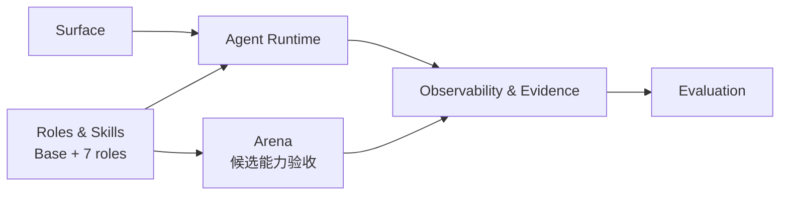

# XiaoBa-CLI PLAN

状态：Active
最后更新：2026-07-13
Owner：XiaoBa maintainers

本文只维护仓库级当前状态和收敛顺序。历史实现流水由 Git 保存；模块细节进入六份模块 PLAN，不再创建额外计划文档。

## Current Status

XiaoBa-CLI 已形成一套共享 Agent Runtime，以及一个 Base Main Agent + 七个默认 Role Subagents：

- 自进化审查侧：UserCat、InspectorCat、ReviewerCat。
- 执行接管侧：EngineerCat、BrowserCat、GuiCat、SecretaryCat（FeishuCat 别名）。
- EngineerCat 同时承担代码接管，以及 Inspector / Reviewer 闭环里的修复执行。
- 七个角色全部复用 XiaoBa Agent loop；browser/GUI/Feishu drivers 只是确定性 capability adapters。
- CLI、Feishu、Weixin、Pet、Dashboard 和 Electron 共用 AgentSession/ConversationRunner 主链。
- 本地 trace、artifact、delivery evidence、Trace Replay、Live Agent Eval 和 Arena 已有可运行边界。

文档已收敛为固定 14 份：项目级 SPEC/PLAN，加六个模块 SPEC/PLAN。Prompt、`SKILL.md` 和测试 fixture 属于运行时源文件，不是架构文档。

## Milestones

| Milestone | Status | Current meaning |
| --- | --- | --- |
| M0 Documentation baseline | Completed | 1 repository pair + 6 module pairs; no duplicate submodule SPEC/PLAN |
| M1 Shared runtime | Completed | AgentSession、ConversationRunner、layered ToolManager and provider adapters are active |
| M2 Base + seven roles | Completed | Stable topology and default bundle implemented; RouterCat retired; SecretaryCat restored over official lark-cli |
| M3 Surface integration | Partial | Maintained entrypoints share runtime; network auth/permission remains incomplete |
| M4 Evidence system | Partial | Local trace/artifact/delivery facts exist; retention and durable recovery remain incomplete |
| M5 Evaluation split | Completed | Test、Trace Replay and Live Agent Eval have distinct commands and meanings |
| M6 Arena | Partial | Clean runtime, three review modes and scorecards exist; sandbox/promotion hardening remains |
| M7 Browser/GUI takeover | Partial | Typed adapters and pinned official role-local Skills exist; GuiCat's macOS driver package was built and inspected, while BrowserCat packaging, broader coverage and trusted approvals remain |

## Next Steps

1. Finish BrowserCat packaged drivers and broaden BrowserCat/GuiCat real-task verification without adding another model loop.
2. Add Owner-bound authentication and consequential-action confirmation to Dashboard, Pet, Bridge and shared tool context.
3. Persist in-flight subagent state, action receipts and cancellation evidence without introducing a general workflow framework.
4. Make Trace Replay side-effect safe before replaying arbitrary historical tasks.
5. Keep Live Agent Eval fresh-run only; add role cases only when they have task-specific hard verifiers.
6. Harden Arena isolation and require explicit promotion before external skills or roles enter production assets.
7. Simplify SecretaryCat's typed-wrapper compatibility layer against official `lark-cli` skills without weakening Owner confirmation, delivery or evidence.

## Owners

- Surface：`src/commands/**`, `src/feishu/**`, `src/weixin/**`, `src/pet/**`, `src/dashboard/**`, `desktop/**`
- Agent Runtime：`src/core/**`, `src/providers/**`, `src/tools/**`, `src/types/**`
- Roles & Skills：`roles/**`, `src/roles/**`, `skills/**`, `src/skills/**`, `prompts/**`
- Observability & Evidence：`src/observability/**`, `logs/**`, `data/**`, `memory/**`, `output/**`
- Evaluation：`test/**`, `src/replay/**`, `src/eval/**`, `eval/**`
- Arena：`src/arena/**`, `src/commands/arena.ts`, `arena/**`

## Acceptance Criteria

- Only `docs/SPEC.md` plus the six module SPECs define architecture.
- Only their paired PLAN files maintain current execution status.
- Every maintained SPEC has truthful Current Architecture and Target Architecture Mermaid diagrams.
- Base remains the only user-facing main agent and dispatcher.
- Exactly seven default roles share the XiaoBa Agent loop.
- Browser/GUI drivers do not expose upstream Chat/Agent/MCP loops.
- Tool, delivery, artifact and runtime failures remain structured and observable.
- `test:*`, `replay:*`, `eval:*` and `check:*` commands keep distinct meanings.
- Arena subjects remain untrusted until explicit promotion.

## Risks / Open Questions

- Dashboard/Pet/Bridge control surfaces are not yet safe for broad network exposure.
- Owner identity and high-risk confirmation are not consistently bound through runtime execution context.
- In-flight subagent recovery, idempotent side effects and full cancellation remain incomplete.
- Trace Replay can still execute current real side effects.
- Browser release packaging and Browser/GUI trusted approval provenance remain incomplete; GuiCat's local macOS package path and artifact are verified, but signed/notarized release verification remains future release work.
- SecretaryCat's compatibility wrappers can drift from the official `lark-cli` command and skill surface.
- `npm audit --omit=dev` reports 7 production-tree findings (3 moderate, 4 high) in the existing Lark SDK/transitive dependency path; Peekaboo is not among the flagged packages, but release dependency remediation remains open.
- Arena sandbox claims must stay narrower than the actual OS isolation it enforces.

## Recent Verification

- Documentation set check：14 architecture/plan files under `docs/`；post-change Git Markdown inventory is 61 files, consisting of 20 human docs, 38 runtime prompt/skill assets, and 3 test fixture reports。
- Markdown local-link check：the new README links resolve to `requirement.txt`; the previous 60/60 Markdown link baseline remains unchanged otherwise。
- Clean staged-tree tests：481/481 passed；BrowserCat/GuiCat/SecretaryCat focused tests：88/88 passed。
- `npm run build` passed；benchmark preflight passed for 1 manifest / 11 cases；BrowserCat and GuiCat Skill validation passed。
- Feishu Surface 与 SecretaryCat 的 App ID 指纹一致；SecretaryCat 已显式绑定同应用 profile，真实状态为 bot ready / user missing。BrowserCat 当前缺少固定 driver。GuiCat 从项目 optional dependency 发现 Peekaboo 3.8.0，macOS/TCC/bridge 检查为 `ready=true`。
- GuiCat real read-only smoke passed through its typed adapter and returned a non-empty application inventory without claiming the desktop lease.
- GuiCat's role-local `SKILL.md` is an exact vendored copy of official `openclaw/Peekaboo` commit `ed1a7218` (SHA-256 `0bfe8b25ef9ac2ffc99c7135ddc3b7258abb0a41da0bbeeb9c27d1faa52f2d28`) with the upstream MIT LICENSE.
- BrowserCat's role-local `core/SKILL.md` is an exact vendored copy of official `vercel-labs/agent-browser` tag `v0.31.1` / commit `ed2e1059` (SHA-256 `cc5ec94697530e750bcb9776479d71ef7966e7cf874b9a60b091a986b1ae5b9d`) with the upstream Apache-2.0 LICENSE; it loads through role-local SkillManager without exposing shell, raw CLI, Chat/Agent or MCP tools.
- The duplicate Base `agent-browser` routing Skill is retired; Base dispatches BrowserCat directly, and the default package now contains four base Skills.
- `electron-builder --mac --dir` passed；产物中不再包含 Base `skills/agent-browser`，BrowserCat role-local Skill / LICENSE hashes match the source copy；Peekaboo 位于 `Contents/Resources/drivers/peekaboo/peekaboo`，版本 3.8.0，使用 packaged resources 路径复检仍为 `ready=true`。
- `npm audit --omit=dev` found 7 existing production-tree findings；none names `@steipete/peekaboo`。
- JSON parse checks and `git diff --check` passed。
