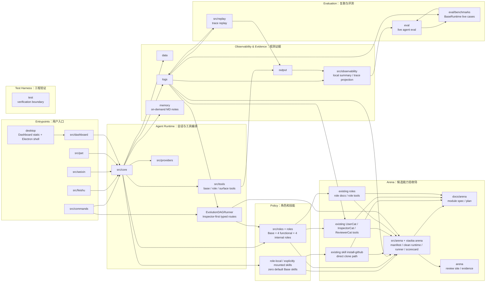
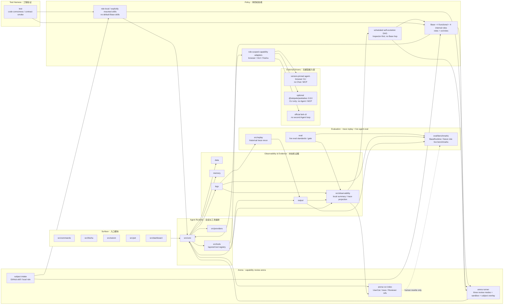
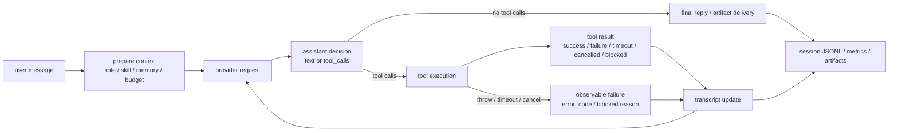

# XiaoBa-CLI SPEC

状态：Active
最后更新：2026-07-14
适用范围：`XiaoBa-CLI` 整体架构、agent harness 边界、核心状态机、运行证据和评测闭环。

本文是 `XiaoBa-CLI` 的项目级架构真相源。项目只维护本文和六个模块 SPEC；角色、benchmark、desktop、test 和实验实现不再各自复制架构文档。

## 顶层架构模块索引

XiaoBa-CLI 的稳定文档结构是一个项目级大 SPEC 加六个顶层模块 SPEC。六个模块是架构介绍和代码 review 的统一口径：Surface、Agent Runtime、Roles & Skills、Observability & Evidence、Evaluation、Arena。每个模块只有一份 SPEC 和一份 PLAN；Trace Replay、state/evidence、live eval、benchmark、desktop、test 和逐角色实现直接写入所属模块文档，不再创建 supporting SPEC/PLAN。

| 模块 | SPEC | PLAN | 覆盖范围 |
| --- | --- | --- | --- |
| Surface：入口层 | [`surface/SPEC.md`](surface/SPEC.md) | [`surface/PLAN.md`](surface/PLAN.md) | `src/commands`、`src/feishu`、`src/weixin`、`src/pet`、`src/dashboard`、`desktop` |
| Agent Runtime：会话与工具编排层 | [`agent-runtime/SPEC.md`](agent-runtime/SPEC.md) | [`agent-runtime/PLAN.md`](agent-runtime/PLAN.md) | `src/core`、`src/providers`、`src/tools`、runtime 类型、session lifecycle 和 agent loop |
| Roles & Skills：Base + 八角色策略层 | [`roles-skills/SPEC.md`](roles-skills/SPEC.md) | [`roles-skills/PLAN.md`](roles-skills/PLAN.md) | Base Main Agent、八个默认 Role Subagent、`roles`、`src/roles`、`skills`、`src/skills` |
| Observability & Evidence：观测证据层 | [`observability-evidence/SPEC.md`](observability-evidence/SPEC.md) | [`observability-evidence/PLAN.md`](observability-evidence/PLAN.md) | `src/observability`、`logs`、`data`、`memory`、`output`、trace projection 和 artifact evidence |
| Evaluation：trace replay + live agent eval 层 | [`evaluation/SPEC.md`](evaluation/SPEC.md) | [`evaluation/PLAN.md`](evaluation/PLAN.md) | `src/replay`、`scripts/run-trace-replay.ts`、`eval`、`eval/benchmarks`、BaseRuntime live agent eval、hard verifiers、scorecard 和工程测试 |
| Arena：候选能力验收场 | [`arena/SPEC.md`](arena/SPEC.md) | [`arena/PLAN.md`](arena/PLAN.md) | `src/arena`、`src/commands/arena.ts`、root `arena`、subject import、clean runtime、sandboxed runner、scorecard 和显式 promotion |

外部观测导出不是当前模块边界。本地 JSONL、artifact evidence 和 role/runtime scorecard 是权威事实；Observability 只输出本地 summary / trace evidence，不拥有 pass/fail，也不能自动接受生成的 benchmark candidate。

## 1. 核心定位

XiaoBa-CLI 是一个本地优先、message-native、可治理自进化的 agent harness runtime。它的核心不是把 LLM 接到几个工具上，也不是只让 agent 沉淀更多 skill；而是把模型、工具、角色、skill、memory、context、artifact、日志、replay 和 Arena review gate 组织成一个可控、可观测、可恢复、可评测的运行时状态机，让每次成长都能被证据验收。

关键判断：

```text
Model is not the runtime.
Harness is the runtime.
```

核心运行术语：

- `session`：一个长期会话，可跨多次用户请求和进程重启恢复。
- `trace`：一次用户请求从进入 runtime 到本次 `ConversationRunner` while loop 截止的闭环，是产品、观测、eval 和 benchmark 的最小用户意图单元。
- `turn`：`ConversationRunner` 内部 while loop 的一次 model request / tool result 推进一步。`turn` 不再指完整用户请求。
- `span`：trace 内可计时的子操作，例如 model、tool、provider、delivery。
- `event`：trace 内的离散事实，例如 `session_started`、`session_completed`、`provider_error`；新日志默认嵌在 trace 主记录里。
- `metric`：token、latency、count 等数值事实，由 trace/event/tool facts 投影产生。
- `case`：trace 清洗、裁剪、补充 rubric 后进入 eval/benchmark 的评测样本。
- session-log-v2 里的 `entry_type="turn"`、`turn_id`、`turn` 是历史兼容字段；session-log-v3 新写入使用 `entry_type="trace"`、`trace_id`、`trace_index`。

模型负责下一步推理，harness 负责工程边界：

- provider transcript 必须合法。
- tool execution 必须闭环。
- session state 必须隔离、可恢复、可清理。
- context compression 不能丢当前任务和硬约束。
- context compression 必须留下结构化断点证据，并把 compact 后 working memory 作为同 session snapshot 关联到 trace。
- artifact 生成与发送必须有 evidence。
- 日志必须可解析、可投影、可 replay。
- 失败必须能归因到 runtime、skill、role 或外部系统。
- self-evolution 产出的 skill / role 变更必须先被视为候选能力，通过 trace、replay、Arena scorecard 或明确人工验收后才能被信任。

## Current Architecture

项目级 spec 的最外层图只表达当前已经存在的 durable module 和职责边界。细节放到对应模块 spec；顶层 Mermaid 节点优先使用模块名，避免把项目级地图画成实现细节图。



## Target Architecture

目标架构保持同一套本地优先 runtime，但把 surface、policy、tool boundary、state/evidence 和 evaluation gate 分层收敛。项目层只约束模块关系；模块内部的类、工具和数据结构由各自 `SPEC.md` 继续展开。



## 核心组件边界

| 组件 | 职责 | 不能承担的职责 |
| --- | --- | --- |
| `AgentSession` | 管 session 生命周期、busy/interrupt、上下文压缩触发、skill 激活、session log、context restore 和长期 memory 落盘触发 | 不直接实现 tool 业务；不直接适配某个平台 API；不默认把长期 memory 注入 provider prompt |
| `ConversationRunner` | 管 agent loop：model call -> tool calls -> tool results -> next model call；保证 transcript 合法 | 不保存长期 session；不决定角色配置 |
| `ToolManager` | 管三层工具注册、可见性、参数解析、执行边界、结果归一化、错误码和 retryable 信号；工具层级包括 base tool、role tool 和 surface tool | 不参与模型推理；不维护多轮对话状态；不把平台交付工具伪装成角色工具 |
| `ContextCompressor` | 管长上下文状态迁移，在压缩后保留任务目标、约束、artifact 状态和最近上下文 | 不做业务总结；不替代 memory |
| `SessionTurnLogger` | 管运行证据：trace、legacy turn alias、tool call、tool result、tokens、embedded runtime events、artifact clues；`traces.jsonl` append 后投影到 observability local summary，普通 runtime 文本写入 `runtime.log` | 不做最终质量评分；不作为业务数据库 |
| `Observability` | 管 session log 投影后的 local summary、本地 span/metric helper、hash-only trace continuity 和 trace-to-case proposal evidence | 不替代本地 JSONL、artifact evidence、scorecard；不直接拥有 runtime 事实源；不拥有 pass/fail；不接受、patch 或 apply benchmark case；不处理外发脱敏 |
| `roles/*` | 定义角色身份、职责、工具注入和验收边界 | 不复制 runtime loop |
| `skills/*` | 定义领域流程和操作策略 | 不保存 runtime 状态；不绕过工具边界 |
| `Arena` | 管 GitHub skill 导入、本地 role 验收、三种 review mode（`base_skill`、`role_skill`、`role`）、clean runtime overlay、轻量 execution sandbox、subject manifest、sandboxed runner、arena run index、scorecard、现有 UserCat / trace / Inspector / Reviewer 证据引用和 promotion 边界 | 不自动信任外部 subject；不替代生产 `SkillManager` 或 role registry；不复制 runtime trace / eval benchmark source；不自动接受 benchmark case；不要求 Docker / VM |
| `test/*` | 定义代码正确性、集成测试和 deterministic runtime contract smoke | 不承载 live agent eval benchmark；不保存 eval scorecard policy |
| `src/replay/*` | 定义历史 trace replay：从本地 `traces.jsonl` 抽用户输入，重新驱动当前 runtime，产生 fresh trace 和轻量对比 | 不打 benchmark 分；不自动接受 eval case；不上传或脱敏本地 trace |
| `eval/*` | 只定义 live agent eval：curated benchmark input、setup、runtime replay、tool/result verifier 和 scorecard | 不保存原始私密 trace；不承载普通单测；不保存 schema/contract/rubric governance；不收静态 JSONL regression |
| `eval/benchmarks/*` | 存放 live agent eval benchmark source、suite、case mapping | 不保存原始私密 trace；不承载普通单测；不保存非 live role/static fixtures |

## Agent Loop 状态机

Agent harness 的核心是状态机，不是单次请求。



状态机不变量：

- 每个 assistant tool call 必须进入一个合法终态：success、failure、timeout、cancelled 或 blocked。
- 每个 tool call id 必须有 matching tool result，不能把 dangling tool call 送进下一轮 provider request。
- 模型可见工具必须由 `ToolManager` 根据 role policy 和 surface context 计算；隐藏工具即使被模型硬调也必须返回 forbidden tool result。
- provider-visible transcript、runtime-visible trace、user-visible message 三者可以不同，但必须可关联。
- outbound tools 例如 `send_text` / `send_file` 的成功必须进入 structured delivery evidence，并能被 `delivery_evidence_contract` 验证；channel-backed tools 和 surface runtime replay 还可以记录 `external_delivery_receipts`，用于保存平台 message/file/upload ack 的结构化事实。
- 已经对用户可见的消息不能因为后续 provider 失败而被 runtime 当作未发生。

## 三层状态模型

XiaoBa 的状态不能只用一个 `messages[]` 描述。需要区分三层：

| 层 | 内容 | 作用 |
| --- | --- | --- |
| Durable Session | surface、session key、`data/sessions/<surface>` 持久化上下文、active skill、按需读取的长期 memory 笔记 | 跨 trace / restart 恢复 |
| Trace | 当前用户请求的 user input、runner turns、tool calls、tool results、artifacts、runtime events | debug、replay、scorecard 证据 |
| Provider Transcript | 真正发送给模型 provider 的 system/user/assistant/tool messages | 保证 provider 协议合法和 token budget |

设计原则：

- Durable session 不能直接等同于 provider transcript。
- Trace 是事实证据，不一定全部进入下一次 provider request。
- Context compression 应该迁移状态，而不是简单裁剪文本。
- Session log 是 replay/eval 的输入资产；新写入应带 `trace_id` / `trace_index`，而 `case_id`、`scorecard` 属于后处理或评测产物。

## Memory Contract

`data/sessions/<surface>/<session-key>.jsonl` 是会话恢复主路径：保存 provider-visible transcript 和 compact system messages，用于同一个入口里的同一个 session 断开、TTL cleanup 或进程重启后继续上下文。迁移期兼容读取旧的 `data/sessions/<session-key>.jsonl`，但新写入必须落到 surface 子目录。

`memory/sessions/<session-key-hash>/MEMORY.md` 是按 session/person 维度维护的长期记忆笔记：只保存稳定偏好、习惯、称呼、默认工作方式和用户明确要求记住的事实。它是 Markdown 主存储，便于人类阅读、diff、编辑和删除。

长期 memory 不默认加载进 provider prompt。恢复会话时只恢复对应 surface 下的 `data/sessions`；长期 memory 只能通过显式 recall、后续工具或用户请求按需注入，并且注入内容必须小而相关。当前任务进度、刚失败的命令、下一步待办和临时文件路径属于 `data/sessions` / `[session_memory]`，不能自动固化为长期 memory。

## Message-Native Runtime

XiaoBa 面向 IM、桌宠和 CLI 多入口，但 runtime 统一收敛到 `AgentSession`。

入口边界：

- CLI 可以直接返回文本；CLI 不注入 `send_text` / `send_file`。
- Feishu / Weixin / Pet / Dashboard 是 channel-delivered surface：平台层必须显式传入 `surface` 和 `channel callbacks`，不能从 `session key` 猜入口类型。
- Channel surface 以用户可见消息和文件交付为准；正常路径只有 `send_text` / `send_file` 产生用户可见输出。
- Channel surface 默认不把最终直接文本回复外发给用户；模型要让用户看到回复，必须调用 `send_text` / `send_file`。`ConversationRunner` 的 `delivery_fallback_final_reply` 只是一项显式 opt-in 兼容策略，默认关闭；一旦入口选择开启，fallback 外发仍必须记录 synthetic `send_text` ToolResult 和 structured `delivery_evidence`。
- `send_text` / `send_file` 属于 surface tool 和 outbound side effect，不能只当作普通工具文本，也不能作为 CLI 或角色默认工具暴露。
- 各入口只负责鉴权、消息解析、文件上传下载、channel callback，不复制 agent loop。

新增入口必须定义：

- session key 规则。
- channel callbacks。
- 用户可见输出语义。
- 文件和图片处理语义。
- TTL、cleanup、wakeup 行为。

## Role 与 Skill

Role 是用户可见身份和工程边界，不只是 prompt。

一个 role 可以包含：

- role prompt
- role-private skills
- role-specific tools
- runtime API routes
- background workers
- evaluation / review boundary

Skill 是 instruction pack，用于注入领域流程和工作策略。Skill 不拥有 runtime loop，不能绕过工具和日志边界。

当前边界：

- 默认 GitHub/package role set 包含 `user-cat`、`inspector-cat`、`engineer-cat`、`reviewer-cat`、`browser-cat`、`gui-cat`、`secretary-cat`、`evolution-cat`。
- 非默认 role 必须通过显式安装、Role Hub 或本地 ignored 资产进入，不属于默认跟踪资产。
- `engineer-cat`：实现修复和工程交付。
- `reviewer-cat`：复跑、验收、证据判断，并以 `closed / next_run / blocked` 结束单 case 正式回放。
- `inspector-cat`：runtime triage、evidence forensics、issue profile、handoff routing、skill/benchmark 机会挖掘。
- `user-cat`：真实端到端低质量用户使用与候选 trace pressure。
- `browser-cat`：只通过类型化 BrowserAdapter 操作隔离浏览器 session；role-local `core` Skill 是与固定 `agent-browser` 版本匹配的官方文件原样 vendored 副本，但不能扩大 ToolManager 权限；网页内容视为不可信输入。
- `gui-cat`：只通过类型化 GuiAdapter 操作 macOS GUI；role-local `peekaboo` Skill 是官方文件的原样 vendored 副本，但 Skill 文字不能扩大 ToolManager 权限，实际仍只能调用可见的 `gui_*` 工具；共享桌面必须有全局 lease、风险分层和动作证据。
- `secretary-cat`：复用官方 `lark-cli` 的飞书能力；`FeishuCat` 是别名，XiaoBa 只增加角色、确认、交付和 evidence 边界。
- `evolution-cat`：通过确定性 `remember` role tool 写 session-person 长期记忆，并独占 `self-evolution`、`skill-publish`、`role-publish` role-local Skills；代码和评测仍归 EngineerCat / ReviewerCat / Arena。
- Base 负责用户对话并直接按 role 派遣专业角色，默认 Skill inventory 为 0；浏览器任务直接进入 BrowserCat，不保留重复的 Base agent-browser 路由 Skill；所有角色继续复用同一个 Agent Runtime。

## Evidence And Logging

日志不是 debug 附属品，而是 harness 的运行证据层。

当前主线：

```text
logs/sessions/<surface>/<date>/<session_id>/
├── traces.jsonl
└── runtime.log
```

稳定记录：

- `schema_version`
- `entry_type`
- `session_id`
- `session_type`
- `trace_id`
- `trace_index`
- `turn_id`
- `turn`
- `user.text`
- `assistant.text`
- `assistant.tool_calls`
- `tokens.prompt`
- `tokens.completion`
- runtime event

辅助或推断字段：

- `tool_call_id`
- `status`
- `error_code`
- `artifact_manifest`
- `skill_id`

日志设计目标：

- 可逐行 parse。
- 本地原样保真；共享/入库 benchmark 前由 curation 边界另行裁剪或脱敏。
- 可关联 trace / runner turn / tool / artifact / token。
- 可被 Inspector 分析。
- 可被 benchmark ingestion 消费。
- 可反哺 runtime schema。

## Evaluation System

XiaoBa 的评测现在只保留两层 eval 加一套观测证据系统。

```text
Quality System
├── Test Harness
│   ├── unit / integration
│   └── contract smoke
├── Eval / Benchmark
│   ├── BaseRuntime benchmark
│   └── role eval / benchmark
└── Observability Evidence System
```

`test/` 维护代码正确性和 deterministic contract smoke：unit / integration tests 在 `test/**/*.test.ts`，runtime contract smoke 在 `test/contract-smoke/suites` 和 `test/contract-smoke/fixtures`。`src/replay` / `xiaoba replay --trace` 维护历史 trace replay：输入本地 `traces.jsonl`，抽取真实用户输入，重新驱动当前 runtime 并生成 fresh trace 对比。`eval/` 只维护 live agent eval benchmark：curated 输入请求 + setup + runtime replay + tool/result verifier + scorecard。`Arena` 是候选能力验收场，不属于 `eval/`；它的 run 可以启发未来 live eval case，但必须人工重写后才能进入 `eval/benchmarks`。`check:benchmarks` 只验证 live benchmark manifest、case id 和 referenced suite。`eval/benchmarks/BaseRuntime/` 是当前唯一 live eval benchmark root，包含 11 条 Pet/IM runtime replay cases。`eval:gate` 默认只聚合这套 live BaseRuntime eval。

Live runtime alignment：`AgentSession` provider failure fallback turns now emit the same degraded provider transcript boundary facts required by the deterministic State/Evidence gate, while production-network provider replay remains a later E2E layer.

Provider-network readiness alignment：provider-network readiness remains an opt-in diagnostic script for real provider credentials, outside the public `eval:*` command surface.

Historical output alignment：old generated `output/**` roots are not current observability source-of-truth unless an owner explicitly moves them into a maintained check or live eval source.

三类 case 来源：

- Test harness case：从 contract、JSONL、provider、surface runtime、state/evidence 和 resilience 不变量构造稳定 smoke，归 `test/contract-smoke`。
- Trace replay：从历史 `traces.jsonl` 抽取真实用户输入，重新跑当前 runtime，观察 fresh trace 是否还能复现同类行为。
- Live agent eval case：从 curated 用户输入、setup、replay、expected tool/result 和 verifier 构造可重新运行的 benchmark 行为评测。
- Observability evidence：从 trace / event / metric / artifact 生成可审证据，可辅助定位和候选 case 设计，但不自动接受为 benchmark。

评估顺序：

```text
contract hard gate
  -> runtime harness replay or role benchmark replay
  -> hard gate verifier
  -> role/domain verifier when owned by a role benchmark
  -> deterministic soft judge
  -> LLM / VLM judge
  -> human review for high-value or disputed cases
  -> quality / efficiency scorecard
```

质量原则：

- contract fail 直接 block。
- 必需 artifact 缺失直接 fail。
- provider payload boundary 或必需 evidence 违规直接 fail。
- quality 先过门槛，efficiency 再排序。
- LLM/VLM judge 只做语义评估和初筛，不能替代程序化 evidence。

## Agent Harness Contracts

这些 contract 是 release hard gate，不是业务加分项：

- Transcript completeness：每个 tool call 必须有 matching tool result。
- Failure observability：timeout、cancelled、throw 必须转成可观测 `status/error_code`。
- Retry budget：失败重试必须有上限，重复失败后要变更策略或报告 blocked reason。
- Privacy boundary：reply、log、artifact、scorecard 不得泄漏 credential、token、私有 host；release JSONL fixtures 和 artifact fixtures 在进入 eval evidence 前必须通过隐私预检；`data/sessions` durable restore store 属于私有恢复状态，不等同于可发布 evidence。
- Artifact evidence：生成、更新、发送用户文件必须有 manifest 或 delivery evidence。
- Context continuity：restore/compaction 后保留当前任务目标、硬约束、关键路径和 artifact 状态。
- JSONL compatibility：session log 必须逐行可解析，schema 变更必须兼容 ingestion；release suite `inputs.jsonl` 必须声明 `session-log-v2` schema 或 explicit non-session contract，且 non-session contract 必须有 dedicated shape + semantic gate。

## Extension Rules

新增 runtime 能力时，必须回答四个问题：

- 它接入哪一层：surface、control plane、agent session、runner、tool、state/evidence、eval？
- 它改变哪个状态机边界？
- 它产生什么证据，能否进入 `logs/sessions/**/*.jsonl`？
- 它应该由 trace-derived、requirement-driven 还是 contract eval 覆盖？

新增工具必须定义：

- tool name / description / args schema。
- tool layer：`base`、`role` 或 `surface`。
- visibility policy：base tool 是否受 role 继承/allowlist/denylist 控制，surface tool 需要哪些 surface context。
- transcript mode。
- side effect 边界。
- error code。
- retryable 语义。
- blocked / cancelled 终态与 bounded failure 语义。
- artifact evidence。
- 如果工具调用外部 driver，还必须定义固定版本、binary trust/discovery、argv allowlist、timeout/abort、输出信任级别、Arena 行为和打包边界；不得把任意 driver 参数或 Shell 暴露给模型。

新增角色必须定义：

- 用户可见职责。
- runtime 权限。
- skills / tools。
- 验收边界。
- 与 Engineer / Reviewer / Inspector 的协作方式。

## 文档边界

- `docs/SPEC.md` / `docs/PLAN.md` 是项目级总文档。
- `docs/surface`、`docs/agent-runtime`、`docs/roles-skills`、`docs/observability-evidence`、`docs/evaluation`、`docs/arena` 各自只维护一份 `SPEC.md` 和一份 `PLAN.md`。
- `roles/`、`skills/`、`desktop/`、`eval/`、`test/` 和 benchmark 目录不再维护重复 SPEC/PLAN；设计和进展回写所属模块。
- `prompts/**/*.md` 和 `**/SKILL.md` 是运行时源文件，不计入架构文档集合。
- 如果实现改变了本文定义的组件边界、状态机、日志格式或 live eval 边界，必须同步更新本文。
