# XiaoBa-CLI Architecture Spec

状态：Draft
最后更新：2026-05-20
适用范围：`XiaoBa-CLI` 整体架构、runtime 边界、核心数据流和扩展点。

本文档是 `XiaoBa-CLI` 的整体架构真相源。`docs/` 下的其他文档可以继续作为专题设计、发布说明或历史方案存在，但不再承担“整个项目架构 spec”的职责。任何涉及入口、会话核心、工具循环、角色系统、skill 系统、模型 provider、持久化或反馈闭环的结构性变化，都应该同步更新本文档。

## 1. 一句话架构

XiaoBa-CLI 是一个本地优先的 message-native AI role runtime：多个入口把用户消息转成统一的 `AgentSession`，会话核心加载角色、skills、记忆和工具，通过 `ConversationRunner` 驱动模型与工具循环，并把文本、文件、后台任务、日志和长期记忆交付回真实工作环境。

## 2. 设计目标

- 入口统一：CLI、飞书、微信、CatsCompany、Dashboard、Pet 都复用同一个 runtime 核心。
- Message-native：IM / Pet 这类消息入口的用户可见输出以消息和文件交付为准，而不是普通终端文本。
- Role-aware：角色不是简单 prompt，而是 prompt、skills、工具、后台服务和验收边界的组合。
- Local-first：文件、shell、日志、session、memory、artifact 默认围绕本地工作目录和本地状态运行。
- Agent orchestration：XiaoBa 不替代 Codex / Claude Code / AutoDev，而是把它们作为可调度、可追踪、可验收的外部能力。
- Feedback-ready：runtime 运行痕迹要能进入 replay、benchmark、review 和自动修复闭环。

## 3. 总体 Mermaid 图

```mermaid
flowchart TB
  user["User / IM group / desktop user"]

  subgraph surfaces["Surfaces"]
    cli["CLI<br/>chat / config / skill"]
    feishu["Feishu adapter"]
    weixin["Weixin adapter"]
    cats["CatsCompany adapter"]
    dashboard["Dashboard<br/>local web UI"]
    pet["Desktop Pet<br/>HTTP + SSE"]
  end

  subgraph adapters["Command And Message Adapters"]
    commands["src/commands/*"]
    im_handlers["message handlers<br/>feishu / weixin / catscompany"]
    dashboard_api["dashboard API routes"]
    pet_router["pet channel router"]
  end

  subgraph role_skill_layer["Role And Skill Layer"]
    role_files["roles/*<br/>role.json / prompts / skills"]
    role_resolver["RoleResolver<br/>ActiveRoleContext"]
    role_registry["runtime-role-registry<br/>role tools / API routes / workers"]
    prompt_manager["PromptManager<br/>system prompt builder"]
    skill_files["skills/* and roles/*/skills/*"]
    skill_manager["SkillManager<br/>load / match / list skills"]
    skill_activation["Skill activation protocol<br/>system prompt injection"]
  end

  subgraph session_core["Session Core"]
    services["AgentServices<br/>AIService + ToolManager + SkillManager"]
    message_sessions["MessageSessionManager<br/>session TTL / wakeup / isolation"]
    agent_session["AgentSession<br/>message state / commands / memory / cleanup"]
    runner["ConversationRunner<br/>model-tool loop"]
    compressor["ContextCompressor<br/>token budget guard"]
  end

  subgraph model_tools["Model And Tool Runtime"]
    ai_service["AIService<br/>provider chain / retry / failover"]
    providers["OpenAI-compatible<br/>Anthropic"]
    tool_factory["createRoleAwareToolManager"]
    tool_manager["ToolManager<br/>definitions + executor"]
    base_tools["Base tools<br/>read / write / edit / grep / glob / shell"]
    message_tools["Outbound tools<br/>reply / send_file / ingest_log"]
    skill_tool["Skill tool"]
    subagent_tools["Subagent tools<br/>spawn / check / stop / resume / ask_parent"]
    role_tools["Role tools<br/>inspector / reviewer / engineer"]
  end

  subgraph subagents["Background Work"]
    subagent_manager["SubAgentManager<br/>parent isolation / callbacks"]
    subagent_session["SubAgentSession<br/>skill-scoped worker"]
  end

  subgraph state_obs["State And Observability"]
    session_store["SessionStore<br/>conversation context"]
    turn_logs["SessionTurnLogger<br/>JSONL turns / tool traces"]
    runtime_logs["Logger + Metrics<br/>runtime logs / tokens / timings"]
    memory_finalizer["MemoryFinalizer<br/>facts / preferences / artifacts"]
    benchmarks["benchmarks/*<br/>trace-derived eval assets"]
    case_loop["Case replay feedback loop<br/>inspect -> engineer -> review"]
  end

  subgraph external["External Systems"]
    local_system["Local filesystem / shell / project files"]
    im_apis["IM APIs<br/>Feishu / Weixin / CatsCompany"]
    model_apis["LLM APIs"]
    coding_agents["Codex / Claude Code / AutoDev"]
    browser_ui["Browser / Electron shell"]
  end

  user --> cli
  user --> feishu
  user --> weixin
  user --> cats
  user --> dashboard
  user --> pet

  cli --> commands
  feishu --> im_handlers
  weixin --> im_handlers
  cats --> im_handlers
  dashboard --> dashboard_api
  pet --> pet_router

  commands --> services
  im_handlers --> message_sessions
  pet_router --> message_sessions
  dashboard_api --> services
  message_sessions --> agent_session
  services --> agent_session

  role_files --> role_resolver
  role_resolver --> prompt_manager
  role_resolver --> role_registry
  role_registry --> tool_factory
  role_registry --> dashboard_api
  role_registry --> commands
  skill_files --> skill_manager
  skill_manager --> skill_activation
  skill_activation --> agent_session
  prompt_manager --> agent_session

  services --> ai_service
  services --> tool_manager
  services --> skill_manager
  tool_factory --> tool_manager

  agent_session --> compressor
  agent_session --> runner
  runner --> ai_service
  ai_service --> providers
  providers --> model_apis
  runner --> tool_manager
  tool_manager --> base_tools
  tool_manager --> message_tools
  tool_manager --> skill_tool
  tool_manager --> subagent_tools
  tool_manager --> role_tools

  base_tools --> local_system
  message_tools --> im_apis
  message_tools --> pet_router
  skill_tool --> skill_manager
  subagent_tools --> subagent_manager
  subagent_manager --> subagent_session
  subagent_session --> runner
  role_tools --> coding_agents
  role_tools --> case_loop

  agent_session --> session_store
  agent_session --> turn_logs
  agent_session --> memory_finalizer
  runner --> runtime_logs
  case_loop --> benchmarks
  case_loop --> coding_agents
  dashboard_api --> browser_ui
  pet_router --> browser_ui
```



## 4. 代码目录边界

| 目录 / 文件 | 架构职责 |
| --- | --- |
| `src/index.ts` | CLI 程序入口，注册 commands，统一激活角色。 |
| `src/commands/*` | CLI 命令层，负责把不同启动方式接入 runtime。 |
| `src/core/agent-session.ts` | 会话核心，维护 messages、命令、skill 激活、上下文压缩、cleanup、memory 归档。 |
| `src/core/conversation-runner.ts` | 模型与工具循环，负责请求模型、执行工具、回传 tool result、控制轮次和上下文预算。 |
| `src/core/message-session-manager.ts` | 多消息入口的 session 生命周期管理，按 session key 隔离上下文和 TTL。 |
| `src/core/sub-agent-manager.ts` / `src/core/sub-agent-session.ts` | 后台子任务生命周期、父子会话隔离、完成后回调主会话。 |
| `src/utils/ai-service.ts` | 统一模型调用入口，封装 provider 选择、重试、主备模型 failover。 |
| `src/providers/*` | OpenAI-compatible / Anthropic provider 适配层。 |
| `src/tools/*` | 工具实现层，提供文件、shell、消息、skill、subagent 等能力。 |
| `src/bootstrap/*` | runtime 组合层，启动角色后台服务、注入角色工具、启动命令支持服务。 |
| `src/roles/runtime-role-registry.ts` | 角色运行时扩展注册点，决定角色专属工具、API routes 和后台 worker。 |
| `roles/*` | 角色定义、角色 prompt、角色私有 skills 和角色级 spec。 |
| `skills/*` | 全局 skills，本质是可解析、可注入的 instruction packs。 |
| `src/feishu` / `src/weixin` / `src/catscompany` | IM adapter，负责平台鉴权、消息解析、文件/图片处理和 channel 回调。 |
| `src/dashboard` / `dashboard` | 本地管理面板后端和前端静态资源。 |
| `src/pet` / `electron` | 桌宠、Electron shell、本地具身交互入口。 |
| `docs` / `benchmarks` | 架构 spec、专题设计、发布资料、trace-derived benchmark 和反馈闭环资产。 |

## 5. 核心运行流

### 5.1 启动流

1. `src/index.ts` 创建 Commander 程序并注册 `chat`、`feishu`、`weixin`、`catscompany`、`dashboard`、`pet`、`skill` 等命令。
2. `preAction` 通过 `RoleResolver.activateRole()` 激活 `--role`、`XIAOBA_ROLE` 或 `CURRENT_ROLE` 指定的角色。
3. 命令层创建 `AIService`、`ToolManager`、`SkillManager`，并调用 `startCommandSupport()` 启动角色运行时服务。
4. `createRoleAwareToolManager()` 从 `runtime-role-registry` 注入角色专属工具。
5. `SkillManager.loadSkills()` 加载全局 skills 和角色私有 skills。

### 5.2 消息处理流

1. CLI 直接创建 `AgentSession`；IM / Pet 通过 `MessageSessionManager.getOrCreate()` 按 session key 复用或创建会话。
2. `AgentSession.init()` 构建系统提示词，注入 surface-specific instruction，并从 `SessionStore` 和 `MemoryFinalizer` 恢复上下文。
3. `AgentSession.handleMessage()` 检查 busy、压缩上下文、自动匹配 skill、注入子任务状态和可调用 skills 列表。
4. `ConversationRunner.run()` 进入模型-工具循环。
5. Runner 请求 `AIService.chatStream()` 或 `AIService.chat()`，模型可能返回文本或 tool calls。
6. Tool call 交给 `ToolManager.executeTool()` 执行，结果按 tool transcript mode 写回上下文。
7. 模型没有后续 tool calls 时，Runner 产出最终回复；消息入口通过 channel 自动发回用户。
8. `AgentSession` 清理临时系统消息，记录 turn log、metrics，必要时保存 session 和 memory。

### 5.3 工具循环规则

- `ConversationRunner` 是唯一负责模型-工具多轮循环的核心。
- `ToolManager` 是工具定义和执行的统一入口；工具名别名在工具层和 runner 层做兼容。
- 普通工具结果进入 transcript；`reply` / `send_file` 这类 outbound 工具以 message-native 语义处理。
- `skill` 工具返回 skill activation signal，Runner 将其转成系统提示词并延长有效轮次。
- `spawn_subagent` 等工具通过 `SubAgentManager` 启动后台 `SubAgentSession`，完成后注入父会话。
- 角色工具只由 `runtime-role-registry` 注册，基础 runtime 不直接依赖具体角色实现。

## 6. 会话与状态模型

### 6.1 Session key

Session key 是隔离上下文、日志、后台任务和 memory 的主键。

| Surface | 典型 key | 说明 |
| --- | --- | --- |
| CLI | `cli` | 本地命令行会话。 |
| Feishu | `user:*` / `group:*` | 飞书私聊和群聊。 |
| CatsCompany | `cc_user:*` / `cc_group:*` | CatsCompany 私聊和群聊。 |
| Weixin | `user:*` | 微信会话，当前与 Feishu key 形态存在历史兼容。 |
| Pet | `pet:*` | 每个 pet id 一条本地桌宠会话。 |

### 6.2 持久化资产

- `SessionStore` 保存 conversation context，用于重启后恢复。
- `SessionTurnLogger` 记录每轮用户消息、模型回复、工具调用和 token 使用。
- `Logger` 记录 runtime 事件、错误、provider failover、工具耗时和角色后台服务状态。
- `MemoryFinalizer` 在 cleanup / archive 时从会话中提取 facts、preferences、artifacts。
- `benchmarks/` 保存从真实 trace 抽取、脱敏并结构化后的可回放评测资产。

## 7. 角色系统

角色由 `roles/<role-name>/role.json`、prompt、skills、工具和可选后台 worker 共同定义。

当前运行时的角色扩展点：

- `RoleResolver`：解析和激活当前角色。
- `PromptManager`：把基础 prompt、角色 prompt 和行为约束合并为系统提示词。
- `SkillManager`：按角色配置加载或排除 base skills，并加载角色私有 skills。
- `runtime-role-registry`：注入角色专属工具、API routes 和 AutoDev worker。

角色职责边界：

- `engineer-cat`：面向实现和工程交付，可调度 Codex job tools。
- `reviewer-cat`：面向验收和证据判断，可执行 E2E / module test / Codex job tools。
- `inspector-cat`：面向日志、case 和反馈闭环，可启动 inspector worker 或 hook runtime。
- `researcher-cat`：面向研究任务和长期资料整理，目前以 prompt / skill 为主。

## 8. Skill 系统

Skill 是本地 instruction pack，不是独立代码插件。一个 skill 由 frontmatter metadata 和正文 prompt 组成。

加载规则：

- 默认加载 `skills/*`。
- 如果当前角色配置 `inheritBaseSkills !== false`，则继承全局 skills。
- 角色私有 skills 从 `roles/<role>/skills/*` 加载。
- `excludeBaseSkills` 可排除不适合该角色的全局 skills。

调用规则：

- 用户可通过 `/skill-name args` 显式激活 skill。
- `AgentSession.tryAutoActivateSkill()` 可根据用户文本保守自动激活 auto-invocable skill。
- `skill` 工具也可在推理过程中激活 skill，并通过 system message 注入上下文。
- Skill 激活通常是 turn-scoped，避免长期污染后续会话。

## 9. Provider 与模型链路

`AIService` 是唯一模型调用入口。

职责：

- 从配置和环境变量读取主模型配置。
- 根据 provider / apiUrl / model 自动选择 OpenAI-compatible 或 Anthropic provider。
- 支持最多 5 个备份模型 slot。
- 对普通调用执行 retry 和 failover。
- 对流式调用默认只在首个文本片段输出前 failover，避免用户看到重复输出。

Provider 层只负责协议适配，不应该知道角色、skills、会话、工具业务语义。

## 10. Feedback Loop 与评测

反馈闭环不是单独系统，而是 runtime 运行资产的下游消费方式。

当前链路：

```text
runtime logs / session turns / tool traces
  -> Inspector 发现失败或异常
  -> Case replay / benchmark case
  -> Engineer 修复
  -> Reviewer 验收
  -> 回写 runtime / skill / prompt / docs
```

架构要求：

- 新增重要工具或入口时，应保证 turn log 能复现关键输入、工具调用和输出。
- 涉及用户环境、文件、token、凭证的 trace 必须脱敏后进入 benchmark。
- Case replay 的判断标准要尽量规则化；需要 LLM judge 时必须保留证据。
- Reviewer 的 closed / reopened / blocked 结论必须基于可复核证据。

## 11. 扩展规范

### 11.1 新增入口

新增入口应该接入 `AgentSession` 或 `MessageSessionManager`，不要复制会话循环。

必须定义：

- session key 规则。
- channel callback，至少包含用户可见回复；如支持文件交付，提供 `sendFile`。
- surface-specific system instruction。
- session TTL、cleanup 和 wakeup 行为。

### 11.2 新增工具

新增工具应该实现 `Tool` 接口并注册到 `ToolManager` 或 `runtime-role-registry`。

基础工具进入 `src/tools/*`；角色专属工具进入对应 `roles/<role>` 目录，并通过 `runtime-role-registry` 注入。

必须明确：

- 工具名和描述。
- 参数 schema。
- transcript mode。
- 是否会访问文件、shell、网络、外部 agent 或用户消息通道。
- 失败是否 retryable，错误码是否稳定。

### 11.3 新增角色

新增角色至少包含：

- `roles/<role>/role.json`
- 角色系统 prompt
- README 或 SPEC，说明角色职责边界

如果角色需要专属工具、API route 或后台 worker，必须在 `runtime-role-registry` 显式注册。

### 11.4 新增 skill

新增 skill 应放在 `skills/*` 或 `roles/<role>/skills/*`，并声明：

- `name`
- `description`
- `userInvocable`
- `autoInvocable`
- `aliases`
- `maxTurns`，如果该 skill 会进入多轮工作

Skill 正文应描述操作策略和交付标准，不应把 runtime 架构规则重复写入每个 skill。

## 12. 文档维护规则

- `docs/SPEC.md` 是唯一整体架构 spec。
- `roles/*/SPEC.md` 只能描述对应角色的职责、边界和验收方式。
- `benchmarks/*/SPEC.md` 只能描述评测资产结构和 benchmark 规则。
- `docs/reference/replay-loop.md`、`docs/reference/message-runtime.md` 等历史专题文档可以作为背景材料保留；若内容与本文档冲突，以本文档为准。
- README 只保留高层介绍和 quickstart，具体架构说明链接到本文档。

更新本文档的触发条件：

- 新增或删除顶层 surface / command。
- 改变 `AgentSession` 与 `ConversationRunner` 的职责边界。
- 改变 tool transcript、outbound message、skill activation 或 subagent 协议。
- 改变角色工具注入方式或角色后台 worker 生命周期。
- 改变 provider failover、context compression、session store、memory finalization。
- 改变 case replay / benchmark / feedback loop 的核心数据模型。

## 13. 相关专题文档

以下文档不是整体架构真相源，但可以作为专题背景继续参考：

- `docs/reference/message-runtime.md`
- `docs/reference/replay-loop.md`
- `docs/reference/post-training.md`
- `docs/ops/CD_RELEASE.md`
- `docs/ops/AUTO_UPDATE.md`
- `roles/engineer-cat/SPEC.md`
- `roles/reviewer-cat/SPEC.md`
- `benchmarks/SPEC.md`
