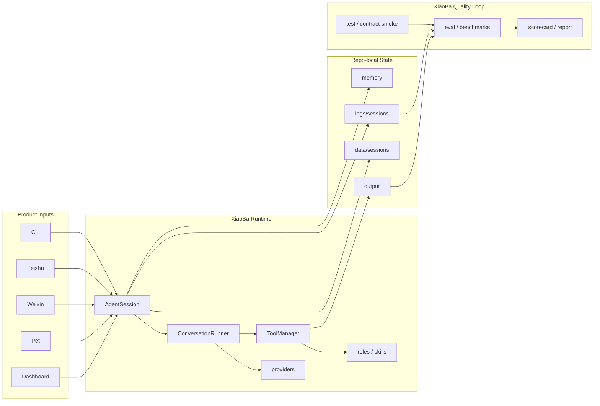
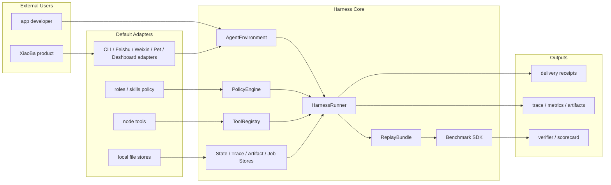

# Harness Extraction SPEC

状态：Draft
最后更新：2026-06-20
适用范围：XiaoBa 从产品型 IM-native agent runtime 向可复用 agent harness core 提取的差距、目标接口和验收边界。

本文是 `docs/agent-runtime/SPEC.md` 的支撑文档，不新增独立顶层架构模块。它回答一个具体问题：XiaoBa 已经有 harness core 的哪些能力，以及离“别人可以直接调用的通用框架型 harness”还差什么。

## Problem

XiaoBa 当前更像一个产品型 runtime：它围绕 CLI、Feishu、Weixin、Pet、Dashboard、roles、skills、logs 和 eval 形成了可运行闭环。这个闭环已经超过普通 bot wrapper，但它仍主要服务 XiaoBa 自己的 IM 同事产品。

通用 harness 的判断标准不同。外部开发者应该可以不理解 XiaoBa 的角色、飞书、桌宠或目录结构，只拿一套稳定 core，接入自己的 environment、tools、state store、policy 和 benchmark。

核心判断：

```text
Current: XiaoBa product runtime with harness core inside.
Target: reusable harness core with XiaoBa product built on top.
```

## Scope

In scope:

- Agent harness 的七层能力评估：输入、状态、执行、工具、策略、观测、评测。
- 当前实现与通用 harness 目标之间的差距。
- 未来可提取接口：`AgentEnvironment`、`StateStore`、`TraceStore`、`ArtifactStore`、`JobStore`、capability policy、replay bundle 和 public runner SDK。
- XiaoBa app 与 harness core 的目标分层。

Out of scope:

- 立即拆包或发布 npm SDK。
- 改写现有 CLI / Feishu / Weixin / Pet / Dashboard 入口。
- 把 XiaoBa 定位提前改成通用 agent framework。
- 将 role benchmark 或 product UX 需求塞进 runtime core。

## Current Architecture

当前架构已经具备 harness 雏形，但抽象仍围绕 XiaoBa 产品组织。入口是产品 surface，状态存储是 repo-local 文件结构，工具和权限受 XiaoBa role/skill 体系驱动，评测主要验证 XiaoBa runtime 与角色行为。



Current strengths:

- `ConversationRunner` 已经是真 agent loop，而不是一次性 prompt wrapper。
- `ToolManager` 已经有 base / role / surface 三层工具可见性、confirmed gate 和 canonical ToolResult。
- `SessionTurnLogger` 已经有 trace、tool result、state boundary、delivery evidence 和 runtime event。
- `eval` 已经有 hard verifier、soft judge、scorecard、benchmark bridge 和 gate。

Current limits:

- 输入层是 product surface，不是可替换 environment protocol。
- 状态层强绑定 `data/`、`logs/`、`memory/`、`output/`。
- 执行层缺 public SDK facade 和 durable job state machine。
- 工具层有 allow/deny/gate，但没有统一 capability grant model。
- 策略层和 XiaoBa roles/skills 绑定较深。
- 观测层内部证据强，对外 trace/replay bundle 规格不足。
- 评测层能评 XiaoBa，但不容易作为别人的 benchmark SDK。

## Target Architecture

目标不是把 XiaoBa 产品拆掉，而是让 XiaoBa 运行在一个更清晰的 harness core 上。XiaoBa 的 CLI、IM、Pet、Dashboard、roles 和 skills 成为默认 adapters / policies；core 暴露稳定接口给外部开发者。



Target rule:

- XiaoBa product can depend on harness core.
- Harness core must not depend on XiaoBa product surfaces.
- Product-specific roles, pets, IM semantics and dashboard UI stay outside core.

## Layer Gap Matrix

| 层 | 现在已有 | 主要差口 |
| --- | --- | --- |
| 输入层 | CLI / Feishu / Weixin / Pet / Dashboard | 缺通用 `Environment` 协议。现在是产品入口，不是别人能接 Slack、浏览器、客服系统、游戏环境的统一接口。 |
| 状态层 | session store、memory、logs、artifacts、trace | 缺可替换 `StateStore` / `TraceStore` / `ArtifactStore`。现在文件结构强绑定 XiaoBa repo。 |
| 执行层 | `AgentSession` + `ConversationRunner` loop | 缺公开 runner SDK、durable run/job state machine、跨进程恢复。当前 loop 强，但产品内聚。 |
| 工具层 | 文件、shell、grep、edit、send、subagent | 缺 capability security model。工具能用，但“谁被授权做什么副作用”还没抽成统一权限系统。 |
| 策略层 | roles、skills、tool visibility、confirm gate | 缺通用 policy engine。现在策略和 XiaoBa role/skill 体系绑定较深。 |
| 观测层 | session JSONL、runtime event、delivery evidence、本地 summary | 缺公开 trace spec + 可导出的 replay bundle。现在内部证据很强，对外标准化不够。 |
| 评测层 | eval runner、hard verifier、scorecard、BaseRuntime benchmark | 缺 hermetic replay 和 benchmark SDK。现在能评 XiaoBa，但别人不容易拿来评自己的 agent。 |

## Target Contracts

### AgentEnvironment

Environment 是输入、输出和外部状态的边界。Feishu、Pet、Dashboard、CLI 都应该是 `AgentEnvironment` adapter，而不是 core 的特殊分支。

```ts
interface AgentEnvironment {
  receive(): Promise<AgentInputEvent>;
  deliver(action: AgentAction): Promise<DeliveryReceipt>;
  snapshot(): Promise<EnvironmentSnapshot>;
  restore(snapshot: EnvironmentSnapshot): Promise<void>;
}
```

Minimum requirements:

- 输入事件必须带 stable event id、session key、actor、payload type 和 optional attachments。
- 输出 action 必须返回 delivery receipt，而不是只依赖副作用。
- snapshot / restore 必须支持 replay 和 crash recovery。

### Public Harness SDK

外部调用不应直接拼 `AgentSession`、`ToolManager` 和 `SkillManager`。目标入口应收敛为一个 facade：

```ts
const harness = createAgentHarness({
  model,
  environment,
  tools,
  stateStore,
  policy,
  evaluator,
});

await harness.run(event);
```

Minimum requirements:

- SDK 参数是接口，不是 XiaoBa 目录约定。
- 默认 adapters 可以使用 XiaoBa 当前实现。
- core 类型必须能独立于 Feishu/Pet/Dashboard import。

### Replaceable Stores

本地 JSONL 仍是默认实现，但 core 应面向接口：

```ts
interface StateStore {
  loadSession(sessionId: string): Promise<SessionState | null>;
  saveSession(sessionId: string, state: SessionState): Promise<void>;
}

interface TraceStore {
  appendTrace(trace: HarnessTrace): Promise<void>;
}

interface ArtifactStore {
  putArtifact(artifact: ArtifactBlob): Promise<ArtifactRef>;
}

interface JobStore {
  createJob(job: HarnessJob): Promise<JobRef>;
  updateJob(ref: JobRef, patch: Partial<HarnessJob>): Promise<void>;
}
```

Minimum requirements:

- 本地文件实现只是 default adapter。
- SQLite、Postgres、S3、Redis 或 browser storage 可以替换。
- trace refs、artifact refs 和 provider transcript refs 必须不泄露本机绝对路径。

### Capability Security

Tool allowlist 不等于 capability model。目标是把副作用权限显式化：

```ts
type Capability =
  | "fs.read"
  | "fs.write"
  | "shell.exec"
  | "network.fetch"
  | "message.send"
  | "file.upload"
  | "job.spawn";
```

Minimum requirements:

- 每个 tool 声明 required capabilities。
- 每个 environment / policy 授予 capabilities。
- 高风险 capability 支持 confirmation、budget、scope 和 audit。
- denied capability 必须进入 structured blocked evidence。

### Policy Engine

Roles 和 skills 可以继续存在，但 core policy 不应该只认识 XiaoBa role config。

Minimum requirements:

- policy 输入：actor、environment、active role/skill、capabilities、risk class、recent confirmation。
- policy 输出：visible tools、blocked tools、confirmation requirements、budget 和 stop condition。
- XiaoBa roles/skills 是默认 policy pack，不是唯一 policy 格式。

### Replay Bundle

通用 harness 需要 hermetic replay，而不只是跑当前 runtime smoke。

```text
replay-bundle/
  manifest.json
  initial-state.json
  input-events.jsonl
  model-responses.jsonl
  tool-fixtures/
  expected-actions.jsonl
  verifiers.json
  scorecard.json
```

Minimum requirements:

- 模型响应可 fixture 化。
- 工具输出可 fixture 化。
- 初始 workspace / artifacts 可声明。
- replay 不需要真实 IM credentials、provider API key 或用户私密路径。

## Extraction Milestones

1. H0：Document the gap：本文完成，作为提取路线的判断基线。
2. H1：Define interfaces：新增 `src/harness-core/types.ts` 或等价 package，先只放类型和 no-op adapters。
3. H2：Wrap current surfaces：把 CLI / Pet / Feishu / Dashboard 包成 `AgentEnvironment` adapters，不改用户行为。
4. H3：Store boundary：抽出 `StateStore`、`TraceStore`、`ArtifactStore`，本地文件作为默认实现。
5. H4：Durable jobs：把 subagent / background work 升级为 `JobStore` 驱动的可恢复状态机。
6. H5：Replay bundle：把 BaseRuntime 的 replay evidence 导出为 hermetic bundle，并提供 benchmark SDK。
7. H6：Package boundary：再考虑 `packages/harness-core`、`packages/xiaoba-runtime` 和 app 层拆分。

## Acceptance Criteria

XiaoBa 可以声称“有可复用 harness core”之前，至少满足：

- 外部 demo 能只 import public SDK，不 import Feishu/Pet/Dashboard 内部模块。
- 一个非 XiaoBa environment adapter 能完成 receive -> run -> deliver -> trace。
- 一个非本地文件的 store adapter 能通过最小 session restore 和 trace append 测试。
- 一个 tool 的 capability denial 能在 trace 和 scorecard 中被稳定验证。
- BaseRuntime 至少一个 case 能导出并复跑 hermetic replay bundle。
- README 能诚实区分 XiaoBa product runtime 和 extracted harness core。

## Risks / Open Questions

- 过早拆包会降低当前产品迭代速度。
- 过晚抽象会让 runtime 与 XiaoBa product 继续耦合，外部贡献者难以复用。
- Capability model 不能只做静态 allowlist，否则无法覆盖 message send、file upload、shell exec 等副作用。
- Replay bundle 若不能隔离 provider/network/credentials，就不能作为通用 harness 可信证据。

## Interaction With Existing Modules

- `docs/surface/SPEC.md`：未来 surface adapter 可以成为 `AgentEnvironment` 的默认实现。
- `docs/agent-runtime/SPEC.md`：继续拥有 current runtime loop、provider、tool 和 session lifecycle。
- `docs/roles-skills/SPEC.md`：XiaoBa roles/skills 是默认 policy pack，不是 harness core 的唯一策略格式。
- `docs/observability-evidence/SPEC.md`：trace、delivery evidence 和 artifact evidence 是 future replay bundle 的输入。
- `docs/evaluation/SPEC.md`：eval runner 和 benchmark bridge 是 future benchmark SDK 的来源。
