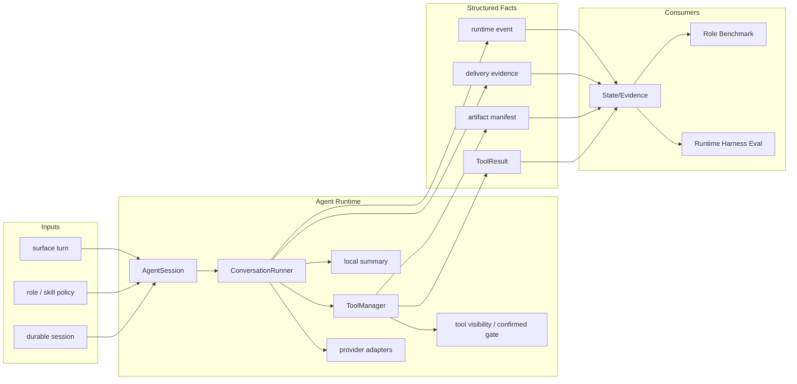

# Agent Runtime PLAN

状态：Active
最后更新：2026-06-25
Owner：Runtime maintainers

本文维护核心 agent harness runtime 的当前执行状态。架构边界见 `SPEC.md`。历史实现日志由 git 保存；本文只保留当前状态、下一步和近期有效验证。

## Current Status

Agent Runtime owns the live loop: session lifecycle, provider calls, prompt assembly, tool visibility, tool execution, retry/cancel semantics, explicit channel delivery, subagent dispatch and runtime-facing structured facts. `PromptManager` now expands prompt includes and provides the shared `prompts/surface.md` channel delivery prompt consumed by `AgentSession`. It produces evidence for State/Evidence and downstream evals, but it does not own role behavior benchmarks. `ToolExecutionContext.subAgentServiceFactory` gives deterministic replay a narrow way to inject scripted subagent services while production `spawn_subagent` keeps the real-service path.

Completed:

- `AgentSession` + `ConversationRunner` is the shared runtime path for CLI, surface and role sessions.
- `PromptManager` expands `{{include:...}}` prompt fragments and exposes the shared `prompts/surface.md` delivery prompt to `AgentSession`.
- Provider adapters cover OpenAI-compatible, Anthropic Messages and Ollama native chat/tool streaming.
- Tool visibility is layered as base / role / surface, with role skill-scoped visibility and confirmed-tool execution checks.
- `spawn_subagent` supports exactly one dispatch target: inherited-role `skill_name` or target-role `role_name`.
- Canonical ToolResult helper normalizes terminal status, error semantics, retryability, duration, blocked reason and compatibility fields.
- `ToolExecutionOutput` now carries explicit status/error_code/retryability facts, ToolManager / AgentToolExecutor use them before falling back to legacy prose classification, and core file/search/shell/delivery plus subagent/skill control tools now return those facts through shared builders.
- Repeated non-retryable tool failures and provider failures converge to structured blocked evidence.
- Channel final text is hidden from users by default; explicit `send_text` / `send_file` is the normal channel delivery path.
- Channel fallback final replies remain available only through opt-in `deliveryFallbackFinalReply` and then write synthetic `send_text` ToolResults with delivery evidence.
- Maintained role tools can expose explicit `Tool.getArtifactManifest()` evidence through the runtime tool boundary.
- Observability is local-only in the current implementation; the runtime does not start an external exporter.

Partial:

- Some compatibility paths still infer artifact evidence for legacy/ad hoc role output.
- Provider transcript, working trace and durable session separation is established but still guarded by eval contracts while historical data remains mixed.
- Production-network provider failover is represented by deterministic contracts and opt-in readiness evidence; full live orchestration remains future work.
- Broader role/surface coverage for confirmed gates and external delivery is still selective.
- Harness extraction has a documented gap analysis in `HARNESS-EXTRACTION-SPEC.md`: XiaoBa is currently a product runtime with a harness core inside, not yet a public framework-style harness SDK.

## Milestones

1. Runtime module SPEC/PLAN baseline: completed.
2. Shared `AgentSession` + `ConversationRunner` loop: completed.
3. Layered ToolManager and surface delivery tools: completed.
4. Provider adapter baseline: completed for OpenAI-compatible, Anthropic and Ollama.
5. Canonical ToolResult boundary: completed for maintained runtime paths, including shared `ToolExecutionOutput` builders and structured status/error_code input from core tools.
6. Retry/cancel/blocked evidence: completed for tool failures and provider failures; production-network orchestration remains future work.
7. State split evidence: completed for live `state_boundary` refs and digest-only provider transcript refs.
8. Role skill-scoped visibility and confirmed-tool gate: completed v2; broader release fixtures remain follow-up.
9. Local observability summary: completed for current runtime paths; external exporter mirror is not part of the implementation.

## Next Steps

- Keep maintained role tool artifact declarations synchronized with runtime registry changes.
- Split remaining central eval/schema checks only when they map to a clear runtime source boundary.
- Add small contract cases for broader skill-scoped visibility, confirmed-tool payload binding and small-model tool hit-rate regressions.
- Keep provider-network readiness opt-in; do not make credentialed provider replay part of default runtime harness gates.
- Expand delivery evidence to production-network surfaces only after stable external receipts exist.
- Preserve fallback inference only for legacy structured facts; channel user-visible output should be explicit `send_text` / `send_file`.
- Continue migrating remaining legacy role/ad hoc tools so prose-prefix classification can be reduced to compatibility-only coverage.
- Use `HARNESS-EXTRACTION-SPEC.md` before claiming general framework status; future extraction should start with `AgentEnvironment`, replaceable stores, capability policy and replay bundle contracts.

## Owners

- Session lifecycle：`src/core/agent-session.ts`
- Agent loop：`src/core/conversation-runner.ts`
- Provider adapters：`src/providers/**`
- Tool boundary：`src/tools/**`, `src/types/tool.ts`
- Sub-agent runtime：`src/core/sub-agent-*`
- Runtime observability summary：`src/observability/**`

## Acceptance Criteria

- Every assistant tool call has a matching tool result before the next provider request.
- Tool failures, cancels, retries, blocked states and provider failures become structured runtime facts.
- Provider transcript, working trace and durable session are documented and separately auditable.
- Confirmed tools are hidden without recent positive confirmation and blocked when payload anchors do not match the confirmation/proposal.
- Opt-in channel fallback replies produce delivery evidence instead of relying only on side effects; default channel final text remains hidden from users.
- Observability remains local-first; external exporter failure cannot exist in the current runtime path.
- Deterministic contract smoke verifies runtime contracts; role behavior benchmarks must re-enter only as live agent eval.

## Verification Log

- 2026-06-25：Feishu/channel skill command result semantics tightened at the AgentSession boundary. `CommandResult` and `HandleMessageResult` now carry `finalResponseVisible`, so channel-backed slash skills can keep normal final assistant text hidden after explicit `send_text` delivery while still direct-sending provider/busy/error text that is explicitly visible to the user. Verification：`node --test -r tsx test/feishu-engineer-runtime.test.ts test/agent-session-skill-integration.test.ts test/pet-channel.test.ts test/dashboard-observability-api.test.ts`（24/24）；`npm test`（353/353）；`npm run test:contract-smoke`（6/6 items，23/23 cases）；`npm run build`。
- 2026-06-24：PromptManager now expands `{{include:...}}` fragments and exposes `prompts/surface.md` as the shared channel delivery prompt used by `AgentSession` and RouterCat. Verification：`node --test -r tsx test/prompt-manager-runtime-info.test.ts test/agent-session-log.test.ts test/router-cat-role.test.ts`（15/15）；`npm run build`；`git diff --check`。
- 2026-06-23：Channel delivery visibility semantics fixed at the AgentSession boundary. Successful `send_text` / `send_file` delivery evidence now makes `HandleMessageResult.visibleToUser` true even when final assistant text is suppressed; `finalResponseVisible` remains the separate final-text fallback flag. Verification：focused AgentSession / observability / Pet channel tests passed；`npm run build`。
- 2026-06-23：Structured tool execution status no longer depends on prose prefixes for live `ToolExecutionOutput`. `ToolExecutionOutput` now exposes `status/error_code/blocked_reason/retryable/retry_budget` facts; shared builders cover success/failure/blocked/timeout output; ToolManager and AgentToolExecutor prefer those fields and only classify text for legacy outputs. Core read/write/edit/shell/grep/glob/send_text/send_file and subagent/skill control tools now return structured execution facts. Verification：`node --test -r tsx test/tool-result.test.ts test/tool-manager-rate-limit.test.ts test/grep-tool.test.ts test/agent-tool-executor.test.ts test/conversation-runner-rate-limit.test.ts test/conversation-runner-harness.test.ts test/agent-session-log.test.ts`（60/60）；`node --test -r tsx test/skill-manager-runtime.test.ts test/sub-agent-status.test.ts test/tool-manager-roles.test.ts`（30/30）；`npm run build`; `git diff --check`.
- 2026-06-18：Added deterministic subagent service injection through `ToolExecutionContext.subAgentServiceFactory` so BaseRuntime Pet replay can verify background subagent completion without production-network model calls. Verification：`npm run build`; `npm run eval:base-runtime`（6/6 benchmark cases，6/6 eval cases）。
- 2026-06-20：Added `HARNESS-EXTRACTION-SPEC.md` as a documentation-only gap analysis for turning the product runtime into a reusable harness core. Verification：documentation review; no runtime behavior changed.
- 2026-06-10：Runtime/role eval slimming verified the current runtime harness boundary. Verification：`node --test -r tsx test/dashboard-observability-api.test.ts test/eval-schema-validation.test.ts` (65/65); `npm run test:contract-smoke` (10/10 items, 34/34 cases); `npm run eval:role-benchmarks` (10/10 items, 88/88 cases); `npm run check:eval-assets` (4769/4769); `npm run build`; `git diff --check`.
- 2026-06-17：Channel final text fallback changed to default-off opt-in policy. Verification：`npm run build`; `node --test -r tsx test/conversation-runner-harness.test.ts test/agent-session-log.test.ts`.
- 2026-06-07：`spawn_subagent` either/or role/skill dispatch verified. Verification：`node --test -r tsx test/skill-manager-runtime.test.ts test/sub-agent-status.test.ts test/tool-manager-roles.test.ts`; `npm run build`.

## Risks / Open Questions

- Provider-specific transcript semantics remain subtle and should stay covered by adapter-specific tests.
- Payload-bound confirmation uses conservative argument-anchor matching; high-risk side effects may need explicit draft/confirmation tokens later.
- Central eval/schema validation is still large and should keep shrinking behind focused source-boundary helpers.

## Status Maintenance Rules

- Update this plan when `AgentSession`, `ConversationRunner`, provider adapters, tool result semantics or runtime observability boundaries change.
- Update `SPEC.md` when runtime architecture or data contracts change.
- Do not move role behavior benchmark ownership into runtime harness docs.
