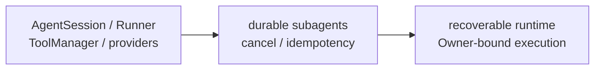

# Agent Runtime PLAN

状态：Active
最后更新：2026-07-13
Owner：Runtime maintainers

## Current Status

- `AgentSession` + `ConversationRunner` is the single model-driven loop for Base and all roles.
- ToolManager enforces base / role / surface layers, role visibility and confirmed-tool gates.
- Tool results, delivery evidence, artifact manifests, provider failures and context compaction have structured runtime facts.
- OpenAI-compatible、Anthropic and Ollama adapters share normalized message/tool boundaries.
- Subagent role dispatch works through shared sessions; in-flight state remains mainly memory-backed.
- BrowserCat/GuiCat drivers are deterministic adapters and do not run a second Agent/Chat/MCP loop.
- XiaoBa is a product runtime with a reusable harness core, not yet a public general-purpose Harness SDK.

## Milestones

1. Shared AgentSession/ConversationRunner loop：completed。
2. Layered ToolManager and canonical ToolResult：completed for maintained paths。
3. Provider adapter normalization：completed for current adapters。
4. Structured failure/delivery/artifact/compaction evidence：completed for current paths。
5. Role-only subagent dispatch：completed。
6. Durable in-flight subagent recovery and action receipts：partial/not started。
7. Provider/Shell end-to-end cancellation：partial。
8. Public Harness SDK extraction：not a current product milestone。

## Next Steps

- Persist existing parent/child status, pending confirmations, resume cursor and action receipts.
- Carry authenticated principal and Owner authority through ToolExecutionContext.
- Complete AbortSignal propagation through providers, child processes and retry waits.
- Reduce remaining prose-based legacy ToolResult/artifact inference.
- Package and release-verify BrowserCat/GuiCat adapters without adding driver-side model loops.

## Owners

- Session lifecycle：`src/core/agent-session.ts`
- Agent loop：`src/core/conversation-runner.ts`
- Subagents：`src/core/sub-agent-*`
- Providers：`src/providers/**`
- Tools and execution types：`src/tools/**`, `src/types/**`

## Acceptance Criteria

- Every assistant tool call has a matching terminal tool result.
- Failure, timeout, cancel and blocked states are structured and auditable.
- Provider transcript, working trace and durable session remain distinct boundaries.
- Confirmed tools are hidden or blocked unless confirmation matches actor and payload.
- Base and all seven roles use the same runtime loop.
- External drivers are fixed, bounded capability adapters with version, timeout and trust evidence.
- Runtime architecture changes update this PLAN and [`SPEC.md`](SPEC.md) only.

## Risks / Open Questions

- Process crashes can still lose in-flight child state.
- A successful external side effect followed by a lost response can still be repeated.
- Full provider/Shell cancellation is incomplete.
- Owner identity is not yet a first-class runtime authorization fact.
