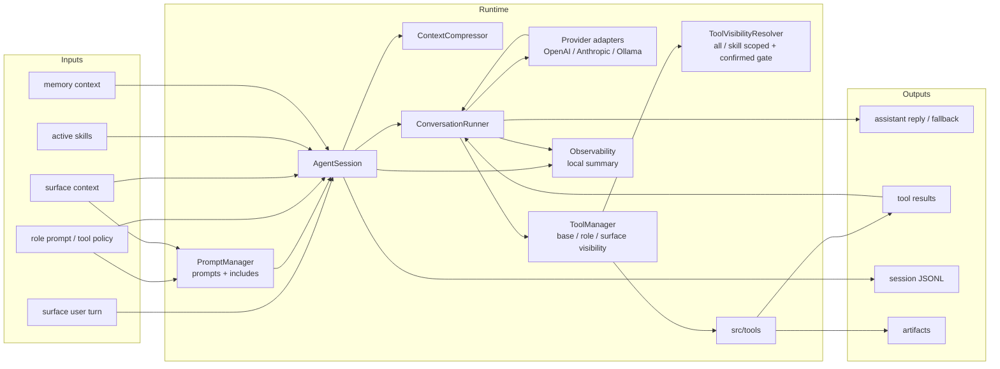
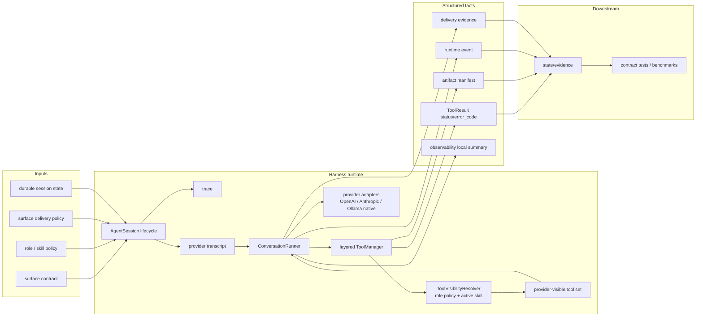

# Agent Runtime SPEC

状态：Active
最后更新：2026-06-24
适用范围：XiaoBa 的核心 agent harness runtime，包括 `src/core`、`src/providers`、`src/tools`、`src/types/tool.ts` 和 runtime-facing harness docs。

本文是五大顶层模块之一的 Agent Runtime spec。它定义 agent loop、provider transcript、tool boundary 和 session lifecycle；入口、角色策略、观测证据和评测分别由各自模块 spec 维护。

## Problem

Agent Runtime 把用户输入、角色策略、技能、工具、provider 调用和运行证据组织成一个可恢复、可观测、可评测的状态机。模型不是 runtime；runtime 必须保证 transcript 合法、tool 调用闭环、失败可观测、上下文压缩不丢当前任务。一次用户请求到本次 `ConversationRunner` while loop 截止叫 `trace`；while loop 的内部推进才叫 `turn`。`episode_id` 只作为历史兼容 alias 保留。

## Scope

In scope:

- `AgentSession` 生命周期、busy/interrupt、restore、context compression 和 memory cleanup。
- `ConversationRunner` 的 model call -> tool calls -> tool results -> next model call 循环。
- Provider adapters：`src/providers/**`。
- Tool boundary：`src/tools/**`、tool layer、tool schema、参数解析、执行结果、错误码和 retryable 语义。
- Sub-agent/session runtime：`src/core/sub-agent-*`。
- Runtime 类型契约：`src/types/**` 中与 session/tool/provider 相关的类型。

Out of scope:

- 平台入口协议和用户可见交付，属于 `docs/surface/SPEC.md`。
- Role/skill policy，属于 `docs/roles-skills/SPEC.md`。
- 日志、artifact 和 trace projection 的持久化证据边界，属于 `docs/observability-evidence/SPEC.md` 和 `docs/observability-evidence/state-evidence/SPEC.md`。
- Deterministic contract smoke belongs to `test/SPEC.md`; replay/verifier/scorecard belong to `eval/SPEC.md` and `eval/benchmarks/SPEC.md`。

## Current Architecture

当前 runtime 已经以 `AgentSession` 和 `ConversationRunner` 为主线，入口和角色最终都进入同一套 runner。`PromptManager` 负责读取 role/base prompts、展开 `{{include:...}}` prompt fragments，并通过 `prompts/surface.md` 向 `AgentSession` 提供共享 channel delivery prompt。ToolManager 支持 base / role / surface 三层过滤，并已增加 role 声明式 `skill_scoped` 可见性 resolver 与 confirmed tool gate；confirmed gate 现在分成 provider-visible 的无否定显式确认检查和 execution-time payload binding 检查，确认类工具即使被硬调也必须让 tool args 与最近确认 turn 或上一条 assistant 提案形成可验证匹配。ConversationRunner 每次 provider request 前都会用当前 active skill 重新解析 provider-visible tools；channel surface 默认只有显式 `send_text` / `send_file` 会产生用户可见输出，final text 只写入 provider/session trace，不自动外发。`delivery_fallback_final_reply` 保留为显式 opt-in 策略，开启时才记录 synthetic `send_text` ToolResult、`delivery_evidence` 和可选 external receipt。Tool result 现在通过 `src/tools/tool-result.ts` 的 canonical builder/canonicalizer 统一收口，覆盖 ToolManager、AgentToolExecutor、SubAgent forbidden results 和 ConversationRunner retry/cancel/fallback delivery results，保证 status/error_code/retryable/duration evidence v1 不再由各 executor 分散拼装；live `ToolExecutionOutput` 也可显式声明 `status/error_code/blocked_reason/retryable/retry_budget`，ToolManager 和 AgentToolExecutor 会优先使用这些结构化字段，只有 legacy string output 才进入中文/英文前缀分类兼容路径。core tools 以及 ResearcherCat / InspectorCat / EngineerCat / ReviewerCat / UserCat maintained role tools 已能产出显式 artifact evidence，AgentToolExecutor 也会保留 `Tool.getArtifactManifest()` 的 tool-owned evidence；structured outbound delivery evidence 已有 `delivery_evidence_contract` v1 hard verifier，覆盖 deterministic `send_text` / `send_file` 正负例、opt-in fallback final reply evidence 以及 production entrypoint Surface Runtime / Surface Runtime File replay；Surface Full deterministic gate 现在还固定 message/file/upload/download 的 external delivery receipt shape；`session-log-v2` provider transcript boundary 现在还有 schema semantic gate，拒绝把 raw messages/tool payload 放进 provider transcript ref；`src/observability` 现在只维护本地 summary、local metric/span helpers 和 trace continuity，不启动外部观测 exporter，也不在 runtime 侧做本地 trace/log 清洗；provider/durable/working trace 的严格分离仍在推进中。

Current addendum：live `AgentSession` provider/model failure path now emits a structured `runtime_event` with `event_type=provider_error` before writing the fallback turn. The event records provider error facts (`provider`、`model`、`endpoint`、`status`、`error_code`、`retryable`、`message`) plus surface, token counters and session-local provider failure budget facts (`status`、`retry_count`、`retry_budget`、`retry_budget_exhausted`、`blocked_reason`、`provider_failure_budget`). Consecutive same-fingerprint retryable provider failures converge to `status=blocked`; non-retryable provider failures are blocked immediately.

Current addendum：the same live provider/model failure path now marks the fallback turn's provider transcript boundary as degraded without retaining raw provider transcript payload. `AgentSession` emits `state_boundary.provider_transcript.ref=provider-transcripts/sha256:<digest>` for all turns; provider failure turns add `status=degraded|blocked`、`degraded=true`、`degradation_reason/error_code`、`fallback_chain`、`blocked_reason` and explicit false raw payload flags. This means local live runtime evidence now matches the Contract Sentinel provider transcript degradation shape, while production-network cross-provider orchestration remains future work.

Current addendum：`scripts/check-provider-network-readiness.ts` adds an opt-in live provider-network readiness runner around the existing `AgentSession` path. By default the runner returns structured `blocked` environment evidence; with `--enable` or `XIAOBA_PROVIDER_NETWORK_REPLAY=true` and explicit provider config, it exercises a live provider call inside an isolated workspace and checks for `provider_error` runtime_event evidence plus degraded provider transcript boundary facts. This keeps the production user path simple while creating a concrete bridge toward production-network degradation replay.

Current addendum：Contract Boundary now also fixes deterministic cross-adapter failover sequence evidence. `provider_failover_sequence` verifies ordered `provider_error` events across OpenAI-compatible、Anthropic and Ollama attempts, including endpoint/error_code order, retry budget facts, monotonic timestamps and terminal blocked reason. This is a release contract for evidence shape; live production-network failover orchestration remains target architecture work.

## Target Architecture

目标是把 provider transcript、trace 和 durable session 分清楚，并把 tool result、delivery evidence、runtime failure 和 retry budget 升级为结构化事实。Provider adapter 必须作为可扩展边界存在：OpenAI-compatible、Anthropic Messages 和 Ollama native `/api/chat` 都要统一归一到 `ChatResponse` / `Message` / `ToolDefinition` 合同，而不是把 provider-specific transcript 泄漏到 runner。工具可见性必须支持 role 声明式策略：默认角色继续看到三层 ToolManager 过滤后的工具；显式配置的弱模型/窄动作角色可以通过 active skill 激活 scoped toolsets，并由 runtime 强制执行确认类工具 gate。

## Core Contracts

- 每个 assistant tool call 必须有 matching tool result，不能把 dangling tool call 送入下一次 provider request。
- Tool call 必须进入 success、failure、timeout、cancelled 或 blocked 之一，失败要有可观测 `status/error_code`；runner interrupt 时未执行的 pending tool calls 必须生成 `cancelled` ToolResult，而不是从 evidence 中消失。
- External observability export is not part of the current runtime implementation. Runtime evidence stays local-first in session JSONL, local summary, ToolResult, runtime_event, delivery evidence and artifact manifest.
- Release-grade runtime evidence can use `tool_result_contract` to require every tool call fact to carry a canonical terminal `status`, require `error_code` on non-success states, require `blocked_reason` for blocked calls, and check `ok` / retry-budget consistency. Curated `session-log-v2` cases that declare `tool_transcript_completeness` should keep this verifier in their owning `test/contract-smoke` or benchmark source, so promoted session fixtures cannot rely on transcript text alone. This is stricter than `runtime_observability`, which remains a compatibility verifier for failure visibility.
- Provider/model failures that escape the provider call path must become structured runtime evidence: live `AgentSession` writes a `runtime_event:event_type=provider_error` with stable `provider_error.error_code`、`retryable` and session-local budget facts before returning the user-visible fallback. Consecutive same-fingerprint retryable failures must record retry-budget exhaustion and blocked reason; non-retryable provider failures must record immediate blocked evidence. Deterministic failover fixtures must prove provider/endpoint/error_code order and terminal blocked reason until live production-network failover orchestration is stable.
- The fallback turn for a provider/model failure must also carry degraded provider transcript state-boundary evidence. The provider transcript boundary stays digest-ref-only and must include reason/status/fallback-chain/blocked/raw-payload storage facts, so downstream State/Evidence gates can audit degradation without requiring raw provider request or response retention.
- Generated eval suite scorecards must retain the source suite hard verifier set. Runtime owns the structured ToolResult/delivery/artifact facts; scorecard regeneration or focused tests must confirm every generated case keeps verifier results for all hard verifiers declared by the source case, preventing stale release scorecards from bypassing newly added runtime contracts.
- Top-level `error_code` describes tool execution failure only. If a successful tool result contains domain-level blocked/path/validation evidence, that evidence must stay in the result payload or artifacts; `SessionTurnLogger` must not hoist it into a success ToolResult's top-level `error_code`.
- ToolManager 负责三层工具可见性：base tool 受 role 的 `inheritBaseTools`、allowlist、denylist 控制；role tool 由 role registry 注入；surface tool 只在显式 channel-backed surface 上可见。
- `spawn_subagent` 是 role-aware sub-agent dispatch boundary：`role_name` 和 `skill_name` 二选一。只传 `skill_name` 时，子智能体继承父会话当前 role 并预激活该 role 可见 skill；只传 `role_name` 时，有效 role 会在启动前 canonicalize，并用于加载 role prompt、role-local skills 和 role-specific tools，子智能体再通过 `skill` 工具自行选择该 role 的 skill。
- `ToolExecutionContext.subAgentServiceFactory` 是 deterministic eval / runtime harness 的服务注入点，用于给后台子智能体提供 scripted AIService / skill manager；production `spawn_subagent` 不依赖该字段，仍默认创建真实 runtime services。
- `role_name=base/default/none` 不构成 role-only dispatch；调用方必须改为只传 `skill_name`。子智能体内部仍隐藏主会话控制面和外发工具，例如 `spawn_subagent`、`check_subagent`、`stop_subagent`、`resume_subagent`、`send_text` 和 `send_file`。`skill` 工具只在 role-only dispatch 中开放，用于让目标 role 自选 skill。
- `src/tools/tool-result.ts` 是 runtime ToolResult canonicalization boundary。ToolManager、AgentToolExecutor、SubAgent forbidden path 和 ConversationRunner retry/cancel path 必须通过 canonical builder/canonicalizer，保证 `status` 必填、`ok` 与 status 一致、non-success 必有 `error_code`、blocked 必有 `blocked_reason`，并且 success 结果不能携带顶层 execution `error_code`。
- `ToolExecutionOutput` 是工具实现返回结构化执行事实的 live 协议。新工具必须通过 `toolSuccess` / `toolFailure` / `toolBlocked` / `toolTimeout` 等共享 builder 返回 `status`、non-success `error_code`、可选 `blocked_reason` / `retryable` / retry budget facts；`toolContent` 只承载给模型看的 payload，不能作为执行状态的唯一来源。字符串前缀分类只保留给 legacy string output 和未迁移工具，并在代码中命名为 legacy path。
- ToolManager 负责把工具执行结果归一为结构化 ToolResult；core file/search/shell/delivery tools 和 subagent/skill control tools 使用显式语义产出 status/error_code，file/delivery tools 还产出 artifact/delivery evidence 和可选 `external_delivery_receipts`；maintained role tools 可通过 `Tool.getArtifactManifest()` 产出 tool-owned `artifact_manifest`，旧 role-layer 输出才从明确的 JSON / `key=value` artifact 字段保守推断 `action=captured` 的 fallback manifest。
- Maintained role tool artifact semantics belong to runtime/test ownership; they must not be stored under `eval/`, which is live agent eval only.
- Successful outbound delivery tools and opt-in channel fallback final replies must expose structured `delivery_evidence`; deterministic eval uses `delivery_evidence_contract` to require text/file delivery type, status, timestamp, preview/name/path evidence and sent file manifest or runtime file artifact evidence instead of accepting prose-only delivery claims. Scripted replay may synthesize those facts from stable `send_text` / `send_file` arguments and results when a suite omits explicit delivery evidence; surface runtime replay may synthesize them from production Feishu sender callbacks and Dashboard/Pet SSE delivery events.
- ToolResult/session logs and surface runtime replay may additionally carry `external_delivery_receipts` for platform-facing acknowledgements. These receipts capture message/file/upload/download ack ids, status, timestamps, platform message/file ids and evidence refs; Feishu runtime file smoke now requires message/upload/file receipts with platform ids, while Dashboard/Pet local SSE receipts use local delivery ids without pretending to be third-party platform ids.
- ToolManager 还负责 role 声明式二段式可见性：`toolVisibility.mode:"all"` 保持兼容；`toolVisibility.mode:"skill_scoped"` 时，未激活 skill 只暴露 `defaultTools`，激活 skill 后只暴露对应 `skillToolsets` / `skillToolsetAliases` 和仍然允许的 surface tools。
- `skill_scoped` role 的 active skill/toolset 是 session-local domain state，可跨用户确认 turn 保留，直到新 skill 激活、会话清空或进程恢复边界；provider prompt 中的 skill system message 仍按 runner transcript 规则管理，不能成为外部持久权限。
- 确认类工具 gate 必须由 runtime 强制执行。配置为 `confirmedToolGate.tools` 的工具在缺少最近、无否定的显式用户确认时不得进入 provider-visible tool set；即使进入可见集或被硬调，执行前也必须验证 tool args 与最近确认 turn 或上一条 assistant 提案存在 payload-level anchor overlap，匹配失败必须返回 `blocked` ToolResult 和 `TOOL_CONFIRMATION_PAYLOAD_MISMATCH`。
- `ConversationRunner` 发给 provider 的工具定义必须使用当前 `ToolExecutionContext` 过滤后的 visible tool set；隐藏工具被硬调时必须返回 forbidden tool result，而不是执行。
- `ConversationRunner` 负责 transcript 合法性，不保存长期 session，也不决定角色配置。
- `AgentSession` 负责 session lifecycle、role/skill 注入、context compression 和 state cleanup，不直接实现平台 API。
- Provider-visible transcript、trace、durable session 和 visible history 可以内容不同，但必须可关联且不能互相替代；live `AgentSession` trace logs expose `state_boundary` refs for durable session, legacy `working_trace` evidence and provider transcript digest reference, and release-grade state evidence 可用 `state_boundary_contract` + `provider_transcript_normalization` 证明 provider transcript 只是 normalized `sha256` reference，不是 raw messages/tool payloads 或普通路径 ref。Degraded provider transcript evidence must additionally carry structured `degradation_reason` / terminal `status`, `fallback_chain`, `blocked_reason` and explicit false raw-payload storage flags, so provider failures can be audited without raw transcript retention.
- Provider adapter 负责把各自的消息、tool call、usage 和 streaming 协议归一为 runtime 合同；Ollama native adapter 使用 `/api/chat`、NDJSON streaming、默认 `think:false`、`keep_alive`、`num_ctx` 和可选 API key，以支持本地小模型。
- Retry 必须有上限；重复失败后应改变策略或报告 blocked reason。显式 `retryable` 的 ToolResult retry exhausted 后必须进入 `blocked` 终态并记录 `retry_count` / `retry_budget` / `retry_budget_exhausted`；同一 run 内重复出现同名、同参、同错误的不可重试 ToolResult，必须在 bounded failure budget 后由 `ConversationRunner` 收束为 `blocked` ToolResult，并记录 prior failure count、budget exhaustion 和 `blocked_reason`；interrupt/cancel 必须进入 `cancelled` 终态且不可重试。

## Data Contracts

Runtime 需要稳定维护这些结构化事实：

- `surface`、`sessionKey`、role、active skills 和 budget。
- tool layer、visible tool set、role base-tool inheritance policy 和 surface delivery context。
- tool visibility mode、active skill、visible tool names、hidden tool count、confirmed tool gate decision。
- provider request/response 的 token 和 model metadata；debug dump 只能保留结构、长度、sha256 摘要和非敏感元数据，不能持久化 raw prompt/tool arguments/response payload。
- tool call id、tool name、arguments summary、status、error_code、retryable、duration_ms、blocked_reason、retry_count、retry_budget、retry_budget_exhausted。
- ToolExecutionOutput 中的显式 status/error_code/retryable facts，及 legacy string classification 是否只作为兼容兜底。
- artifact manifest 或 delivery evidence，包括 outbound text/file delivery status。
- delivery evidence facts should include delivery type, status, timestamp, optional surface/channel id, bounded text preview, file name/path and delivery error code where applicable.
- role-local artifact manifest should be tool-owned when the role tool knows creation/update semantics; fallback inference must ignore operational paths such as cwd and ids and mark inferred entries as compatibility evidence.
- maintained role tool artifact contract entries must state whether `artifact_manifest` is required or not applicable, so role registry changes cannot silently fall back to prose/log inference.
- runtime event，例如 timeout、interrupt、context compression、fallback delivery、provider_error，包括 provider failure budget / blocked evidence。
- optional observability attributes for session/model/tool/provider/delivery/eval facts; explicitly recorded previews remain local raw evidence.

## Interaction With Other Modules

- 从 `docs/surface/SPEC.md` 接收规范化 user turn 和 callbacks。
- 从 `docs/roles-skills/SPEC.md` 接收 role prompt、role-scoped tools 和 skill policy。
- 向 `docs/observability-evidence/SPEC.md` / `docs/observability-evidence/state-evidence/SPEC.md` 输出 session logs、runtime events、artifact evidence、trace projection 和 durable state。
- 由 `test/contract-smoke` 的 deterministic contract smoke 和 `eval/benchmarks/BaseRuntime` 的 release-blocking runtime benchmark cases 分层验证 transcript completeness、failure observability、delivery evidence 和 JSONL compatibility。
