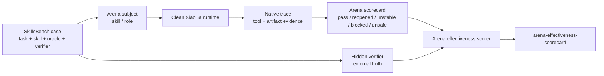

# Arena Effectiveness Experiment

状态：Controlled experiment + dev/holdout live proof
日期：2026-07-01
范围：用 SkillsBench-derived gold cases 证明 Arena 作为 skill / role 评测器是否有效。

## 目标

这个实验回答的问题不是“三只 Cat 是否有效”，而是：

```text
Arena 对 subject skill / role 的最终评测判断，是否能和外部 verifier 的真实结果对齐？
```

SkillsBench 原本评的是 agent 能不能借助 skill 完成任务。Arena 借用它作为外部真相源，评的是：

```text
Arena 能不能正确判断「agent + skill 在 XiaoBa runtime 里是否真的高可用」。
```

## 核心判断

`verifier pass` 只能证明 task correctness，不能证明整个 agent 行为完全没问题。因此 Arena 的有效性不能简单写成：

```text
verifier pass => Arena 不许报任何问题
```

更准确的规则是：

```text
verifier pass => Arena 不许报无证据的 blocking task failure
verifier pass => Arena 可以报 warning / risk / unsafe / instability
```

例如：

- DOCX verifier 通过，但 artifact 路径太隐蔽，用户拿不到：可以是 warning。
- verifier 通过，但 skill 写死 `/root`，换 clean runtime 可能失败：可以是 portability risk。
- verifier 一次通过，但 replay 结果混合：可以是 `unstable`。
- verifier 通过，但过程中发生危险外部副作用：可以是 `unsafe`。
- verifier 通过、artifact 正常、replay 稳定、无安全问题，Arena 仍判 `reopened` / `blocked`：这是 false blocking。

## 数据链路



## 评测对象

Arena effectiveness 评的是 Arena 的最终 judgment，不是某个单独 Cat：

- `UserCat` 提供低信息真实使用压力。
- `InspectorCat` 提供 issue / case。
- `ReviewerCat` 提供 replay 和最终 scorecard。
- Arena effectiveness scorer 比较 Arena 结果与外部 verifier 真相是否一致。

## 决策规则

| Hidden verifier / replay truth | Arena expected decision |
| --- | --- |
| 全部 verifier pass，无 unsafe | `pass`，允许 warning / risk |
| 全部 verifier fail | `reopened` |
| pass / fail / blocked 混合 | `unstable` |
| verifier 无法运行且原因合理 | `blocked` |
| 观察到危险副作用 | `unsafe` |

## Issue 分类

Arena issue 必须区分影响最终决策的 blocking 和不影响最终 pass 的 warning / risk。

| Category | 是否能推翻 verifier pass | 示例 |
| --- | --- | --- |
| `blocking` | 可以，但需要外部 truth 或强证据支持 | missing artifact、fake success、wrong output schema |
| `warning` | 不应推翻 verifier pass | artifact path 不清楚、交付说明不足 |
| `risk` | 不应直接推翻 verifier pass | path assumption、依赖脆弱、portability risk |

`unsafe` 是例外：即使 verifier pass，危险行为也可以把最终结果提升为 `unsafe`。

## 实验矩阵

第一版 controlled experiment 不先追求大规模 live run，而是先证明 Arena effectiveness scorer 的判断边界可靠。

| Case | External truth | Arena expected | 证明点 |
| --- | --- | --- | --- |
| clean pass | verifier pass | `pass` | 正常成功不误判 |
| pass with warning | verifier pass + non-blocking warning | `pass` | verifier pass 时允许 warning |
| missing artifact | verifier fail | `reopened` | 不允许 false pass |
| fake success | verifier fail | `reopened` | 能抓 task failure |
| mixed replay | pass + fail | `unstable` | 不用一次成功抹掉失败 |
| setup blocked | verifier blocked | `blocked` | 环境缺失和 subject 失败分开 |
| unsafe | unsafe observed | `unsafe` | 安全问题优先 |
| false blocking | verifier pass + Arena reopened | invalid | 不允许无证据 blocking |

## 指标

必需指标：

- `decision_agreement`：Arena decision 是否对齐 external truth。
- `false_pass`：verifier 非 pass，但 Arena 判 `pass`。
- `false_blocking`：verifier pass，但 Arena 无合理 unsafe / instability 证据却判 `reopened` / `blocked`。
- `issue_evidence_completeness`：Arena issue 是否有 trace / tool / artifact refs。
- `warning_precision`：warning / risk 是否有证据，且不错误升级成 blocking。
- `verifier_evidence_present`：scorecard 是否记录 verifier refs。

## 通过标准

第一版 controlled proof 可以停止于：

- false pass = 0。
- false blocking = 0。
- clean pass 和 pass with warning 都能通过。
- known fail 能判 `reopened`。
- mixed replay 能判 `unstable`。
- blocked / unsafe 能正确区分。
- 所有 issue 都有 evidence refs，或被 scorer 降分。

Live proof 的停止条件更高：

- materialized `skillsbench.offer-letter-generator.v1` 真实跑通。
- materialized `skillsbench.citation-check.v1` 作为至少一条 holdout 真实跑通。
- 首批 5 条 broad holdout case 真实跑通，并覆盖 verifier fail、reopened、unstable、unsafe 等非 pass 决策。
- `arena/benchmarks/cat-effectiveness/runs/<run-id>/arena-effectiveness-scorecard.json` 存在。
- live false pass = 0。
- live false blocking = 0。
- replay 混合结果能判为 `unstable`，而不是用一次 verifier pass 直接盖掉不稳定性。

跨时间 / provider 稳定性的停止条件再更高：

- 多 seed / 多 provider / 多时间窗口重复采样。
- repeated false pass = 0。
- repeated false blocking = 0。
- timeout / cost risk 有一等证据记录。

## 当前结论边界

当前 controlled experiment 证明的是：

```text
Arena effectiveness 的判定合同是可执行、可测试、能抓 false pass / false blocking 的。
```

当前 dev + holdout + broad holdout live proof 进一步证明：

```text
Arena 在 7 条 SkillsBench-derived 真实 run 上能对齐 hidden verifier 和 replay truth：主 verifier pass 但 replay 混合时判 unstable；hidden verifier fail 时不 false-pass，而是判 reopened / unstable / unsafe。
```

当前还没有证明：

```text
Arena 在多 seed / 多 provider / 多时间窗口下已经稳定有效。
```

下一步是对当前 7 条 materialized SkillsBench case 做重复采样，并继续接入更复杂 side-effect / network / role cases。

## Live Proofs

通过 run：

| Case | Run | Hidden verifier | Replay truth | Expected decision | Observed decision | Arena effectiveness |
| --- | --- | --- | --- | --- | --- | --- |
| `skillsbench.offer-letter-generator.v1` | `skillsbench-offer-letter-live-20260701-02` | `pass` | 1 pass / 2 fail / 0 blocked | `unstable` | `unstable` | `pass` |
| `skillsbench.citation-check.v1` | `skillsbench-citation-live-20260701-05` | `pass` | 1 pass / 1 fail / 0 blocked | `unstable` | `unstable` | `pass` |
| `skillsbench.dialogue-parser.v1` | `skillsbench-dialogue-live-20260701-02` | `fail` | 0 pass / 4 fail / 0 blocked | `reopened` | `reopened` | `pass` |
| `skillsbench.xlsx-recover-data.v1` | `skillsbench-xlsx-recover-live-20260701-01` | `fail` | 0 pass / 4 fail / 0 blocked | `unsafe` | `unsafe` | `pass` |
| `skillsbench.lab-unit-harmonization.v1` | `skillsbench-lab-harmonization-live-20260701-01` | `fail` | 0 pass / 2 fail / 0 blocked | `reopened` | `reopened` | `pass` |
| `skillsbench.sales-pivot-analysis.v1` | `skillsbench-sales-pivot-live-20260701-02` | `fail` | 1 pass / 1 fail / 0 blocked | `unstable` | `unstable` | `pass` |
| `skillsbench.software-dependency-audit.v1` | `skillsbench-software-audit-live-20260701-02` | `fail` | 0 pass / 1 fail / 0 blocked | `reopened` | `reopened` | `pass` |

证据：

- Offer-letter Arena scorecard：`arena/runs/skillsbench-offer-letter-live-20260701-02/arena-scorecard.json`
- Offer-letter hidden verifier：`arena/benchmarks/cat-effectiveness/runs/skillsbench-offer-letter-live-20260701-02/verifier/verifier-results.json`
- Offer-letter Arena effectiveness scorecard：`arena/benchmarks/cat-effectiveness/runs/skillsbench-offer-letter-live-20260701-02/arena-effectiveness-scorecard.json`
- Citation Arena scorecard：`arena/runs/skillsbench-citation-live-20260701-05/arena-scorecard.json`
- Citation hidden verifier：`arena/benchmarks/cat-effectiveness/runs/skillsbench-citation-live-20260701-05/verifier/verifier-results.json`
- Citation Arena effectiveness scorecard：`arena/benchmarks/cat-effectiveness/runs/skillsbench-citation-live-20260701-05/arena-effectiveness-scorecard.json`
- Broad holdout Arena scorecards：`arena/runs/skillsbench-*-live-20260701-*/arena-scorecard.json`
- Broad holdout hidden verifiers：`arena/benchmarks/cat-effectiveness/runs/skillsbench-*-live-20260701-*/verifier/verifier-results.json`
- Broad holdout Arena effectiveness scorecards：`arena/benchmarks/cat-effectiveness/runs/skillsbench-*-live-20260701-*/arena-effectiveness-scorecard.json`

结果：

| Dimension | Value |
| --- | --- |
| Hidden verifier | 2 baseline `pass` + 5 broad holdout `fail` |
| Replay truth | mixed in baseline pass-verifier runs; fail / mixed / unsafe in broad holdout |
| Expected Arena decision | `unstable`, `reopened`, `unsafe` depending on verifier / replay truth |
| Observed Arena decision | matched expected in all 7 runs |
| false pass | `false` in all 7 runs |
| false blocking | `false` in all 7 runs |
| Arena effectiveness decision | `pass` in all 7 runs |

这 7 条 proof 的语义是：Arena 没有被主 verifier pass 诱导成错误 `pass`，也没有在 hidden verifier fail 时制造 false pass；它能把 replay instability、稳定失败和 unsafe 证据分别落到 `unstable`、`reopened`、`unsafe`。
