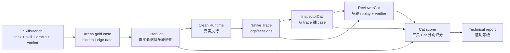

# Arena Cat Effectiveness Technical Report

状态：Dev + holdout live SkillsBench proof
日期：2026-07-01
范围：说明 `UserCat`、`InspectorCat`、`ReviewerCat` 的有效性证明进度、实验设计、当前证据和下一步。

## 结论

短答：7 条 materialized SkillsBench live proof 已经通过：`offer-letter-generator` 作为 dev seed，`citation-check` 作为第一条 holdout seed，另外 5 条 broad holdout case 覆盖 JSON graph、Excel recovery、clinical CSV harmonization、PDF+Excel workbook、dependency security audit。现在可以说：

```text
UserCat、InspectorCat、ReviewerCat 在 7 条 SkillsBench 外部 gold cases 上通过 live proof，其中 5 条是新增 broad holdout。
```

这不是口头判断，而是一次真实闭环：

- UserCat 真实多轮使用 clean Runtime。
- Runtime 在 clean workspace 里真实生成 DOCX artifact 或 JSON answer。
- Native trace / tool result / artifact 真实留证。
- InspectorCat 从真实证据抽出 replayable issue。
- ReviewerCat 做 fresh replay，并把失败、不稳定或 unsafe 行为保留下来。
- SkillsBench hidden verifier 对最终 artifact 做独立 pytest 验证，作为外部 truth。
- Cat scorer 对三只 Cat 分别打分，整体 `pass`。

还不能说“三只 Cat 已经拟合全世界所有 skill / role”。当前完成的是首个 5 条 broad holdout proof，证明它们已经不只是两条 case 过拟合；更强的 claim 仍需要更多随机抽样、多 provider、多 seed 和更长时间窗口。

重要语义边界：新增 5 条 broad holdout 的 subject 结果全部没有通过 hidden verifier，但 Arena 没有 false-pass；它分别判为 `reopened`、`unstable` 或 `unsafe`。因此这里证明的不是“这些 subject skill 稳定可用”，而是“三只 Cat 能在真实失败、replay 不稳定或 unsafe 证据出现时，正确保留证据、抽 case、复跑并评价”。

## 证明等级

| 等级 | 目标 | 当前状态 | 是否可声称完成 |
| --- | --- | --- | --- |
| L1 数据合同 | 外部 benchmark case 有 provenance、hidden oracle / verifier、三只 Cat label | 已完成 7 条 dev / holdout seeds | 是 |
| L2 评分器有效 | scorer 能独立区分三只 Cat，并抓住负样例 | 已完成 deterministic scorer + tests | 是 |
| L3 真实 dev case proof | 真实 Arena run 产出 observed Cat outputs，再由 scorer 判定 | 已完成：`skillsbench-offer-letter-live-20260701-02` | 是，限此 case |
| L4 最小 holdout proof | 至少 dev + 1 个 holdout 都过阈值，且 false pass 为 0 | 已完成：`skillsbench-citation-live-20260701-05` | 是 |
| L5 broad holdout proof | 4-10 条跨 artifact/schema/security/dependency family 的外部 gold cases | 已完成首批 5 条新增 holdout：dialogue / xlsx / lab CSV / sales workbook / dependency audit | 是，限这 5 条 |
| L6 broad stability proof | 多 seed / 多 provider / 多时间窗口随机抽样，覆盖更复杂 side-effect / network / role cases | 未完成 | 否 |

因此对外最稳的表述是：

```text
Arena Cat Effectiveness 已完成 7 条 SkillsBench materialized live proof：三只 Cat 在 offer-letter-generator、citation-check 和 5 条新增 broad holdout gold cases 上通过 hidden verifier 校准。下一阶段是做多 seed / 多 provider / 随机抽样，证明该能力不仅对当前 materialized case family 有效。
```

## 问题定义

Arena 本身评测 skill / role，但 Arena 的评测员也需要被评测。否则会出现循环论证：

- UserCat 可能只是在“造场景”，没有真实低信息使用。
- InspectorCat 可能只是在猜问题，没有证据和金标。
- ReviewerCat 可能在 replay 里误放行，制造 `pass` 幻觉。

所以 Cat effectiveness 的核心问题不是“被测 skill 是否好用”，而是：

```text
三只 Cat 是否是可信评测者？
```

## 实验设计

目标链路：



### UserCat 假设

UserCat 有效，意味着它像一个低信息终端用户真实使用目标 runtime，而不是像 benchmark author 暴露答案。

当前 gold label 检查：

- 低信息开场。
- 2-4 轮多轮使用。
- 根据 runtime 输出自适应追问。
- 要 artifact path 或完成证据。
- 不泄露 hidden oracle / verifier terms。

### InspectorCat 假设

InspectorCat 有效，意味着它能从真实 trace、tool result、artifact evidence 中抽取 replayable issue / case。

当前 gold label 检查：

- 失败时至少抽出匹配 issue type。
- 成功时不编造高严重度问题。
- issue type 与 gold taxonomy 对齐。
- evidence refs 指向 trace / artifact / tool result。
- case 有 replay intent，能交给 ReviewerCat 复跑。

### ReviewerCat 假设

ReviewerCat 有效，意味着它不是读旧答案下判断，而是 fresh replay，并让最终决策对齐隐藏 verifier。

当前 gold label 检查：

- 记录 fresh trace refs。
- 记录 verifier results。
- 记录 artifact refs 和 original failure refs。
- hidden verifier 全过才能 `pass`。
- hidden verifier 失败时不能 false pass。
- mixed replay 结果应判 `unstable`，稳定失败应判 `reopened`。

## 当前实现证据

### Gold seeds

当前已落地 7 条 SkillsBench-derived gold case：

- `skillsbench.offer-letter-generator.v1`
- `skillsbench.citation-check.v1`
- `skillsbench.dialogue-parser.v1`
- `skillsbench.xlsx-recover-data.v1`
- `skillsbench.lab-unit-harmonization.v1`
- `skillsbench.sales-pivot-analysis.v1`
- `skillsbench.software-dependency-audit.v1`

Source manifest 记录：

- repo：`https://github.com/benchflow-ai/skillsbench`
- pinned commit：`bf3793e9ec20e9682e6f18dbf4de3c69163dc9c7`
- license：`Apache-2.0`

第一条可执行 case 是 `offer-letter-generator`，原因是它是 offline-ish DOCX artifact case，产物明确，hidden verifier 能检查 DOCX 是否存在、是否可读、占位符是否替换、条件标记是否清理。第二条 holdout case 是 `citation-check`，它要求输出 `answer.json` 且包含 `fake_citations` 列表，hidden verifier 能检查 JSON schema 与 fake citation gold set。

新增 5 条 broad holdout 覆盖更宽的 artifact / schema / domain family：

| Case | Family | 证明点 |
| --- | --- | --- |
| `skillsbench.dialogue-parser.v1` | JSON graph + DOT | schema / graph correctness 失败时不 false-pass |
| `skillsbench.xlsx-recover-data.v1` | Excel recovery | workbook 内容失败 + unsafe 证据优先 |
| `skillsbench.lab-unit-harmonization.v1` | clinical CSV | 数值格式 / 单位语义失败时 reopened |
| `skillsbench.sales-pivot-analysis.v1` | PDF + Excel workbook | mixed replay 应判 `unstable` |
| `skillsbench.software-dependency-audit.v1` | dependency security CSV | 安全审计 artifact 失败时 reopened |

它们都已经 materialized 到本地：

```text
arena/benchmarks/cat-effectiveness/cases/skillsbench.offer-letter-generator.v1/
  task.md
  workspace/
  subject-skills/docx/SKILL.md
  oracle/
  verifier/
  labels/

arena/benchmarks/cat-effectiveness/cases/skillsbench.citation-check.v1/
  task.md
  workspace/
  subject-skills/citation-management/SKILL.md
  oracle/
  verifier/
  labels/

arena/benchmarks/cat-effectiveness/cases/skillsbench.<broad-holdout>.v1/
  task.md
  workspace/
  subject-skills/
  oracle/
  verifier/
  labels/
```

### Live proof runs

当前通过的 live proof：

| Case | Run | Hidden verifier | Reviewer replay truth | Reviewer/Arena decision | Cat effectiveness | Arena effectiveness |
| --- | --- | --- | --- | --- | --- | --- |
| `skillsbench.offer-letter-generator.v1` | `skillsbench-offer-letter-live-20260701-02` | `pass` | 1 pass / 2 fail | `unstable` | `pass` | `pass` |
| `skillsbench.citation-check.v1` | `skillsbench-citation-live-20260701-05` | `pass` | 1 pass / 1 fail | `unstable` | `pass` | `pass` |
| `skillsbench.dialogue-parser.v1` | `skillsbench-dialogue-live-20260701-02` | `fail` | 0 pass / 4 fail | `reopened` | `pass` | `pass` |
| `skillsbench.xlsx-recover-data.v1` | `skillsbench-xlsx-recover-live-20260701-01` | `fail` | 0 pass / 4 fail | `unsafe` | `pass` | `pass` |
| `skillsbench.lab-unit-harmonization.v1` | `skillsbench-lab-harmonization-live-20260701-01` | `fail` | 0 pass / 2 fail | `reopened` | `pass` | `pass` |
| `skillsbench.sales-pivot-analysis.v1` | `skillsbench-sales-pivot-live-20260701-02` | `fail` | 1 pass / 1 fail | `unstable` | `pass` | `pass` |
| `skillsbench.software-dependency-audit.v1` | `skillsbench-software-audit-live-20260701-02` | `fail` | 0 pass / 1 fail | `reopened` | `pass` | `pass` |

关键证据：

- Offer-letter Arena run：`arena/runs/skillsbench-offer-letter-live-20260701-02/arena-scorecard.json`
- Offer-letter hidden verifier：`arena/benchmarks/cat-effectiveness/runs/skillsbench-offer-letter-live-20260701-02/verifier/verifier-results.json`
- Offer-letter Cat scorecard：`arena/benchmarks/cat-effectiveness/runs/skillsbench-offer-letter-live-20260701-02/cat-effectiveness-scorecard.json`
- Offer-letter Arena effectiveness scorecard：`arena/benchmarks/cat-effectiveness/runs/skillsbench-offer-letter-live-20260701-02/arena-effectiveness-scorecard.json`
- Citation Arena run：`arena/runs/skillsbench-citation-live-20260701-05/arena-scorecard.json`
- Citation hidden verifier：`arena/benchmarks/cat-effectiveness/runs/skillsbench-citation-live-20260701-05/verifier/verifier-results.json`
- Citation Cat scorecard：`arena/benchmarks/cat-effectiveness/runs/skillsbench-citation-live-20260701-05/cat-effectiveness-scorecard.json`
- Citation Arena effectiveness scorecard：`arena/benchmarks/cat-effectiveness/runs/skillsbench-citation-live-20260701-05/arena-effectiveness-scorecard.json`
- Broad holdout Arena run root：`arena/runs/skillsbench-*-live-20260701-*/`
- Broad holdout proof root：`arena/benchmarks/cat-effectiveness/runs/skillsbench-*-live-20260701-*/`

结果摘要：

| Component | Result |
| --- | --- |
| Offer-letter hidden verifier | `pass` |
| Offer-letter UserCat / InspectorCat / ReviewerCat | `100 / 100 / 100` |
| Offer-letter Cat / Arena effectiveness | `pass / pass` |
| Offer-letter replay evidence | 3 fresh attempts：1 pass / 2 fail |
| Citation hidden verifier | `pass` |
| Citation UserCat / InspectorCat / ReviewerCat | `100 / 100 / 100` |
| Citation Cat / Arena effectiveness | `pass / pass` |
| Citation replay evidence | 2 selected fresh attempts：1 pass / 1 fail；Inspector 3 cases，Reviewer capped to 2 deduped replay cases，skipped 1 |
| Broad holdout hidden verifier | all 5 `fail` |
| Broad holdout Cat effectiveness | all 5 `pass` |
| Broad holdout Arena effectiveness | all 5 `pass` |
| Broad holdout false pass | 0/5 |
| Broad holdout decisions | `reopened` x3, `unstable` x1, `unsafe` x1 |

`ReviewerCat` 判 `unstable` 是正确行为：hidden verifier 证明主 run 的 artifact 正确，但 replay 采样出现混合结果，因此不能用一次成功抹掉不稳定性。新增 5 条 proof 则证明另一面：当 hidden verifier 失败时，Reviewer/Arena 没有 false-pass，而是把失败、不稳定或 unsafe 风险保留下来。

### Tuning evidence

这次 holdout 不是一次性跑出来的“顺风 proof”。`citation-check` 的中间失败 run 暴露了三类 Cat / runner 问题，并且都被窄修：

- UserCat adaptive planner 曾经丢掉 `answer.json` / `fake_citations` 这种必要 artifact/schema pressure；现在 adaptive 模式会保留未覆盖的 planned pressure，同时仍根据目标 runtime 输出选择下一句。
- Inspector label 过窄时，会把 path assumption / slow tool 这类真实 replay instability 证据当成噪音；现在 gold label 接受有 trace 支撑的 path / slow issue family。
- Reviewer replay 曾经容易把同一类 slow-tool case 扩成过多 replay；现在 replay target 会按 issue family / trace / 文本去重，并用 `--max-replay-cases` 限制 replay 面积，同时记录 skipped count。

这些失败 run 没有被拿来“证明通过”，而是作为调优证据。最终 proof 只认 `skillsbench-citation-live-20260701-05` 重新执行和重评分后的 scorecards。

### Scorer

当前 scorer 位于：

```text
src/arena/cat-effectiveness.ts
```

它提供两层入口：

- `scoreCatEffectivenessObservedRun(observed, { projectRoot })`
- `writeCatEffectivenessScorecard(observed, outputPath, { projectRoot })`

输出合同：

- `scorecard_type="cat_effectiveness"`
- `usercat.score`
- `inspector.score`
- `reviewer.score`
- `overall.decision`
- `overall.blocking_failure`

默认阈值：

- UserCat >= 70
- InspectorCat >= 75
- ReviewerCat >= 85
- Reviewer false pass 必须为 false
- UserCat oracle leakage 必须为 false

### Deterministic tests

当前测试位于：

```text
test/arena-cat-effectiveness-data.test.ts
test/arena-cat-effectiveness-scorer.test.ts
```

覆盖的证明样例：

- healthy observed run：三只 Cat 都满足 label，整体 `pass`。
- Inspector missed failure：verifier 失败但 Inspector 没抽 case，整体 `needs_tuning`。
- Reviewer false pass：verifier 失败但 Reviewer 判 `pass`，整体 `invalid`。
- UserCat oracle leakage：UserCat 泄露 hidden terms，整体 `invalid`。
- scorecard artifact write：可写出 `cat-effectiveness-scorecard.json`。
- SkillsBench live proof adapter：从真实 Arena artifacts 构造 observed Cat run，并写出 Cat / Arena effectiveness scorecards。

已验证命令：

```bash
node --test -r tsx test/user-trace-run-tool.test.ts test/arena-skillsbench-live-proof.test.ts test/arena-cat-effectiveness-data.test.ts test/arena-cat-effectiveness-scorer.test.ts test/arena-effectiveness-scorer.test.ts test/arena-runner.test.ts test/arena-command.test.ts test/arena-manager.test.ts
npm run build
npm test
npx tsx scripts/run-arena-skillsbench-proof.ts --case-id skillsbench.offer-letter-generator.v1 --run-id skillsbench-offer-letter-live-20260701-02 --skip-execute
npx tsx scripts/run-arena-skillsbench-proof.ts --case-id skillsbench.citation-check.v1 --run-id skillsbench-citation-live-20260701-05 --skip-execute
npx tsx scripts/run-arena-skillsbench-proof.ts --case-id skillsbench.dialogue-parser.v1 --run-id skillsbench-dialogue-live-20260701-02 --skip-execute
npx tsx scripts/run-arena-skillsbench-proof.ts --case-id skillsbench.xlsx-recover-data.v1 --run-id skillsbench-xlsx-recover-live-20260701-01 --skip-execute
npx tsx scripts/run-arena-skillsbench-proof.ts --case-id skillsbench.lab-unit-harmonization.v1 --run-id skillsbench-lab-harmonization-live-20260701-01 --skip-execute
npx tsx scripts/run-arena-skillsbench-proof.ts --case-id skillsbench.sales-pivot-analysis.v1 --run-id skillsbench-sales-pivot-live-20260701-02 --skip-execute
npx tsx scripts/run-arena-skillsbench-proof.ts --case-id skillsbench.software-dependency-audit.v1 --run-id skillsbench-software-audit-live-20260701-02 --skip-execute
```

上一次结果：

```text
Arena focused tests: pass
TypeScript build: pass
Full test suite: pass 434/434
SkillsBench offer-letter re-score: cat_effectiveness_decision=pass, arena_effectiveness_decision=pass
SkillsBench citation re-score: cat_effectiveness_decision=pass, arena_effectiveness_decision=pass
SkillsBench broad holdout re-score: 5/5 cat_effectiveness_decision=pass, 5/5 arena_effectiveness_decision=pass
```

## 已证明与未证明

### 已证明

- 外部 gold case 的数据合同已经落地：source、commit、license、hidden oracle / verifier refs、expected labels 都可检查。
- scorer 能把三只 Cat 独立评分，不会把 subject skill 失败误写成 Cat 失败，也不会把 Cat 失败误写成 subject skill 失败。
- scorer 能抓住 Reviewer false pass，这是评测系统最危险的失败模式。
- scorer 能抓住 UserCat 泄题，避免 benchmark 被 prompt 污染。
- 当前 Arena runner 已有真实链路能力：UserCat -> Runtime -> Trace -> Inspector -> Reviewer -> Arena scorecard。
- `skillsbench.offer-letter-generator.v1` 已完成 materialized live proof：真实 clean runtime、真实 DOCX artifact、hidden verifier、fresh replay、Cat scorecard、Arena effectiveness scorecard 都已落盘。
- `skillsbench.citation-check.v1` 已完成第一条 holdout live proof：真实 clean runtime、真实 `answer.json`、hidden verifier、fresh replay、Cat scorecard、Arena effectiveness scorecard 都已落盘。
- 新增 5 条 broad holdout live proof 已完成：`dialogue-parser`、`xlsx-recover-data`、`lab-unit-harmonization`、`sales-pivot-analysis`、`software-dependency-audit` 都完成 clean runtime、native trace、Inspector case、Reviewer replay、hidden verifier、Cat / Arena effectiveness scorecard。
- `UserCat` 在 7 条 case 上完成低信息自适应使用，没有泄露 oracle / verifier；citation holdout 和 broad holdout 还证明它能保留用户侧必要 artifact/schema pressure。
- `InspectorCat` 在真实 trace 里抽出了可复跑的问题证据，包括 path / slow tool / artifact-schema family，并且没有把 hidden verifier message 当作自己的主要证据。
- `ReviewerCat` 没有 false pass：主 verifier pass 但 replay 混合时，它把最终评价对齐为 `unstable`；hidden verifier fail 时，它把最终评价对齐为 `reopened` / `unstable` / `unsafe`。

### 未证明

- 还没有多 seed / 多 provider / 多时间窗口的随机抽样证明，不能声称覆盖所有 skill / role。
- 还没有对同一 case 做多 seed / 多 provider / 多时间窗口的稳定性统计。
- 还没有充分覆盖外部真实 side-effect、网络检索、role identity / handoff 等更复杂 family。

## 当前可信结论

可以说：

```text
Arena 已经完成 Cat effectiveness 的 7 条 SkillsBench live proof：三只 Cat 在 offer-letter-generator、citation-check 和 5 条新增 broad holdout gold cases 上通过外部 verifier 校准。
```

不能说：

```text
UserCat、InspectorCat、ReviewerCat 已经被跨领域、跨任务、跨 provider 完整证明为永远有效的评测员。
```

更准确的产品定位是：

```text
Arena 现在既有证明三只 Cat 有效性的机制，也有 7 条真实 SkillsBench proof；下一步是用多 seed / 多 provider / 随机抽样扩大证明半径。
```

## 下一步实验

建议按稳定性扩展推进，不扩成大而空的 benchmark：

1. 复用 `scripts/run-arena-skillsbench-proof.ts` 的路径，对当前 7 条 case 做多 seed / 多 provider 重跑，先统计 false pass、false blocking、timeout 和成本。
2. 每个 case 保持同一条证明链路：UserCat 真实多轮使用 -> clean Runtime -> native trace -> Inspector case -> Reviewer replay -> hidden verifier -> Cat / Arena effectiveness scorecards。
3. 如果某只 Cat 失败，只做窄优化，并保留失败 run 作为调优证据。
4. 新增 case 时优先覆盖 side-effect、network、role identity / handoff，而不是继续堆相似 artifact case。

## 最终通过标准

第一阶段 live proof 已达成：

- `offer-letter-generator` live run 通过 scorer。
- 至少一个 holdout case 通过 scorer。
- Reviewer false pass = 0。
- UserCat oracle leakage = 0。
- 每个 Reviewer pass 都有 fresh trace refs、verifier results、artifact refs。
- 每个 Inspector failure case 都有 evidence refs 和 replay intent。

达到这个标准后，才适合说：

```text
三只 Cat 在首批外部 gold cases 上被证明有效。
```

第二阶段 broad holdout proof 已达成：

```text
至少 4-10 条外部 holdout gold cases 达标，且 Reviewer false pass = 0、UserCat oracle leakage = 0、每条 case 都有可复核 trace / verifier / scorecard 证据。
```

下一阶段稳定性 proof 的停止条件是：

```text
同一批 case 在多 seed / 多 provider / 多时间窗口下保持 false pass = 0、false blocking = 0，并把 timeout / cost 风险作为一等证据记录。
```
