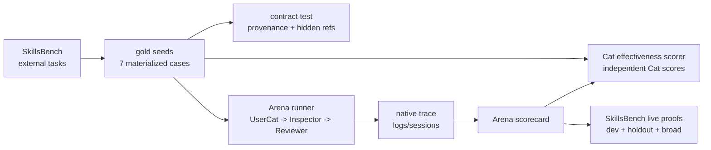
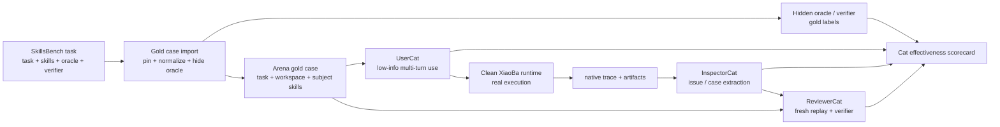
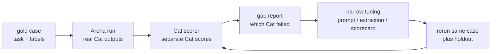

# Arena Cat Effectiveness SPEC

状态：Draft
最后更新：2026-07-01
适用范围：用外部已验证 task / skill / oracle / verifier 数据集验证和调优 `UserCat`、`InspectorCat`、`ReviewerCat` 的 Arena 子规格。首个目标数据源是 SkillsBench。

本规格的目标不是评测 SkillsBench，也不是把外部 benchmark 直接搬进 `eval/`。它的目标是把外部经过验证的 skill task 变成 Arena 的 gold cases，用真实任务、真实 skill、隐藏 oracle 和独立 verifier 证明三只 Cat 是否真的有效：

- `UserCat` 会不会像低信息终端用户一样真实使用。
- `InspectorCat` 会不会从真实 trace 里抓出正确 issue / case。
- `ReviewerCat` 会不会 fresh replay、运行 verifier，并做出正确评价：`pass` / `reopened` / `unstable` / `blocked` / `unsafe`。

当前证明等级和对外 claim 边界见 [`CAT_EFFECTIVENESS_REPORT.md`](CAT_EFFECTIVENESS_REPORT.md)。

## Problem

Arena 已经可以让 UserCat 真实多轮使用、Runtime 真实跑、Trace 真实留证、Inspector 抽 case、Reviewer replay / scorecard。但现在还有一个顶级可信度问题：

```text
谁来证明 UserCat / InspectorCat / ReviewerCat 本身靠谱？
```

如果只用 XiaoBa 自己生成的 case，会有循环论证风险：

- UserCat 生成的场景可能太弱，没触发真实失败。
- InspectorCat 抽的问题可能只是猜测，没有独立金标。
- ReviewerCat 的 scorecard 可能和真实任务结果不一致。
- Arena 看起来跑通了，但不知道三只 Cat 是有效评测者，还是只是制造流程感。

SkillsBench 这类外部 benchmark 提供了更硬的数据基础：每个任务有真实任务说明、环境、skills、oracle 和 verifier。Arena 可以隐藏 oracle / verifier，让三只 Cat 真实执行评测链路，再用外部 verifier 和 gold labels 反向评估三只 Cat 的有效性。

## Scope

In scope:

- 从 SkillsBench 导入经过 pin 的 task package，包括 `task.md`、`environment/skills/**`、`oracle/**`、`verifier/**` 和必要 workspace fixtures。
- 把外部 task 转成 Arena gold case，不直接进入生产 `skills/`，也不自动进入 `eval/benchmarks/`。
- 保留 source provenance：repo、commit、license、原始 task path、导入时间。
- 对三只 Cat 分别打分：
  - UserCat：低信息真实多轮使用质量。
  - InspectorCat：trace issue / case extraction 质量。
  - ReviewerCat：fresh replay、verifier 对齐和 scorecard 评价质量。
- 使用外部 verifier / oracle 作为裁判侧数据，默认对 UserCat、InspectorCat、ReviewerCat 隐藏。
- 支持人工标注 `expected-usercat.json`、`expected-inspector-cases.json`、`expected-reviewer-scorecard.json`，并允许后续迭代成半自动标注。
- 首批候选从 SkillsBench 选择 task goal 明确、产物明确、verifier 强的 case，例如：
  - `citation-check`
  - `software-dependency-audit`
  - `offer-letter-generator`
  - `suricata-custom-exfil`

Out of scope:

- 公开排行榜。
- 自动把 SkillsBench case 写入 `eval/` release gate。
- 直接运行外部 task 的任意脚本而不经过 Arena sandbox / clean runtime。
- 让三只 Cat 读取 oracle / verifier 细节后再完成任务。
- 评估 SkillsBench 原项目质量。
- 只靠 LLM judge 代替 verifier / oracle。

## Current Architecture

当前状态是：Arena 已经有真实端到端评测链路，SkillsBench 数据源已被人工确认具备 task / skill / oracle / verifier 结构，仓库已有 7 条 materialized Cat effectiveness gold case。`skillsbench.offer-letter-generator.v1`、`skillsbench.citation-check.v1` 和 5 条 broad holdout case 都包含 workspace fixtures、subject skill、oracle、verifier 和三只 Cat 的 expected labels。`src/arena/cat-effectiveness.ts` 已实现 deterministic Cat scorer：它读取 gold labels，对 UserCat、InspectorCat、ReviewerCat 分别评分，并把 Reviewer false pass / UserCat oracle leakage 标为 blocking failure。`src/arena/skillsbench-live-proof.ts` 和 `scripts/run-arena-skillsbench-proof.ts` 已把真实 Arena artifacts、hidden verifier、Cat scorer 和 Arena effectiveness scorer 串成 dev + holdout + broad holdout live proof；runner 也支持 replay case 去重/上限和 artifact/schema contract scan，避免 holdout 因重复 case 或漏检 schema artifact 失真。



当前已经确认的外部数据事实：

- SkillsBench repo：`benchflow-ai/skillsbench`
- License：Apache-2.0
- 已观察的 pinned commit：`bf3793e9ec20e9682e6f18dbf4de3c69163dc9c7`
- Source manifest：`arena/benchmarks/cat-effectiveness/sources/skillsbench/source-manifest.json`
- Materialized seeds：`arena/benchmarks/cat-effectiveness/cases/skillsbench.*.v1/`
- 抽样 case 具备 `task.md`、`oracle/` 和 `verifier/`。
- 多个 case 具备 `environment/skills/*/SKILL.md`，可以作为被测 skill 数据源。
- Scorer：`src/arena/cat-effectiveness.ts`
- SkillsBench live proof adapter：`src/arena/skillsbench-live-proof.ts`
- SkillsBench proof runner：`scripts/run-arena-skillsbench-proof.ts`
- Scorer tests：`test/arena-cat-effectiveness-scorer.test.ts`
- Live proof tests：`test/arena-skillsbench-live-proof.test.ts`
- Dev live proof run：`skillsbench-offer-letter-live-20260701-02`
- Holdout live proof run：`skillsbench-citation-live-20260701-05`
- Broad holdout live proof runs：`skillsbench-dialogue-live-20260701-02`、`skillsbench-xlsx-recover-live-20260701-01`、`skillsbench-lab-harmonization-live-20260701-01`、`skillsbench-sales-pivot-live-20260701-02`、`skillsbench-software-audit-live-20260701-02`

这些事实说明 dev + holdout + 首批 broad holdout materialized live proof 已经成立：case 能被 Arena 真正执行，UserCat / InspectorCat / ReviewerCat 的真实输出能被 `cat-effectiveness-scorecard.json` 独立评分，并且 hidden verifier / replay truth 能校准 Reviewer 的最终评价。它仍不等于跨 provider / 跨时间窗口泛化已经完全成立；下一步需要多 seed / 多 provider / 随机抽样。

## Target Architecture

目标架构把 SkillsBench task 转成 Arena gold case。三只 Cat 只能看到真实用户侧任务、subject skills 和 workspace；oracle / verifier 留在裁判侧。Arena 真实跑完后，用 hidden oracle / verifier 和 gold labels 给三只 Cat 分别打分。



## Data Layout

Cat effectiveness data lives under Arena's real evidence/data root, not under `eval/`:

```text
arena/benchmarks/cat-effectiveness/
  sources/
    skillsbench/
      source-manifest.json
  cases/
    <case-id>/
      case-manifest.json
      task.md
      workspace/
      subject-skills/
        <skill-name>/SKILL.md
      oracle/
      verifier/
      labels/
        expected-usercat.json
        expected-inspector-cases.json
        expected-reviewer-scorecard.json
  runs/
    <run-id>/
      arena-run.json
      arena-scorecard.json
      verifier/
        verifier-results.json
      cat-effectiveness-scorecard.json
      arena-effectiveness-scorecard.json
```

`arena/benchmarks/cat-effectiveness/cases/**` is curated source data. `arena/benchmarks/cat-effectiveness/runs/**` is execution output for validating Cat behavior against those cases.

Curated `sources/**` and `cases/**` are intended to be versioned with the repository. Generated `runs/**` remain local evidence by default and should not be committed unless a maintainer explicitly promotes a small, reviewed fixture.

Raw external source files must retain provenance. If a case copies external files into the repo, `case-manifest.json` must record source license and original paths. If a case references external files without copying them, the manifest must record an exact fetch plan and pinned commit.

## Case Manifest Contract

`case-manifest.json` required fields:

```json
{
  "case_id": "skillsbench.citation-check.v1",
  "case_type": "cat_effectiveness_gold_case",
  "source": {
    "repo": "benchflow-ai/skillsbench",
    "commit": "bf3793e9ec20e9682e6f18dbf4de3c69163dc9c7",
    "license": "Apache-2.0",
    "original_task_path": "tasks/citation-check"
  },
  "task": {
    "user_seed_path": "task.md",
    "domain": "office-white-collar",
    "expected_artifacts": ["/root/answer.json"],
    "hidden_oracle_paths": ["oracle/"],
    "hidden_verifier_paths": ["verifier/"]
  },
  "subjects": {
    "skills_root": "subject-skills",
    "skill_ids": ["citation-management"]
  },
  "sandbox": {
    "network": "disabled_by_default",
    "workspace_write": true,
    "timeout_ms": 900000
  },
  "labels": {
    "expected_usercat": "labels/expected-usercat.json",
    "expected_inspector_cases": "labels/expected-inspector-cases.json",
    "expected_reviewer_scorecard": "labels/expected-reviewer-scorecard.json"
  }
}
```

## Hidden Oracle / Verifier Boundary

Oracle and verifier are judge-side data:

- UserCat must not read `oracle/` or `verifier/`.
- The target runtime must not see verifier implementation unless the original task explicitly exposes a test command to the agent.
- InspectorCat must not use verifier failure messages as its primary evidence during issue extraction; it must inspect runtime trace, tool results and artifacts.
- ReviewerCat may run the verifier only during the review / evaluation phase, and the scorecard must distinguish:
  - trace-based evidence
  - replay-based evidence
  - verifier-based evidence

This boundary prevents answer leakage. The point is to test whether the Cats can produce useful behavior from realistic evidence, then use hidden verifier / oracle to grade them.

## UserCat Effectiveness Labels

`labels/expected-usercat.json` evaluates whether UserCat behaves like a low-information end user rather than a developer or verifier.

Required dimensions:

- `low_info_opening`: opening request is vague enough and does not reveal oracle / verifier.
- `adaptive_followup`: UserCat reacts to target runtime output, tool events or missing proof.
- `proof_pressure`: UserCat asks for artifact path, visible result, run evidence or completion proof when appropriate.
- `no_oracle_leakage`: UserCat does not mention hidden answer, exact verifier assertions or implementation details.
- `task_completion_pressure`: UserCat keeps pressure until the task is visibly completed, blocked with reason, or unsafe.

Example expected shape:

```json
{
  "case_id": "skillsbench.offer-letter-generator.v1",
  "min_turns": 2,
  "max_turns": 4,
  "must_include_behaviors": [
    "low_info_opening",
    "artifact_path_followup",
    "placeholder_completion_check"
  ],
  "must_not_include": [
    "oracle_answer",
    "verifier_file_names",
    "exact_hidden_assertions"
  ]
}
```

## InspectorCat Effectiveness Labels

`labels/expected-inspector-cases.json` evaluates whether InspectorCat finds the right issue / case from trace evidence.

Required dimensions:

- `case_recall`: known failure should produce at least one matching issue.
- `case_precision`: clean successful trace should not produce high-severity false positives.
- `issue_type_accuracy`: issue type matches gold taxonomy.
- `evidence_ref_accuracy`: cited trace / tool / artifact refs support the issue.
- `replayability`: extracted case has enough setup and expected evidence for ReviewerCat to replay.

Core issue taxonomy:

- `missing_artifact`
- `wrong_output_schema`
- `fake_success`
- `tool_failure`
- `dependency_missing`
- `path_assumption`
- `unsafe_side_effect`
- `blocked_without_reason`
- `skill_not_activated`
- `low_value_usercat_trace`

Example expected shape:

```json
{
  "case_id": "skillsbench.software-dependency-audit.v1",
  "expected_cases": [
    {
      "issue_type": "wrong_output_schema",
      "severity": "high",
      "required_evidence_kinds": ["artifact", "tool_result"],
      "replay_intent": "rerun audit and verify generated CSV against hidden verifier"
    }
  ],
  "false_positive_budget": 0
}
```

## ReviewerCat Effectiveness Labels

`labels/expected-reviewer-scorecard.json` evaluates whether ReviewerCat fresh-replays the case, runs verifier when allowed, and makes the right final decision.

Required dimensions:

- `fresh_replay`: ReviewerCat drives current runtime again instead of reusing the old answer.
- `verifier_alignment`: decision agrees with hidden verifier / oracle.
- `false_pass_guard`: failed verifier cannot become `pass`.
- `blocked_reason_quality`: blocked decisions cite real missing setup, sandbox, dependency or credential reasons.
- `stability_sampling`: multiple replay attempts are summarized correctly as `pass` / `unstable` / `reopened`.

Expected decision mapping:

| Verifier / replay state | Expected Reviewer decision |
| --- | --- |
| Verifier passes consistently | `pass` |
| Verifier fails consistently | `reopened` |
| Mixed pass/fail attempts | `unstable` |
| Verifier cannot run for legitimate setup reason | `blocked` |
| Unsafe side effect observed | `unsafe` |

Example expected shape:

```json
{
  "case_id": "skillsbench.citation-check.v1",
  "replay_attempts_per_case": 3,
  "decision_rules": {
    "all_verifier_pass": "pass",
    "any_unsafe": "unsafe",
    "consistent_verifier_fail": "reopened",
    "mixed_verifier_results": "unstable",
    "missing_fixture_or_dependency": "blocked"
  },
  "must_record": [
    "fresh_trace_refs",
    "verifier_results",
    "original_failure_refs"
  ]
}
```

## Cat Effectiveness Scorecard

Every run against a gold case writes:

```text
arena/benchmarks/cat-effectiveness/runs/<run-id>/cat-effectiveness-scorecard.json
```

Required fields:

- `scorecard_type="cat_effectiveness"`
- `run_id`
- `case_id`
- `source_case_ref`
- `arena_run_ref`
- `usercat={score, passed_dimensions[], failed_dimensions[], evidence_refs[]}`
- `inspector={score, recall, precision, issue_type_accuracy, evidence_ref_accuracy, replayability, evidence_refs[]}`
- `reviewer={score, decision_agreement, false_pass, replay_hygiene, verifier_alignment, evidence_refs[]}`
- `overall={score, decision, blocking_failure?}`

Current implementation:

- `scoreCatEffectivenessObservedRun(observed, { projectRoot })` loads the gold case labels and returns the scorecard object.
- `writeCatEffectivenessScorecard(observed, outputPath, { projectRoot })` writes `cat-effectiveness-scorecard.json`.
- `overall.decision` is `pass` only when UserCat / InspectorCat / ReviewerCat all meet thresholds.
- `overall.decision` is `needs_tuning` when one Cat misses threshold but no loop-breaking failure occurs.
- `overall.decision` is `invalid` when Reviewer false-passes or UserCat leaks hidden oracle/verifier terms.

Initial pass bar:

- UserCat score >= 70
- Inspector score >= 75
- Reviewer score >= 85
- Reviewer `false_pass=false`
- No oracle leakage

Reviewer false pass is a release-blocking failure for the Cat evaluation dataset. A Cat run can survive a weak UserCat or noisy Inspector as `needs_tuning`, but a Reviewer false pass means the evaluation loop is not trustworthy.

## Experiment Loop

Cat effectiveness tuning follows a tight benchmark loop:



Stop conditions for proving a Cat slice:

- Development seed passes the Cat scorer without Reviewer false pass or oracle leakage.
- At least one negative fixture proves the scorer catches Inspector miss and Reviewer false pass.
- A materialized live run passes hidden verifier calibration before claiming the Cat behavior is proven for that case.
- A holdout seed remains above the same thresholds before claiming the Cat behavior is generally improved.
- Any optimization must be narrow and traceable to the failed Cat dimension; do not tune by exposing oracle / verifier details to UserCat or InspectorCat.

## First Data Slice

Start small and high-signal. The first SkillsBench slice should prioritize cases with clear artifacts and strong verifiers:

| Case | Why first |
| --- | --- |
| `offer-letter-generator` | Offline-ish DOCX artifact, one narrow subject skill, clear workspace fixtures, good for artifact evidence and false pass guard. |
| `citation-check` | JSON answer, explicit fake citation gold set, good for schema / hallucination detection; now used as the first holdout proof. |
| `dialogue-parser` | JSON graph + DOT output, good for schema / graph correctness and false pass guard. |
| `xlsx-recover-data` | Excel recovery, good for workbook content checks and unsafe evidence priority. |
| `lab-unit-harmonization` | Clinical CSV unit conversion, good for semantic data correctness. |
| `sales-pivot-analysis` | PDF + Excel workbook, good for mixed replay and workbook structure checks. |
| `software-dependency-audit` | CSV ground truth, strong verifier, good for artifact correctness and false pass guard. |
| `suricata-custom-exfil` | Security rule with false positive / false negative pressure, good for unsafe / verifier alignment. |

Do not import all SkillsBench tasks at once. The first executable-priority case `skillsbench.offer-letter-generator.v1` has completed one live proof run: `skillsbench-offer-letter-live-20260701-02`. The first holdout case `skillsbench.citation-check.v1` has completed one live proof run: `skillsbench-citation-live-20260701-05`. The first broad holdout set has completed five additional live proof runs. The next goal is repeated sampling across seeds / providers / time windows, not indiscriminate case growth.

## Relationship To Evaluation

Cat effectiveness is not a release `eval/` benchmark by default.

- `eval/` answers: does XiaoBa runtime / role behavior pass release-grade live benchmark cases?
- `arena/benchmarks/cat-effectiveness` answers: are UserCat, InspectorCat and ReviewerCat trustworthy evaluators?

Promotion path is manual:

```text
SkillsBench task
-> Arena gold case
-> Cat effectiveness run
-> useful failure pattern
-> optional rewritten live eval case
```

Raw SkillsBench tasks and raw Arena Cat runs must not be copied into `eval/benchmarks/**` without a maintainer rewriting them into XiaoBa live agent eval format.

## Acceptance Criteria

- Each case records source repo, pinned commit, license and original task path.
- Each case includes or references `task.md`, subject skill files, workspace fixtures, oracle and verifier.
- Oracle and verifier are hidden from UserCat and InspectorCat.
- ReviewerCat can run verifier only during review / evaluation, and scorecards record verifier evidence separately from trace evidence.
- UserCat labels evaluate low-information, adaptive, proof-seeking behavior.
- InspectorCat labels evaluate issue recall, precision, evidence refs and replayability.
- ReviewerCat labels evaluate fresh replay, verifier alignment, false pass rate and stochastic evaluation.
- A Cat effectiveness scorecard can fail one Cat without pretending the subject skill failed.
- No Cat effectiveness case is automatically accepted into `eval/`.

## Risks / Open Questions

- SkillsBench tasks often assume Docker/Linux paths like `/root`; Arena must either provide compatible workspace mapping or adapt tasks carefully.
- Some tasks require network or external services; initial slice should prefer offline or easily sandboxed tasks.
- Verifier error messages can leak oracle details; Reviewer report should summarize verifier outcomes without letting earlier stages see hidden assertions.
- External task licenses must remain visible in source manifests.
- Human labels may initially be noisy; each gold label should carry author/date/review status once label curation begins.
