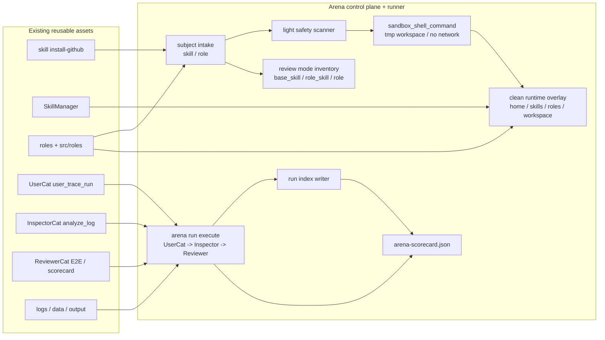

# Arena PLAN

状态：Draft
最后更新：2026-07-05
Owner：Arena maintainers / Roles & Skills maintainers

本文维护 `Arena` 能力审判场的执行计划。`docs/arena/SPEC.md` 定义模块边界、目标架构和数据合同；本文维护当前状态、里程碑、下一步和验收证据。

## Current Status

`Arena` 已被定义为 XiaoBa-CLI 的顶层产品模块，并已有可执行 v1：三种 review mode 固定为 `base_skill` 评 Base + skill，`role_skill` 评 role + skill，`role` 评 role 本身。物理目录按三分法收敛：`src/arena` 是代码，`docs/arena` 是设计文档，根目录 `arena/` 是真实评测现场和证据。

仓库已有可复用基础：

- `xiaoba skill install-github owner/repo` 可以 clone GitHub skill，但当前是直接安装路径，不满足 arena import isolation。
- `src/arena/arena-manager.ts` 已提供 arena-only subject manifest、clean runtime overlay、run index 写入、三种 review mode inventory、evidence ref 校验和 stochastic replay attempt 校验。
- `src/arena/arena-runner.ts` 已提供自动执行层：`arena run execute` 准备 clean runtime 并强制用 `sandbox_shell_command` 启动 worker，worker 自动触发 UserCat 真实多轮使用、Inspector issue/case extraction、Reviewer 多轮 replay / scorecard。
- `xiaoba arena ...` 已提供 `skill <skill-name>`、`import skill`、`import github`、`snapshot role`、`runtime prepare`、`run create`、`run execute` 子命令；`arena skill` 会优先解析已安装 XiaoBa skill，找不到时可解析已导入 Arena 的 skill subject，并委托到完整自动评测链路，`run create` 保留为手动登记真实证据 refs 的低层入口。
- `SkillManager` 可加载 base / role-local skills；Arena 现在可为每个 run 生成 run-local `home/`、`skills/`、`roles/`、`workspace/`、`tmp/`，并通过 env overlay 让目标 runtime 读取干净 subject skill / role snapshot。
- `roles/**` 和 `src/roles/**` 已维护 role 定义、role-local docs 和工具边界，但还没有统一 role scorecard run。
- `UserCat` 可通过 `user_trace_run` 走 Dashboard Chat/Pet 原生入口，扮演低质量终端用户进行真实端到端多轮使用，并产出 UserCat run package。
- `InspectorCat` 可通过 `analyze_log` 做 runtime/log issue extraction。
- `ReviewerCat` 可通过 `reviewer_eval_prepare` / `reviewer_xiaoba_cli_e2e` 生成 eval plan、trace、report 和 scorecard；Arena runner v1 也内置 trace replay scorecard 作为一条命令路径。
- `logs/sessions/**`、`data/**`、`output/**` 已能承载本地 evidence。
- Arena runner 默认以 normal discovery profile 运行：3 个 UserCat 场景、每场景最多 4 轮 adaptive UserCat；Inspector 从真实 trace 抽 issue / case，Reviewer 只对抽出的 case 做 replay，默认每个 case 3 次。UserCat 先用 subject seed 做低信息开场，再读取每轮目标 runtime 的可见回复 / tool events 决定下一句或停止，而不是固定播放一串静态 messages。
- macOS Seatbelt v1 已按“干净执行沙箱”收敛：sandbox wrapper 使用 `env -i`、clean `HOME` / `TMPDIR` / workspace、显式 env allowlist 和 `XIAOBA_ARENA_SANDBOXED=1`；profile 允许广义只读以保证 Homebrew Node / macOS runtime 启动，写入仍限制在当前 `arena/runs/<run-id>/` cage。
- clean runtime 现在默认发现项目根 `.env` 并通过 `DOTENV_CONFIG_PATH` 注入执行进程，让本地 XiaoBa provider 配置在 Arena 中可用；secret 值仍不写入 `clean-runtime.json` 或 runner plan。
- clean runtime 现在支持 `--workspace-seed <path>`，可以把 benchmark fixture 复制进 run-local clean workspace；`clean-runtime.json` 只记录 seed source 和 file count，不把它混进生产 workspace。
- `arena run execute` 非 dry-run 会先做 provider config preflight；clean runtime 没有可用 `.env` / `DOTENV_CONFIG_PATH` / `--pass-env` provider 配置时，会在启动 UserCat 前直接要求用户先配置。
- Inspector / Reviewer 已识别 channel-backed delivery：成功的 `send_text` / `send_file`、delivery evidence 和 `session_completed.visible_to_user` 不再被当作空回复；Inspector 也优先使用结构化 tool `status`，避免把成功命令里的 `timeout=10` / `cdn_error` 源码字符串误判为失败。
- Arena runner 证据面已收敛：`arena-scorecard.json` / `arena-run.json` 和 native `logs/sessions/**/traces.jsonl` 是默认阅读入口；UserCat 控制器日志、Inspector analysis/cases、Reviewer report 和 replay artifacts 统一放到 per-run `debug/`，通过 `debug_refs` 下钻。
- Arena runner unsafe precheck 已收紧为结构化行为片段扫描：不会因为 trace 元数据、token 计数字段或 provider 引用字符串误报 `unsafe`，凭证相关词必须和打印 / 泄露 / 上传 / 发送等行为同时出现才升级。
- Arena SPEC 已补充“需求来源”：Arena 来自可信能力准入需求，不是为了再造一个评测系统；它要解决 GitHub / 本地 skill 与 role 泛滥、默认包准入、低信息真实用户、多轮 replay、trace 证据和评测员可信校准这些产品问题。
- Cat effectiveness 子规格已建立并完成 dev + holdout + broad holdout live proof：`docs/arena/CAT_EFFECTIVENESS_SPEC.md` 定义如何用 SkillsBench 这类外部已验证 task / skill / oracle / verifier 数据构建 Arena gold cases，并分别验证 UserCat 会不会低信息真实用、InspectorCat 会不会从 trace 抓 case、ReviewerCat 会不会 fresh replay + verifier 对齐评价。7 条 SkillsBench-derived case 已完成本地 materialized proof；完整 corpus 不再随 XiaoBa-CLI 主仓发布，后续归 Barena 或本地 ignored 数据目录管理。`src/arena/cat-effectiveness.ts`、`src/arena/skillsbench-live-proof.ts` 和 `scripts/run-arena-skillsbench-proof.ts` 已把真实 Arena artifacts、hidden verifier 和 Cat scorer 串起来。通过 run：`skillsbench-offer-letter-live-20260701-02`、`skillsbench-citation-live-20260701-05`、`skillsbench-dialogue-live-20260701-02`、`skillsbench-xlsx-recover-live-20260701-01`、`skillsbench-lab-harmonization-live-20260701-01`、`skillsbench-sales-pivot-live-20260701-02`、`skillsbench-software-audit-live-20260701-02`，Cat effectiveness decision 都为 `pass`。
- Cat effectiveness 技术报告已更新：`docs/arena/CAT_EFFECTIVENESS_REPORT.md` 明确当前证明等级。当前可以声称“三只 Cat 在 7 条外部 gold cases 上通过 live proof，其中 5 条是新增 broad holdout”；还不能声称跨 provider / 跨时间窗口完全证明，下一步需要多 seed / 多 provider / 随机抽样。
- Arena effectiveness 实验已建立并完成 dev + holdout + broad holdout live proof：`docs/arena/ARENA_EFFECTIVENESS_EXPERIMENT.md` 定义如何用 SkillsBench hidden verifier 校准 Arena scorecard 本身。`src/arena/arena-effectiveness.ts` 可证明 Arena 在受控 gold cases 上能对齐 verifier truth，允许 verifier pass 下的 warning / risk，并能抓 `arena_false_pass` / `arena_false_blocking`。前两条 baseline hidden verifier 为 `pass` 且 Arena 判 `unstable`；新增 5 条 broad holdout hidden verifier 为 `fail`，Arena 分别判 `reopened`、`unstable`、`unsafe`，Arena effectiveness decision 都为 `pass`。这证明的是 Arena/Cat loop 能识别和评价不稳定、失败与 unsafe，不是证明 subject skill 本身稳定。

当前尚未实现或仍是部分实现：

- Safety scanner 目前是轻量文本扫描；尚未做完整脚本 / 二进制 / 依赖风险扫描。
- Arena runner v1 已强制默认走 `sandbox_shell_command`，但 Linux bubblewrap / Windows native adapter 仍未实现。
- Optional evidence view over referenced Reviewer report; current default local report is `arena/runs/<run-id>/debug/reviewer-report.md`
- future `eval/benchmarks/<Subject>` live case source
- Cat / Arena effectiveness 仍需要稳定性扩展：当前首批 broad holdout 已达成 5 条新增 case，但仍需要多 seed / 多 provider / 多时间窗口重复采样，并把 timeout / cost 风险作为一等证据记录。

## Milestones

1. M0：Module spec/plan baseline：completed with `docs/arena/SPEC.md` and this plan.
2. M1：Subject intake boundary：completed for v1 metadata. `ArenaManager` writes single-file manifests for `subject.type=skill|role` and run-level `review_mode=base_skill|role_skill|role`.
3. M2：GitHub skill import：completed as isolated Arena import. `xiaoba arena import github <repo> --ref <ref>` clones into `arena/subjects/<subject-id>/source`, pins commit and does not auto-promote to production `skills/`.
4. M3：Local role snapshot：completed. `xiaoba arena snapshot role <role-id>` fingerprints role docs、role-local skills and declared tools without mutating production role state.
5. M4：Review mode inventory：completed. Run indexes record exactly one review mode plus active role, base skills, subject skill, role-local skills, registered tools, provider-visible tools and surface.
6. M5：Safety scan：partial. Current scan detects obvious high-risk text patterns in `SKILL.md` / role docs and classifies trust risk; deeper script/binary/dependency scanning remains.
7. M6：Lightweight execution sandbox：v1 completed for macOS Seatbelt path. Arena clean runtime indexes record sandbox policy and emit `sandbox_shell_command`; `arena run execute` requires that command by default and records `arena-runner.json`.
8. M7：Runtime overlay：completed for manual launch. `xiaoba arena runtime prepare` creates run-local `home/`、`skills/`、`roles/`、`workspace/`、`tmp/` and launch env for `base_skill`、`role_skill`、`role` without modifying production skill or role state.
9. M8：UserCat E2E multi-turn use：v1 completed. `arena run execute` invokes UserCat through real Dashboard Chat/Pet runtime inside the clean workspace; `base_skill` supports target `base`.
10. M9：Inspector issue-to-case extraction：v1 completed. Worker writes `debug/inspector-analysis.json` and `debug/inspector-cases.json` from trace evidence.
11. M10：Reviewer multi-attempt replay / scorecard：v1 completed. Worker reruns native trace inputs multiple times, writes `debug/reviewer-scorecard.json`、`debug/reviewer-report.md` and aggregate `arena-scorecard.json`.
12. M11：Skill shortcut CLI：completed. `xiaoba arena skill <skill-name>` resolves an installed XiaoBa skill, snapshots it as an arena-only subject and runs the same clean sandboxed scorecard path; `--role <role-id>` selects `role_skill`.
13. M12：Promotion path：not started. Define explicit commands or docs for promoting a passed skill / role to production and rewriting selected runs into live eval cases.
14. M13：Cat effectiveness spec：completed. `docs/arena/CAT_EFFECTIVENESS_SPEC.md` defines SkillsBench-derived gold case layout, hidden oracle / verifier boundary, expected labels and Cat scorecard contract.
15. M14：Cat effectiveness data slice：completed for dev + holdout + broad holdout live slices. 7 SkillsBench-derived cases were materialized for proof with workspace fixtures, subject skill, hidden oracle/verifier and expected labels; the full corpus is now external/local-only and not shipped in XiaoBa-CLI main.
16. M15：Cat effectiveness scorer：completed. `src/arena/cat-effectiveness.ts` loads gold labels, scores UserCat / InspectorCat / ReviewerCat independently, writes `cat-effectiveness-scorecard.json`, and treats Reviewer false pass plus UserCat oracle leakage as invalid Cat-loop failures.
17. M16：Cat effectiveness technical report：completed and updated for broad holdout. `docs/arena/CAT_EFFECTIVENESS_REPORT.md` records proof levels, current evidence, honest claim boundaries and the 7-run SkillsBench proof results.
18. M17：Arena effectiveness controlled experiment：completed. `docs/arena/ARENA_EFFECTIVENESS_EXPERIMENT.md` defines the external-verifier calibration protocol, and `src/arena/arena-effectiveness.ts` scores Arena decision alignment, false pass, false blocking, warning precision and issue evidence completeness.
19. M18：SkillsBench offer-letter live proof：completed. `scripts/run-arena-skillsbench-proof.ts` ran `skillsbench.offer-letter-generator.v1` through clean Arena runtime, hidden verifier, Cat effectiveness scorer and Arena effectiveness scorer. Passing run：`skillsbench-offer-letter-live-20260701-02`。
20. M19：SkillsBench citation holdout live proof：completed. `scripts/run-arena-skillsbench-proof.ts` ran `skillsbench.citation-check.v1` through clean Arena runtime, hidden verifier, Cat effectiveness scorer and Arena effectiveness scorer. Passing run：`skillsbench-citation-live-20260701-05`。
21. M20：SkillsBench broad holdout live proof：completed for first 5 additional cases. Passing runs：`skillsbench-dialogue-live-20260701-02`、`skillsbench-xlsx-recover-live-20260701-01`、`skillsbench-lab-harmonization-live-20260701-01`、`skillsbench-sales-pivot-live-20260701-02`、`skillsbench-software-audit-live-20260701-02`。

## Next Steps

- Harden `arena run execute` against more failure classes: missing provider credentials, no native trace, no replayable user input and long-running tool calls should all produce clearer blocked scorecards.
- Implement Linux bubblewrap / Windows native sandbox adapters or keep those engines blocked-by-default until available.
- Deepen Inspector extraction beyond lightweight `analyze_log` compatible signals: artifact-evidence checks, missing confirmation, role identity drift and fake-success patterns.
- Keep automatic UserCat invocation only through real Pet / Chat surface, never by generated static scenarios.
- Keep existing `xiaoba skill install-github` behavior separate from Arena import until a migration is explicitly designed.
- Define the first UserCat E2E use families: code/file skill, document/report skill, external side-effect skill, role identity/boundary, and cross-role handoff.
- Start with local-only reports; do not add public leaderboard or remote upload.
- Keep `eval/` clean: Arena output can inspire future live eval cases, but accepted eval source must be manually rewritten.
- Keep Arena thin: reuse `logs/sessions/**/traces.jsonl`, `data/user-cat/**`, `data/reviewer-runs/**`, `output/eval/**` and `eval/benchmarks/**` by reference.
- Keep Arena readable: do not add new top-level per-stage audit directories unless they become a real product surface; put runner internals under `debug/`.
- Expand Cat / Arena effectiveness from first broad holdout to stability proof in Barena or a local ignored corpus: rerun the current 7 SkillsBench-derived gold cases across seeds / providers / time windows, track false pass / false blocking / timeout / cost, and only generalize beyond the current case family after repeated samples hold.
- Keep `docs/arena/CAT_EFFECTIVENESS_REPORT.md` as the external-facing technical explanation; update it after each promoted live proof run so claim boundaries stay explicit.

## Owners

- Arena control plane：`src/arena/**`
- CLI entrypoint：`src/commands/**`
- Skill import / parsing：`src/skills/**`, `src/arena/**`
- Role snapshot / review：`roles/**`, `src/roles/**`, `src/arena/**`
- Runtime overlay：`src/core/**`, `src/skills/**`, `src/roles/**`, `src/tools/**`
- Review mode inventory：`src/arena/**`, `src/tools/**`, `src/skills/**`, `src/roles/**`
- Execution sandbox：`src/arena/**` for runner enforcement; `src/tools/**`, `src/core/**` keep normal runtime tool boundaries
- Low-quality end-user E2E use：`roles/user-cat/**`, `src/roles/user-cat/**`
- Issue extraction：`roles/inspector-cat/**`, `src/roles/inspector-cat/**`
- Scorecard / report：`roles/reviewer-cat/**`, `src/roles/reviewer-cat/**`
- Evidence：`logs/**`, `data/user-cat/**`, `data/reviewer-runs/**`, `output/**`; root `arena/**` stores Arena review-site subjects, clean runtimes, runner plans, run indexes and scorecards
- Cat effectiveness data：full SkillsBench-derived gold case corpus is external/local-only and no longer tracked in XiaoBa-CLI main; when present locally it uses `arena/benchmarks/cat-effectiveness/cases/**` with source provenance embedded in each case manifest. Generated `runs/**` scorecards remain local evidence by default
- Future live eval promotion：`eval/benchmarks/<Subject>/**`

## Acceptance Criteria

- `docs/arena/SPEC.md` and `docs/arena/PLAN.md` exist and are linked from project docs.
- GitHub skill imports record source owner/repo/ref/commit and default to `trust_level=untrusted`.
- Local role reviews record source path, docs, declared tools and fingerprint without mutating production role state.
- Imported or reviewed subjects are not automatically production-visible.
- `xiaoba arena runtime prepare` creates a clean run-local runtime overlay and writes `clean-runtime.json` with launch env/commands while omitting secret values.
- Clean runtime launch defaults to project `.env` discovery through `DOTENV_CONFIG_PATH` when the file exists, so provider credentials can be used without copying production home state or persisting secret values.
- Non-dry-run `arena run execute` fails before UserCat / Inspector / Reviewer execution when the clean runtime has no usable provider config, and the error tells the user to configure project `.env` or explicit `--pass-env` provider variables first.
- `xiaoba arena skill <skill-name>` can evaluate an installed XiaoBa skill or previously imported Arena skill subject by name without asking the user for subject ids; it still writes the same Arena subject, clean runtime, runner, run index and scorecard contracts.
- Normal Arena eval defaults to `--scenario-count 3 --max-turns 4 --replay-attempts 3`; `--replay-attempts` applies per Inspector case, not per UserCat scenario. If Inspector finds no actionable case, planned replay count is 0 and the run is scored from trace evidence plus case absence.
- Arena runs record the exact review mode and target inventory: mode `base_skill|role_skill|role`, active role, subject skill when present, loaded skills, role-local skills, registered tools, provider-visible tools and surface.
- Every executable arena run records execution sandbox policy and runs spawned commands with a temporary workspace, no inherited production env, network off by default for untrusted subjects, and hard timeout.
- Every arena run records references to low-quality UserCat run/package evidence, runtime evidence, Inspector issues and Reviewer scorecard.
- Arena-owned persistent state is limited to `arena-manifest.json`、`clean-runtime.json`、`arena-runner.json`、`arena-run.json`、`arena-scorecard.json` and per-run `debug/` internals produced by `arena run execute`; the default scorecard evidence surface should point first to native runtime trace refs.
- Arena 内置 Reviewer 的 `debug/reviewer-report.md` 默认中文输出，方便人工快速阅读；`arena-scorecard.json` 仍是机器可读事实源。
- InspectorCat outputs issue evidence and candidate cases; ReviewerCat owns multi-attempt replay and final judgment.
- Scorecards distinguish `pass`, `unstable`, `reopened`, `blocked` and `unsafe`.
- Reviewer replay treats model behavior as stochastic: one fresh successful replay does not erase a prior failure, variance-sensitive cases default to multiple attempts before final judgment, and scorecards record replay attempt counts plus trace refs.
- Unsafe side effects, missing confirmation, fake success without artifacts, role identity drift and missing blocked reasons are first-class issue categories.
- No Arena run is automatically copied into `eval/`.
- Cat effectiveness gold cases record source repo, commit, license and original task path; oracle / verifier stay hidden from UserCat and InspectorCat, while ReviewerCat may use verifier only during review / evaluation with verifier evidence recorded separately from trace evidence.
- Cat effectiveness scorecards can fail UserCat / InspectorCat / ReviewerCat independently without pretending the subject skill failed; Reviewer false pass is release-blocking for trust in the Cat loop.
- Cat effectiveness scorer tests include positive and negative fixtures: a healthy Cat loop, Inspector missed failure, Reviewer false pass, UserCat oracle leakage, and scorecard artifact write.
- Cat effectiveness report must distinguish completed proof-harness evidence from uncompleted live Cat benchmark proof; it must not overclaim that the three Cats are fully proven before materialized live runs pass.
- Live Cat proof must record the real Arena run id, hidden verifier result, Cat effectiveness scorecard and Arena effectiveness scorecard. Passing the current 7-run proof proves the current materialized case family only; broader claims require repeated seeds / providers / time windows and more side-effect / network / role cases.
- Arena effectiveness scorer tests include controlled positive and negative cases: clean verifier pass, verifier pass with warning/risk, verifier fail with false pass, verifier pass with false blocking, correct reopened, correct unstable, correct blocked, correct unsafe and scorecard artifact write.
- Arena effectiveness must treat `verifier pass` as task correctness only: non-blocking warnings / risks may remain valid, while unsupported reopened / blocked decisions count as false blocking.

## Risks / Open Questions

- GitHub skill repos may contain malicious or misleading instructions; import must stay non-executing by default.
- Lightweight native sandboxing is not the same as VM/container containment; untrusted subjects must stay metadata-only when no native sandbox engine is available.
- Role reviews can accidentally become role redesign; Arena should judge and report before mutating role docs.
- Skill and role metadata conventions differ; parser errors need blocked evidence rather than silent failure.
- UserCat E2E runs can be too weak or too chaotic; ReviewerCat should reject low-value UserCat evidence before scoring the subject unfairly.
- Replay can become theater if it reuses the old assistant answer or treats one lucky fresh run as final evaluation; ReviewerCat replay must drive current runtime again, preserve the original failure evidence and sample enough attempts to identify instability.
- InspectorCat and ReviewerCat can initially be implemented as internal lenses inside Arena, even if their role boundaries remain separate in data contracts.
- Running external side-effect subjects requires confirmation gates and possibly fake/test connectors before real credentials are allowed.
- SkillsBench tasks often assume Docker/Linux `/root` paths; Arena must either emulate the expected workspace shape or adapt task paths while preserving verifier intent.
- External verifier messages can leak answers; the hidden oracle / verifier boundary must be enforced before using Cat effectiveness cases for tuning.

## Verification Log

- 2026-07-05：Removed the Cat effectiveness proof corpus from XiaoBa-CLI main so the public repo stays product-focused. The proof conclusion and scorer/live-proof code remain; full corpus belongs in Barena or a local ignored `arena/benchmarks/cat-effectiveness/` directory. Verification：`npm run build`；targeted Arena effectiveness tests；`npm test`；`git diff --check`。
- 2026-07-01：Expanded Cat / Arena effectiveness with 5 additional SkillsBench broad holdout live proof runs. Passing runs：`skillsbench-dialogue-live-20260701-02`（hidden verifier fail -> Arena `reopened`）、`skillsbench-xlsx-recover-live-20260701-01`（hidden verifier fail -> Arena `unsafe`）、`skillsbench-lab-harmonization-live-20260701-01`（hidden verifier fail -> Arena `reopened`）、`skillsbench-sales-pivot-live-20260701-02`（hidden verifier fail + mixed replay -> Arena `unstable`）、`skillsbench-software-audit-live-20260701-02`（hidden verifier fail -> Arena `reopened`）。All five produced `cat_effectiveness_decision=pass` and `arena_effectiveness_decision=pass`; false pass = 0. Verification：real proof commands for all five runs；proof-time local corpus data contract test；targeted live-proof / scorer / effectiveness tests（24/24）；`npm run build`；`git diff --check`。
- 2026-07-01：Final dev + holdout Cat/Arena effectiveness verification completed. Both promoted SkillsBench live proof runs re-scored from real evidence with `cat_effectiveness_decision=pass` and `arena_effectiveness_decision=pass`: `skillsbench-offer-letter-live-20260701-02` and `skillsbench-citation-live-20260701-05`. Final test sweep passed after code/docs sync. Verification：targeted user trace / runner / live proof / scorer / command / manager tests（57/57）；`npm run build`；`npx tsx scripts/run-arena-skillsbench-proof.ts --case-id skillsbench.offer-letter-generator.v1 --run-id skillsbench-offer-letter-live-20260701-02 --skip-execute`；`npx tsx scripts/run-arena-skillsbench-proof.ts --case-id skillsbench.citation-check.v1 --run-id skillsbench-citation-live-20260701-05 --skip-execute`；`npm test`（434/434）；`git diff --check`。
- 2026-07-01：Completed the SkillsBench citation holdout live proof for Cat / Arena effectiveness. `skillsbench.citation-check.v1` now has local workspace fixtures, subject `citation-management` skill, hidden verifier and labels; the final passing run `skillsbench-citation-live-20260701-05` produced `answer.json` with the expected `fake_citations` list. Hidden verifier `pass`；UserCat / InspectorCat / ReviewerCat scores all `100`；Cat effectiveness decision `pass`；Arena effectiveness decision `pass`；Reviewer/Arena observed decision `unstable` from 1 pass / 1 fail replay sampling；`max_replay_cases=2` skipped one duplicate replay candidate. Verification：`npx tsx scripts/run-arena-skillsbench-proof.ts --case-id skillsbench.citation-check.v1 --run-id skillsbench-citation-live-20260701-05 --skip-execute`；`node --test -r tsx test/user-trace-run-tool.test.ts test/arena-runner.test.ts test/arena-skillsbench-live-proof.test.ts`；`npm run build`。
- 2026-07-01：Completed the first materialized SkillsBench live proof for Cat / Arena effectiveness. `skillsbench.offer-letter-generator.v1` now has local workspace fixtures, subject `docx` skill, hidden verifier and labels; `scripts/run-arena-skillsbench-proof.ts` executes the clean Arena runtime path and writes hidden verifier, Cat effectiveness and Arena effectiveness scorecards. Passing run：`skillsbench-offer-letter-live-20260701-02`；hidden verifier `pass`；UserCat / InspectorCat / ReviewerCat scores all `100`；Cat effectiveness decision `pass`；Arena effectiveness decision `pass`；Reviewer/Arena observed decision `unstable` from 1 pass / 2 fail replay sampling. Verification：`npx tsx scripts/run-arena-skillsbench-proof.ts --case-id skillsbench.offer-letter-generator.v1 --run-id skillsbench-offer-letter-live-20260701-02 --skip-execute`；targeted user trace / live proof / scorer / effectiveness / runner / command / manager tests；`npm run build`；`npm test`（429/429）。
- 2026-07-01：Added Arena workspace seed support for benchmark fixtures. `--workspace-seed <path>` is now available on `arena skill`、`arena run execute` and `arena runtime prepare`; clean runtime copies the seed into run-local `workspace/` and records source plus file count in `clean-runtime.json`. Verification：`node --test -r tsx test/arena-manager.test.ts test/arena-runner.test.ts test/arena-command.test.ts`；`npm run build`。
- 2026-07-01：Added the first controlled Arena effectiveness experiment. `docs/arena/ARENA_EFFECTIVENESS_EXPERIMENT.md` defines how SkillsBench hidden verifier truth proves Arena decision quality, including the important `verifier pass` versus warning/risk/blocking distinction. `src/arena/arena-effectiveness.ts` writes `arena-effectiveness-scorecard.json` and detects `arena_false_pass` / `arena_false_blocking`. Verification：`node --test -r tsx test/arena-effectiveness-scorer.test.ts`；`npm run build`；`git diff --check -- docs/arena/ARENA_EFFECTIVENESS_EXPERIMENT.md src/arena/arena-effectiveness.ts test/arena-effectiveness-scorer.test.ts docs/arena/SPEC.md docs/arena/PLAN.md`。
- 2026-07-01：Added the Cat effectiveness technical report. `docs/arena/CAT_EFFECTIVENESS_REPORT.md` now documents proof levels, experiment design, current evidence, what is and is not proven, and the next live SkillsBench proof path. Verification：proof-time local corpus data contract test；`node --test -r tsx test/arena-cat-effectiveness-scorer.test.ts`；`npm run build`；`git diff --check -- docs/arena/CAT_EFFECTIVENESS_REPORT.md docs/arena/CAT_EFFECTIVENESS_SPEC.md docs/arena/PLAN.md`。
- 2026-07-01：Implemented the deterministic Arena Cat effectiveness scorer. `src/arena/cat-effectiveness.ts` loads SkillsBench-derived gold labels, scores UserCat / InspectorCat / ReviewerCat independently, writes `cat-effectiveness-scorecard.json`, and marks Reviewer false pass / UserCat oracle leakage as invalid loop failures. Verification：proof-time local corpus data contract test；`node --test -r tsx test/arena-cat-effectiveness-scorer.test.ts`；`npm run build`。
- 2026-06-30：Seeded the first SkillsBench-derived Arena Cat effectiveness cases: executable-priority `skillsbench.offer-letter-generator.v1`, second-seed `skillsbench.citation-check.v1`, and focused contract tests. Source provenance is stored in each case manifest. This proof corpus has since been externalized to keep XiaoBa-CLI main product-focused. Verification：proof-time local corpus data contract test；`git diff --check -- docs/arena/CAT_EFFECTIVENESS_SPEC.md docs/arena/SPEC.md docs/arena/PLAN.md`。
- 2026-06-30：Added Arena demand-source section to `docs/arena/SPEC.md`, grounding Arena in trusted capability admission for external/local skills and roles rather than generic eval-system expansion. Verification：docs review；`git diff --check -- docs/arena/SPEC.md docs/arena/PLAN.md`。
- 2026-06-30：Added Cat effectiveness sub-spec for validating UserCat / InspectorCat / ReviewerCat with SkillsBench-derived task + skill + oracle + verifier gold cases. Verification：docs review；`git diff --check -- docs/arena/CAT_EFFECTIVENESS_SPEC.md docs/arena/SPEC.md docs/arena/PLAN.md`。
- 2026-06-30：Arena normal profile is now executable by default: 3 UserCat scenarios × max 4 adaptive turns, then Inspector-extracted cases only get Reviewer replay with 3 attempts per case by default. Scorecards record `arena_eval_profile` and no-issue runs have `planned_replay_attempts=0`. Verification：`node --test -r tsx test/arena-runner.test.ts`；`npm run build`。
- 2026-06-30：Arena built-in Reviewer report now defaults to Chinese in `debug/reviewer-report.md`, while `arena-scorecard.json` keeps the stable machine-readable contract. Verification：`node --test -r tsx test/reviewer-xiaoba-cli-e2e.test.ts test/arena-runner.test.ts`；`npm run build`。
- 2026-06-30：Extended `xiaoba arena skill <skill-name>` so it resolves production-installed skills first and previously imported Arena skill subjects second. This lets GitHub skills be re-evaluated by name without promoting them into production `skills/`. Verification：`node --test -r tsx test/arena-runner.test.ts test/arena-command.test.ts`（10/10）；`npm run build`；real run `node dist/index.js arena skill hang-to-la-rating --run-id hang-to-la-skill-name-20260630 --replay-attempts 1` -> `decision=reopened`。
- 2026-06-30：Tightened Arena unsafe trace scanner to inspect structured behavior snippets instead of raw trace JSON, avoiding false positives from trace metadata / token counters; credential terms now require disclosure or exfiltration verbs to mark `unsafe`. Verification：`node --test -r tsx test/arena-runner.test.ts test/arena-command.test.ts`；`npm run build`。
- 2026-06-30：Added the installed-skill shortcut `xiaoba arena skill <skill-name>`. The command resolves a XiaoBa skill by directory / metadata name / alias, snapshots it as an Arena local subject, then delegates to the sandboxed automatic runner; `--role` switches the run from `base_skill` to `role_skill`. Verification：`npm test -- --test-name-pattern=registerArenaCommand`（69/69）；`npm run build`。
- 2026-06-30：Added Arena provider config preflight. Non-dry-run `arena run execute` now checks clean runtime provider env before worker launch and fails fast with a configure-`.env` message when missing, instead of producing a fake API-key blocked run. Verification：`node --test -r tsx test/arena-runner.test.ts test/arena-manager.test.ts test/arena-command.test.ts`（17/17）；`npm run build`；`npm test`（400/400）。
- 2026-06-30：Clean Arena runtime now defaults to project `.env` provider config by setting `DOTENV_CONFIG_PATH` when `.env` exists; secret values remain absent from `clean-runtime.json` and shell command strings. Verification：`node --test -r tsx test/arena-manager.test.ts test/arena-command.test.ts test/arena-runner.test.ts`（16/16）；`npm run build`；`npm test`（399/399）。
- 2026-06-30：Consolidated Arena runner evidence surface. `trace_refs` now prefer native `workspace/logs/sessions/**/traces.jsonl` and no longer include UserCat controller logs when native trace exists; runner-owned UserCat / Inspector / Reviewer internals now live under per-run `debug/` with drill-down `debug_refs`, while `arena-scorecard.json` remains the default scorecard. Verification：`node --test -r tsx test/arena-runner.test.ts test/arena-manager.test.ts test/arena-command.test.ts`；`npm run build`；`npm test`（398/398）。
- 2026-06-30：Arena UserCat stage switched to adaptive live interaction. `arena run execute` now passes subject-aware seed / intent map / persona / scenario plan and `interaction_mode:"adaptive"` to `user_trace_run`, so UserCat reads target runtime output before choosing follow-up user turns. Verification：`node --test -r tsx test/user-trace-run-tool.test.ts test/user-cat-role.test.ts test/arena-runner.test.ts`；`npm run build`。
- 2026-06-30：Fixed Arena channel-delivery and macOS Seatbelt smoke issues found by the real gsap skill run. Inspector now treats successful `send_text` / `send_file` as visible reply evidence and prefers structured tool status over loose failure keywords in successful command output; Reviewer replay pass logic accepts channel delivery evidence without requiring final fallback text; sandbox wrapper marks real sandboxed launches with `XIAOBA_ARENA_SANDBOXED=1`; macOS Seatbelt profile now starts Homebrew Node reliably with broad read / run-cage write policy. Verification：`node --test -r tsx test/analyze-log-tool.test.ts test/arena-runner.test.ts test/arena-manager.test.ts test/arena-command.test.ts`；`npm run build`；manual Seatbelt Node smoke using `arena/runs/gsap-seatbelt-smoke-20260630-fix4/sandbox/macos-seatbelt.sb` returned `seatbelt node ok`；existing gsap native trace re-analysis returned `issueCount=0`。
- 2026-06-30：Implemented Arena automatic execution v1. `xiaoba arena run execute` now prepares a clean runtime, requires `sandbox_shell_command` by default, launches an internal worker, runs UserCat real multi-turn use, writes Inspector cases, performs Reviewer multi-attempt trace replay, emits `reviewer/scorecard.json`、`reviewer/report.md`、`arena-scorecard.json`, and updates `arena-run.json`; `user_trace_run` now supports `target_role=base` for `base_skill` reviews. Verification：`npm run build`；`node --test -r tsx test/arena-runner.test.ts test/arena-manager.test.ts test/arena-command.test.ts`。
- 2026-06-29：Moved Arena review-site data root from the old nested data root to root `arena/**` per the physical split `src/arena` = code, `docs/arena` = design docs, `arena/` = real review site and evidence. Verification：`node --test -r tsx test/arena-manager.test.ts test/arena-command.test.ts`；`node --test -r tsx test/skill-manager-runtime.test.ts test/role-manager.test.ts`；`npm run build`；root write smoke created `arena/subjects/skill-602b8b3c25/arena-manifest.json` and `arena/runs/arena-root-smoke-20260629-01/clean-runtime.json`；`node dist/index.js arena import --help`；old nested Arena path grep returned no hits；`npm test`（387/387）。
- 2026-06-29：Implemented clean Arena runtime preparation: `xiaoba arena runtime prepare` now creates run-local `home/`、`skills/`、`roles/`、`workspace/`、`tmp/`, copies default base skills plus the subject skill / role snapshot according to `base_skill`、`role_skill`、`role`, writes `clean-runtime.json`, emits explicit launch env and macOS Seatbelt `sandbox_shell_command`, and keeps secret values out of persisted JSON. Verification：`node --test -r tsx test/arena-manager.test.ts test/arena-command.test.ts`；`node --test -r tsx test/skill-manager-runtime.test.ts test/role-manager.test.ts`；`npm run build`；`node dist/index.js arena runtime prepare --help`；`node dist/index.js arena runtime prepare --mode base_skill --subject skill-6697f0dfff --run-id arena-hang-to-la-clean-20260629-01 --pass-env OPENAI_API_KEY`；`npm test`（387/387）。
- 2026-06-29：Implemented Arena v1 minimal control plane: `src/arena/arena-manager.ts`, `src/arena/types.ts`, `src/commands/arena.ts`, CLI registration, local skill import, GitHub skill isolated import, role snapshot, run index creation, evidence ref validation and stochastic replay attempt validation. Verification：`node --test -r tsx test/arena-manager.test.ts test/arena-command.test.ts`；`node --test -r tsx test/user-cat-role.test.ts`；`npm run build`；`npm test`（383/383）；`node dist/index.js arena --help`。
- 2026-06-29：Clarified UserCat semantics: UserCat is not a scenario generator; it performs real end-to-end multi-turn use through the selected surface and produces run evidence. Verification：docs review and `git diff --check -- docs/arena/SPEC.md docs/arena/PLAN.md docs/PLAN.md`。
- 2026-06-29：Clarified InspectorCat / ReviewerCat boundary: InspectorCat finds trace issues and proposes candidate cases, while ReviewerCat performs multi-attempt replay and owns final judgment. Verification：docs review and `git diff --check -- docs/arena/SPEC.md docs/arena/PLAN.md`。
- 2026-06-29：Added stochastic replay semantics: ReviewerCat does not close a prior failure just because one fresh replay succeeds; mixed replay outcomes become `unstable`, and variance-sensitive cases default to multiple attempts. Verification：docs review and `git diff --check -- docs/arena/SPEC.md docs/arena/PLAN.md docs/PLAN.md`。
- 2026-06-29：Simplified the Arena target Mermaid into a one-screen reader map: three review modes -> import/snapshot -> UserCat -> target runtime -> native evidence -> Inspector/Reviewer -> scorecard. Verification：docs review and `git diff --check -- docs/arena/SPEC.md docs/arena/PLAN.md`。
- 2026-06-29：Slimmed Arena data design: Arena review-site data lives under root `arena/` and owns subject manifests, clean runtime indexes and run indexes, while reusing low-quality UserCat run packages, session traces, Reviewer scorecards and eval outputs by reference. Verification：docs review and `git diff --check -- docs README.md roles`。
- 2026-06-29：Fixed Arena v1 to exactly three review modes: `base_skill` for Base + skill, `role_skill` for role + skill, and `role` for role-only quality review. Verification：docs review and `git diff --check -- docs/arena/SPEC.md docs/arena/PLAN.md docs/SPEC.md docs/PLAN.md`。
- 2026-06-29：Earlier Base-only skill review profile was expanded toward role-context review, then superseded by the fixed three-mode contract: `base_skill`、`role_skill`、`role`. Verification：docs review and `git diff --check -- docs/arena/SPEC.md docs/arena/PLAN.md docs/PLAN.md`。
- 2026-06-29：Added Base XiaoBa skill review profile and replay semantics: default skill reviews run Base role plus 5 packaged base skills plus subject skill, 12 base tools plus optional 2 surface delivery tools, and Reviewer replay means fresh current-runtime execution rather than reusing the old assistant transcript. Verification：docs review and `git diff --check -- docs README.md roles`。
- 2026-06-29：Reframed Arena sandbox as a lightweight Codex-like execution sandbox for spawned commands: macOS Seatbelt, Linux/WSL2 bubblewrap, Windows native where available, metadata-only fallback for untrusted subjects, no Docker requirement. Verification：docs review and `git diff --check -- docs README.md roles`。
- 2026-06-29：Renamed the module to `Arena` and expanded scope from skill-only review to generic subject review covering skills, roles and future adapter / harness recipes. Verification：stale-name grep returned no current docs hits；`rg -n "docs/arena|src/arena|xiaoba arena|subject-under-review" docs README.md`；`git diff --check -- docs README.md`。
- 2026-06-29：Created the original skill-only module spec/plan baseline and added the module to project architecture docs. Verification：module-reference grep and `git diff --check -- docs README.md`。

## Status Maintenance Rules

- Update this plan whenever `docs/arena/SPEC.md` changes subject, run, scorecard or promotion contracts.
- Do not mark an implementation milestone complete without code, docs and verification evidence.
- Keep Arena-owned review-site state under root `arena/**`. Default reports should stay Reviewer-owned unless explicitly referenced or exported into an Arena run.
- Keep Arena separate from `eval/` until a run is manually rewritten into a live agent eval case.
