# Arena PLAN

状态：Active
最后更新：2026-07-15
Owner：Arena maintainers

Arena is the candidate capability acceptance environment. It reviews skills and roles; it does not replace Evaluation or automatically promote a subject.

## Current Status

- Three review modes exist: `base_skill`, `role_skill`, and `role`.
- GitHub skill import and local role snapshot remain isolated from production assets.
- Skill and Role subjects are content-addressed by their full copied package fingerprint and retain Arena-owned immutable source snapshots.
- Arbitrary isolated Skill and Candidate Role intake exist; both snapshot into the run-local Arena subject store without touching production assets.
- Clean runtime preparation records run-local home, skills, roles, workspace and temp roots.
- The executable path runs UserCat pressure → target runtime → InspectorCat extraction → Arena multi-case replay / compare / scoring and writes an Arena-owned scorecard without starting ReviewerCat.
- ReviewerCat remains outside Arena and handles only one frozen Replay Case in the scheduled evolution DAG, returning `closed | next_run | blocked`.
- Seven SkillsBench-derived live proofs calibrated UserCat pressure, InspectorCat extraction, Arena replay/scoring and final Arena decisions against hidden verifiers; this is evidence for the review loop, not universal proof.
- Promotion into production skills/roles or Live Agent Eval remains explicit and manual.
- Strict fixed-line Skill contracts are checked across every evaluated native and replay turn through `arena-output-line-prefixes`; Arena re-activates the exact subject before every internal Pet message and requires matching final Skill visibility, so duplicate/extra deliveries, wrong lines, unmounted turns and incomplete trace coverage cannot produce `pass`.
- Self-evolution promotion is an explicit runtime CLI action bound to the exact DAG, Arena run and immutable subject fingerprint; it materializes the snapshot, changes only outer lifecycle and writes a durable receipt. Arena never invokes it automatically.
- Sandbox network/secret isolation and cross-platform adapters need further hardening.

```mermaid
flowchart LR
    Subject["candidate skill / role"] --> Clean["clean runtime"]
    Clean --> User["UserCat pressure"]
    User --> Evidence["native trace / artifacts"]
    Evidence --> Inspector["InspectorCat"]
    Inspector --> Replay["Arena replay / compare"]
    Replay --> Score["Arena scorecard"]
    Score -. "explicit promotion only" .-> Trusted["trusted assets"]
```

## Milestones

1. Subject manifest and three review modes：completed。
2. Clean runtime overlay：completed。
3. Automatic UserCat / InspectorCat / Arena replay-score run path：completed。
4. Scorecard and run index：completed。
5. Hidden-verifier calibration proof：completed for seven current cases。
6. Strong secret/network isolation：partial。
7. Linux/Windows sandbox adapters：not started。
8. Explicit promotion workflow with runtime enforcement：completed for self-evolution Candidate Skill/Role snapshots；manual installed-asset lifecycle remains a separate Dashboard path。
9. Zero-default-Base-Skill clean-runtime policy：completed；Arena reuses the empty packaged Base inventory and mounts only the declared subject/role assets。
10. Evolution DAG candidate intake：completed；isolated Skill/Role paths and lifecycle gate verification are implemented。
11. Content-addressed Skill/Role subject snapshots：completed；same-path content changes create a new subject without rewriting earlier source。

## Next Steps

- Make recorded sandbox/network policy match enforced OS behavior.
- Keep provider credentials outside subject tool environments.
- Repeat calibration across seeds, providers and time windows before broad claims.
- Repeat the closed real-provider Candidate Skill proof across providers, seeds and time windows before making broad effectiveness claims.
- Keep full proof corpora outside the main repository when they are not product runtime assets.

## Owners

- Arena commands/control plane：`src/commands/arena.ts`, `src/arena/**`
- Review-site state：`arena/**`
- Evaluator inputs：UserCat pressure and InspectorCat extraction under Roles & Skills; multi-case replay / compare / scoring remains Arena-owned
- Fresh evidence：Agent Runtime and Observability & Evidence

## Acceptance Criteria

- Imported subjects do not enter production `skills/` or role registration by default.
- Re-importing changed Skill or Role content produces a distinct subject while the earlier source snapshot remains byte-stable and runnable.
- Every executable run declares one review mode and one subject.
- Clean runtime manifests contain no secret values.
- A pass requires fresh runtime evidence and Arena-owned replay / compare verification.
- Every Candidate requires one unique native session per UserCat/replay run, exactly one safe trace binding, globally unique trace IDs across the complete UserCat + replay Arena run, and exact sequential turn coverage `1..expected_turns`; this identity gate applies even when no fixed-output contract is declared.
- A declared fixed-line output contract additionally requires final `tool_visibility.activeSkillName` bound to the immutable subject on every checked turn, `expected_turns=checked_turns=passed_turns>0`, zero violating turns and every evaluated session fully compliant.
- Unsafe behavior remains visible even when the task output is useful.
- Promotion requires explicit human/maintainer action.
- Self-evolution promotion verifies the DAG/Arena/subject/fingerprint chain, binds the scorecard and run index to one canonical Inspector cases artifact, rebuilds ordered replay selection from that artifact with the retained Arena runner config and shared selector, recomputes the Arena decision, re-extracts source inputs with the runtime extractor, re-reads raw trace identity/output evidence, derives visible delivery only from the fresh trace, semantically reconstructs each retained replay manifest/input/result/comparison set, re-derives the snapshot Role tool profile, materializes only the Arena snapshot, refuses unmanaged target overwrite or symlink receipt slots and persists a linked content-addressed receipt covering the Inspector cases, runner config, source trace and retained replay artifacts.
- Arena architecture changes update this PLAN and [`SPEC.md`](SPEC.md) only.

## Risks / Open Questions

- Current sandbox metadata can overstate network/secret isolation if OS policy is weaker.
- Seven calibration cases do not prove cross-provider or long-term generalization.
- One real-provider closed Candidate Skill loop proves its exact closeout-format contract and workflow integrity, not general autonomous improvement.
- The fixed-line declaration is intentionally narrow; arbitrary regex/schema/script contracts remain out of scope until a demonstrated need justifies another contract type.
- Explicit promotion remains a human/maintainer action rather than an Arena-owned automatic transition; Dashboard manual-asset promotion is not evidence for the self-evolution chain.

## Recent Verification

- Evolution DAG/Arena/promotion/Pet/UserCat/replay focused tests passed 155/155 after adding the Arena-run-wide Trace identity gate, all-turn contract checks, deterministic per-message subject mounting, Inspector-rooted replay selection, exact replay case/source binding, retained-replay semantic re-attestation, explicit raw-evidence-bound promotion and stale-run cleanup; the full repository passed 632/632 across 96 suites and `npm run build` also passed. The preserved v3-shaped regression remains classified as 6 checked turns, 4 passed, 2 violations and only 1/3 fully compliant sessions; separate tests prove every UserCat/replay turn is subject-bound, trace IDs cannot be reused across native or replay sessions, synchronized scorecard/run/artifact edits cannot retarget an attempt to an uninspected easy source, top-level Arena decisions and replay config are re-derived, forged retained visible-output fields cannot replace fresh-trace delivery evidence, replay inputs/results/comparison/fresh trace cannot be forged into a pass, non-strict Roles cannot pass with empty replay output, an unconfigured Pet run does not auto-activate, and raw-evidence drift or mismatch fails closed.
- Current and target Mermaid diagrams rendered successfully after the ReviewerCat / Arena ownership split was made explicit.
- Current-contract real-provider run `evo-closeout-v2-formatter` started from two independent failing Pet sessions (0/2). InspectorCat routed the repeated output-protocol finding to EvolutionCat; after one generated revision was correctly rejected as `unstable`, Arena passed immutable subject `skill-01752e5069` in `base_skill` mode across 3 independent UserCat sessions / 7 turns (`trace_identity_check` 3/3, output 7/7, 0 violations). `xiaoba evolution promote --date 2026-07-15 --confirm evo-closeout-v2-formatter` re-read the raw traces and wrote a durable explicit-CLI receipt with 7 exact raw-evidence hashes, including the canonical Inspector cases and Arena runner config; two fresh Pet sessions then passed (2/2), and a same-date nightly rerun preserved receipt and production hashes. The ignored bundle is self-verified by `node output/evolution/proofs/2026-07-15-evo-closeout-v3/proof/verify-closeout.mjs`.
