# Arena PLAN

状态：Active
最后更新：2026-07-15
Owner：Arena maintainers

Arena is the candidate capability acceptance environment. It reviews skills and roles; it does not replace Evaluation or automatically promote a subject.

## Current Status

- Three review modes exist: `base_skill`, `role_skill`, and `role`.
- GitHub skill import and local role snapshot remain isolated from production assets.
- Skill and Role subjects are content-addressed by their full copied package fingerprint and retain Arena-owned immutable source snapshots.
- Arbitrary isolated Skill and Candidate Role intake exist; both snapshot into the run-local Arena subject store without touching production assets.
- Clean runtime preparation records run-local home, skills, roles, workspace and temp roots.
- The executable path runs UserCat pressure → target runtime → InspectorCat extraction → Arena multi-case replay / compare / scoring and writes an Arena-owned scorecard without starting ReviewerCat.
- ReviewerCat remains outside Arena and handles only one frozen Replay Case in the scheduled evolution DAG, returning `closed | next_run | blocked`.
- Seven SkillsBench-derived live proofs calibrated UserCat pressure, InspectorCat extraction, Arena replay/scoring and final Arena decisions against hidden verifiers; this is evidence for the review loop, not universal proof.
- Promotion into production skills/roles or Live Agent Eval remains explicit and manual.
- Sandbox network/secret isolation and cross-platform adapters need further hardening.

```mermaid
flowchart LR
    Subject["candidate skill / role"] --> Clean["clean runtime"]
    Clean --> User["UserCat pressure"]
    User --> Evidence["native trace / artifacts"]
    Evidence --> Inspector["InspectorCat"]
    Inspector --> Replay["Arena replay / compare"]
    Replay --> Score["Arena scorecard"]
    Score -. "explicit promotion only" .-> Trusted["trusted assets"]
```

## Milestones

1. Subject manifest and three review modes：completed。
2. Clean runtime overlay：completed。
3. Automatic UserCat / InspectorCat / Arena replay-score run path：completed。
4. Scorecard and run index：completed。
5. Hidden-verifier calibration proof：completed for seven current cases。
6. Strong secret/network isolation：partial。
7. Linux/Windows sandbox adapters：not started。
8. Explicit promotion workflow with runtime enforcement：not started。
9. Zero-default-Base-Skill clean-runtime policy：completed；Arena reuses the empty packaged Base inventory and mounts only the declared subject/role assets。
10. Evolution DAG candidate intake：completed；isolated Skill/Role paths and lifecycle gate verification are implemented。
11. Content-addressed Skill/Role subject snapshots：completed；same-path content changes create a new subject without rewriting earlier source。

## Next Steps

- Make recorded sandbox/network policy match enforced OS behavior.
- Keep provider credentials outside subject tool environments.
- Repeat calibration across seeds, providers and time windows before broad claims.
- Add explicit Owner promotion that changes candidate status only after reviewed evidence.
- Exercise isolated Candidate Skill / Role intake with broader real-provider cases before making effectiveness claims.
- Keep full proof corpora outside the main repository when they are not product runtime assets.

## Owners

- Arena commands/control plane：`src/commands/arena.ts`, `src/arena/**`
- Review-site state：`arena/**`
- Evaluator inputs：UserCat pressure and InspectorCat extraction under Roles & Skills; multi-case replay / compare / scoring remains Arena-owned
- Fresh evidence：Agent Runtime and Observability & Evidence

## Acceptance Criteria

- Imported subjects do not enter production `skills/` or role registration by default.
- Re-importing changed Skill or Role content produces a distinct subject while the earlier source snapshot remains byte-stable and runnable.
- Every executable run declares one review mode and one subject.
- Clean runtime manifests contain no secret values.
- A pass requires fresh runtime evidence and Arena-owned replay / compare verification.
- Unsafe behavior remains visible even when the task output is useful.
- Promotion requires explicit human/maintainer action.
- Arena architecture changes update this PLAN and [`SPEC.md`](SPEC.md) only.

## Risks / Open Questions

- Current sandbox metadata can overstate network/secret isolation if OS policy is weaker.
- Seven calibration cases do not prove cross-provider or long-term generalization.
- Explicit promotion remains a human/maintainer action rather than an Arena-owned automatic transition.

## Recent Verification

- `node --test -r tsx test/arena-manager.test.ts test/arena-runner.test.ts` passed 23/23, covering Skill/Role snapshots, clean-runtime execution, replay selection and Arena-owned scorecard decisions.
- Current and target Mermaid diagrams rendered successfully after the ReviewerCat / Arena ownership split was made explicit.
