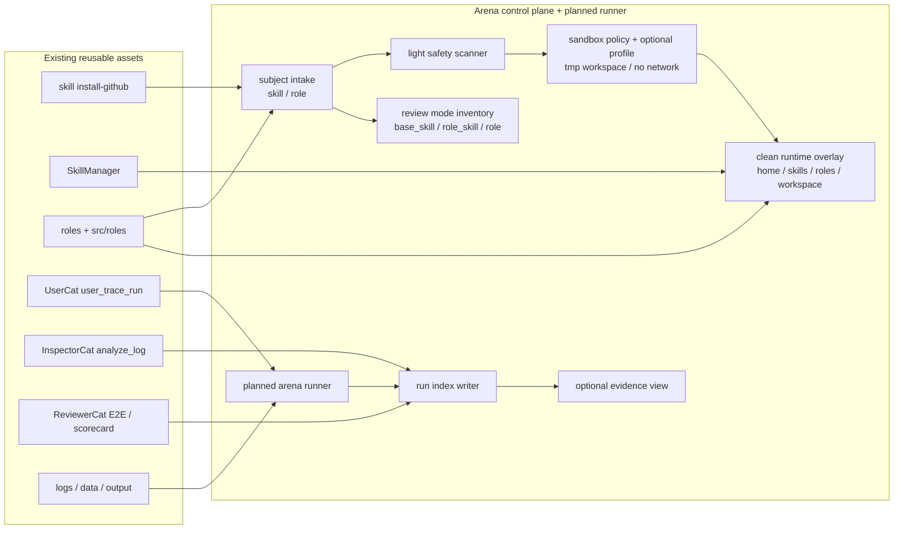

# Arena PLAN

状态：Draft
最后更新：2026-06-29
Owner：Arena maintainers / Roles & Skills maintainers

本文维护 `Arena` 能力审判场的执行计划。`docs/arena/SPEC.md` 定义模块边界、目标架构和数据合同；本文维护当前状态、里程碑、下一步和验收证据。

## Current Status

`Arena` 已被定义为 XiaoBa-CLI 的顶层产品模块，并已有最小控制面实现。v1 口径固定为三种 review mode：`base_skill` 评 Base + skill，`role_skill` 评 role + skill，`role` 评 role 本身。物理目录按三分法收敛：`src/arena` 是代码，`docs/arena` 是设计文档，根目录 `arena/` 是真实评测现场和证据。

仓库已有可复用基础：

- `xiaoba skill install-github owner/repo` 可以 clone GitHub skill，但当前是直接安装路径，不满足 arena import isolation。
- `src/arena/arena-manager.ts` 已提供 arena-only subject manifest、clean runtime overlay、run index 写入、三种 review mode inventory、evidence ref 校验和 stochastic replay attempt 校验。
- `xiaoba arena ...` 已提供 `import skill`、`import github`、`snapshot role`、`runtime prepare`、`run create` 子命令；`runtime prepare` 只准备干净运行时启动环境，`run create` 只创建和校验证据索引，不伪装成已经执行 UserCat / Inspector / Reviewer。
- `SkillManager` 可加载 base / role-local skills；Arena 现在可为每个 run 生成 run-local `home/`、`skills/`、`roles/`、`workspace/`、`tmp/`，并通过 env overlay 让目标 runtime 读取干净 subject skill / role snapshot。
- `roles/**` 和 `src/roles/**` 已维护 role 定义、role-local docs 和工具边界，但还没有统一 role scorecard run。
- `UserCat` 可通过 `user_trace_run` 走 Dashboard Chat/Pet 原生入口，扮演低质量终端用户进行真实端到端多轮使用，并产出 UserCat run package。
- `InspectorCat` 可通过 `analyze_log` 做 runtime/log issue extraction。
- `ReviewerCat` 可通过 `reviewer_eval_prepare` / `reviewer_xiaoba_cli_e2e` 生成 eval plan、trace、report 和 scorecard。
- `logs/sessions/**`、`data/**`、`output/**` 已能承载本地 evidence。

当前尚未实现或仍是部分实现：

- Safety scanner 目前是轻量文本扫描；尚未做完整脚本 / 二进制 / 依赖风险扫描。
- Arena lightweight execution sandbox 目前会记录 policy，并可为 `macos_seatbelt` 生成 Seatbelt profile / `sandbox_shell_command`；尚未由自动编排统一包裹所有 spawned commands。
- 自动触发 clean runtime launch
- 自动触发 UserCat E2E multi-turn run
- 自动调用 InspectorCat 抽 case
- 自动调用 ReviewerCat 多轮 replay / scorecard
- Optional evidence view over referenced Reviewer report; no default Arena report file
- future `eval/benchmarks/<Subject>` live case source

## Milestones

1. M0：Module spec/plan baseline：completed with `docs/arena/SPEC.md` and this plan.
2. M1：Subject intake boundary：completed for v1 metadata. `ArenaManager` writes single-file manifests for `subject.type=skill|role` and run-level `review_mode=base_skill|role_skill|role`.
3. M2：GitHub skill import：completed as isolated Arena import. `xiaoba arena import github <repo> --ref <ref>` clones into `arena/subjects/<subject-id>/source`, pins commit and does not auto-promote to production `skills/`.
4. M3：Local role snapshot：completed. `xiaoba arena snapshot role <role-id>` fingerprints role docs、role-local skills and declared tools without mutating production role state.
5. M4：Review mode inventory：completed. Run indexes record exactly one review mode plus active role, base skills, subject skill, role-local skills, registered tools, provider-visible tools and surface.
6. M5：Safety scan：partial. Current scan detects obvious high-risk text patterns in `SKILL.md` / role docs and classifies trust risk; deeper script/binary/dependency scanning remains.
7. M6：Lightweight execution sandbox：partial. Arena clean runtime indexes record sandbox policy and can emit macOS Seatbelt profile / `sandbox_shell_command`; automatic runner-side enforcement for every spawned command is not implemented yet.
8. M7：Runtime overlay：completed for manual launch. `xiaoba arena runtime prepare` creates run-local `home/`、`skills/`、`roles/`、`workspace/`、`tmp/` and launch env for `base_skill`、`role_skill`、`role` without modifying production skill or role state.
9. M8：UserCat E2E multi-turn use：partial. Arena run indexes validate and reference UserCat run packages; automatic triggering is not implemented.
10. M9：Inspector issue-to-case extraction：partial. Arena run indexes validate and reference Inspector case / issue artifacts; automatic Inspector invocation is not implemented.
11. M10：Reviewer multi-attempt replay / scorecard：partial. Arena run indexes validate Reviewer scorecard/report refs and replay attempt counts; automatic Reviewer invocation is not implemented.
12. M11：Promotion path：not started. Define explicit commands or docs for promoting a passed skill / role to production and rewriting selected runs into live eval cases.

## Next Steps

- Add the next orchestration layer only after the current manifest/run-index control plane stays stable under focused tests.
- Wire automatic `arena run` execution to the clean runtime launcher before invoking UserCat / ReviewerCat; current `runtime prepare` is manual launch and `run create` is index-only.
- Add automatic UserCat invocation only through real Pet / Chat surface, never by generated static scenarios.
- Extend sandbox enforcement from generated launch commands into the automatic runner path: temp workspace, read-only subject refs, no inherited production env, network off by default, hard timeout.
- Keep existing `xiaoba skill install-github` behavior separate from Arena import until a migration is explicitly designed.
- Define the first UserCat E2E use families: code/file skill, document/report skill, external side-effect skill, role identity/boundary, and cross-role handoff.
- Start with local-only reports; do not add public leaderboard or remote upload.
- Keep `eval/` clean: Arena output can inspire future live eval cases, but accepted eval source must be manually rewritten.
- Keep Arena thin: reuse `logs/sessions/**/traces.jsonl`, `data/user-cat/**`, `data/reviewer-runs/**`, `output/eval/**` and `eval/benchmarks/**` by reference.

## Owners

- Arena control plane：`src/arena/**`
- CLI entrypoint：`src/commands/**`
- Skill import / parsing：`src/skills/**`, `src/arena/**`
- Role snapshot / review：`roles/**`, `src/roles/**`, `src/arena/**`
- Runtime overlay：`src/core/**`, `src/skills/**`, `src/roles/**`, `src/tools/**`
- Review mode inventory：`src/arena/**`, `src/tools/**`, `src/skills/**`, `src/roles/**`
- Execution sandbox：future enforcement in `src/arena/**`, `src/tools/**`, `src/core/**`
- Low-quality end-user E2E use：`roles/user-cat/**`, `src/roles/user-cat/**`
- Issue extraction：`roles/inspector-cat/**`, `src/roles/inspector-cat/**`
- Scorecard / report：`roles/reviewer-cat/**`, `src/roles/reviewer-cat/**`
- Evidence：`logs/**`, `data/user-cat/**`, `data/reviewer-runs/**`, `output/**`; root `arena/**` stores Arena review-site subjects, clean runtimes and run indexes
- Future live eval promotion：`eval/benchmarks/<Subject>/**`

## Acceptance Criteria

- `docs/arena/SPEC.md` and `docs/arena/PLAN.md` exist and are linked from project docs.
- GitHub skill imports record source owner/repo/ref/commit and default to `trust_level=untrusted`.
- Local role reviews record source path, docs, declared tools and fingerprint without mutating production role state.
- Imported or reviewed subjects are not automatically production-visible.
- `xiaoba arena runtime prepare` creates a clean run-local runtime overlay and writes `clean-runtime.json` with launch env/commands while omitting secret values.
- Arena runs record the exact review mode and target inventory: mode `base_skill|role_skill|role`, active role, subject skill when present, loaded skills, role-local skills, registered tools, provider-visible tools and surface.
- Every executable arena run records execution sandbox policy and runs spawned commands with a temporary workspace, no inherited production env, network off by default for untrusted subjects, and hard timeout.
- Every arena run records references to low-quality UserCat run/package evidence, runtime evidence, Inspector issues and Reviewer scorecard.
- Arena-owned persistent state is limited to `arena-manifest.json`、`clean-runtime.json` and `arena-run.json` unless an explicit export is requested.
- InspectorCat outputs issue evidence and candidate cases; ReviewerCat owns multi-attempt replay and final judgment.
- Scorecards distinguish `pass`, `unstable`, `reopened`, `blocked` and `unsafe`.
- Reviewer replay treats model behavior as stochastic: one fresh successful replay does not erase a prior failure, variance-sensitive cases default to multiple attempts before closure, and scorecards record replay attempt counts plus trace refs.
- Unsafe side effects, missing confirmation, fake success without artifacts, role identity drift and missing blocked reasons are first-class issue categories.
- No Arena run is automatically copied into `eval/`.

## Risks / Open Questions

- GitHub skill repos may contain malicious or misleading instructions; import must stay non-executing by default.
- Lightweight native sandboxing is not the same as VM/container containment; untrusted subjects must stay metadata-only when no native sandbox engine is available.
- Role reviews can accidentally become role redesign; Arena should judge and report before mutating role docs.
- Skill and role metadata conventions differ; parser errors need blocked evidence rather than silent failure.
- UserCat E2E runs can be too weak or too chaotic; ReviewerCat should reject low-value UserCat evidence before scoring the subject unfairly.
- Replay can become theater if it reuses the old assistant answer or treats one lucky fresh run as closure; ReviewerCat replay must drive current runtime again, preserve the original failure evidence and sample enough attempts to identify instability.
- InspectorCat and ReviewerCat can initially be implemented as internal lenses inside Arena, even if their role boundaries remain separate in data contracts.
- Running external side-effect subjects requires confirmation gates and possibly fake/test connectors before real credentials are allowed.

## Verification Log

- 2026-06-29：Moved Arena review-site data root from the old nested data root to root `arena/**` per the physical split `src/arena` = code, `docs/arena` = design docs, `arena/` = real review site and evidence. Verification：`node --test -r tsx test/arena-manager.test.ts test/arena-command.test.ts`；`node --test -r tsx test/skill-manager-runtime.test.ts test/role-manager.test.ts`；`npm run build`；root write smoke created `arena/subjects/skill-602b8b3c25/arena-manifest.json` and `arena/runs/arena-root-smoke-20260629-01/clean-runtime.json`；`node dist/index.js arena import --help`；old nested Arena path grep returned no hits；`npm test`（387/387）。
- 2026-06-29：Implemented clean Arena runtime preparation: `xiaoba arena runtime prepare` now creates run-local `home/`、`skills/`、`roles/`、`workspace/`、`tmp/`, copies default base skills plus the subject skill / role snapshot according to `base_skill`、`role_skill`、`role`, writes `clean-runtime.json`, emits explicit launch env and macOS Seatbelt `sandbox_shell_command`, and keeps secret values out of persisted JSON. Verification：`node --test -r tsx test/arena-manager.test.ts test/arena-command.test.ts`；`node --test -r tsx test/skill-manager-runtime.test.ts test/role-manager.test.ts`；`npm run build`；`node dist/index.js arena runtime prepare --help`；`node dist/index.js arena runtime prepare --mode base_skill --subject skill-6697f0dfff --run-id arena-hang-to-la-clean-20260629-01 --pass-env OPENAI_API_KEY`；`npm test`（387/387）。
- 2026-06-29：Implemented Arena v1 minimal control plane: `src/arena/arena-manager.ts`, `src/arena/types.ts`, `src/commands/arena.ts`, CLI registration, local skill import, GitHub skill isolated import, role snapshot, run index creation, evidence ref validation and stochastic replay attempt validation. Verification：`node --test -r tsx test/arena-manager.test.ts test/arena-command.test.ts`；`node --test -r tsx test/user-cat-role.test.ts`；`npm run build`；`npm test`（383/383）；`node dist/index.js arena --help`。
- 2026-06-29：Clarified UserCat semantics: UserCat is not a scenario generator; it performs real end-to-end multi-turn use through the selected surface and produces run evidence. Verification：docs review and `git diff --check -- docs/arena/SPEC.md docs/arena/PLAN.md docs/PLAN.md`。
- 2026-06-29：Clarified InspectorCat / ReviewerCat boundary: InspectorCat finds trace issues and proposes candidate cases, while ReviewerCat performs multi-attempt replay and owns final judgment. Verification：docs review and `git diff --check -- docs/arena/SPEC.md docs/arena/PLAN.md`。
- 2026-06-29：Added stochastic replay semantics: ReviewerCat does not close a prior failure just because one fresh replay succeeds; mixed replay outcomes become `unstable`, and variance-sensitive cases default to multiple attempts. Verification：docs review and `git diff --check -- docs/arena/SPEC.md docs/arena/PLAN.md docs/PLAN.md`。
- 2026-06-29：Simplified the Arena target Mermaid into a one-screen reader map: three review modes -> import/snapshot -> UserCat -> target runtime -> native evidence -> Inspector/Reviewer -> scorecard. Verification：docs review and `git diff --check -- docs/arena/SPEC.md docs/arena/PLAN.md`。
- 2026-06-29：Slimmed Arena data design: Arena review-site data lives under root `arena/` and owns subject manifests, clean runtime indexes and run indexes, while reusing low-quality UserCat run packages, session traces, Reviewer scorecards and eval outputs by reference. Verification：docs review and `git diff --check -- docs README.md roles`。
- 2026-06-29：Fixed Arena v1 to exactly three review modes: `base_skill` for Base + skill, `role_skill` for role + skill, and `role` for role-only quality review. Verification：docs review and `git diff --check -- docs/arena/SPEC.md docs/arena/PLAN.md docs/SPEC.md docs/PLAN.md`。
- 2026-06-29：Earlier Base-only skill review profile was expanded toward role-context review, then superseded by the fixed three-mode contract: `base_skill`、`role_skill`、`role`. Verification：docs review and `git diff --check -- docs/arena/SPEC.md docs/arena/PLAN.md docs/PLAN.md`。
- 2026-06-29：Added Base XiaoBa skill review profile and replay semantics: default skill reviews run Base role plus 5 packaged base skills plus subject skill, 12 base tools plus optional 2 surface delivery tools, and Reviewer replay means fresh current-runtime execution rather than reusing the old assistant transcript. Verification：docs review and `git diff --check -- docs README.md roles`。
- 2026-06-29：Reframed Arena sandbox as a lightweight Codex-like execution sandbox for spawned commands: macOS Seatbelt, Linux/WSL2 bubblewrap, Windows native where available, metadata-only fallback for untrusted subjects, no Docker requirement. Verification：docs review and `git diff --check -- docs README.md roles`。
- 2026-06-29：Renamed the module to `Arena` and expanded scope from skill-only review to generic subject review covering skills, roles and future adapter / harness recipes. Verification：stale-name grep returned no current docs hits；`rg -n "docs/arena|src/arena|xiaoba arena|subject-under-review" docs README.md`；`git diff --check -- docs README.md`。
- 2026-06-29：Created the original skill-only module spec/plan baseline and added the module to project architecture docs. Verification：module-reference grep and `git diff --check -- docs README.md`。

## Status Maintenance Rules

- Update this plan whenever `docs/arena/SPEC.md` changes subject, run, scorecard or promotion contracts.
- Do not mark an implementation milestone complete without code, docs and verification evidence.
- Keep Arena-owned review-site state under root `arena/**`. Default reports should stay Reviewer-owned unless explicitly referenced or exported into an Arena run.
- Keep Arena separate from `eval/` until a run is manually rewritten into a live agent eval case.
