# Arena PLAN

状态：Active
最后更新：2026-07-13
Owner：Arena maintainers

Arena is the candidate capability acceptance environment. It reviews skills and roles; it does not replace Evaluation or automatically promote a subject.

## Current Status

- Three review modes exist: `base_skill`, `role_skill`, and `role`.
- GitHub skill import and local role snapshot remain isolated from production assets.
- Clean runtime preparation records run-local home, skills, roles, workspace and temp roots.
- The executable path runs UserCat → target runtime → InspectorCat → ReviewerCat and writes an Arena scorecard.
- Seven SkillsBench-derived live proofs calibrated UserCat/InspectorCat/ReviewerCat and Arena decisions against hidden verifiers; this is evidence for the review loop, not universal proof.
- Promotion into production skills/roles or Live Agent Eval remains explicit and manual.
- Sandbox network/secret isolation and cross-platform adapters need further hardening.

```mermaid
flowchart LR
    Subject["candidate skill / role"] --> Clean["clean runtime"]
    Clean --> User["UserCat pressure"]
    User --> Evidence["native trace / artifacts"]
    Evidence --> Inspector["InspectorCat"]
    Inspector --> Reviewer["ReviewerCat replay"]
    Reviewer --> Score["scorecard"]
    Score -. "explicit promotion only" .-> Trusted["trusted assets"]
```

## Milestones

1. Subject manifest and three review modes：completed。
2. Clean runtime overlay：completed。
3. Automatic UserCat/InspectorCat/ReviewerCat run path：completed。
4. Scorecard and run index：completed。
5. Hidden-verifier calibration proof：completed for seven current cases。
6. Strong secret/network isolation：partial。
7. Linux/Windows sandbox adapters：not started。
8. Explicit promotion workflow with runtime enforcement：not started。

## Next Steps

- Make recorded sandbox/network policy match enforced OS behavior.
- Keep provider credentials outside subject tool environments.
- Repeat calibration across seeds, providers and time windows before broad claims.
- Add explicit Owner promotion that changes candidate status only after reviewed evidence.
- Keep full proof corpora outside the main repository when they are not product runtime assets.

## Owners

- Arena commands/control plane：`src/commands/arena.ts`, `src/arena/**`
- Review-site state：`arena/**`
- Evaluator roles：UserCat, InspectorCat, ReviewerCat under Roles & Skills
- Fresh evidence：Agent Runtime and Observability & Evidence

## Acceptance Criteria

- Imported subjects do not enter production `skills/` or role registration by default.
- Every executable run declares one review mode and one subject.
- Clean runtime manifests contain no secret values.
- A pass requires fresh runtime evidence and Reviewer-owned verification.
- Unsafe behavior remains visible even when the task output is useful.
- Promotion requires explicit human/maintainer action.
- Arena architecture changes update this PLAN and [`SPEC.md`](SPEC.md) only.

## Risks / Open Questions

- Current sandbox metadata can overstate network/secret isolation if OS policy is weaker.
- Seven calibration cases do not prove cross-provider or long-term generalization.
- Candidate/blocked lifecycle is not yet enforced consistently by role/skill loaders.
