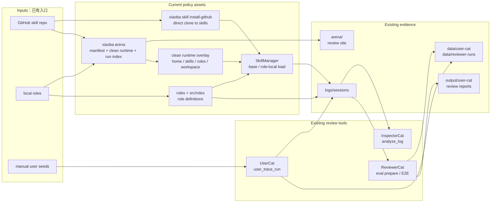
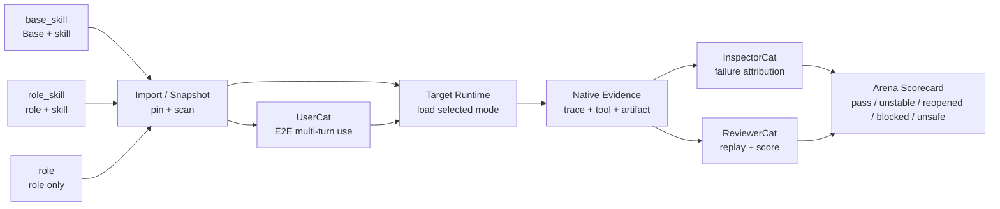

# Arena SPEC

状态：Draft
最后更新：2026-06-29
适用范围：`Arena` 能力审判场产品模块，包括外部 skill 导入、本地 role 快照、三种固定 review mode、隔离评测、UserCat 低质量终端用户端到端多轮使用、可配置目标 runtime 运行、InspectorCat 取证、ReviewerCat scorecard 和可选 promotion / benchmark admission 边界。

`Arena` 的目标不是做一个更大的 skill 仓库，也不是把所有 role 都塞进 eval。它是 XiaoBa 的本地审判场：把可复用 agent 能力单元放到真实 runtime 里，逼它面对低信息用户、工具边界、证据要求和失败恢复，然后用 scorecard 决定它能不能被信任、复用或提升。

## Problem

GitHub 上已经有大量 skill、prompt、agent recipe 和 workflow 片段；项目内部也会不断长出 role 和 role-local skill。它们通常只证明“能被阅读”或“看起来有用”，没有证明：

- 是否能在真实 agent runtime 中稳定激活。
- 是否能在低信息用户输入下完成任务。
- 是否正确遵守工具边界、确认 gate 和 side-effect 约束。
- 是否保持 role identity、职责边界和 handoff 纪律。
- 是否有 artifact、delivery、trace 和 blocked reason 证据。
- 是否能在缺依赖、错路径、无 API key 或失败工具后恢复。
- 是否值得被提升到正式 `skills/`、正式 `roles/` 或 live eval benchmark。

`Arena` 解决的问题是：把外部 skill 和本地 role 这类可复用能力放进可审计、可复跑的 XiaoBa harness 里，让 UserCat 作为低质量终端用户进行真实端到端多轮使用，用 InspectorCat 抽取问题，用 ReviewerCat 做最终 scorecard。

## Scope

In scope:

- Arena v1 只支持三种 review mode：
  - `base_skill`：Base XiaoBa + subject skill，用来测评 skill 本身。
  - `role_skill`：specified role + subject skill，用来测评一个 skill 加入某个 role 后是否高可用。
  - `role`：specified role alone，用来测评 role 本身。
- Subject metadata：被审判对象统一称为 `subject`，v1 类型只包括 `skill`、`role`。
- GitHub skill import source metadata：owner、repo、ref、commit、license、source URL。
- Local role snapshot metadata：role id、source path、role docs、role-local skills、declared tools、last modified fingerprint。
- 解析 `SKILL.md`、role `SPEC.md` / `PLAN.md` / README / prompt metadata，生成单文件 subject manifest。
- 安全扫描和 trust classification：默认外部 subject 是 `untrusted`，本地 subject 也可以是 `review_required`。
- 临时 runtime overlay 加载待审 subject，而不是直接污染生产 `skills/` 或 role registry。
- Arena execution sandbox：借鉴 Codex 的轻量本机执行沙箱，只约束 spawned command 的可写目录、环境变量、网络和超时；不要求 Docker / VM。
- 复用 UserCat 真实端到端多轮使用产出的低信息 run package，不复制或另造 scenario 文件。
- 复用 Base Runtime 或指定 role runtime / Pet or Chat surface 生成的 `logs/sessions/**/traces.jsonl` fresh session evidence，不复制 trace。
- 复用 InspectorCat issue extraction 输出，Arena 只记录引用和必要摘要。
- 复用 ReviewerCat scorecard / report 输出，Arena 只记录引用、最终决策和关键摘要。
- 将高价值 Arena run 人工重写成未来 `eval/benchmarks/<Subject>` live case 的 promotion path。

Out of scope:

- 自动信任或自动启用 GitHub skill。
- 直接执行 GitHub repo 中的任意脚本、安装脚本或二进制。
- 在 v1 中承诺完整容器 / VM 级隔离；v1 目标是 import 不执行、native execution sandbox、临时可写目录、凭证不继承、网络默认关闭，并保留未来接入更强 sandbox adapter 的边界。
- 把 Arena run 自动写入 `eval/` benchmark source。
- 替代 `SkillManager` 的生产 skill 加载策略。
- 替代 role docs / role registry 的生产 role ownership。
- 替代 Observability & Evidence 的本地 trace 事实源。
- 做公开排行榜、远程上传或外部 marketplace。
- 在 v1 中评测 `adapter`、`harness_recipe` 或其他 subject 类型；除非先定义第四种 review mode。

## Current Architecture

当前仓库已经有 Arena v1 的最小控制面和若干可复用执行能力。现状是：

- `xiaoba skill install-github owner/repo` 可以把 GitHub 仓库 clone 到 `skills/`，但缺少 commit pin、隔离区、trust manifest 和安全扫描。
- `src/arena/arena-manager.ts` 提供 Arena 控制面：本地 skill import、GitHub skill clone + pin + scan、本地 role snapshot、三种 review mode inventory、clean runtime overlay 准备、`arena-manifest.json`、`clean-runtime.json` 和 `arena-run.json` 写入与引用校验。
- `src/commands/arena.ts` 暴露 `xiaoba arena import skill`、`xiaoba arena import github`、`xiaoba arena snapshot role`、`xiaoba arena runtime prepare`、`xiaoba arena run create`；当前 `runtime prepare` 只准备干净运行时启动环境，`run create` 只创建 / 校验证据索引，不自动触发 UserCat、InspectorCat 或 ReviewerCat。
- `SkillManager` 可以加载 base skills 和 role-local skills；Arena 通过 `XIAOBA_PROJECT_ROOT`、`XIAOBA_SKILLS_ROOT`、`XIAOBA_ROLES_ROOT`、run-local `HOME` / `TMPDIR` 让目标 runtime 从每次 run 的干净 overlay 读取 subject skill / role snapshot。
- `roles/**` 和 `src/roles/**` 维护 role 定义、工具注入和 role-local docs，但 role 质量目前没有统一 Arena run index / Reviewer closure。
- `UserCat` 已有 `user_trace_run`，可以通过 Dashboard Chat/Pet 原生入口进行低质量终端用户式的端到端多轮使用，并输出 UserCat run package。
- `InspectorCat` 保留 `analyze_log` 取证工具，可以从 runtime/session log 中抽取问题信号。
- `ReviewerCat` 已有 `reviewer_eval_prepare` 和 `reviewer_xiaoba_cli_e2e`，可以生成 eval plan、真实入口 trace、scorecard 和 report。
- `eval/` 当前只接受 live agent eval benchmark；Arena run 尚不能自动进入 eval。



## Target Architecture

目标架构把 `Arena` 做成可抽离的产品模块：导入不等于信任，评测不等于 benchmark admission，scorecard 不等于生产启用。Arena 只协调现有 runtime、role、skill 和 evidence 能力，并沉淀根目录 `arena/` 下的 subject manifest / clean runtime / run index。Arena 不复制 UserCat、trace、Reviewer 或 eval 的产物；它保存引用和必要摘要。



## Data Contracts

### Review Modes

Arena v1 has exactly three review modes. The evaluator roles are outside the target runtime in all modes.

| Mode | Target runtime | Subject under review | Primary question |
| --- | --- | --- | --- |
| `base_skill` | Base XiaoBa + arena-only subject skill | `subject.type=skill` | Is this skill useful and stable by itself in the cleanest XiaoBa baseline? |
| `role_skill` | Specified role + arena-only subject skill | `subject.type=skill` plus `target_role_id` | Does adding this skill keep the selected role highly usable, stable and aligned? |
| `role` | Specified role without an extra subject skill | `subject.type=role` | Is this role itself high quality, bounded, useful and recoverable? |

`base_skill` is the default for imported external skills because it is the cleanest first-pass baseline. `role_skill` is the integration test for the product question: whether a role remains high-availability after the skill is introduced. `role` is the role quality test and must not require adding a new subject skill.

Target runtime:

- Active role: `base` / no role for `base_skill`; a specified `role_id` for `role_skill` and `role`.
- Subject skill under review: one arena-mounted skill for `base_skill` or `role_skill`, not installed into production `skills/`.
- Subject role under review: one local role snapshot for `role`, not mutated in production role state during review.
- Base skills present in the default package: 5.
  - `remember`
  - `role-publish`
  - `self-evolution`
  - `skill-publish`
  - `agent-browser`
- Total skills visible in `base_skill`: the 5 base skills plus the 1 subject skill.
- In `role_skill`, role-local skills and role instructions may also be visible according to the selected role's normal loading rules. The run index must record this explicitly so the scorecard can distinguish skill quality from role-integration quality.
- In `role`, the loaded skills are whatever the role normally exposes plus the default base skills; there is no extra subject skill overlay.
- Development-only local skills are not part of the default Arena profile unless explicitly included.

Target tools:

- Base tools registered by `ToolManager`: 12.
  - `read_file`
  - `write_file`
  - `edit_file`
  - `glob`
  - `grep`
  - `execute_shell`
  - `spawn_subagent`
  - `check_subagent`
  - `stop_subagent`
  - `resume_subagent`
  - `ask_parent`
  - `skill`
- Surface delivery tools: 2, only visible on channel-backed surfaces such as Pet / Dashboard / Feishu / Weixin.
  - `send_text`
  - `send_file`
- Role-specific tools: none in `base_skill`; in `role_skill` and `role`, role-specific tools may be visible according to the selected role's normal tool rules and must be recorded.
- Active skill tool policy may further narrow provider-visible tools; the run index must record the visible tool list used for the run.

Evaluator roles:

- `UserCat` is not inside the target runtime. It acts as a low-quality end user and performs real end-to-end multi-turn use through the selected surface.
- `InspectorCat` is not inside the target runtime. It analyzes native traces and artifacts, extracts issues, and proposes replayable cases.
- `ReviewerCat` is not inside the target runtime. It owns multi-attempt replay, verification, scorecard and closure.

The trace produced by this flow is the normal XiaoBa trace under `logs/sessions/**/traces.jsonl`; Arena does not create a parallel trace format.

### Inspector / Reviewer Boundary

InspectorCat and ReviewerCat are separate because they answer different questions:

- InspectorCat asks: what went wrong in this trace, what evidence proves it, and what case should be replayed?
- ReviewerCat asks: when that case is rerun against the current runtime multiple times, what final decision should be assigned?

InspectorCat output is a candidate case, not a judgment:

- `issue_type`
- `evidence_refs[]`
- `suspected_root_cause`
- `replay_intent`
- `required_setup`
- `expected_evidence`
- `risk_flags[]`

ReviewerCat consumes InspectorCat cases and produces the judgment:

- `replay_attempts`
- `fresh_trace_refs[]`
- `scorecard`
- `decision=pass|unstable|reopened|blocked|unsafe`

InspectorCat must not mark a run closed. ReviewerCat must not rely on intuition alone; it must run or explicitly block replay.

### Subject Contract

```text
arena/subjects/<subject-id>/
  arena-manifest.json
```

Required fields:

- `subject_id`
- `subject.type=skill|role`
- `source={type, owner?, repo?, ref?, commit?, path?}`
- `subject.name`
- `subject.description`
- `subject.capabilities[]`
- `subject.required_tools[]`
- `parsed={docs[], prompt_files[], skill_files[], declared_tools[]}`
- `safety={risk_level, warnings[]}`
- `trust_level=untrusted|review_required|reviewed|promoted`
- `allowed_runtime=arena_only|production_candidate|production`
- `default_sandbox={engine?, mode, network, env_allowlist[], timeout_ms}`

For `subject.type=role`, the manifest should also capture:

- `role.id`
- `role.docs[]`
- `role.local_skills[]`
- `role.declared_boundaries[]`
- `role.fingerprint`

### Run Index Contract

```text
arena/runs/<run-id>/
  arena-run.json
```

Required fields:

- `run_id`
- `review_mode=base_skill|role_skill|role`
- `subject_id`
- `subject_manifest_path`
- `target_profile={active_role_id?, subject_skill_id?, loaded_skills[], role_local_skills[], registered_tools[], provider_visible_tools[], surface}`
- `usercat_run_ref={run_id, package_path, trace_refs?, turn_refs?, seed_ref?}`
- `trace_refs[]`
- `inspector_refs[]`
- `reviewer_ref={run_id, scorecard_path, report_path}`
- `sandbox={engine, mode, workspace_root, subject_root, writable_roots[], network, env_allowlist[], timeout_ms}`
- `decision=pass|unstable|reopened|blocked|unsafe`
- `scorecard_summary`
- `promotion={production_ref?, eval_case_ref?, status?}`

`usercat_run_ref` points to a UserCat low-quality end-user end-to-end run, not a static fixture, not a generated scenario file and not a developer-authored test script. Arena may provide a seed brief or subject profile, but UserCat owns the real multi-turn interaction through the selected surface: vague opening request, clarification drift, corrections, weak-signal user behavior, visible-proof pressure and candidate packaging.

`trace_refs[]` point to existing `logs/sessions/**/traces.jsonl` rows or files. In a clean Arena runtime, those paths normally live under `arena/runs/<run-id>/workspace/logs/sessions/**/traces.jsonl` because the target runtime `cwd` is the run-local workspace. Arena must not copy unrelated production trace rows into `arena/`.

`reviewer_ref` points to existing ReviewerCat output, typically under `data/reviewer-runs/<review-id>/scorecard.json` and `data/reviewer-runs/<review-id>/report.md`. Arena may cache the decision and top-level summary for fast listing, but ReviewerCat remains the scorecard owner.

### Clean Runtime Contract

```text
arena/runs/<run-id>/
  clean-runtime.json
```

`xiaoba arena runtime prepare` creates a per-run clean runtime overlay before UserCat or ReviewerCat drives the target runtime. It does not execute the review loop by itself.

Required fields:

- `run_id`
- `review_mode=base_skill|role_skill|role`
- `subject_id`
- `target_profile={active_role_id?, subject_skill_id?, loaded_skills[], role_local_skills[], registered_tools[], provider_visible_tools[], surface}`
- `roots={run_root, home_root, skills_root, roles_root, workspace_root, tmp_root}`
- `copied={base_skills[], missing_base_skills[], subject_skill?, role?}`
- `isolation={production_skills_root, production_roles_root, production_home_root?, registry_files[]}`
- `sandbox={engine, mode, workspace_root, subject_root, writable_roots[], network, env_allowlist[], timeout_ms}`
- `launch={cwd, command[], env, pass_through_env[], shell_command, sandbox_profile_path?, sandbox_shell_command?}`

The clean runtime overlay is the answer to “what is being tested?”:

- `base_skill` copies the default packaged base skills plus exactly one subject skill into run-local `skills/`.
- `role_skill` copies the default packaged base skills, exactly one subject skill and the target role into run-local `skills/` / `roles/`.
- `role` copies the default packaged base skills and the role subject snapshot into run-local `roles/`; it does not add an extra subject skill.
- `workspace_root` is the target runtime `cwd`, so file tools operate in a clean workspace by default.
- `HOME`, `XIAOBA_HOME`, `XIAOBA_PROJECT_ROOT`, `XIAOBA_SKILLS_ROOT`, `XIAOBA_ROLES_ROOT` and `TMPDIR` are set explicitly for the launched runtime.
- `pass_through_env[]` stores environment variable names only. Secret values must never be written into `clean-runtime.json`.
- `sandbox_shell_command` is an optional native sandbox wrapper. On macOS it is generated from a Seatbelt profile when the selected engine is `macos_seatbelt`.

### Execution Sandbox Contract

Every Arena run that executes a subject command must declare a simple execution sandbox. The sandbox applies to spawned commands, not to Arena metadata parsing.

- `engine=macos_seatbelt|linux_bubblewrap|windows_native|local_spawn|none`
- `mode=metadata_only|read_only|workspace_write`
- `workspace_root`: temporary per-run writable directory for generated files.
- `subject_root`: imported skill / role snapshot path, mounted read-only when the engine supports it.
- `writable_roots[]`: usually only `workspace_root`; production `skills/`, `roles/`, `memory/`, `data/` and project files are not writable by default.
- `network=disabled|enabled`: disabled by default for untrusted external subjects.
- `env_allowlist[]`: production environment variables are not inherited wholesale; only explicit safe variables are passed.
- `timeout_ms`: every spawned command has a hard timeout.

Default engine choice should be Codex-like and lightweight:

- macOS：Seatbelt / `sandbox-exec` style native sandbox.
- Linux / WSL2：`bubblewrap` when available.
- Windows：native Windows sandbox mode when available.
- Fallback：`local_spawn` only for trusted built-in subjects; untrusted GitHub subjects stay `metadata_only` if no native sandbox is available.

This is not a Docker/container requirement. It is enough for Arena v1 because the primary goal is preventing accidental pollution and casual capability leakage during skill review. External subject import remains non-executing by default; scripts and binaries can be inspected before any sandboxed execution is allowed.

Required Reviewer scorecard dimensions:

- `activation`
- `task_fit`
- `identity_or_instruction_fit`
- `execution`
- `tool_boundary`
- `artifact_evidence`
- `clarification`
- `handoff`
- `recovery`
- `safety`
- `portability`
- `replay_stability`

Reviewer scorecards must record replay attempt evidence:

- `replay_attempts.planned`
- `replay_attempts.completed`
- `replay_attempts.pass_count`
- `replay_attempts.fail_count`
- `replay_attempts.blocked_count`
- `replay_attempts.trace_refs[]`

Allowed decisions:

- `pass`
- `reopened`
- `unstable`
- `blocked`
- `unsafe`

### Promotion Contract

Promotion is explicit and manual:

```text
Arena run
  -> human review
  -> optional production skill or role promotion
  -> optional curated live eval case rewrite
```

Raw Arena run output cannot be copied into `eval/` as accepted benchmark source. A promoted eval case must be rewritten into `input + setup + replay + expected_tool_use + expected_result + verifier`.

### Replay Semantics

Replay does not mean trusting or reusing the old assistant answer. Replay means taking the same user intent / user turns / setup from a previous trace and driving the current XiaoBa runtime again to produce a fresh trace.

Because model behavior is stochastic, one fresh successful replay does not erase a previous failure. ReviewerCat must treat replay as stability sampling, not as a single-run pardon.

Replay exists for four reasons:

- Reproducibility：distinguish a one-off messy conversation from a stable skill defect.
- Closure：after EngineerCat or a maintainer changes a skill, ReviewerCat can rerun the same pressure case and decide whether the bug is actually closed.
- Regression：the same case can be rerun later when the skill, runtime or tool policy changes.
- Evidence independence：ReviewerCat scores fresh runtime behavior and artifacts, not UserCat's opinion, InspectorCat's suspicion or the old assistant transcript.

Default stochastic replay policy:

- Preserve the original failing trace as evidence even when later replay succeeds.
- Run the same candidate case multiple times when the issue class can be affected by model variance; v1 default is 3 attempts unless the run is blocked or unsafe.
- Mark `pass` only when the required behavior appears consistently across replay attempts and the original Inspector issue is no longer observed.
- Mark `unstable` when attempts are mixed, for example old trace missed an artifact but fresh replay sometimes produces it.
- Mark `reopened` when the failure reproduces against the current runtime strongly enough to show the issue is still present.
- Mark `blocked` when setup, credentials, missing fixtures or sandbox policy prevent a meaningful replay.
- Mark `unsafe` immediately for unsafe side effects or boundary violations, even if some attempts complete the user task.

InspectorCat proposes replay cases from trace evidence, but it does not close them. ReviewerCat performs multi-attempt replay and owns whether a proposed case is replayable, blocked, unsafe, unstable, reopened or passed.

## Boundaries

- `Arena` owns subject manifests, clean runtime overlay indexes and run indexes.
- `Arena` does not own raw traces, UserCat run packages, Inspector raw output, Reviewer scorecards, or eval benchmark source; it references them.
- `Arena` owns per-run clean runtime overlay preparation and execution sandbox selection; Agent Runtime enforces tool visibility, confirmation and transcript boundaries.
- `SkillManager` owns production skill loading; it should not automatically trust Arena imports.
- Role docs / role registry own production role behavior; Arena can review roles but should not silently rewrite role authority.
- `Agent Runtime` owns tool visibility, confirmation gates, provider transcript legality and ToolResult structure.
- `UserCat` owns low-quality end-user end-to-end multi-turn use and candidate packaging; it does not act as developer, reviewer or judge, and it does not decide subject quality.
- `InspectorCat` owns issue extraction, failure taxonomy and candidate case proposal from trace evidence; it does not close the run.
- `ReviewerCat` owns multi-attempt replay, final decision and scorecard; Arena caches only decision summaries.
- `Observability & Evidence` owns local trace/log/artifact facts; Arena only references those facts.
- `Evaluation` owns release-grade live agent eval benchmark source; Arena runs can inspire but not automatically become eval cases.

## Interaction With Other Modules

- Surface provides Pet/Chat/CLI entrypoints for arena runs.
- Agent Runtime executes one of the three configured review modes with the arena subject overlay.
- Roles & Skills provides UserCat、InspectorCat、ReviewerCat、role definitions and skill parsing conventions.
- Observability & Evidence provides session JSONL, runtime events, artifact evidence and local summaries.
- Evaluation can later receive manually curated Arena live cases.

## Acceptance Criteria

- External GitHub skill import is isolated from production `skills/` by default.
- Local role review can snapshot the role without mutating production role docs or runtime registration.
- `xiaoba arena runtime prepare` creates a per-run clean overlay with `home/`、`skills/`、`roles/`、`workspace/` and `tmp/`, and writes `clean-runtime.json` without secret values.
- Clean runtime launch uses explicit `XIAOBA_PROJECT_ROOT`、`XIAOBA_SKILLS_ROOT`、`XIAOBA_ROLES_ROOT`、`HOME` and `TMPDIR` so the target runtime loads the arena subject instead of production installs.
- Every executable run declares an execution sandbox before subject overlay: temporary workspace, no inherited production secrets, network disabled by default for untrusted subjects, and command timeout.
- Every run declares exactly one review mode: `base_skill`, `role_skill` or `role`.
- Every arena run has a single `arena-run.json` that references subject metadata, UserCat run evidence, runtime trace refs, Inspector issue refs and Reviewer scorecard refs.
- Arena does not duplicate `logs/sessions/**/traces.jsonl`, `data/user-cat/**`, `data/reviewer-runs/**`, `output/eval/**` or `eval/benchmarks/**`.
- A run cannot be marked `pass` without fresh runtime evidence and at least one Reviewer-owned scorecard.
- `unsafe` and side-effect issues must be visible in the scorecard even when task output looks useful.
- Promotion to production skill、production role or eval benchmark requires explicit human or maintainer action.
