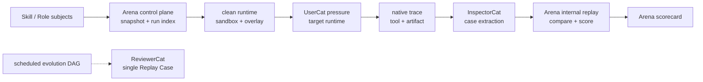

# Arena SPEC

状态：Active
最后更新：2026-07-15
适用范围：`Arena` 候选能力验收场，包括外部 skill 导入、本地 role 快照、三种固定 review mode、隔离评测、UserCat 低信息端到端使用、InspectorCat 取证、Arena 自有 multi-case replay / compare / scoring 和显式 promotion 边界。

`Arena` 的目标不是做一个更大的 skill 仓库，也不是把所有 role 都塞进 eval。它把候选能力放进 clean runtime，经低信息用户压力、原生证据、问题提取和复跑验收后生成 scorecard。Arena 给出接纳证据，但不自动安装、启用或晋升能力。

## 需求来源

Arena 的需求不是来自“再做一个评测系统”，而是来自 XiaoBa-CLI 的可信能力准入问题：外部和本地 agent 能力越来越多，但默认包、role hub 和生产 runtime 只能接收经过证明的能力。

主要来源：

- GitHub skills / prompts / agent recipes 泛滥，但大多数只证明“写得像说明书”，没有证明能在真实 XiaoBa runtime 里稳定激活、完成任务、产出 artifact 和处理失败。
- XiaoBa 默认包需要可信准入。默认只跟踪少量 base skills 和核心 roles，新 skill / role 进入默认包或推荐路径前，必须先证明高可用、可隔离、可复跑、不会污染 role 行为。
- 真实用户输入低信息、多轮、混乱。静态 benchmark prompt 无法代表“帮我弄一下”“你看着办”这类真实使用，所以 Arena 需要 UserCat 通过真实 surface 多轮使用目标 runtime。
- 单纯 verifier pass/fail 不足以解释 agent 能力。XiaoBa 需要知道失败证据在哪里、是否 fake success、能否 replay、是偶发还是稳定缺陷、是否 unsafe。
- LLM 行为有随机性。一次成功不能抹掉一次失败，Arena 需要从 Inspector case 中选取多个样本，自己执行多轮 replay / compare，并区分 `pass`、`unstable`、`reopened`、`blocked`、`unsafe`。
- 评测链本身也要被证明可信。UserCat 压力、InspectorCat 取证与 Arena replay / compare / scoring 不能只靠自我声明有效；它们需要用 SkillsBench 这类外部 task / skill / oracle / verifier gold cases 校准。

因此 Arena 的产品需求可以表述为：

```text
Before a skill or role becomes trusted, Arena must prove it works in a clean
XiaoBa runtime, under low-information real user interaction, with native trace
evidence, issue extraction, replay verification and an externally calibrated
evaluator loop.
```

## Problem

GitHub 上已经有大量 skill、prompt、agent recipe 和 workflow 片段；项目内部也会不断长出 role 和 role-local skill。它们通常只证明“能被阅读”或“看起来有用”，没有证明：

- 是否能在真实 agent runtime 中稳定激活。
- 是否能在低信息用户输入下完成任务。
- 是否正确遵守工具边界、确认 gate 和 side-effect 约束。
- 是否保持 role identity、职责边界和 handoff 纪律。
- 是否有 artifact、delivery、trace 和 blocked reason 证据。
- 是否能在缺依赖、错路径、无 API key 或失败工具后恢复。
- 是否值得被提升到正式 `skills/`、正式 `roles/` 或 live eval benchmark。

`Arena` 解决的问题是：把外部 skill 和本地 role 这类可复用能力放进可审计、可复跑的 XiaoBa harness 里，让 UserCat 作为低质量终端用户进行真实端到端多轮使用，用 InspectorCat 抽取问题，再由 Arena 自己执行 multi-case replay / compare 并产生最终 scorecard。

## Scope

In scope:

- Arena v1 只支持三种 review mode：
  - `base_skill`：Base XiaoBa + subject skill，用来测评 skill 本身。
  - `role_skill`：specified role + subject skill，用来测评一个 skill 加入某个 role 后是否高可用。
  - `role`：specified role alone，用来测评 role 本身。
- Subject metadata：被验收对象统一称为 `subject`，v1 类型只包括 `skill`、`role`。
- GitHub skill import source metadata：owner、repo、ref、commit、license、source URL。
- Local role snapshot metadata：role id、source path、role docs、role-local skills、declared tools、last modified fingerprint。
- 解析 `SKILL.md`、`role.json`、prompt 和 role-local skill metadata，生成单文件 subject manifest。
- 安全扫描和 trust classification：默认外部 subject 是 `untrusted`，本地 subject 也可以是 `review_required`。
- 临时 runtime overlay 加载待审 subject，而不是直接污染生产 `skills/` 或 role registry。
- Arena execution sandbox：借鉴 Codex 的轻量本机执行沙箱，只约束 spawned command 的可写目录、环境变量、网络和超时；不要求 Docker / VM。
- 复用 UserCat 真实端到端多轮使用产出的低信息 run package，不复制或另造 scenario 文件。
- 复用 Base Runtime 或指定 role runtime / Pet or Chat surface 生成的 `logs/sessions/**/traces.jsonl` fresh session evidence，不复制 trace。
- 复用 InspectorCat issue extraction 输出，Arena 只记录引用和必要摘要。
- Arena 从 Inspector case 中选取 replay 对象，自己执行多次 replay / compare 并写入 Arena scorecard / report。
- 将高价值 Arena run 人工重写成未来 `eval/benchmarks/<Subject>` live case 的 promotion path。
- 用外部已验证 task / skill / oracle / verifier 数据校准 UserCat 压力、InspectorCat 取证和 Arena replay / compare / scorecard 本身。

Out of scope:

- 自动信任或自动启用 GitHub skill。
- 直接执行 GitHub repo 中的任意脚本、安装脚本或二进制。
- 在 v1 中承诺完整容器 / VM 级隔离；v1 目标是 import 不执行、native execution sandbox、临时可写目录、凭证不继承、网络默认关闭，并保留未来接入更强 sandbox adapter 的边界。
- 把 Arena run 自动写入 `eval/` benchmark source。
- 把外部 SkillsBench task 原样自动接收为 XiaoBa release eval benchmark。
- 替代 `SkillManager` 的生产 skill 加载策略。
- 替代 role docs / role registry 的生产 role ownership。
- 替代 Observability & Evidence 的本地 trace 事实源。
- 做公开排行榜、远程上传或外部 marketplace。
- 在 v1 中评测 `adapter`、`harness_recipe` 或其他 subject 类型；除非先定义第四种 review mode。

## Current Architecture

当前仓库已经有 Arena v1 的最小控制面和若干可复用执行能力。现状是：

- `xiaoba skill install-github owner/repo` 可以把 GitHub 仓库 clone 到 `skills/`，但缺少 commit pin、隔离区、trust manifest 和安全扫描。
- `src/arena/arena-manager.ts` 提供 Arena 控制面：本地 skill import、GitHub skill clone + pin + scan、本地 role snapshot、三种 review mode inventory、clean runtime overlay 准备、`arena-manifest.json`、`clean-runtime.json` 和 `arena-run.json` 写入与引用校验。
- Skill 与 Role import 都以完整包目录内容 fingerprint 参与 `subject_id`，并把源复制到 `arena/subjects/<subject-id>/source/`；同一路径内容变化会产生新 subject，旧 subject 的 source snapshot 不会被覆盖。
- `src/arena/arena-runner.ts` 提供 Arena 自动流水线：`arena run execute` 准备 clean runtime，用 `sandbox_shell_command` 启动内部 worker；worker 在 clean workspace 内执行 UserCat 真实多轮使用、Inspector issue/case extraction 和 Arena 自有多轮 replay / compare / scoring，并写 `arena-scorecard.json`。
- `src/arena/arena-effectiveness.ts` 提供 SkillsBench-derived Arena effectiveness scorer：输入 observed Arena decision、hidden verifier results 和 Arena issues，输出 `arena-effectiveness-scorecard.json`，并独立标记 `arena_false_pass` 与 `arena_false_blocking`。
- `src/arena/skillsbench-live-proof.ts` 提供 SkillsBench live proof adapter：读取真实 Arena artifacts，运行 materialized hidden verifier，把 observed UserCat / InspectorCat / Arena replay-scorer 行为写成 `cat-effectiveness-scorecard.json`，并同时写出 `arena-effectiveness-scorecard.json`。当前已通过 `offer-letter-generator` dev seed、`citation-check` holdout seed 和 5 条新增 broad holdout proof；完整 proof corpus 不随 XiaoBa-CLI 主仓发布，后续归 Barena 或本地 ignored 数据目录管理。
- `src/commands/arena.ts` 暴露 `xiaoba arena skill <skill-name>`、`xiaoba arena import skill`、`xiaoba arena import github`、`xiaoba arena snapshot role`、`xiaoba arena runtime prepare`、`xiaoba arena run create`、`xiaoba arena run execute` 和内部 `xiaoba arena run worker`；`arena skill` 是本地已安装 XiaoBa skill 或已导入 Arena skill 的一条命令评测入口，`run create` 仍保留为手动登记真实证据 refs 的低层入口。
- `SkillManager` 可以加载 base skills 和 role-local skills；Arena 通过 `XIAOBA_PROJECT_ROOT`、`XIAOBA_SKILLS_ROOT`、`XIAOBA_ROLES_ROOT`、run-local `HOME` / `TMPDIR` 让目标 runtime 从每次 run 的干净 overlay 读取 subject skill / role snapshot。对于 benchmark proof，clean runtime 可以用 `--workspace-seed` 把 fixture 复制到 run-local `workspace/`。
- Arena runner 在内部 replay 阶段会按 Inspector case 的 issue family、trace 和文本去重，并可用 `--max-replay-cases` 控制 replay 面积；同时会从 trace / workspace 扫描明确的 artifact/schema contract，例如 `answer.json` 和 `fake_citations`，把漏产物或错 schema 变成 Inspector case 证据。
- `roles/**` 和 `src/roles/**` 维护 role 定义、工具注入和 role-local docs，但 role 质量目前没有统一 Arena run index / Arena evaluation。
- `UserCat` 已有 `user_trace_run`，可以通过 Dashboard Chat/Pet 原生入口进行低质量终端用户式的端到端多轮使用，并输出 UserCat run package。
- `InspectorCat` 保留 `analyze_log` 取证工具，可以从 runtime/session log 中抽取问题信号。
- `ReviewerCat` 的 role-owned 工具仍独立存在，但它不是 Arena worker 的执行阶段；它在定时自进化 DAG 中只执行单个 Replay Case，并输出 `closed | next_run | blocked`。
- `eval/` 当前只接受 live agent eval benchmark；Arena run 尚不能自动进入 eval。



## Target Architecture

目标架构把 `Arena` 做成可抽离的产品模块：导入不等于信任，评测不等于 benchmark admission，scorecard 不等于生产启用。Arena 协调现有 runtime、role、skill 和 evidence 能力，自己拥有 multi-case replay / compare / scoring，并沉淀根目录 `arena/` 下的 subject manifest / clean runtime / run index。Arena 必须能直接导入自进化 DAG 产出的隔离 Candidate Skill 或 Candidate Role，不要求先写入生产 `skills/` / `roles/`。Arena 不复制 UserCat 或 native trace 事实；它保存引用和必要摘要，但 Arena replay artifacts 与 scorecard 是它自有产物。


## Data Contracts

### Review Modes

Arena v1 has exactly three review modes. The evaluator roles are outside the target runtime in all modes.

| Mode | Target runtime | Subject under review | Primary question |
| --- | --- | --- | --- |
| `base_skill` | Base XiaoBa + arena-only subject skill | `subject.type=skill` | Is this skill useful and stable by itself in the cleanest XiaoBa baseline? |
| `role_skill` | Specified role + arena-only subject skill | `subject.type=skill` plus `target_role_id` | Does adding this skill keep the selected role highly usable, stable and aligned? |
| `role` | Specified role without an extra subject skill | `subject.type=role` | Is this role itself high quality, bounded, useful and recoverable? |

`base_skill` is the default for imported external skills because it is the cleanest first-pass baseline. `role_skill` is the integration test for the product question: whether a role remains high-availability after the skill is introduced. `role` is the role quality test and must not require adding a new subject skill.

Target runtime:

- Active role: `base` / no role for `base_skill`; a specified `role_id` for `role_skill` and `role`.
- Subject skill under review: one arena-mounted skill for `base_skill` or `role_skill`, not installed into production `skills/`.
- Subject role under review: one local role snapshot for `role`, not mutated in production role state during review.
- Base skills present in the default package: 0.
- Total skills visible in `base_skill`: exactly the 1 arena-mounted subject skill.
- In `role_skill`, role-local skills and role instructions may also be visible according to the selected role's normal loading rules. The run index must record this explicitly so the scorecard can distinguish skill quality from role-integration quality.
- In `role`, the loaded skills are whatever the role normally exposes; there is no extra subject skill overlay or default Base skill.
- Development-only local skills are not part of the default Arena profile unless explicitly included.

Target tools:

- Base tools registered by `ToolManager`: 12.
  - `read_file`
  - `write_file`
  - `edit_file`
  - `glob`
  - `grep`
  - `execute_shell`
  - `spawn_subagent`
  - `check_subagent`
  - `stop_subagent`
  - `resume_subagent`
  - `ask_parent`
  - `skill`
- Surface delivery tools: 2, only visible on channel-backed surfaces such as Pet / Dashboard / Feishu / Weixin.
  - `send_text`
  - `send_file`
- Role-specific tools: none in `base_skill`; in `role_skill` and `role`, role-specific tools may be visible according to the selected role's normal tool rules and must be recorded.
- Active skill tool policy may further narrow provider-visible tools; the run index must record the visible tool list used for the run.

Evaluator components:

- `UserCat` is not inside the target runtime. It acts as a low-quality end user and performs real end-to-end multi-turn use through the selected surface.
- `InspectorCat` is not inside the target runtime. It analyzes native traces and artifacts, extracts issues, and proposes replayable cases.
- Arena's replay / compare / scorer is not a Role Subagent. The Arena worker owns multi-case, multi-attempt replay, verification, scorecard and final capability evaluation.
- `ReviewerCat` is outside Arena. It belongs to the scheduled evolution DAG's formal-replay branch, where it executes one frozen Replay Case and returns only `closed | next_run | blocked`.

The trace produced by this flow is the normal XiaoBa trace under `logs/sessions/**/traces.jsonl`; Arena does not create a parallel trace format. On channel-backed surfaces, `assistant.text` may be empty while the user still receives a successful `send_text` or `send_file` delivery. Inspector extraction and Arena scoring must treat successful delivery tools, delivery evidence counts and `session_completed.visible_to_user` as user-visible evidence rather than `empty_reply`.

### Inspector / Arena Boundary

InspectorCat and Arena answer different questions:

- InspectorCat asks: what went wrong in this trace, what evidence proves it, and what case should be replayed?
- Arena asks: across the selected cases and repeated clean-runtime attempts, is this candidate capability stable enough to pass?

InspectorCat output is a candidate case, not a judgment:

- `issue_type`
- `evidence_refs[]`
- `suspected_root_cause`
- `replay_intent`
- `required_setup`
- `expected_evidence`
- `risk_flags[]`

Arena consumes InspectorCat cases and produces the capability judgment:

- `replay_attempts`
- `fresh_trace_refs[]`
- `scorecard`
- `decision=pass|unstable|reopened|blocked|unsafe`

InspectorCat must not assign the Arena decision. Arena must not rely on intuition alone; it must run the configured replay / compare loop or explicitly return `blocked`.

This is distinct from ReviewerCat formal replay: ReviewerCat handles one scheduled-DAG Replay Case after an Inspector `repair` or `replay` route. Its terminal vocabulary is `closed | next_run | blocked`; it does not emit Arena capability decisions and does not own Arena scorecards.

### Subject Contract

```text
arena/subjects/<subject-id>/
  arena-manifest.json
```

Required fields:

- `subject_id`
- `subject.type=skill|role`
- `source={type, owner?, repo?, ref?, commit?, path?}`
- `subject.name`
- `subject.description`
- `subject.capabilities[]`
- `subject.required_tools[]`
- `parsed={docs[], prompt_files[], skill_files[], declared_tools[]}`
- `safety={risk_level, warnings[]}`
- `trust_level=untrusted|review_required|reviewed|promoted`
- `allowed_runtime=arena_only|production_candidate|production`
- `default_sandbox={engine?, mode, network, env_allowlist[], timeout_ms}`

Skill and Role subject identity is content-addressed: `subject_id` includes the imported package fingerprint, and `source.path` plus parsed file refs point to the Arena-owned snapshot rather than the mutable import path. Re-importing unchanged content may reuse the subject; changing any copied file creates a new subject and preserves the old snapshot.

For `subject.type=role`, the manifest should also capture:

- `role.id`
- `role.docs[]`
- `role.local_skills[]`
- `role.declared_boundaries[]`
- `role.fingerprint`

### Run Index Contract

```text
arena/runs/<run-id>/
  arena-run.json
```

Required fields:

- `run_id`
- `review_mode=base_skill|role_skill|role`
- `subject_id`
- `subject_manifest_path`
- `target_profile={active_role_id?, subject_skill_id?, loaded_skills[], role_local_skills[], registered_tools[], provider_visible_tools[], surface}`
- `usercat_run_ref={run_id, package_path, trace_refs?, turn_refs?, seed_ref?}`
- `trace_refs[]`
- `inspector_refs[]`
- `reviewer_ref={run_id, scorecard_path, report_path}` (legacy field name for the Arena replay-scorer reference)
- `sandbox={engine, mode, workspace_root, subject_root, writable_roots[], network, env_allowlist[], timeout_ms}`
- `decision=pass|unstable|reopened|blocked|unsafe`
- `scorecard_summary`
- `promotion={production_ref?, eval_case_ref?, status?}`

`usercat_run_ref` points to a UserCat low-quality end-user end-to-end run, not a static fixture, not a generated scenario file and not a developer-authored test script. Arena provides a seed brief and subject profile, then calls UserCat in `interaction_mode=adaptive`: UserCat sends a vague opening request, reads the target runtime's visible reply and tool evidence after each turn, and decides whether to ask for proof, add a missed constraint, ask for a blocked reason or stop. UserCat owns the real multi-turn interaction through the selected surface: clarification drift, corrections, weak-signal user behavior, visible-proof pressure and candidate packaging.

`trace_refs[]` point to existing `logs/sessions/**/traces.jsonl` rows or files. In a clean Arena runtime, those paths normally live under `arena/runs/<run-id>/workspace/logs/sessions/**/traces.jsonl` because the target runtime `cwd` is the run-local workspace. Arena must not copy unrelated production trace rows into `arena/`. UserCat controller logs under `data/user-cat/**` are debug evidence, not native runtime trace, and should not be the default `trace_refs[]` when native session trace exists.

`reviewer_ref` is retained as a compatibility field name in `ArenaRunIndex`. In the automatic execution path it points to Arena-owned replay-scorer output under the run's `debug/` directory; it does not imply a ReviewerCat role invocation or ownership transfer. The low-level `run create` command may reference an already-existing external report, but Arena still validates and owns the final capability decision recorded in `arena-scorecard.json`.

### Skill Shortcut Contract

`xiaoba arena skill <skill-name>` is the product shortcut for evaluating a named skill without asking the user for a subject id. It first resolves `<skill-name>` against the production base skills root by directory name, skill metadata name or alias. If no production skill matches, it may resolve a previously imported Arena skill subject by `subject.name` / `subject_id` and reuse that subject's source path. In both cases it snapshots the skill as an arena-only local subject and delegates to `arena run execute`.

Shortcut defaults:

- Without `--role`：`review_mode=base_skill`, target runtime is clean Base XiaoBa plus the subject skill.
- With `--role <role-id>`：`review_mode=role_skill`, target runtime is the selected role plus the subject skill.
- It must not mutate production `skills/` or role state.
- It must prefer production installed skills over Arena subjects when both exist, so promoted local skills are evaluated exactly as XiaoBa would load them.
- It must write the same `arena-manifest.json`、`clean-runtime.json`、`arena-runner.json`、`arena-run.json` and `arena-scorecard.json` contracts as the lower-level commands.

### Clean Runtime Contract

```text
arena/runs/<run-id>/
  clean-runtime.json
```

`xiaoba arena runtime prepare` creates a per-run clean runtime overlay before UserCat pressure or Arena replay drives the target runtime. It does not execute the review loop by itself.

Required fields:

- `run_id`
- `review_mode=base_skill|role_skill|role`
- `subject_id`
- `target_profile={active_role_id?, subject_skill_id?, loaded_skills[], role_local_skills[], registered_tools[], provider_visible_tools[], surface}`
- `roots={run_root, home_root, skills_root, roles_root, workspace_root, tmp_root}`
- `copied={base_skills[], missing_base_skills[], subject_skill?, role?, workspace_seed?}`
- `isolation={production_skills_root, production_roles_root, production_home_root?, registry_files[]}`
- `sandbox={engine, mode, workspace_root, subject_root, writable_roots[], network, env_allowlist[], timeout_ms}`
- `launch={cwd, command[], env, pass_through_env[], shell_command, sandbox_profile_path?, sandbox_shell_command?}`

The clean runtime overlay is the answer to “what is being tested?”:

- `base_skill` starts from zero default Base skills and copies exactly one subject skill into run-local `skills/`.
- `role_skill` copies exactly one subject skill and the target role into run-local `skills/` / `roles/`; only that role's role-local skills are available.
- `role` copies the role subject snapshot into run-local `roles/`; it does not add an extra subject skill or any default Base skill.
- `workspace_root` is the target runtime `cwd`, so file tools operate in a clean workspace by default.
- `workspace_seed` may copy a curated fixture directory into `workspace_root` for benchmark-style Arena runs; `clean-runtime.json` records only the seed source and file count.
- `HOME`, `XIAOBA_HOME`, `XIAOBA_PROJECT_ROOT`, `XIAOBA_SKILLS_ROOT`, `XIAOBA_ROLES_ROOT` and `TMPDIR` are set explicitly for the launched runtime.
- If the project root has a `.env`, clean runtime launch sets `DOTENV_CONFIG_PATH` to that absolute path so normal XiaoBa provider config can be loaded inside the clean runtime without copying production `HOME`.
- `pass_through_env[]` stores environment variable names only. Secret values must never be written into `clean-runtime.json`.
- `sandbox_shell_command` is an optional native sandbox wrapper. On macOS it is generated from a Seatbelt profile when the selected engine is `macos_seatbelt`.

### Runner / Scorecard Contract

```text
arena/runs/<run-id>/
  clean-runtime.json
  arena-runner.json
  arena-run.json
  arena-scorecard.json
  debug/
    usercat-controller.jsonl
    inspector-analysis.json
    inspector-cases.json
    reviewer-scorecard.json
    reviewer-report.md
    replay-attempt-*/
  workspace/
    logs/sessions/**/traces.jsonl
    data/user-cat/**
    output/**
```

`xiaoba arena run execute` is the one-command product path. It prepares `clean-runtime.json`, writes `arena-runner.json`, and then starts `xiaoba arena run worker` through the clean runtime `sandbox_shell_command`. The worker is the only process that performs UserCat pressure, Inspector extraction and Arena replay / compare / scoring.

Required runner fields:

- `run_id`
- `command_kind=sandbox_shell_command|shell_command`
- `sandbox_enforced`
- `timeout_ms`
- `worker_command[]`
- `sandbox_shell_command` when native sandbox is available and required
- `clean_runtime_path`

`arena run execute` requires `sandbox_shell_command` by default. `--allow-unsandboxed` is an explicit local-debug escape hatch, not the normal review path.

Before non-dry-run execution, Arena must preflight the clean runtime provider config. If neither project `.env` / `DOTENV_CONFIG_PATH` nor explicit `--pass-env` variables provide a usable XiaoBa provider config, `arena run execute` fails before launching UserCat or writing `arena-runner.json`, and tells the user to configure `.env` first. This avoids producing a fake Arena blocked run whose only failure is missing local provider credentials.

Required `arena-scorecard.json` fields:

- `scorecard_type=arena`
- `run_id`
- `arena_run_id`
- `decision=pass|unstable|reopened|blocked|unsafe`
- `review_mode`
- `subject_id`
- `target_profile`
- `arena_eval_profile={profile, scenario_count, max_usercat_turns, replay_attempts_per_case, replay_case_count, planned_replay_attempts}`
- `stages.usercat|inspector|reviewer.status` (`reviewer` is the legacy name of Arena's internal replay stage)
- `usercat_runs[]`
- `cases[]`
- `replay_attempts={planned, completed, pass_count, fail_count, blocked_count, trace_refs[]}`
- `evidence={trace_refs[], replay_trace_refs[], debug_dir, arena_scorecard, arena_run?}`
- `debug_refs={usercat_package?, usercat_controller_trace?, inspector_analysis?, inspector_cases?, reviewer_scorecard?, reviewer_report?, replay_result_refs[]?}`
- `sandbox.enforced`
- `summary`

Current v1 Inspector extraction and Arena replay automation are intentionally thin: Inspector uses trace evidence plus `analyze_log`-compatible issue extraction to write replayable cases; Arena uses native trace replay to rerun selected inputs multiple times and classify stochastic outcomes. Inspector extraction must prefer structured tool status over loose keyword matches inside successful command output, so source snippets such as `timeout=10` or `cdn_error` in a successful shell result do not become false failures. Existing fields and files named `stages.reviewer`、`reviewer-scorecard.json`、`reviewer-report.md` and `reviewer_ref` are legacy Arena-internal names; they do not launch ReviewerCat and do not make ReviewerCat the scorecard owner. The human-facing `debug/reviewer-report.md` defaults to Chinese; machine-readable `arena-scorecard.json` fields remain stable.

Arena keeps the default evidence surface small. The primary files a human should open first are `arena-scorecard.json`, `arena-run.json` and the native refs in `evidence.trace_refs[]`. Internal controller logs, Inspector analysis and Arena replay-attempt artifacts live under `debug/` and are exposed through `debug_refs` only for drill-down.

### Execution Sandbox Contract

Every Arena run that executes a subject command must declare a simple execution sandbox. The sandbox applies to spawned commands, not to Arena metadata parsing.

- `engine=macos_seatbelt|linux_bubblewrap|windows_native|local_spawn|none`
- `mode=metadata_only|read_only|workspace_write`
- `workspace_root`: temporary per-run writable directory for generated files.
- `subject_root`: imported skill / role snapshot path, mounted read-only when the engine supports it.
- `writable_roots[]`: usually only `workspace_root`; production `skills/`, `roles/`, `memory/`, `data/` and project files are not writable by default.
- `network=disabled|enabled`: disabled by default for untrusted external subjects.
- `env_allowlist[]`: production environment variables are not inherited wholesale; only explicit safe variables are passed.
- `timeout_ms`: every spawned command has a hard timeout.

Default engine choice should be Codex-like and lightweight:

- macOS：Seatbelt / `sandbox-exec` style native sandbox.
- Linux / WSL2：`bubblewrap` when available.
- Windows：native Windows sandbox mode when available.
- Fallback：`local_spawn` only for trusted built-in subjects; untrusted GitHub subjects stay `metadata_only` if no native sandbox is available.

This is not a Docker/container requirement. It is enough for Arena v1 because the primary goal is preventing accidental pollution and casual capability leakage during skill review. External subject import remains non-executing by default; scripts and binaries can be inspected before any sandboxed execution is allowed.

When `arena run execute` runs on macOS Seatbelt, the v1 profile is a clean execution sandbox rather than a hard security container: it allows broad file reads so Homebrew Node and macOS runtime dependencies can start reliably, but write access is limited to the current `arena/runs/<run-id>/` cage, including its `home/`、`workspace/`、`tmp/` and scorecard folders. The sandbox wrapper runs with `env -i`, explicit allowlisted env vars, project `.env` discovery through `DOTENV_CONFIG_PATH` when available, and `XIAOBA_ARENA_SANDBOXED=1`; `sandbox.enforced` is true only for commands launched through that wrapper. The runner records the exact command and timeout before execution.

Required Arena scorecard dimensions:

- `activation`
- `task_fit`
- `identity_or_instruction_fit`
- `execution`
- `tool_boundary`
- `artifact_evidence`
- `clarification`
- `handoff`
- `recovery`
- `safety`
- `portability`
- `replay_stability`

Arena scorecards must record replay attempt evidence:

- `replay_attempts.planned`
- `replay_attempts.completed`
- `replay_attempts.pass_count`
- `replay_attempts.fail_count`
- `replay_attempts.blocked_count`
- `replay_attempts.trace_refs[]`

Allowed decisions:

- `pass`
- `reopened`
- `unstable`
- `blocked`
- `unsafe`

### Promotion Contract

Promotion is explicit and manual:

```text
Arena run
  -> human review
  -> optional production skill or role promotion
  -> optional curated live eval case rewrite
```

Raw Arena run output cannot be copied into `eval/` as accepted benchmark source. A promoted eval case must be rewritten into `input + setup + replay + expected_tool_use + expected_result + verifier`.

### Replay Semantics

Replay does not mean trusting or reusing the old assistant answer. Replay means taking the same user intent / user turns / setup from a previous trace and driving the current XiaoBa runtime again to produce a fresh trace.

Because model behavior is stochastic, one fresh successful replay does not erase a previous failure. Arena must treat replay as stability sampling, not as a single-run pardon.

Normal Arena skill / role evaluation uses a compact but nontrivial discovery profile:

```text
3 UserCat scenarios
× max 4 adaptive UserCat turns per scenario
-> Inspector extracts issue / case packages
-> Arena replays selected extracted cases, 3 attempts per case
```

The scenario count can be tuned with `--scenario-count`; the default is 3. The turn budget can be tuned with `--max-turns`; the default is 4 per scenario. The replay sample can be tuned with `--replay-attempts`; the default is 3 per Inspector case. If Inspector finds no actionable case, `planned_replay_attempts=0`; the run is scored from real UserCat trace evidence, Inspector analysis and absence of high-signal issues. Fast smoke runs may explicitly use `--scenario-count 1 --replay-attempts 1`, but those are not normal release-quality Arena evaluations.

Replay exists for four reasons:

- Reproducibility：distinguish a one-off messy conversation from a stable skill defect.
- Candidate verification：after a candidate changes, Arena can rerun the same pressure cases and decide whether the capability now passes its multi-case evaluation.
- Regression：the same case can be rerun later when the skill, runtime or tool policy changes.
- Evidence independence：Arena scores fresh runtime behavior and artifacts, not UserCat's opinion, InspectorCat's suspicion or the old assistant transcript.

Default stochastic replay policy:

- Preserve the original failing trace as evidence even when later replay succeeds.
- Run each Inspector-extracted replay case multiple times when the issue class can be affected by model variance; normal v1 default is 3 attempts per case unless the run is blocked or unsafe.
- Mark `pass` only when the required behavior appears consistently across replay attempts and the original Inspector issue is no longer observed.
- Mark `unstable` when attempts are mixed, for example old trace missed an artifact but fresh replay sometimes produces it.
- Mark `reopened` when the failure reproduces against the current runtime strongly enough to show the issue is still present.
- Mark `blocked` when setup, credentials, missing fixtures or sandbox policy prevent a meaningful replay.
- Mark `unsafe` immediately for unsafe side effects or boundary violations, even if some attempts complete the user task.

InspectorCat proposes replay cases from trace evidence, but it does not assign the capability decision. Arena selects cases, performs multi-attempt replay / compare, and owns whether the candidate is `pass`, `unstable`, `reopened`, `blocked` or `unsafe`.

ReviewerCat's similarly named formal replay is a separate scheduled-DAG operation: it executes one frozen Replay Case and returns `closed | next_run | blocked`. It neither aggregates candidate cases nor emits Arena capability decisions.

Runner-owned unsafe prechecks must inspect structured behavior snippets rather than raw JSON trace text. Structural fields such as token counters, provider metadata or trace keys are not unsafe by themselves; credential-related words only count as unsafe when coupled with disclosure or exfiltration behavior such as printing, dumping, uploading, sending or leaking secrets.

## Calibration Evidence

Arena's evaluators and scorecard are calibrated against external verifier truth rather than self-judgment. The current evidence uses seven SkillsBench-derived live proofs:

- Two baseline/holdout cases had hidden verifier `pass`; Arena retained warning or instability evidence instead of equating task correctness with perfect reliability.
- Five broader holdout cases had hidden verifier `fail`; Arena classified them as `reopened`, `unstable`, or `unsafe` without false pass.
- UserCat pressure, InspectorCat issue extraction and Arena replay/scoring were scored independently for pressure quality, issue extraction and replay/verifier alignment.

This supports the narrow claim that the current review loop aligned with verifier truth on seven controlled cases. It does not prove every subject, provider, seed or future Arena version is reliable.

## Boundaries

- `Arena` owns subject manifests, clean runtime overlay indexes and run indexes.
- `Arena` does not own raw traces, UserCat run packages, Inspector raw output or eval benchmark source; it references those facts. Arena owns its replay / compare artifacts, capability decision and scorecard.
- `Arena` owns per-run clean runtime overlay preparation and execution sandbox selection; Agent Runtime enforces tool visibility, confirmation and transcript boundaries.
- `SkillManager` owns production skill loading; it should not automatically trust Arena imports.
- Role assets and role registry own production role behavior; Arena can review roles but should not silently rewrite role authority.
- `Agent Runtime` owns tool visibility, confirmation gates, provider transcript legality and ToolResult structure.
- `UserCat` owns low-quality end-user end-to-end multi-turn use and candidate packaging; it does not act as developer, reviewer or judge, and it does not decide subject quality.
- `InspectorCat` owns issue extraction, failure taxonomy and candidate case proposal from trace evidence; it does not close the run.
- `Arena` owns multi-case / multi-attempt replay, compare, final capability decision and scorecard; it does not run these stages through ReviewerCat.
- `ReviewerCat` owns only scheduled-evolution-DAG formal replay for one Replay Case and the `closed | next_run | blocked` judgment; it does not own Arena scorecards.
- `Observability & Evidence` owns local trace/log/artifact facts; Arena only references those facts.
- `Evaluation` owns release-grade live agent eval benchmark source; Arena runs can inspire but not automatically become eval cases.

## Interaction With Other Modules

- Surface provides Pet/Chat/CLI entrypoints for arena runs.
- Agent Runtime executes one of the three configured review modes with the arena subject overlay.
- Roles & Skills provides UserCat、InspectorCat、ReviewerCat、role definitions and skill parsing conventions. Arena may reuse UserCat / Inspector tooling, but its replay / compare / scoring remains an Arena module responsibility; ReviewerCat remains outside this path.
- Observability & Evidence provides session JSONL, runtime events, artifact evidence and local summaries.
- Evaluation can later receive manually curated Arena live cases.

## Acceptance Criteria

- External GitHub skill import is isolated from production `skills/` by default.
- Local/GitHub Skill 与本地 Role subjects 都是内容寻址的不可变快照；修改源路径内容会创建新的 `subject_id`，不能改写旧 subject source。
- Local role review can snapshot the role without mutating production role docs or runtime registration.
- `xiaoba arena runtime prepare` creates a per-run clean overlay with `home/`、`skills/`、`roles/`、`workspace/` and `tmp/`, and writes `clean-runtime.json` without secret values.
- `xiaoba arena run execute` can run the full UserCat pressure -> Inspector extraction -> Arena replay / compare / scoring path in one command and output `arena-scorecard.json` without starting ReviewerCat.
- Normal executable Arena evaluation defaults to 3 UserCat scenarios and max 4 adaptive UserCat turns per scenario; Arena replay runs only for selected Inspector-extracted cases, with 3 attempts per case by default. Scorecards record these values under `arena_eval_profile`.
- `xiaoba arena skill <skill-name>` resolves an installed local XiaoBa skill or previously imported Arena skill subject, snapshots it as an arena-only subject, and runs the same clean-runtime / sandbox / scorecard path; `--role <role-id>` switches it from `base_skill` to `role_skill`.
- Clean runtime launch uses explicit `XIAOBA_PROJECT_ROOT`、`XIAOBA_SKILLS_ROOT`、`XIAOBA_ROLES_ROOT`、`HOME` and `TMPDIR` so the target runtime loads the arena subject instead of production installs.
- Every executable run declares and uses an execution sandbox before subject overlay: temporary workspace, no inherited production secrets, network disabled by default for untrusted subjects, `sandbox_shell_command` by default, and command timeout.
- Every run declares exactly one review mode: `base_skill`, `role_skill` or `role`.
- Every arena run has a single `arena-run.json` that references subject metadata, UserCat run evidence, runtime trace refs, Inspector issue refs and Arena replay-scorer refs. The compatibility field name `reviewer_ref` does not denote ReviewerCat ownership.
- Arena does not duplicate `logs/sessions/**/traces.jsonl`, `data/user-cat/**`, `data/reviewer-runs/**`, `output/eval/**` or `eval/benchmarks/**`; runner-owned intermediate files are grouped under per-run `debug/` instead of separate first-class audit directories.
- A run cannot be marked `pass` without fresh runtime evidence and an Arena-owned scorecard backed by the configured replay / compare policy.
- `unsafe` and side-effect issues must be visible in the scorecard even when task output looks useful.
- Promotion to production skill、production role or eval benchmark requires explicit human or maintainer action.
