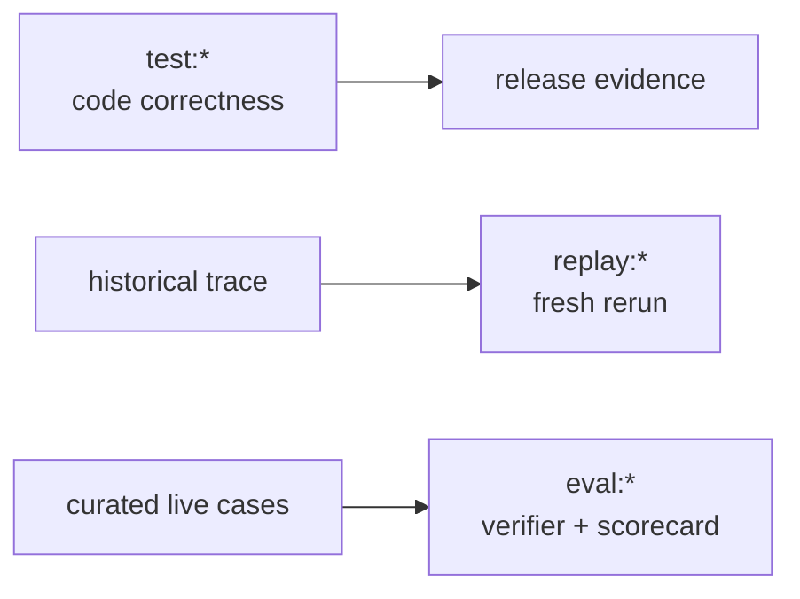

# Evaluation PLAN

状态：Active
最后更新：2026-07-15
Owner：Runtime / Evaluation maintainers

## Current Status

- Engineering tests, Trace Replay and Live Agent Eval have separate commands and meanings.
- Trace Replay reads historical Pet/Chat input, drives the current runtime and writes fresh evidence plus lightweight comparison.
- Trace Replay appends runtime-owned replay provenance to every fresh session, including calls with a custom session key.
- Live Agent Eval currently contains one BaseRuntime manifest with 11 fresh-run cases.
- `eval:gate` aggregates live eval only; `check:benchmarks` performs source preflight only.
- Legacy static/mixed role benchmarks are removed.
- Trace Replay is not yet side-effect safe and role live eval has not been rebuilt.
- The evolution DAG uses Inspector-authored replay cases and Reviewer terminal evidence (`closed | next_run | blocked`); same-run repair back-edges are forbidden.

## Milestones

1. Test / Replay / Eval boundary：completed。
2. Trace Replay v1：completed。
3. BaseRuntime 11-case live eval：completed。
4. Live-only eval gate and benchmark preflight：completed。
5. Replay side-effect isolation：not started。
6. Role-owned live eval：not started after legacy asset removal。
7. Multi-run real-model effectiveness evidence：partial；one bounded positive loop exists, while cross-provider / cross-seed repetition remains future work。
8. Evolution formal-replay contract：completed for deterministic DAG coverage and one real-provider `evolution`-route proof。

## Next Steps

- Add side-effect-safe replay behavior before arbitrary historical reruns.
- Keep `eval/` live-only and source authoring manual.
- Rebuild role eval only with task-specific setup, expected result and hard verifiers.
- Keep deterministic runtime checks under `test:*`.
- Do not reintroduce generic schema/rubric/governance directories.

## Owners

- Engineering verification：`test/**`
- Trace Replay：`src/replay/**`, `src/commands/replay.ts`, `scripts/run-trace-replay.ts`
- Live eval runtime：`src/eval/**`, `scripts/run-eval-*.ts`
- Benchmark source：`eval/benchmarks/**`

## Acceptance Criteria

- `test:*`, `replay:*`, `eval:*` and `check:*` remain semantically distinct.
- Trace Replay does not output benchmark pass/fail or auto-author accepted cases.
- Trace Replay output remains identifiable as replay evidence regardless of caller-supplied session naming.
- Every Live Agent Eval case fresh-runs the current runtime.
- `eval:gate` contains only live behavior evaluation.
- Benchmark preflight does not claim behavior correctness.
- Evaluation architecture changes update this PLAN and [`SPEC.md`](SPEC.md) only.

## Risks / Open Questions

- Replay can execute current real side effects and does not restore historical workspace state.
- BaseRuntime uses scripted model decisions and does not prove broad real-model role effectiveness.
- No default role benchmark currently provides fresh-run release evidence.
- The single current-contract `evo-closeout-v2-formatter` closed loop proves one exact output-protocol contract and the promotion workflow, not broad autonomous improvement or cross-provider generalization.

## Recent Verification

- On 2026-07-15, two independent real-provider Pet sessions failed the same strict closeout verifier (0/2), InspectorCat routed the repeated finding to EvolutionCat, and Arena rejected one generated revision as `unstable` instead of manufacturing a positive result.
- EvolutionCat generated the accepted `evo-closeout-v2-formatter` Candidate; current Arena code then passed 7/7 native turns across 3/3 independently bound UserCat sessions with 0 violations. Explicit CLI promotion re-read the raw traces, content-addressed 5 consumed evidence files, promoted only the immutable Arena snapshot, and two fresh production Pet sessions passed (2/2) with the Skill active.
- The current source traces, typed route, immutable snapshot, Arena identity/output attestations, promotion receipt and post-promotion traces are preserved under `output/evolution/proofs/2026-07-15-evo-closeout-v3/` rather than committed as product runtime assets; its verifier recomputes the raw hashes and closure assertions.
