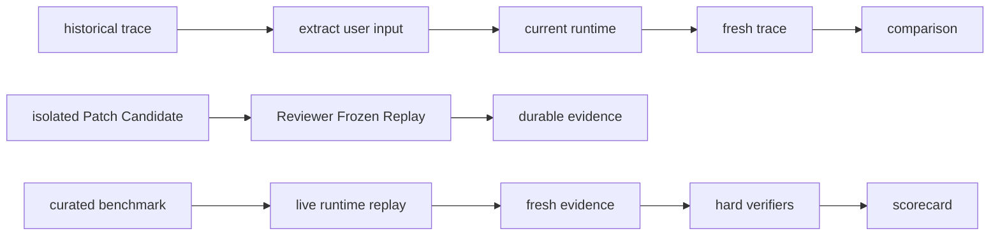
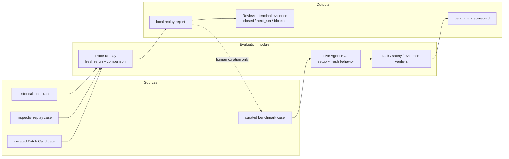

# Evaluation SPEC

状态：Active
最后更新：2026-07-20
适用范围：历史 Trace Replay、Live Agent Eval、benchmark source、verifier 和 scorecard gate。

本文是 XiaoBa-CLI 六个顶层模块之一 `Evaluation` 的唯一架构真相源。它同时定义 Engineering Test、Trace Replay 和 Live Agent Eval 的边界；前者验证代码，Replay 回答“同款历史输入现在会发生什么”，Live Agent Eval 回答“curated benchmark 是否通过”。

## Problem

Agent 的历史 trace、工程测试、真实行为复跑和 benchmark scorecard 都有价值，但不能都叫 eval：

- Trace Replay 是本地排障和回归观察，不给能力打最终分。
- Live Agent Eval 必须重新驱动当前 runtime，验证新产生的 tool/result/artifact/delivery evidence，并输出 scorecard。
- Unit、integration 和 deterministic contract smoke 属于 `test/`，不属于 Evaluation gate。
- Arena 验收候选 skill / role 的可信度，不自动接纳 benchmark source。

## Scope

In scope:

- `src/replay/**`、`src/commands/replay.ts`、`scripts/run-trace-replay.ts`。
- `src/eval/**`、`eval/**`、`scripts/run-eval-*.ts`。
- historical trace input extraction、fresh runtime rerun 和 lightweight comparison。
- curated live benchmark setup、replay、hard verifier、report 和 scorecard。
- `npm run replay:trace`、`npm run eval:base-runtime`、`npm run eval:gate`、`npm run check:benchmarks`。

Out of scope:

- Unit、integration、contract smoke 和 deterministic runtime checks 位于 `test/**`，但语义边界由本文统一维护。
- 原始 trace、artifact 和 delivery evidence 的事实源，属于 [`../observability-evidence/SPEC.md`](../observability-evidence/SPEC.md)。
- 外部 skill / 本地 role 的候选接入和可信验收，属于 [`../arena/SPEC.md`](../arena/SPEC.md)。
- 自动把 observability proposal、Replay output 或 Arena run 接纳为 benchmark source。

## Current Architecture

当前两条主线已经物理分开。Trace Replay 读取历史 `traces.jsonl`，重新驱动当前 Pet/Chat runtime 并输出 fresh trace 和轻量比较；Live Agent Eval 当前只保留 BaseRuntime 11 条 live case，通过 `surface_runtime` 产生新证据并运行 hard verifiers。Scheduled Repair 的 Reviewer replay 还可把 detached Patch worktree 作为 code root，通过独立 `tsx` 子进程加载候选代码，并只暴露 `read_file / grep / glob`；其 durable replay artifact 会迁回 DAG run root，行为型修复随后由 Arena 多次调用同一隔离 replay 路径。



## Target Architecture

目标架构保持两条窄主线，不重新引入中心化 schema/rubric/governance 平台。Replay output 只能经人工整理成为 curated case；Live Agent Eval 只接纳能重新运行当前 agent/runtime 的 case。Repair 路径的 Frozen Replay 必须把隔离 Patch Candidate 的 worktree 作为 runtime code root，而不是复跑调度器所在 checkout；它先为 ReviewerCat 提供一次关闭证据，行为型修复再由 Arena 对同一冻结用例执行多次 `repair_regression`。



## Stable Boundaries

- Trace Replay 不属于 `eval:*` 命令面，不输出 benchmark pass/fail。
- Trace Replay 的 fresh session 必须由 runtime 追加 replay provenance；呼叫者的自定义 session key 不能将派生 trace 伪装成生产交互。
- Live Agent Eval case 必须 fresh-run 当前 runtime；只读旧 trace 或旧 artifact 的检查不是 live eval。
- Replay、Observability 和 Arena 都不能自动写入 accepted benchmark source。
- `test/` 是独立工程验证边界；它可以验证 Evaluation 的代码，但不属于 Evaluation gate。
- `check:benchmarks` 只做 manifest/case/suite preflight，不冒充行为评测。
- 当前 release eval 只聚合 BaseRuntime；未来 role benchmark 必须有输入、setup、fresh replay、expected result、hard verifiers 和 scorecard。

Minimum live case shape:

- Stable case id and user request.
- Deterministic setup/fixture instructions.
- A replay adapter that drives the current production runtime path.
- Expected user-visible, tool, artifact or delivery outcome.
- Task-specific hard verifiers; prose similarity alone is insufficient.
- Generated scorecard that records every declared hard verifier.

## Implementation Layout

```text
test/                         unit / integration / deterministic smoke
src/replay/                   historical trace replay runner
scripts/run-trace-replay.ts   replay command adapter
src/eval/                     live eval runner / gate
eval/benchmarks/              curated live benchmark source
output/replay/                generated replay output
output/eval/                  generated eval output
```

Stable command meanings:

- `npm test` and `npm run test:*`: code correctness and deterministic contracts.
- `npm run replay:trace`: historical input rerun with fresh evidence; no benchmark verdict.
- `npm run eval:base-runtime`: current BaseRuntime live cases.
- `npm run eval:gate`: live agent eval aggregation only.
- `npm run check:benchmarks`: manifest/case/suite reference preflight only.

## Interaction With Other Modules

- Agent Runtime 提供当前被复跑的 AgentSession、ConversationRunner 和 ToolManager。
- Surface 提供 Pet/Chat 等真实入口。
- Observability & Evidence 提供历史输入和 fresh evidence 的本地事实源。
- Roles & Skills 提供被评测的 Base/Role/Skill 策略。
- Arena 可以引用 Evaluation 结果，但不能自动改变 Evaluation source。
