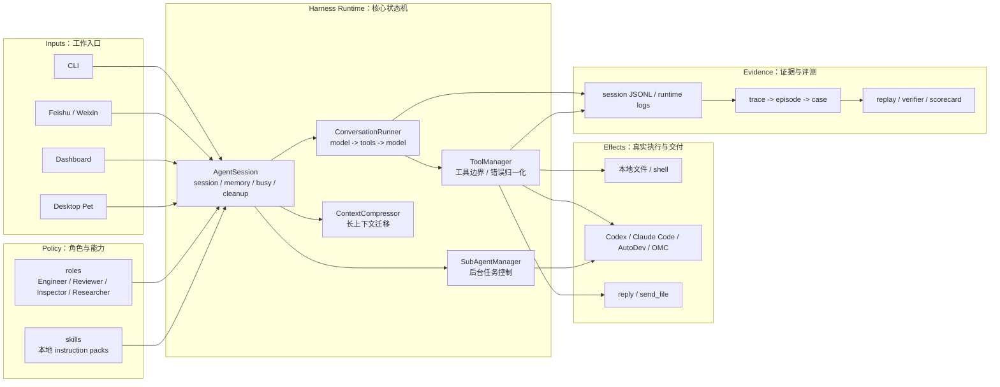

# XiaoBa 项目介绍书

版本：2026-05 草案  
用途：项目展示、面试材料、开源发布、技术交流、个人作品集

## 1. 项目摘要

XiaoBa 是一个本地优先、message-native 的 AI 角色 runtime。它不是把大模型接到命令行里的聊天壳，也不是一个只会在群里自动回复的机器人，而是把模型、角色、skills、tools、subagents、本地文件、IM 消息、日志证据和评测反馈组织成一个可运行、可观测、可恢复、可演进的 agent harness。

项目的核心判断是：

```text
Model is not the runtime.
Harness is the runtime.
```

大模型负责推理下一步，XiaoBa 负责把推理放进真实工作环境里：用户可以从 CLI、飞书、微信、Dashboard 或桌宠入口发起任务；不同 AI 角色按职责加载自己的 prompt、skills 和工具边界；长任务可以派给后台 subagent 或外部 coding agent；最终结果以消息、文件、日志和 artifact evidence 的形式回到工作开始的地方。

如果只看第一眼，XiaoBa 可能像一个 AI 助手；但真正的难点不在“能不能回复一句话”，而在“能不能长期像同事一样工作”：会接任务、会调用工具、会处理失败、会保留上下文、会让产物可追踪、会把真实运行日志沉淀成后续评测和改进资产。

## 2. 一句话定位

对外一句话：

> XiaoBa 是一个本地优先的 IM-native AI 角色 runtime，让长期存在的 AI 同事可以从聊天、文件、工具和 coding agent 中完成真实工作。

更技术化的版本：

> XiaoBa is a local-first, message-native agent harness runtime that turns AI roles into observable, tool-using, replayable workers across chats, files, local projects, and coding agents.

更适合面试或答辩的版本：

> 我做的不是一个 prompt demo，而是一套 agent harness。它把模型调用、工具执行、角色边界、上下文压缩、消息交付、后台任务、运行日志和 replay/eval 反馈闭环放到同一个工程系统里，目标是让 AI 角色可以长期在真实工作流里协作。

## 3. 为什么这个项目不是 toy

XiaoBa 的“非 toy”价值不来自功能数量，而来自它处理的是 agent 落地中最容易被 demo 掩盖的系统工程问题。

| 维度 | Toy demo 常见做法 | XiaoBa 的设计重点 |
| --- | --- | --- |
| 入口 | 单一网页或终端输入框 | CLI、IM、Dashboard、桌宠等多入口统一收敛到同一 runtime |
| 模型调用 | 一次 user message -> 一次 LLM response | ConversationRunner 管理 model call、tool call、tool result、下一轮推理的闭环 |
| 工具执行 | 给模型几个工具，失败靠人工看 | ToolManager 负责工具定义、参数、执行边界、错误归一化和 retryable 信号 |
| 上下文 | 简单 messages 数组 | 区分 durable session、working trace、provider transcript 三层状态 |
| 角色 | 换一段 system prompt | role 是职责、工具、skill、验收边界和运行策略的组合 |
| 长任务 | 主会话一直阻塞 | 主会话作为控制平面，subagent / coding agent 作为执行平面 |
| IM 交付 | 把文字发出去就结束 | send text / send file 是用户可见 side effect，需要 delivery evidence |
| 日志 | debug log | session JSONL 是 replay、分析、评测和后续优化的输入资产 |
| 评测 | 手动试几个例子 | trace -> episode -> case -> replay -> verifier -> scorecard 的长期评测体系 |
| 演进 | 改 prompt 看感觉 | Inspector / Engineer / Reviewer 角色分工，围绕失败发现、修复、验收形成反馈闭环 |

这类问题不是靠“让 Codex 生成一个界面”就能完成的。Codex 可以帮助写代码，但前提是有人知道系统应该长成什么样，知道哪些边界不能混，知道哪些失败会在真实使用中反复出现，并能把这些判断固化成架构、测试、日志、评测和文档。

## 4. 项目背景

现在大量 AI coding 工具都生活在终端或 IDE 里，但真实工作并不总是从终端开始。很多任务来自飞书消息、微信群、群聊里的 bug 描述、别人顺手丢过来的文件、一个需要后续跟进的需求、一次跨天的研究任务，或者一个需要后台执行并持续汇报的工程问题。

传统 coding agent 的强项是“在一个项目目录里完成一次任务”。XiaoBa 关注的是更上游和更长期的问题：

- 工作如何从 IM 消息自然进入 agent runtime？
- agent 如何知道自己是工程师、审查员、督察员还是研究员？
- 长任务执行时，用户是否还能继续追问、停止、补充信息？
- AI 产出的文件、消息、工具调用和失败原因能否被追踪？
- 真实运行中的失败能否沉淀成可复现 case，而不是只靠作者记忆？
- 当模型、工具、角色、入口越来越多时，系统如何保持可控？

XiaoBa 的回答不是再做一个更漂亮的聊天框，而是做一个本地优先的 agent harness runtime。

## 5. 核心架构

XiaoBa 的总体架构可以理解为四层：

- Surface 层：CLI、IM、Dashboard、Pet 等用户入口。
- Policy 层：roles 和 skills，定义角色身份、行为策略、工具边界和领域流程。
- Harness 层：AgentSession、ConversationRunner、ToolManager、ContextCompressor、SessionTurnLogger 等核心状态机。
- Feedback 层：logs、benchmarks、replay、verifier、scorecard 和角色化修复流程。



这张图里最重要的是：XiaoBa 的中心不是模型 provider，而是 harness runtime。Provider 可以替换，入口可以增加，角色可以扩展，但状态机、工具闭环、上下文迁移、日志证据和评测反馈是系统的骨架。

## 6. 已实现能力

当前仓库已经具备一组可以支撑真实演进的基础能力。

| 模块 | 当前能力 |
| --- | --- |
| 本地 CLI chat | 支持交互式对话、单条消息、角色选择 |
| IM adapters | 飞书、微信入口已接入，需要对应平台凭证 |
| Role runtime | 支持 engineer-cat、reviewer-cat、inspector-cat、researcher-cat 等角色 |
| Skill system | 支持本地 skill、角色私有 skill、GitHub skill install、frontmatter parser |
| Tool system | 支持 read、write、edit、grep、glob、bash、send text、send file、thinking、skill、subagent 等工具 |
| Subagent | 支持 spawn、check、stop、resume、ask parent，主会话与后台任务分离 |
| Provider layer | 支持 OpenAI-compatible 和 Anthropic provider，并处理 provider 差异和 failover |
| Context | 支持 token 估算、上下文压缩和 provider transcript 清理 |
| Evidence | 支持 session JSONL、runtime event、tool call、token usage、artifact manifest 等运行证据 |
| Dashboard / desktop | Electron 和本地 dashboard 已具备开发模式和打包流程 |
| Benchmarks | 已定义 trace-derived、requirement-driven、contract/invariant 三类评测架构，BioBench 是第一个落地对象 |
| Tests | 测试覆盖 provider 兼容、conversation runner、skill activation、roles、tool manager、logger、context compressor、pet channel、AutoDev worker 等关键路径 |

需要强调的是，评测体系当前仍处在分阶段建设中：trace catalog 和规范已经有基础，replay case、verifier runner、scorecard 和 CI gate 仍在推进。这个表述比“已经做完整 benchmark”更准确，也更可信。

## 7. 技术深水区

### 7.1 Agent loop 不是一次请求，而是状态机

XiaoBa 的核心循环不是“用户输入 -> 模型输出”，而是：

```text
user message
  -> prepare context
  -> provider request
  -> assistant decision
  -> tool execution
  -> tool result
  -> transcript update
  -> next provider request
  -> final reply / artifact delivery
```

这个循环必须保证几个不变量：

- 每个 assistant tool call 必须有 matching tool result。
- tool timeout、cancel、crash 也必须进入合法终态。
- provider-visible transcript、runtime-visible trace、user-visible message 可以不同，但必须能关联。
- 已经发给用户的消息不能因为后续 provider 失败而被当作没发生。
- artifact 生成和文件发送必须有 evidence。

这些不变量看起来细碎，但它们决定了 agent 在真实环境里是否可靠。玩具 demo 可以靠“重新试一次”掩盖，runtime 不能。

### 7.2 三层状态模型

XiaoBa 区分三类状态：

| 状态层 | 作用 |
| --- | --- |
| Durable Session | 跨 turn / restart 恢复，包括 session key、memory、active skill、长期偏好 |
| Working Trace | 当前 run 的工具调用、结果、artifact、runtime event，是 debug 和 replay 的事实证据 |
| Provider Transcript | 真正发送给模型 provider 的 messages，必须满足 provider 协议和 token budget |

这也是项目不容易复制的原因之一。很多 demo 把所有东西都塞进 `messages[]`，短期能跑，长期会遇到上下文膨胀、工具结果不合法、历史状态污染、日志不可重放等问题。

### 7.3 Role 不是 prompt，而是工程边界

XiaoBa 的角色不是“换一种说话风格”，而是可执行职责边界。

- InspectorCat 负责发现问题、读日志、归因失败、创建或流转 case。
- EngineerCat 负责需求理解、方案判断、实现、验证和交付。
- ReviewerCat 负责 replay、验收、scorecard、closed/reopened 决策。
- ResearcherCat 负责长周期研究、证据维护和资料整理。

这样的角色划分让系统具备组织结构：发现问题的人、修问题的人、验收结果的人不是同一个职责。这比“一个万能助手什么都做”更接近真实工程团队，也更适合长期自动化演进。

### 7.4 IM-native 不是消息转发，而是交付语义

在 IM 里工作，难点不是“收到一条消息”，而是：

- 如何建立 session key 和 channel callback？
- 如何处理群聊、私聊、文件、图片和平台鉴权？
- 如何把用户可见输出与 provider transcript 分开？
- 如何让 `reply` 和 `send_file` 这种 side effect 有证据？
- 长任务结束后如何回到原会话通知用户？

XiaoBa 把 IM 入口收敛到统一 `AgentSession`，避免每个平台复制一套 agent loop。入口只负责消息解析、文件上传下载、鉴权和回调，真正的 agent 状态机由 runtime 统一处理。

### 7.5 后台任务需要控制平面和执行平面分离

在真实 IM 场景里，长任务不能阻塞主会话。用户可能随时问进度、补充约束、要求停止或确认某个选择。

XiaoBa 采用：

```text
IM 用户
  -> 主会话：控制平面
      -> subagent / coding agent：执行平面
```

主会话负责接住用户、派发任务、查询进度、停止任务、转问确认；subagent 负责独立执行长任务、调用工具、记录产物、必要时通过 `ask_parent` 请求用户输入。

这不是简单的异步任务队列，而是 agent 协作中的任务生命周期管理。

### 7.6 评测体系是项目的长期护城河

XiaoBa 把真实运行日志视为资产。项目里的 benchmark 设计不是为了做一次性论文分数，而是为了回答工程演进中的关键问题：

- 这次改动有没有破坏真实历史场景？
- 某个角色是否真的比之前更会完成任务？
- runtime contract 有没有被破坏？
- artifact 是否真的生成并交付？
- 是否发生隐私泄漏或路径泄漏？
- 失败应该路由给 runtime、skill、role 还是外部系统？

通用链路是：

```text
raw trace
  -> session ingestion
  -> episode extraction
  -> benchmark case
  -> replay
  -> verifier
  -> scorecard
  -> failure routing
  -> fix
```

这套思路体现的是工程化 agent 开发能力：不是靠主观感觉调 prompt，而是让失败可以被捕获、复现、判定和回归。

## 8. 复制门槛

XiaoBa 不容易被快速复制，原因不在于某个 API 很难，而在于它把很多容易被低估的边界同时放进了一个系统。

第一，问题定义有门槛。  
如果只把问题看成“做一个 AI 聊天工具”，项目会自然走向 UI、prompt 和工具数量。XiaoBa 把问题定义成“message-native agent harness runtime”，这会迫使系统处理状态、边界、证据和反馈闭环。

第二，架构取舍有门槛。  
AgentSession、ConversationRunner、ToolManager、ContextCompressor、SessionTurnLogger、roles、skills、subagents、benchmarks 各自承担不同职责。边界划错，短期也能跑，但后期会变成不可维护的 prompt 和工具泥团。

第三，真实集成有门槛。  
IM adapter、桌面壳、provider 差异、文件交付、后台任务、日志脱敏、平台回调、外部 coding agent 调度，都需要在本地环境里反复踩坑。demo 可以绕过，产品化 runtime 绕不过。

第四，反馈资产有门槛。  
一套真正有价值的 agent 系统，不只由代码组成，也由运行日志、失败 case、评测规范、角色职责、验收标准和复盘文档组成。这些资产需要时间积累，不是一次代码生成能补齐的。

第五，作者判断有门槛。  
这个项目最能体现的是系统性判断：知道哪些事情应该交给模型，哪些事情必须由 harness 承担；知道什么时候该做功能，什么时候该做 contract；知道什么时候应该写 prompt，什么时候应该写测试、日志和 verifier。

## 9. 体现出的个人优势

这部分可以在面试、项目答辩或作品集里直接转成第一人称表述。

### 9.1 能把模糊需求抽象成系统问题

很多人看到 AI agent，会先做一个聊天界面或工具集合。这个项目体现的优势是：我没有停留在“让模型能回答”，而是进一步抽象出 agent 真正落地需要的 runtime 问题，包括状态机、工具闭环、上下文迁移、角色边界、证据记录和 replay/eval。

这说明我不只是能实现功能，也能重新定义问题。

### 9.2 有端到端工程落地能力

XiaoBa 同时涉及 TypeScript runtime、CLI、Electron、IM adapter、provider SDK、tool system、skills、roles、日志、测试、benchmark 和外部 coding agent 协作。它不是一个单点 demo，而是跨多个工程层面的系统。

这体现的是端到端交付能力：从产品入口，到 runtime 架构，到工具执行，到用户交付，到测试和发布，都能自己推进。

### 9.3 对 agent 可靠性有真实理解

项目中大量设计关注的是 agent 失败时会发生什么：

- provider transcript 是否合法？
- tool call 是否闭环？
- 上下文压缩后任务是否丢失？
- 文件是否真的发送？
- 日志是否可解析？
- 隐私信息是否泄漏？
- 失败是否能变成可复现 case？

这说明我对 agent 的理解不止是“会调模型”，而是知道 agent 系统在真实环境里会如何失控，并提前设计边界。

### 9.4 能把产品直觉转成工程结构

“AI 同事活在 IM 里”是一个产品判断，但 XiaoBa 没有停留在概念，而是把它拆成 IM adapter、message session、channel callback、send text、send file、artifact evidence、主会话控制平面、后台执行平面等工程模块。

这体现的是产品和工程之间的转换能力：不仅能想到一个方向，也能把方向落成可维护的系统结构。

### 9.5 有长期演进意识

项目维护了 SPEC、PLAN、角色文档、benchmark 文档、promotion plan 和模块边界说明。这个习惯很重要，因为 agent 项目最容易变成“今天改一点 prompt，明天加一个工具”的无序堆叠。

XiaoBa 的文档不是装饰，而是把设计决策、当前状态、风险和下一步写下来，让项目可以被长期推进、复盘和协作。

## 10. 和“产品经理用 Codex 做出来”的区别

如果一个人只是让 Codex 写一个 AI 工具，大概率能很快做出：

- 一个聊天 UI。
- 一套模型 API 调用。
- 几个文件和 shell 工具。
- 一个简单的机器人入口。
- 一段看起来很聪明的 prompt。

这些东西可以形成 demo，但很难形成 XiaoBa 现在关注的 runtime 能力。

| 表面功能 | 快速生成难度 | 真正难点 |
| --- | --- | --- |
| 聊天 | 低 | 多入口 session 隔离、长上下文、历史恢复、busy/interrupt |
| 工具调用 | 中 | tool call id 匹配、失败终态、provider transcript 合法性、错误归一化 |
| 角色 | 低 | 角色专属工具、职责边界、验收权责、role-aware loading |
| 文件发送 | 低 | 用户可见 side effect、delivery evidence、artifact manifest |
| 后台任务 | 中 | 主会话控制、并发限制、停止/恢复、ask parent、完成回调 |
| 日志 | 低 | 结构化 JSONL、schema version、脱敏、trace ingestion、case mining |
| Benchmark | 中 | episode/case 层级、fixture、replay runner、verifier、scorecard、回归门禁 |
| 项目演进 | 低 | SPEC/PLAN 同步、模块 owner、状态维护、设计偏差纠正 |

因此，XiaoBa 的价值不在于“Codex 能不能写出某个文件”，而在于作者已经把 agent runtime 的关键问题拆出来，并形成了一套持续演进的工程系统。

## 11. 典型使用场景

### 11.1 IM 里的工程同事

用户在群里发一个 bug、需求或文件，EngineerCat 接住任务，读取上下文，必要时调度 Codex / Claude Code / AutoDev，完成实现或分析后，把结果、文件和验证证据发回聊天。

价值：让 coding agent 从终端工具变成团队协作入口中的 AI 同事。

### 11.2 Runtime 督察与自我修复

InspectorCat 读取日志，识别 tool failure、provider error、平台不兼容、artifact 缺失等问题，生成 case 或流转给 EngineerCat。ReviewerCat 负责复跑和验收，决定 case closed 还是 reopened。

价值：把“我发现 agent 又坏了”变成可追踪的工程闭环。

### 11.3 长周期研究助手

ResearcherCat 维护长期研究状态，处理论文、实验、证据和交付材料，不把一次对话当作任务结束，而是围绕长期上下文持续积累。

价值：让 AI 角色适合跨天、跨材料、跨产物的研究流程。

### 11.4 本地优先的个人 AI runtime

XiaoBa 不只面向企业群聊，也可以成为个人电脑上的本地 AI runtime。它知道本地文件、项目、工具、日志和用户偏好，可以通过 CLI、Dashboard 或桌宠入口陪伴用户处理长期任务。

价值：把 AI 从云端一次性问答拉回用户真实环境。

## 12. 当前状态与路线图

### 已经可展示的状态

- CLI、role runtime、skill loading、多 provider、基础工具链已经可运行。
- 飞书、微信、Dashboard、Desktop Pet 已有入口和开发路径。
- EngineerCat、ReviewerCat、InspectorCat、ResearcherCat 已有角色边界和文档。
- session JSONL、runtime log、tool trace、token usage 和 artifact clue 已经进入 evidence 设计。
- benchmark 通用架构和 BioBench 方向已经成型。
- 测试覆盖了多条 runtime 关键路径。

### 下一阶段重点

- 补齐 replay case spec，把 selected cases 从 metadata 升级成可复跑 case。
- 实现 AgentSession replay runner，支持 fixture setup、role activation、scripted turns、artifact capture。
- 实现 verifier runner，先做 privacy scan、artifact manifest、file exists、runtime trace 等硬门槛。
- 聚合 scorecard，支持 baseline vs candidate 对比。
- 把少量 e2e replay 接入 ReviewerCat 和 CI gate。
- 继续打磨 EngineerCat 的 OMC / Codex / Claude Code 协作能力。
- 完成更稳定的桌面发布和 public launch 承接材料。

## 13. 适合展示的项目亮点

可以在简历或作品集里写：

- 设计并实现本地优先的 message-native agent harness runtime，统一 CLI、IM、Dashboard、桌宠等多入口。
- 抽象 AgentSession / ConversationRunner / ToolManager / ContextCompressor / SessionTurnLogger，保证模型调用、工具执行、上下文压缩、日志证据和用户可见交付的边界清晰。
- 构建 role-aware runtime，使 EngineerCat、ReviewerCat、InspectorCat、ResearcherCat 具备不同职责、skills 和工具边界。
- 实现 subagent 后台任务机制，支持长任务派发、进度查询、停止、恢复和 ask-parent 确认。
- 设计 trace-derived agent evaluation system，规划并部分落地从真实 session 日志到 episode、case、replay、verifier 和 scorecard 的长期回归链路。
- 接入 OpenAI-compatible / Anthropic provider、飞书 / 微信 adapter、Electron dashboard 和本地桌面发布流程。

## 14. 可验证证据索引

对外介绍时，可以把下列仓库材料作为“这不是空讲概念”的证据：

| 证据 | 说明 |
| --- | --- |
| [`README.zh-CN.md`](../../README.zh-CN.md) | 项目定位、快速开始、角色体系、IM 入口和当前状态 |
| [`SPEC.md`](../../SPEC.md) | 项目级架构真相源，定义 harness 边界、状态机、三层状态、日志和评测原则 |
| [`benchmarks/SPEC.md`](../../benchmarks/SPEC.md) | Agent evaluation system 的 trace、episode、case、replay、verifier、scorecard 架构 |
| [`benchmarks/PLAN.md`](../../benchmarks/PLAN.md) | benchmark 当前状态、未完成项、milestone 和验收标准 |
| [`roles/engineer-cat/SPEC.md`](../../roles/engineer-cat/SPEC.md) | EngineerCat 的高级工程师 agent 设计、OMC / Codex 协作边界和后台任务模型 |
| [`roles/reviewer-cat/SPEC.md`](../../roles/reviewer-cat/SPEC.md) | ReviewerCat 的 replay、验证、scorecard 和 closed/reopened 职责 |
| [`src/core/conversation-runner.ts`](../../src/core/conversation-runner.ts) | model -> tool calls -> tool results -> next model call 的核心循环 |
| [`src/core/sub-agent-manager.ts`](../../src/core/sub-agent-manager.ts) | 后台 subagent 生命周期、并发限制、停止、恢复和父会话回调 |
| [`src/utils/session-turn-logger.ts`](../../src/utils/session-turn-logger.ts) | session JSONL、tool call、status、error code、artifact manifest 等证据记录 |
| [`tests/`](../../tests) | provider、conversation runner、skill activation、roles、tool manager、logger、context compressor、e2e 等测试资产 |

这组证据很重要。它把“项目很复杂”从主观形容变成可检查事实：有架构真相源，有推进计划，有源码模块，有角色设计，有测试，有评测路线，也有对当前未完成部分的诚实记录。

## 15. 面试答辩口径

### 问：这和普通 AI chatbot 有什么区别？

普通 chatbot 的中心是一次回复。XiaoBa 的中心是 runtime。它要处理多入口 session、工具调用闭环、角色职责、长上下文、后台任务、IM 交付、日志证据和评测回归。聊天只是入口，真正复杂的是让 agent 在真实环境里长期可靠地工作。

### 问：这是不是 Codex 帮你写出来的？

我会使用 Codex 作为工程协作工具，但项目的核心不是“谁敲了代码”，而是系统设计本身。XiaoBa 里的 role runtime、tool transcript contract、三层状态模型、session JSONL、trace-derived benchmark、Inspector / Engineer / Reviewer 职责划分，都是围绕 agent 落地问题做的架构判断。Codex 能提升实现效率，但不能替代这些判断和长期取舍。

### 问：为什么你觉得它有壁垒？

壁垒不在某个功能，而在长期积累的 runtime 边界和反馈资产。一个 demo 可以快速复刻聊天、工具和界面，但很难同时补上合法 transcript、上下文迁移、artifact evidence、IM side effect、角色验收边界、失败 case、replay/verifier 和 scorecard。这些东西需要真实使用、失败复盘和持续工程化。

### 问：项目还缺什么？

我不会把它包装成已经完整成熟的产品。当前最重要的缺口是 replay runner、verifier runner、scorecard 和 CI gate，需要把已有 trace catalog 和 case metadata 进一步变成可复跑、可判定、可回归的评测系统。这也是下一阶段最有价值的工程重点。

## 16. 结语

XiaoBa 的目标不是做一个“会说话的工具”，而是探索 AI agent 真正进入日常工作环境时需要的 runtime 形态。

它把 AI 角色放到消息、文件、工具、本地项目、外部 coding agent 和长期日志中，让 agent 不只是回答问题，而是具备身份、职责、执行、交付、证据和复盘能力。

这个项目最能体现的个人能力，是把一个看似产品化的想法继续向下追问，追到工程系统的底层：状态如何管理，失败如何归因，产物如何证明，角色如何分工，改动如何评测，系统如何长期演进。

这也是 XiaoBa 不像 toy 的地方。它不是一个“让人觉得 AI 很聪明”的演示，而是一套认真处理 agent 落地复杂性的工程实验。
