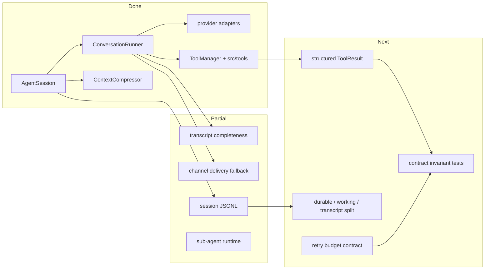

# Harness Runtime PLAN

状态：Active
最后更新：2026-05-30
Owner：Runtime maintainers

本文维护核心 agent harness runtime 的执行状态。架构边界见 `SPEC.md`。

## Current Status

`AgentSession`、`ConversationRunner`、provider adapters、tool manager 和 context compressor 已经组成共享 runtime 主线。当前重点是把 tool result、delivery evidence、runtime event 和三层状态模型从“日志可推断”推进到“运行时结构化事实”。

## Milestones

1. Runtime module spec baseline: completed.
2. Shared `AgentSession` + `ConversationRunner` loop: completed.
3. Channel delivery fallback integrated into runtime: completed in current implementation.
4. Structured `ToolResult` with status/error_code/retryable: not started.
5. Explicit durable session / working trace / provider transcript split: partial.
6. Retry budget and blocked reason hard contract: not started.
7. Contract invariant gate for runtime: not started.

## Next Steps

- Promote tool execution results from string-derived observations to structured status facts.
- Make artifact/delivery evidence an explicit runtime output, not only a side effect.
- Define and test retry budget behavior for repeated tool/provider failures.
- Add contract cases for transcript completeness, timeout/cancel, JSONL compatibility and context continuity.

## Owners

- Session lifecycle：`src/core/agent-session.ts`
- Agent loop：`src/core/conversation-runner.ts`
- Context compression：`src/core/context-compressor.ts`
- Provider adapters：`src/providers/**`
- Tool boundary：`src/tools/**`, `src/types/tool.ts`
- Sub-agent runtime：`src/core/sub-agent-*`

## Acceptance Criteria

- Every assistant tool call has a matching tool result before the next provider request.
- Tool failures, timeouts and cancels become observable structured facts.
- Provider transcript, working trace and durable session state have documented boundaries.
- Runtime contract tests fail fast on dangling tool calls, malformed JSONL, privacy leaks or missing artifact evidence.

## Verification Log

- 2026-05-30：Added `harness/SPEC.md` and `harness/PLAN.md` to make Harness Runtime one of the five top-level module specs.

## Risks / Open Questions

- Some existing evidence still depends on log inference rather than structured runtime facts.
- Provider-specific response shapes may make transcript normalization subtle; contract tests should cover each maintained provider adapter.

## Status Maintenance Rules

- Any change to `AgentSession`, `ConversationRunner`, provider transcript handling or tool result semantics must update this plan and `SPEC.md` when boundaries change.
- Role or surface behavior should not weaken harness-level contracts.
