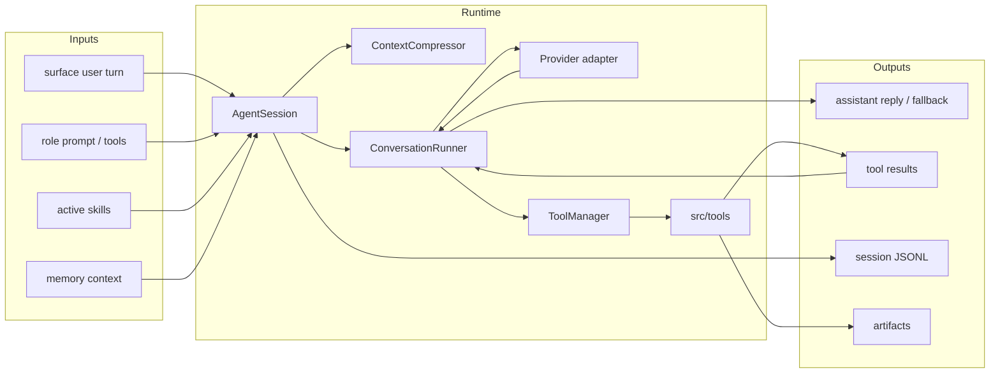
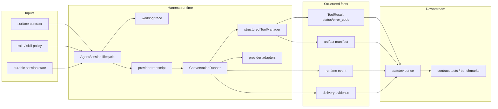

# Harness Runtime SPEC

状态：Active
最后更新：2026-05-30
适用范围：XiaoBa 的核心 agent harness runtime，包括 `src/core`、`src/providers`、`src/tools`、`src/types/tool.ts` 和 runtime-facing harness docs。

本文是五大顶层模块之一的核心运行时 spec。它定义 agent loop、provider transcript、tool boundary 和 session lifecycle；入口、角色策略、状态证据和评测分别由各自模块 spec 维护。

## Problem

Harness Runtime 把用户输入、角色策略、技能、工具、provider 调用和运行证据组织成一个可恢复、可观测、可评测的状态机。模型不是 runtime；runtime 必须保证 transcript 合法、tool 调用闭环、失败可观测、上下文压缩不丢当前任务。

## Scope

In scope:

- `AgentSession` 生命周期、busy/interrupt、restore、context compression 和 memory cleanup。
- `ConversationRunner` 的 model call -> tool calls -> tool results -> next model call 循环。
- Provider adapters：`src/providers/**`。
- Tool boundary：`src/tools/**`、tool schema、参数解析、执行结果、错误码和 retryable 语义。
- Sub-agent/session runtime：`src/core/sub-agent-*`。
- Runtime 类型契约：`src/types/**` 中与 session/tool/provider 相关的类型。

Out of scope:

- 平台入口协议和用户可见交付，属于 `surfaces/SPEC.md`。
- Role/skill policy，属于 `roles/SPEC.md`。
- 日志和 artifact 的持久化 schema，属于 `state-evidence/SPEC.md`。
- Replay/verifier/scorecard，属于 `benchmarks/SPEC.md`。

## Current Architecture

当前 runtime 已经以 `AgentSession` 和 `ConversationRunner` 为主线，入口和角色最终都进入同一套 runner。Tool result、artifact evidence 和 provider/durable/working trace 的严格分离仍在推进中。

## Target Architecture

目标是把 provider transcript、working trace 和 durable session 分清楚，并把 tool result、delivery evidence、runtime failure 和 retry budget 升级为结构化事实。

## Core Contracts

- 每个 assistant tool call 必须有 matching tool result，不能把 dangling tool call 送入下一次 provider request。
- Tool call 必须进入 success、failure、timeout、cancel 或 blocked 之一，失败要有可观测 `status/error_code`。
- `ConversationRunner` 负责 transcript 合法性，不保存长期 session，也不决定角色配置。
- `AgentSession` 负责 session lifecycle、role/skill 注入、context compression 和 state cleanup，不直接实现平台 API。
- Provider-visible transcript、working trace 和 durable session 可以内容不同，但必须可关联。
- Retry 必须有上限；重复失败后应改变策略或报告 blocked reason。

## Data Contracts

Runtime 需要稳定维护这些结构化事实：

- `surface`、`sessionKey`、role、active skills 和 budget。
- provider request/response 的 token 和 model metadata。
- tool call id、tool name、arguments summary、status、error_code、retryable。
- artifact manifest 或 delivery evidence。
- runtime event，例如 timeout、interrupt、context compression、fallback delivery。

## Interaction With Other Modules

- 从 `surfaces/SPEC.md` 接收规范化 user turn 和 callbacks。
- 从 `roles/SPEC.md` 接收 role prompt、role-scoped tools 和 skill policy。
- 向 `state-evidence/SPEC.md` 输出 session logs、runtime events、artifact evidence 和 durable state。
- 由 `benchmarks/SPEC.md` 的 contract/invariant cases 验证 transcript completeness、failure observability、privacy 和 JSONL compatibility。
