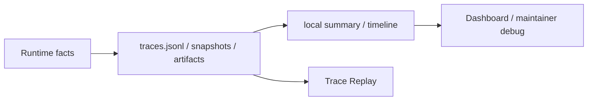

# Observability & Evidence PLAN

状态：Active
最后更新：2026-07-13
Owner：Runtime / evidence maintainers

## Current Status

- `traces.jsonl` is the faithful local runtime fact source.
- `session-log-projector` derives local summary and trace timeline from session logs.
- Context compaction emits events plus compact-after snapshots.
- Tool, artifact, delivery, provider failure and external receipt facts are represented in runtime evidence.
- Dashboard observability endpoints are read-only and return redacted projections.
- Observability does not accept benchmark source or decide pass/fail.
- Retention, encryption, durable in-flight state and user-controlled deletion remain incomplete.

## Milestones

1. Local session JSONL fact source：completed。
2. Session-log projection and local summary：completed。
3. Context compaction evidence：completed。
4. Source-acceptance/governance removal from Observability：completed。
5. Redacted Dashboard read boundary：completed for current API。
6. Retention/delete/encryption policy：not started。
7. Durable in-flight task/action evidence：partial/not started。

## Next Steps

- Move remaining direct metric writers behind session-log projection or explicit standalone mode.
- Define local retention and user-controlled deletion without altering faithful trace semantics.
- Add durable parent/child/action receipts needed for crash recovery.
- Keep raw provider payload and full pre-compaction snapshots opt-in rather than default.
- Keep benchmark admission manual and Evaluation-owned.

## Owners

- Session evidence writer：`src/utils/session-turn-logger.ts`
- Projection/local summary：`src/observability/**`
- Durable roots：`logs/**`, `data/**`, `memory/**`, `output/**`
- Runtime evidence producers：`src/core/**`, `src/tools/**`, `src/roles/**`

## Acceptance Criteria

- Local summary facts resolve back to a durable session trace or explicit standalone run.
- Compaction events resolve to same-session snapshots by stable ids.
- Tool, artifact and delivery evidence remain structured and locally auditable.
- Dashboard/API projections redact sensitive preview and path/token values.
- Observability cannot accept, patch or score benchmark source.
- Evidence architecture changes update this PLAN and [`SPEC.md`](SPEC.md) only.

## Risks / Open Questions

- Faithful local traces may retain sensitive content longer than users expect.
- Crash recovery lacks a complete durable child/action journal.
- Historical v2/v3 logs still contain mixed naming and evidence shapes.
