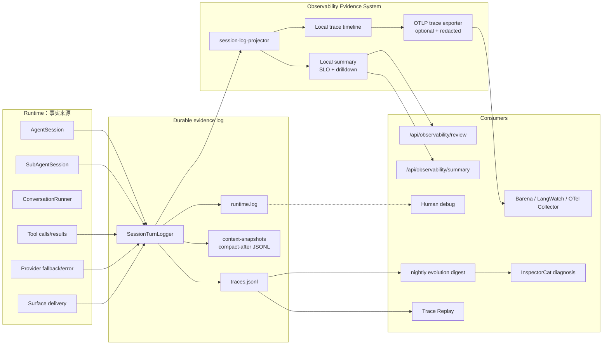
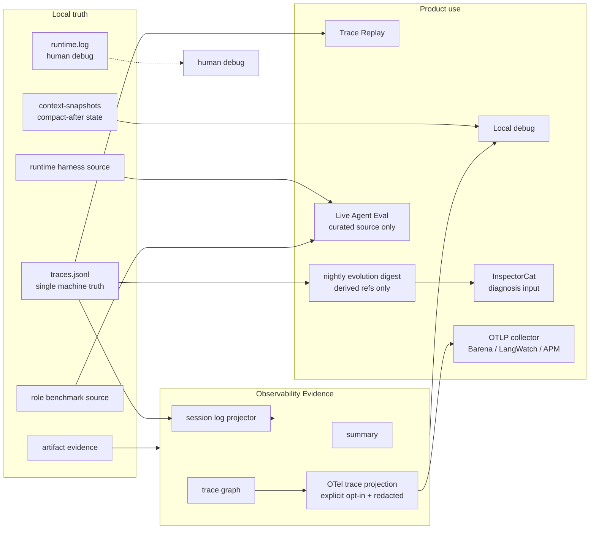

# Observability & Evidence SPEC

状态：Active
最后更新：2026-07-22

本文是顶层架构模块中的 **Observability & Evidence / 观测证据层** spec。它以本地 trace JSONL、durable state 和 artifact evidence 为事实源；当前实现可显式启用一个脱敏 OTLP trace 投影，但不会在本地 trace/log 写入前做清洗。

## Problem

XiaoBa 需要一套轻的观测证据系统：本地 trace JSONL 是 faithful local runtime 事实源，observability 只负责把 trace 事实投影成 local summary 和 trace drilldown，不能再长出第二套评测流水线。

术语边界：

- `session` 是长期会话，可以包含多条 trace。
- `trace` 是一次用户请求到本次 `ConversationRunner` while loop 截止的闭环，是本地 summary、dashboard drilldown 和 eval evidence 的最小用户意图单元。
- `turn` 只表示 `ConversationRunner` while loop 的一次推进。session-log-v2 中的 `entry_type="turn"` / `turn_id` / `turn` 是兼容命名；session-log-v3 新日志使用 `entry_type="trace"` / `trace_id` / `trace_index`。
- `event` 是 trace 内的离散事实，默认嵌在 `traces.jsonl` 主记录中；`runtime.log` 只做人类可读流水。

## Scope

In scope:

- 以 `SessionTurnLogger` / `logs/sessions/<surface>/<date>/<session_id>/traces.jsonl` 为本地 durable evidence source。
- `session-log-projector` 将 trace / embedded runtime_event 投影为 local summary。
- 本地 span/metric summary helpers，用于 standalone runner 或测试路径。
- 默认开启的 local in-process summary，优先从 session log 投影产生。
- Dashboard developer API：只读 summary / review state。
- 可选、默认关闭的 OTLP/HTTP trace exporter；它只投影脱敏 runtime span，不改变本地 evidence 写入和评测语义。

Out of scope:

- Benchmark admission、pass/fail、release decision。
- Benchmark source acceptance、source edit lifecycle、signed review artifacts or queue-based curation workflow。
- 原始 prompt、tool args、provider payload、file content 和 raw traceparent 的外部导出。
- metrics/logs 外部导出、外部 APM 后端部署与告警体系。
- benchmark source admission；需要进入 benchmark source 时，由对应 benchmark owner 重新整理 case。

## Current Architecture



Current implementation:

- `src/utils/session-turn-logger.ts` owns durable trace evidence, writes `logs/sessions/<surface>/<date>/<session_id>/traces.jsonl` and human runtime text to sibling `runtime.log`, and invokes `src/observability/session-log-projector.ts` after trace append.
- Context compression is first-class evidence: `context_compaction` runtime events are embedded in the next trace row, and successful compactions append a compact-after snapshot to sibling `context-snapshots/<session_id>.jsonl`; the event's `snapshot_ref` points at the matching snapshot line by `snapshot_id`.
- `src/observability/session-log-projector.ts` projects trace、embedded runtime_event、provider_error、delivery evidence and token facts into local summary.
- `src/observability/index.ts` owns local summary storage and local trace/span helpers；`src/observability/otel-trace-exporter.ts` bridges the same runtime span topology into an optional OTLP/HTTP protobuf exporter.
- Export is default-off and fail-open. The external attribute projection is allowlist-based for strings, keeps bounded scalar topology/status/count facts, and excludes prompt/tool/file previews plus free-form error messages.
- CLI、Feishu、Weixin、Pet and Dashboard graceful shutdown paths flush the exporter；normal one-shot processes also flush it on `beforeExit`.
- `AgentSession` records session lifecycle facts through `SessionTurnLogger`; its `ConversationRunner` is configured `mirror_only` so local summary does not double count runtime metrics.
- Standalone `ConversationRunner` can still record local metrics directly because it has no owning session log.
- `GET /api/observability/summary` returns aggregate and local trace facts derived from local logs, with raw prompt/tool preview attributes removed and sensitive freeform values such as paths/tokens redacted at the Dashboard API boundary.
- `GET /api/observability/review` returns readonly local observability state; it does not generate candidates, continuity reports, or benchmark source.
- `check:benchmarks` guards active benchmark manifest references; observability has no eval source acceptance path.
- `src/roles/evolution-cat/evolution-observer.ts` reads terminal rows from all local session/subagent `traces.jsonl`, filters by row timestamp, excludes self-run/test/replay evidence, and atomically derives `output/evolution/sleep/<date>/digest.json` with stable trace refs. Runtime builds it once and hands it to InspectorCat as the first model stage; the digest is a bounded projection, not a new truth source or evaluation result.

## Target Architecture



Target rules:

- Observability is evidence, not governance.
- Local runtime facts enter observability through `traces.jsonl` projection when a session log exists; the local trace log is raw local evidence before persistence.
- Context compression must leave a structured `context_compaction` event in `traces.jsonl`; successful compactions must store the compact-after messages as local snapshot evidence next to the owning session log. These snapshots are evidence/restoration anchors, not default prompt material for replay.
- Direct runtime metric recording is allowed only for standalone runners or explicit local-summary helper paths.
- A trace-derived benchmark asset must be created explicitly by a benchmark owner; observability does not propose, accept, score, or patch benchmark source.
- A nightly evolution digest is a bounded, local, read-only projection over terminal trace rows. It keeps stable source refs and may summarize user/tool/artifact facts, but it is not a second trace truth and cannot create, accept, score, publish or promote a candidate.
- Harvest filters by each trace row timestamp rather than only the enclosing date directory, so long-lived sessions crossing midnight remain correct. Evolution sleep traces, replay/eval traces and deterministic zero-model-call harness rows are excluded from future mining; Trace Replay always appends runtime-owned replay provenance even when its caller supplies a custom session key.
- Runtime harness owns runtime/contract regression decisions.
- Roles own role-specific replay, rubric and benchmark admission.
- Dashboard stays read-only for observability summary/review state; network-facing summary responses default to a redacted projection even when the in-process local summary retains explicit local preview facts.
- OTLP trace export is an optional lossy projection, never a second evidence truth. It exports span topology and bounded scalar attributes only; prompt/tool/file previews, raw traceparent and free-form error text stay local.
- Export failure is fail-open for Agent execution and must be visible through exporter health state without changing runtime outcomes.
- Metrics and logs remain local in the first OTel milestone; expanding those signals requires a separate privacy and cardinality review.

## Contracts

Stable public replay/eval commands:

- `npm run replay:trace`
- `npm run eval:base-runtime`
- `npm run eval:gate`

Stable OTel configuration:

- `XIAOBA_OBSERVABILITY_ENABLED=true` explicitly enables external trace export; unset/false performs no network export.
- `XIAOBA_OBSERVABILITY_TRACES_EXPORTER=otlp` is the only supported external signal exporter; `OTEL_TRACES_EXPORTER=otlp` is accepted as the standard fallback.
- `OTEL_EXPORTER_OTLP_TRACES_ENDPOINT` overrides `OTEL_EXPORTER_OTLP_ENDPOINT`; the shared endpoint receives `/v1/traces` automatically.
- `OTEL_EXPORTER_OTLP_TRACES_HEADERS` overrides duplicate shared `OTEL_EXPORTER_OTLP_HEADERS` keys. Header values use standard URL encoding.
- `OTEL_SERVICE_NAME` and standard OTLP timeout variables are accepted; `XIAOBA_OBSERVABILITY_SERVICE_NAME` remains the XiaoBa-specific service-name override.
- `OTEL_SDK_DISABLED=true` disables the exporter even when the XiaoBa opt-in flag is set.

Stable generated roots:

- `output/replay/**`
- `output/eval/**`

Local invariants:

- OTLP trace export must be explicitly enabled; unset configuration performs no network export.
- `traces.jsonl` remains the authoritative evidence source even when OTLP export is enabled.
- External spans preserve W3C trace ancestry but contain only the exporter-safe attribute projection.
- Local summary preserves scalar local attributes, including prompt/tool previews when explicitly recorded, as local in-process evidence. Dashboard API responses redact preview attributes by default.
- Local `traces.jsonl` keeps runtime facts as local evidence; benchmark curation rewrites raw traces into runnable eval cases.
- `context_compaction` events and `context-snapshots/<session_id>.jsonl#<snapshot_id>` refs must agree by `event_id` / `snapshot_id`; consumers should resolve snapshot refs relative to the owning session log directory.

Durable evidence layout:

```text
logs/sessions/<surface>/<date>/<session-id>/
  traces.jsonl
  runtime.log
  context-snapshots/<session-id>.jsonl
data/chat/sessions/**
memory/**
output/replay/**
output/eval/**
```

`traces.jsonl` is the machine-readable runtime fact source; `runtime.log` is human debug text; snapshots are compact-after recovery/evidence anchors; generated replay/eval outputs are derived artifacts and never replace the source trace.
