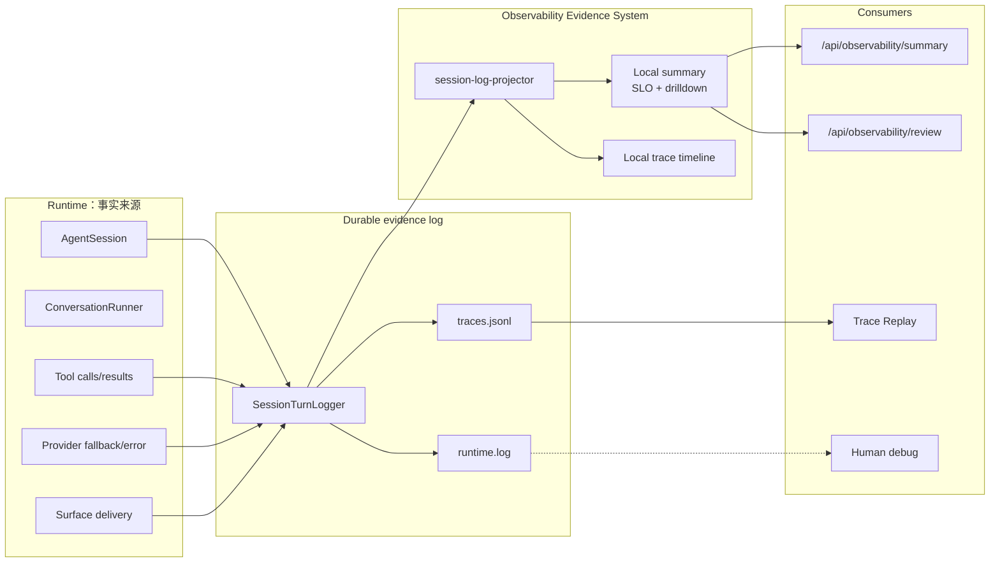
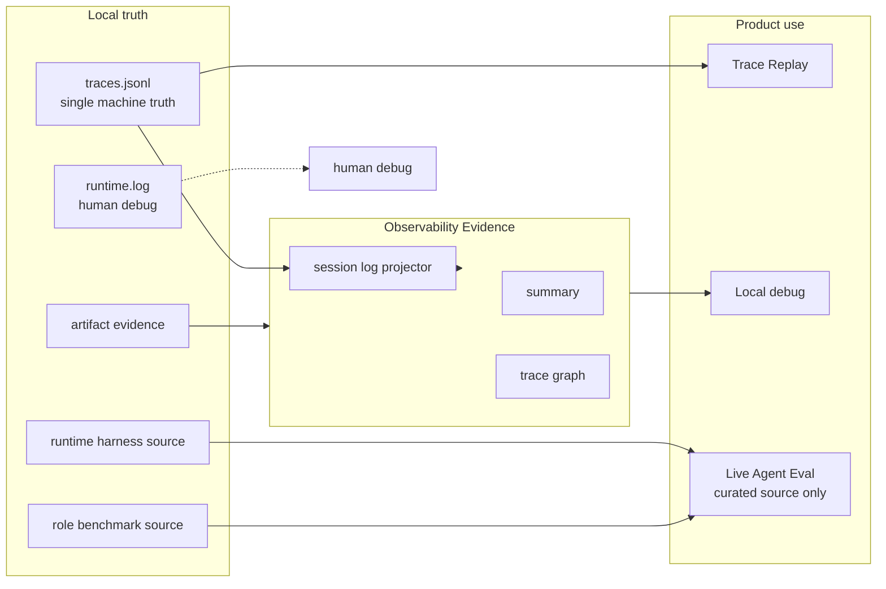

# Observability Evidence System SPEC

状态：Active
最后更新：2026-06-23

本文是五大顶层模块中的 **Observability & Evidence / 观测证据层** spec。它以本地 trace JSONL、durable state 和 artifact evidence 为事实源；当前实现不提供外部观测导出，也不在本地 trace/log 写入前做清洗。

## Problem

XiaoBa 需要一套轻的观测证据系统：本地 trace JSONL 是 faithful local runtime 事实源，observability 只负责把 trace 事实投影成 local summary 和 trace drilldown，不能再长出第二套评测流水线。

术语边界：

- `session` 是长期会话，可以包含多条 trace。
- `trace` 是一次用户请求到本次 `ConversationRunner` while loop 截止的闭环，是本地 summary、dashboard drilldown 和 eval evidence 的最小用户意图单元。
- `turn` 只表示 `ConversationRunner` while loop 的一次推进。session-log-v2 中的 `entry_type="turn"` / `turn_id` / `turn` 是兼容命名；session-log-v3 新日志使用 `entry_type="trace"` / `trace_id` / `trace_index`。
- `event` 是 trace 内的离散事实，默认嵌在 `traces.jsonl` 主记录中；`runtime.log` 只做人类可读流水。

## Scope

In scope:

- 以 `SessionTurnLogger` / `logs/sessions/<surface>/<date>/<session_id>/traces.jsonl` 为本地 durable evidence source。
- `session-log-projector` 将 trace / embedded runtime_event 投影为 local summary。
- 本地 span/metric summary helpers，用于 standalone runner 或测试路径。
- 默认开启的 local in-process summary，优先从 session log 投影产生。
- Dashboard developer API：只读 summary / review state。

Out of scope:

- Benchmark admission、pass/fail、release decision。
- Benchmark source acceptance、source edit lifecycle、signed review artifacts or queue-based curation workflow。
- 原始 prompt、tool args、provider payload、file content、raw traceparent、raw trace/span id 的外部导出。
- 外部 APM mirror / collector / exporter。
- benchmark source admission；需要进入 benchmark source 时，由对应 benchmark owner 重新整理 case。
- 外部 APM 后端部署和告警体系。

## Current Architecture

Current implementation:

- `src/utils/session-turn-logger.ts` owns durable trace evidence, writes `logs/sessions/<surface>/<date>/<session_id>/traces.jsonl` and human runtime text to sibling `runtime.log`, and invokes `src/observability/session-log-projector.ts` after trace append.
- `src/observability/session-log-projector.ts` projects trace、embedded runtime_event、provider_error、delivery evidence and token facts into local summary.
- `src/observability/index.ts` owns local summary storage and local trace/span helpers; no external exporter is configured.
- `AgentSession` records session lifecycle facts through `SessionTurnLogger`; its `ConversationRunner` is configured `mirror_only` so local summary does not double count runtime metrics.
- Standalone `ConversationRunner` can still record local metrics directly because it has no owning session log.
- `GET /api/observability/summary` returns aggregate and local trace facts derived from local logs, with raw prompt/tool preview attributes removed and sensitive freeform values such as paths/tokens redacted at the Dashboard API boundary.
- `GET /api/observability/review` returns readonly local observability state; it does not generate candidates, continuity reports, or benchmark source.
- `check:benchmarks` guards active benchmark manifest references; observability has no eval source acceptance path.

## Target Architecture

Target rules:

- Observability is evidence, not governance.
- Local runtime facts enter observability through `traces.jsonl` projection when a session log exists; the local trace log is raw local evidence before persistence.
- Direct runtime metric recording is allowed only for standalone runners or explicit local-summary helper paths.
- A trace-derived benchmark asset must be created explicitly by a benchmark owner; observability does not propose, accept, score, or patch benchmark source.
- Runtime harness owns runtime/contract regression decisions.
- Roles own role-specific replay, rubric and benchmark admission.
- Dashboard stays read-only for observability summary/review state; network-facing summary responses default to a redacted projection even when the in-process local summary retains explicit local preview facts.

## Contracts

Stable public replay/eval commands:

- `npm run replay:trace`
- `npm run eval:base-runtime`
- `npm run eval:gate`

Stable generated roots:

- `output/replay/**`
- `output/eval/**`

Local invariants:

- External observability export is not part of the current implementation.
- Local summary preserves scalar local attributes, including prompt/tool previews when explicitly recorded, as local in-process evidence. Dashboard API responses redact preview attributes by default.
- Local `traces.jsonl` keeps runtime facts as local evidence; benchmark curation rewrites raw traces into runnable eval cases.
