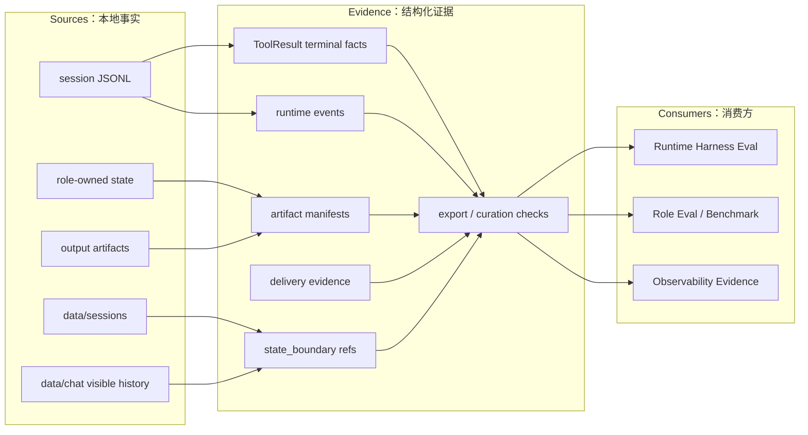

# State And Evidence PLAN

状态：Active
最后更新：2026-06-23
Owner：Runtime evidence maintainers

本文维护 Observability & Evidence 模块下 durable state/evidence source 的当前执行状态。架构边界见 `SPEC.md`。历史流水由 git 保存；本文只保留当前事实、下一步和近期有效验证。

## Current Status

State/Evidence 是 Observability & Evidence 的本地事实源，不是独立顶层模块，也不是独立评测流水线。当前权威事实来自 session JSONL、durable session、visible history、ToolResult、runtime event、artifact manifest、delivery evidence、role-owned artifacts 和 local observability summary。

Completed:

- `traces.jsonl` remains the main machine-readable trace ledger, with one trace row per user request.
- `runtime.log` is the sibling human-readable runtime timeline and is not projected into local summary.
- Durable session restore is surface-scoped under `data/sessions/<surface>` with legacy flat read compatibility.
- Pet visible history writes local refs under `data/chat/**`.
- `state_boundary` separates durable session, working trace, provider transcript digest ref and visible history.
- Runtime ToolResult facts use the canonical helper for terminal `status`, `error_code`, `retryable`, duration and blocked evidence.
- Provider failures emit local `provider_error` runtime events and degraded provider transcript digest refs.
- Tool-owned artifact manifests exist for maintained ResearcherCat, UserCat, EngineerCat, ReviewerCat, InspectorCat, shared Codex job and SecretaryCat local-file tools.
- Delivery evidence exists for deterministic `send_text` / `send_file`, opt-in channel fallback final replies, surface callback replay and surface runtime replay.
- Maintained source checks cover curated JSONL fixtures, curated source artifact dirs, current default benchmark source packages and current direct eval/benchmark output roots.
- External observability mirror is removed from current local-first observability; JSONL, ToolResult, artifact manifest, delivery evidence and scorecards remain source of truth.
- Local `traces.jsonl` and `runtime.log` preserve user text, assistant text, tool arguments/results, delivery receipts and runtime event payloads.

Partial:

- Some historical logs and old generated outputs are intentionally not release evidence and are not fully normalized.
- Fallback artifact inference still exists for legacy/ad hoc role output; maintained role tools should use explicit manifests.
- Provider-network readiness is opt-in and defaults to blocked evidence unless explicitly enabled.
- Broader production-network provider failover and external-platform delivery evidence remain future work.

## Milestones

1. Module SPEC/PLAN baseline: completed.
2. Session JSONL and surface-scoped durable restore: completed.
3. Visible history refs for Pet: completed.
4. Canonical ToolResult and provider failure evidence: completed for maintained runtime paths.
5. Tool-owned artifact manifest coverage: completed for maintained role tools; legacy fallback remains compatibility-only.
6. Delivery evidence contract: completed for deterministic/runtime replay and opt-in fallback evidence; production-network expansion is future work.
7. Source boundaries: completed for current curated sources and direct outputs.
8. External mirror boundary: removed from current local-first observability.
9. Historical-output cleanup: partial and deliberately non-blocking.

## Next Steps

- Keep role-tool artifact and source-readiness checks under runtime/test/observability ownership, not under `eval/`.
- Keep trace-derived or observability-derived material quarantined until a runtime or role owner makes an explicit benchmark source edit.
- Remove remaining stale generated-output roots only after their current owner is clear.
- Extend live provider-network and external delivery evidence only through opt-in lanes until the behavior is stable enough for default runtime harness coverage.
- Continue splitting large central validators when a check can live behind a smaller source-boundary module.

## Owners

- Session and runtime events：`src/core/**`
- ToolResult and delivery evidence：`src/tools/**`, `src/core/conversation-runner.ts`
- Durable/visible state：`data/sessions/**`, `data/chat/**`, `src/core/message-session-manager.ts`
- Role-owned artifacts：`src/roles/**`, `data/engineer-tasks/**`, `data/reviewer-runs/**`, `data/codex-jobs/**`, `data/researcher-cat/**`
- Source/schema checks：runtime/test/observability-owned checks outside `eval/`; `src/eval/**` only runs live eval.

## Acceptance Criteria

- Session JSONL is line-parseable and schema-compatible for curated release fixtures.
- Tool failures, cancels, blocked states, provider failures, delivery events and artifacts are structured facts, not prose-only logs.
- Provider transcript evidence remains digest-ref-only; degraded transcripts carry reason/status/fallback/blocked/raw-payload storage facts without raw payload.
- Maintained role tools declare artifact semantics and implement explicit `Tool.getArtifactManifest()` when they create local evidence.
- Curated source fixtures and direct generated outputs pass owner checks before they become release or benchmark evidence.
- Observability evidence can suggest candidates, but cannot mark benchmark sources accepted.
- Historical local outputs may be diagnosed, but cleanup is not release-blocking unless the owner explicitly moves the root into a current contract.

## Verification Log

- 2026-06-17：Channel final text now remains trace/session evidence by default and only produces delivery evidence when `deliveryFallbackFinalReply` is explicitly enabled. Verification：`npm run build`; `node --test -r tsx test/agent-session-log.test.ts test/observability.test.ts`（19/19）；`npm run eval:gate`（22/22 items，130/130 cases）。
- 2026-06-10：Role-owned benchmark source boundary and current state/evidence contracts verified as part of eval/benchmark slimming. Verification：`node --test -r tsx test/dashboard-observability-api.test.ts test/eval-schema-validation.test.ts` (65/65); `npm run test:contract-smoke` (10/10 items, 34/34 cases); `npm run check:eval-assets` (4769/4769); `npm run build`; `git diff --check`.
- 2026-06-08：Historical external mirror and debug hardening verification retired by the 2026-06-23 local-only observability cleanup.

## Risks / Open Questions

- Old local `output/**` and historical logs are local evidence and should not be treated as publishable by default.
- Central schema validation remains large; more checks should move into focused modules when the boundary is clear.
- Live provider-network and external-platform evidence may require credentials or side effects, so default coverage must stay opt-in or deterministic.

## Status Maintenance Rules

- Update this plan when state layout, evidence contracts or source ownership change.
- Update `SPEC.md` only when the architecture or data contracts change, not for every verification run.
- Do not call trace-derived evidence a benchmark until a runtime or role owner has explicitly curated the source.
