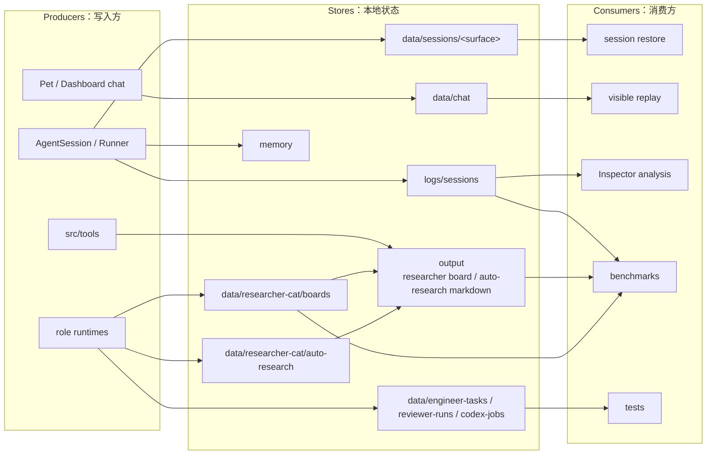
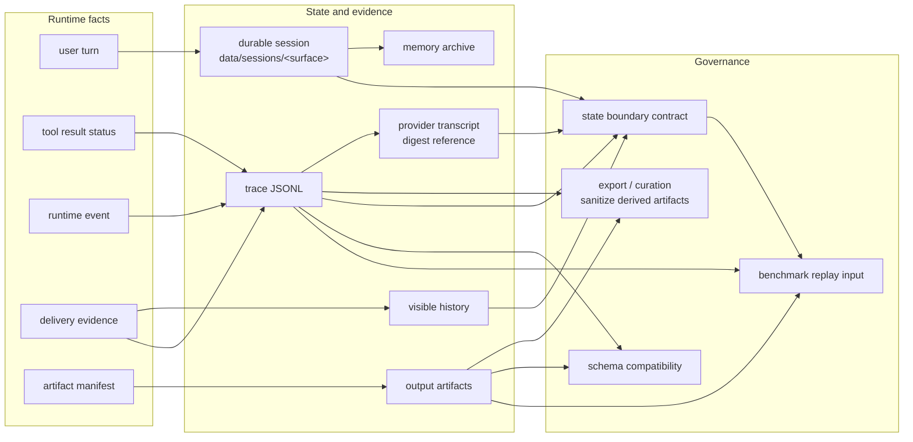

# State And Evidence SPEC

状态：Active
最后更新：2026-06-23
适用范围：XiaoBa 的本地状态和运行证据层，包括 `data`、`logs`、`memory`、`output` 以及写入这些目录的 runtime/role/surface/tool 代码。

本文是 **Observability & Evidence / 观测证据层** 的 durable source 子文档，不再作为独立第六个顶层模块。它定义什么是 durable session、trace、runner turn、provider transcript、visible history、artifact 和 evaluation input。

## Problem

XiaoBa 是本地优先的 agent harness，不能只靠 `messages[]` 保存状态，也不能把日志当作临时 debug 输出。状态与证据层要保证运行可恢复、失败可归因、artifact 可追踪、日志可解析、后续 benchmark 可以复用。

## Scope

In scope:

- Trace logs：`logs/sessions/<surface>/<date>/<session_id>/traces.jsonl`。
- Runtime text logs：`logs/sessions/<surface>/<date>/<session_id>/runtime.log`。
- Durable session 和 chat state：`data/sessions/**`、`data/chat/**`。
- Role/runtime 工作资产：`data/engineer-tasks/**`、`data/reviewer-runs/**`、`data/codex-jobs/**`、`data/researcher-cat/boards/**`、`data/researcher-cat/auto-research/**` 等。
- Memory archive：`memory/**`。
- Tool artifacts 和交付产物：`output/**`。
- JSONL compatibility、local raw evidence、artifact manifest、delivery evidence。

Out of scope:

- Agent loop 和 tool execution，属于 `docs/agent-runtime/SPEC.md`。
- 平台输入输出协议，属于 `docs/surface/SPEC.md`。
- Role/skill 策略，属于 `docs/roles-skills/SPEC.md`。
- Case replay、verifier、benchmark manifest 和 scorecard，属于 `eval/SPEC.md` 与 `eval/benchmarks/SPEC.md`。

## Current Architecture

当前证据层已经有 trace JSONL、按 surface 隔离的 durable session restore、Dashboard/Pet visible history、memory、output 目录、ToolResult/delivery evidence、role/tool-owned artifact manifests、live AgentSession `state_boundary` refs、provider transcript digest reference、runtime events 和 local observability summary projection。ToolResult 由 runtime canonical helper 统一生成 terminal facts，ToolManager、AgentToolExecutor、SubAgent forbidden path 和 ConversationRunner retry/cancel path 不再各自分散拼装 status/error_code/ok；live session-log-v3 覆盖 trace rows with embedded events。`traces.jsonl` / `runtime.log` 是本地 faithful evidence，不在写入前做 user text、assistant text、tool args/result、delivery receipt 或 runtime_event 脱敏；脱敏、裁剪和抽象属于共享产物、ReviewerCat / benchmark-maker case curation 或其他派生边界。schema/fixture checks、generated output drift 和 release evidence hygiene 现在属于 `test/`、observability-owned `check:*` 或 role/runtime focused tests；`eval/` 只消费 live agent replay 后产生的新证据。

Current addendum：static JSONL fixture schema/contract governance no longer lives under `eval/`. Test-owned curated fixtures stay under `test/contract-smoke`; `eval/` only accepts live agent replay cases.

Current addendum：test-owned `session-log-v2` curated fixtures 和 live eval cases 如果使用 `tool_transcript_completeness`，应同时保留 `tool_result_contract` 或等价 focused verifier。这个边界把 tool transcript evidence 从“有 tool result 文本”提升为“有 canonical terminal status、执行失败语义、blocked reason 和 retry facts 的结构化事实”；成功 ToolResult 的顶层 `error_code` 只表示工具执行失败，领域级 path/validation/blocked evidence 必须保留在 payload 或 artifact 中。

Current addendum：runtime ToolResult terminal facts 现在有单一 canonicalization boundary。`src/tools/tool-result.ts` 的 builder/canonicalizer 会集中保证 status 必填、`ok` 与 status 一致、non-success 带 `error_code`、blocked 带 `blocked_reason`，并清理 success ToolResult 的顶层 execution error fields；ToolManager、AgentToolExecutor、SubAgent forbidden results 和 ConversationRunner retry/cancel results 已接入该边界，AgentToolExecutor 也会把 wrapped tool 的 `Tool.getArtifactManifest()` 作为 tool-owned artifact evidence 保留下来。`ConversationRunner` 还会把同一 run 内重复出现的同名、同参、同错误不可重试工具失败收束成 canonical `blocked` ToolResult，避免这类 bounded failure 只能从多条日志文本推断。

Current addendum：live provider/model failure evidence now has runtime backing and session-local failure budget evidence. `AgentSession` writes a `runtime_event` with `event_type=provider_error` before the fallback turn when a provider/model call fails; the event carries surface, token counters, `provider_error` fields (`provider`、`model`、`endpoint`、`status`、`error_code`、`retryable`、`message`) and provider budget facts (`status`、`retry_count`、`retry_budget`、`retry_budget_exhausted`、`blocked_reason`、`provider_failure_budget`). `AIService` attaches provider metadata to wrapped errors, consecutive same-fingerprint retryable failures converge to blocked evidence.

Current addendum：provider failure budget evidence remains runtime/test-owned evidence. It must not depend on `eval/contracts`; live eval cases may verify provider failure behavior only through replay and hard verifiers.

Current addendum：provider failover sequence evidence 也复用 `provider_error` runtime_event，不引入新的状态平面。`REQ-PROVIDER-FAILOVER-SEQUENCE-001` 通过 Contract Boundary fixture 和 `provider_failover_sequence` verifier 固定 provider、endpoint、error_code 顺序、retry budget、monotonic timestamp 和 terminal blocked reason；production-network failover orchestration 仍属于 harness/runtime E2E follow-up。

Current addendum：State/Evidence 的 deterministic requirement evidence 留在 `test/contract-smoke`，release-blocking behavior evidence 当前只由 `eval/benchmarks/BaseRuntime` 的 live agent cases 消费；未来 role-owned benchmark 必须先按 live agent eval 形态重建。`eval/benchmarks/eval-smoke` 已删除；当前 active preflight 是 `check:benchmarks`，只验证 benchmark manifest / case mapping，不再把 requirement invariant、generated-output drift 或 schema governance 混进 eval 默认路径。

Current addendum：该 State/Evidence requirement 的历史 invariant 合同只作为参考，不再由默认 eval gate 统一治理。新增或修改状态证据 case 时，应在 `test/contract-smoke`、runtime/role focused tests、BaseRuntime live eval 或未来 owning live benchmark 中显式保留 `tool_result_contract`、`runtime_observability`、`artifact_evidence` 等 verifier，而不是依赖中心化 source-acceptance runner。

Current addendum：旧的 machine-readable requirement ID、default portfolio requirement、scorecard drift 和 generated-output drift governance 已退出当前架构。Artifact / delivery / ToolResult evidence 仍然是重要证据，但它们必须由 `test:*`、focused checks、`check:*` 或 live agent eval case 的 verifier 明确验证；`eval/` 不再保存 requirement invariant、portfolio ID 或 schema governance。

Current addendum：channel-backed final reply fallback 是显式 opt-in，不是默认交付路径。默认情况下，provider 只返回 final text 且没有显式 `send_text` / `send_file` tool call 时，文本只进入 provider/session trace，不会发送给用户，也不会生成 synthetic delivery evidence。只有入口或测试显式开启 `deliveryFallbackFinalReply` 时，`ConversationRunner` 才会通过 channel reply 发送用户可见文本，同时记录一个 synthetic `send_text` ToolResult，参数包含 `_delivery_fallback=true`，结果包含 `delivery_evidence` 和 normalized `external_delivery_receipts`。

Current addendum：context debug / SDK boundary dumps 是显式 opt-in 的本地诊断证据。`CONTEXT_DEBUG=true` 写入 `logs/context-debug` 时保留 raw provider-adjacent request/response dump，并标记 `raw_payload_stored=true`。这些 debug dumps 只用于本地排障，不能作为 provider transcript ref 或 release evidence。

Current addendum：外部观测 export 已从当前 local-first observability 实现中移除，不再作为 State/Evidence 的 current boundary。`src/observability` 只维护本地 summary / trace timeline；session JSONL、ToolResult、artifact manifest、delivery evidence 和 scorecard 仍是 replay / verifier / release gate 的权威证据。需要进入 benchmark 的内容必须由 runtime/role owner 重写为 live agent eval case。

Current addendum：维护中的 role tool artifact semantics 不再由 `eval/contracts` 声明。变更 maintained role tools 时应通过 runtime/test-owned focused checks 对照 runtime role registry；`eval/` 只保留 live agent replay case。

Current addendum：旧共享治理流水线已退出当前架构。`eval:*` direct suite / benchmark outputs 继续写入 `output/eval/**`；provider-network readiness 是 standalone diagnostic script，默认写入 `output/provider-network-readiness`。

Current addendum：default benchmark portfolio source 现在只包含 `eval/benchmarks/**` 下的 active benchmark manifests；`eval-smoke` 不再是默认 portfolio source。`check:benchmarks` 对这些 manifests 做 lightweight loading / case-count / suite-reference preflight；不要把 source-contract scans 混入 `eval:*` 行为评测命名空间。

Current addendum：default benchmark portfolio source 现在还要求显式 source metadata。每个默认 source 必须声明 `source_kind` 和至少一个可审计 evidence ref；`check:benchmarks` 不做内容扫描，因此 source owner 必须在引入 trace-derived source 前把它重写成 live agent eval case。

Current addendum：requirement evidence 现在按 owning source 分层维护。`test/contract-smoke` 持有 deterministic contract evidence，BaseRuntime live eval 持有当前 release behavior evidence；未来 role benchmarks 必须先以 live agent replay 形式重建。默认 release portfolio 不再读取 `eval/benchmarks/eval-smoke/benchmark.json`，也不读取 retired requirement portfolio IDs。

Current addendum：generated eval suite scorecard drift 不再是 `eval/` 默认治理层。需要固定 scorecard / verifier 映射时，应由 focused tests、`check:*` 或具体 live benchmark owner 读取 scorecard `evidence.suite_path` 并校验 source suite hard verifier set；不要恢复中心化 generated-output drift pipeline。

Current addendum：generated benchmark scorecard mapping drift 也不属于 `eval/` 默认治理层。需要固定 live benchmark mapping 时，应由 `check:benchmarks`、focused tests 或 benchmark owner 校验 `evidence.benchmark_path`、`eval_suite_path` 和 `eval_case_ids`；不要恢复旧 schema-validator 里的 generated-output drift 块。

Current addendum：`session-log-v2` provider transcript boundary 现在也进入通用 semantic gate。Curated fixtures that declare `inputs.jsonl_schema="session-log-v2"` must ensure provider transcript records only save reference/summary/pointer facts, not raw `messages`、`tool_calls`、`tool_results`、raw request/response provider payloads。这样 durable/session evidence 和 provider transcript raw payload 的分离不再只依赖单个 `state_boundary_contract` case。

Current addendum：provider transcript reference 现在进一步收紧为 normalized digest ref。Contract Sentinel `contract.state-boundary.001` 和 focused checks 要求 provider transcript boundary facts 只能保存 `provider-transcripts/sha256:<digest>` 或 `sha256:<digest>` 形式的引用；owning `session-log-v2` curated fixtures should reject non-digest refs and raw provider payload fields。这个边界由 test/runtime ownership 固定，不再通过 requirement invariant ID 进入 eval portfolio。

Current addendum：provider transcript degradation 现在也有 deterministic release contract。Contract Sentinel `contract.provider-transcript-degradation.001` 用两个 degraded provider transcript refs 覆盖 rate-limit 和 timeout 变体；`provider_transcript_degradation` verifier 要求 degraded refs 保留 normalized digest ref、explicit `degradation_reason`、`status`、`fallback_chain`、`blocked_reason` 和 raw payload storage flags。Owning `session-log-v2` curated fixtures should reject degraded provider transcript records that lack reason / blocked reason / fallback chain / explicit raw payload storage flags。live production-network provider degradation replay 仍属于后续 E2E。

Current addendum：live AgentSession provider failure turns now emit the same degraded provider transcript boundary facts as the deterministic release contract. When a provider/model call fails, the fallback turn's `state_boundary.provider_transcript` is a normalized digest ref (`provider-transcripts/sha256:<digest>`), never a working-trace path fragment, and it carries `status=degraded|blocked`、`degraded=true`、`degradation_reason/error_code`、`fallback_chain`、`blocked_reason` plus explicit `raw_messages_stored=false`、`tool_result_payload_stored=false`、`raw_request_stored=false`、`raw_response_stored=false` and `raw_payload_stored=false`. This closes the local live-runtime gap between provider_error events and state-boundary evidence; production-network multi-provider E2E remains a separate follow-up.

Current addendum：provider-network readiness is a standalone opt-in diagnostic evidence boundary. Run `tsx scripts/check-provider-network-readiness.ts` to write `output/provider-network-readiness/{manifest.json,scorecard.json,report.md}`. It defaults to a `blocked` decision until `XIAOBA_PROVIDER_NETWORK_REPLAY=true` or `--enable` is explicitly set, so ordinary users are not forced through external provider authorization. When enabled with explicit provider config, the runner drives a live `AgentSession` in an isolated workspace and accepts the run only if the session JSONL contains both `provider_error` runtime_event evidence and structured degraded provider transcript boundary evidence. This is readiness scorecard evidence, not a replacement for full production-network surface E2E.

Current addendum：旧 generated-output hygiene 不属于当前 State/Evidence 架构。保留的规则是：本地输出默认是本地证据；只有 owner 明确把它改写为 live eval source、contract-smoke fixture 或 release artifact 时，才进入对应 owner 的检查边界。

## Target Architecture

目标是把状态分成 durable session、trace、provider transcript 和 artifacts/evidence 四类，并让每类都有稳定 schema 和 replay 入口。一个 trace 是一次用户请求到本次 `ConversationRunner` while loop 截止；turn 只表示 while loop 的内部推进。Durable session 必须按入口 surface 做硬隔离，路径形态为 `data/sessions/<surface>/<session-key>.jsonl`，并在迁移期兼容读取旧的 `data/sessions/<session-key>.jsonl`。本地状态/trace 是 faithful local truth；benchmark source 必须由 owner 显式重写为 live agent eval case。

## Data Contracts

Stable live trace JSONL records should preserve:

- `schema_version`
- `entry_type`
- `session_id`
- `session_type`
- `trace_id`
- `trace_index`
- `turn_id`
- `turn`
- `user.text`
- `assistant.text`
- `assistant.tool_calls`
- `tokens.prompt`
- `tokens.completion`
- runtime event metadata

Structured evidence should additionally converge on:

- `tool_call_id`
- `status`
- `error_code`
- `retryable`
- `retry_count`
- `retry_budget`
- `retry_budget_exhausted`
- `duration_ms`
- `blocked_reason`
- `artifact_manifest`
- `delivery_evidence`
- `external_delivery_receipts`
- `skill_id`
- `role_name`
- export/curation metadata when applicable

Structured ToolResult gate:

- `session-log-v2` validates the shape of tool call facts when curated fixtures opt in.
- `tool_result_contract` validates the semantic contract: every tool call must have a canonical terminal `status`, non-success calls must expose `error_code`, blocked calls must expose `blocked_reason`, optional `ok` must agree with `status`, and retry-budget exhaustion must be self-consistent.
- Runtime ToolResult producers must pass through the canonical ToolResult helper before their facts enter runner results, session JSONL, or replay records.
- Repeated non-retryable tool failures should become structured bounded-failure facts: after the run-local budget is exhausted, the terminal ToolResult must be `status=blocked` with `retry_count`, `retry_budget`, `retry_budget_exhausted=true` and `blocked_reason`.
- Curated `session-log-v2` contract-smoke fixtures or live eval cases that declare `tool_transcript_completeness` should also declare `tool_result_contract`; owning tests or benchmark checks should reject the case before it can become current evidence.
- Top-level ToolResult `error_code` / `blocked_reason` are execution-state fields. Successful tool calls must not hoist domain-level failure markers from result text into those top-level fields.
- Contract Sentinel `contract.runtime-evidence.001` is the test-owned v1 example that requires `status` / `retryable` / `duration_ms` for all runtime tool facts and retry-budget exhaustion fields for the blocked terminal call.

Runtime event evidence:

- `SessionTurnLogger.logRuntimeEvent()` stages structured runtime events into the next trace row; `SessionTurnLogger.logRuntime()` writes plain human text to `runtime.log`.
- Provider/model failures use `entry_type="runtime_event"` and `event_type="provider_error"` with a nested `provider_error` object. Stable provider fields are `provider`、`model`、`endpoint`、`status`、`error_code`、`retryable` and `message`; stable event-level budget fields are `status` (`failure` or `blocked`)、`error_code`、`retryable`、`retry_count`、`retry_budget`、`retry_budget_exhausted`、optional `blocked_reason` and `provider_failure_budget.scope/fingerprint/prior_failure_count`. Events should also include `surface` and token counters when available.
- Runtime text logs keep local human debug text as written. The structured event payload is the source of truth for eval/replay evidence.

Context debug evidence:

- `CONTEXT_DEBUG` and SDK boundary debug files are local diagnostic artifacts, not release evidence and not provider transcript storage.
- Debug entries set `raw_payload_stored=true` and preserve the raw local provider-adjacent request/response dump when explicitly enabled.
- `logs/context-debug` should be resolved at write time from the current workspace so debug output follows the run workspace rather than a module-load-time process directory.

Delivery evidence:

- Runtime and replay tool outputs may carry `delivery_evidence` entries for outbound `send_text` / `send_file` work; surface runtime replay entries may also carry `surface_runtime.delivery_evidence` derived from production Feishu sender callbacks or Dashboard/Pet SSE delivery events.
- Stable fields are `delivery_id`, `surface`, `channel_id`, `delivery_type`, `status`, `timestamp`, `text_preview`, `file_name`, `file_path` and `error_code`.
- `delivery_type` must be `text` or `file`; `status` must be `delivered`, `failed` or `blocked`; `timestamp` must be parseable.
- Successful text delivery should keep a bounded `text_preview`; successful file delivery should keep `file_name` or `file_path` and pair delivered files with a sent `artifact_manifest` or runtime file artifact path.
- Runtime ToolResult, session JSONL, replay tool outputs and `surface_runtime` entries may additionally carry `external_delivery_receipts` for platform-facing acknowledgement records. Stable receipt fields are `receipt_id`, `receipt_type`, `surface`, `status`, `platform_message_id`, `platform_file_key`, `delivery_id`, `file_name`, `artifact_path`, `timestamp`, `evidence_refs` and `error_code`.
- Feishu `MessageSender` returns external receipts from SDK message/file upload responses when platform ids are available; live session logs preserve receipt fields returned by the tool layer. Dashboard/Pet local SSE receipts use local `delivery_id` evidence and do not claim third-party platform ids.
- Fallback final replies on channel-backed runs must record a synthetic `send_text` ToolResult with `_delivery_fallback=true` and delivery evidence; missing channel or reply errors must become failed ToolResults with explicit delivery error codes instead of silent final-text side effects.
- `delivery_evidence_contract` is the v1 evidence verifier for delivery facts and can require external receipt count/types/platform ids in deterministic replay, including Delivery Evidence smoke, BioBench artifact delivery smoke, Feishu/Dashboard/Pet surface callback replay, Surface Runtime smoke and Surface Runtime File smoke. Feishu Surface Runtime File smoke now hard-gates message/upload/file runtime receipts with platform ids; production-network end-to-end delivery remains a later gate after real credentials/callback records are wired into a safe live surface eval.
- Surface runtime/file fixtures may additionally carry `external_delivery_receipts` for delivery receipt shape coverage. Runtime harness verifier config can require external receipt count, receipt types, platform ids and evidence refs for message/file acknowledgements, fixing the expected evidence shape without claiming that deterministic fixtures contact external platforms.

Role-local tool artifact evidence:

- Core file/delivery tools should emit explicit artifact/delivery evidence from tool arguments and known tool semantics.
- Maintained role tools that know their creation/update semantics should implement `Tool.getArtifactManifest()` and emit workspace-relative entries with `metadata.source=tool_owned`.
- `research_board_update` and `auto_research_run` are explicit v1 examples: board JSON/JSONL/Markdown and auto-research manifest/report/phase/handoff artifacts are emitted as `generated` or `updated` facts by the tool, not parsed from prose.
- UserCat `user_trace_run` is an explicit v1 candidate-trace example: raw trace JSONL and candidate package files are emitted as `captured` / `created` facts with `metadata.artifact_role`, while curation status and benchmark acceptance remain forbidden until ReviewerCat accepts the package.
- EngineerCat `engineer_task_*` / `engineer_codex_supervisor_*`, shared `codex_job_*`, and ReviewerCat `reviewer_eval_prepare` / `reviewer_module_test` / `reviewer_xiaoba_cli_e2e` are explicit v1 role-tool examples for task state, plans, supervisor aggregate evidence, Codex job state/events/stderr/last-message evidence, eval preparation artifacts, module-test reports/logs, E2E trace manifests, normalized transcripts, pane captures, scorecards, reports, git status and verifier stdout/stderr logs.
- InspectorCat `analyze_log` is an explicit v1 source-evidence example: successful analysis emits the analyzed log as a `captured` source-log artifact with `metadata.source=tool_owned`, while generated review/handoff files remain separate Inspector hook artifacts.
- SecretaryCat Feishu local file wrappers are explicit v1 secretary evidence examples: confirmed drive upload/import emit workspace-relative local source files, drive download emits downloaded file evidence, minutes notes emits exported note artifacts, and minutes media download emits local media evidence; URL-only minutes download and cloud-only docs/search/update actions do not claim local artifacts.
- Inspector hook review results saved by `InspectorCaseWorker` include `artifact_manifest` entries for generated `agent-review.md`, generated `inspector-handoff.json`, and sent report files with `metadata.source=inspector_hook`; this is hook-owned evidence, not tool-owned evidence. Curated hook result fixtures should be guarded by focused tests outside `eval/` before being accepted as release evidence.
- Legacy role-layer tools without explicit manifests may still use conservative inferred `artifact_manifest` entries from structured JSON or `key=value` output when fields clearly name artifacts, files, paths, plans, validation reports, boards, manifests, summaries or scorecards.
- Inferred role-local manifest entries use `action=captured`, `metadata.source=tool_output` and `metadata.inferred=true`; inference must ignore non-artifact operational fields such as cwd, session ids, run ids, task ids, route and status.
- Contract Sentinel `contract.tool-owned-artifact-evidence.001` and `contract.role-tool-owned-artifact-evidence.001` verify required artifact matching can assert `metadata.source=tool_owned` across ResearcherCat / InspectorCat / EngineerCat / shared Codex job / ReviewerCat / UserCat / SecretaryCat maintained role evidence.

ResearcherCat board artifacts:

- `data/researcher-cat/boards/<project-slug>/board.json` stores durable research state: project goal, storyline, claim/evidence board, experiment queue, artifact board, risk board, handoffs, next actions and run registry.
- `data/researcher-cat/boards/<project-slug>/events.jsonl` stores append-only board update events.
- `output/researcher-cat/boards/<project-slug>/research-board.md` stores the human-readable board summary.
- `data/researcher-cat/auto-research/<project-slug>/intake-manifest.json` stores `auto_research_run` workspace-relative candidate evidence inventory.
- `output/researcher-cat/auto-research/<project-slug>/auto-research-report.md` stores the human-readable auto research intake/progress report.
- Board artifact paths are evidence metadata, not proof of file delivery. Absolute or parent-relative paths are stored as blocked path hashes to avoid leaking private local paths.
- Formal ResearcherCat workflow outputs should be validated by focused role/runtime tests outside `eval/` unless they are rewritten as live agent eval cases.

Generated/shareable evidence roots:

- Generated outputs remain local evidence unless an owner explicitly promotes them into a maintained check, live eval source, or release artifact.

State boundary evidence:

- New live `AgentSession` trace logs emit `state_boundary` facts for `durable_session`, `working_trace` and `provider_transcript`; Pet and Dashboard Room surface traces also emit `visible_history` when the local chat history path is known. `working_trace` remains the boundary key for compatibility, while the referenced schema is `session-log-v3`.
- Curated release-grade session fixtures may also expose `state_boundary` facts.
- Required boundary names are `durable_session`, `working_trace` and `provider_transcript`; `visible_history` is required when a case opts in.
- Each boundary must carry a non-empty relative `ref`; boundary refs must be distinct and must not be absolute, home-expanded, file-URI or parent-relative paths.
- `provider_transcript` must be a normalized digest reference, not a raw provider message store; `raw_messages_stored=true`, `raw_request_stored=true`, `raw_response_stored=true`, raw `messages`, `tool_calls`, `tool_results`, raw request/response or raw payload fields under the provider transcript boundary are contract failures.
- Degraded `provider_transcript` records must keep structured degradation facts: `degradation_reason`, `status`, `fallback_chain`, `blocked_reason`, and explicit false raw-payload storage flags.

## Contracts

- `logs/sessions/**/traces.jsonl` must be line-delimited JSON and backward compatible for ingestion.
- New runtime trace entries should follow the live session-log-v3 contract documented by Observability & Evidence; historical logs remain compatibility inputs and are not assumed to contain every v1 evidence field.
- `session-log-v2` remains a historical fixture label. New live writes use session-log-v3 trace entries; runtime/test-owned checks assert shape directly and no schema file lives under `eval/`.
- Non-session JSONL fixtures are not live eval cases by themselves. If an owning module still needs them for diagnostics or contract smoke, it must keep their schema/semantic checks outside `eval/`.
- Curated JSONL or artifact fixtures can become maintained evidence only when an owning test/runtime/role module explicitly accepts them; this governance must not live in live eval unless the fixture is rewritten as a live agent eval case.
- Formal ResearcherCat role evidence artifacts must match their JSON Schemas and keep declared paths relative, non-parent-relative and non-home-expanded before they are treated as release evidence.
- Curated Inspector hook result fixtures should include hook-owned `artifact_manifest`, keep declared artifact paths relative, and pass focused owner checks outside `eval/` before they are treated as release evidence.
- The role-tool artifact contract must stay synchronized with `getRoleSpecificToolsForRole()` before source assets are accepted; this gate does not execute cloud tools and does not require user authorization.
- `data/sessions/<surface>/<session-key>.jsonl` is the durable restore layout for new writes; old flat `data/sessions/<session-key>.jsonl` files are read only as migration fallback.
- `data/sessions/**` stores private durable restore state and can contain raw provider transcript payloads for local continuity; it must be referenced by release evidence through `state_boundary`, not scanned or published as release evidence by default.
- User-visible file generation or sending must leave artifact or delivery evidence.
- Release-grade outbound delivery cases must expose structured `delivery_evidence`; scripted replay may auto-fill it from stable `send_text` / `send_file` tool semantics, and `delivery_evidence_contract` rejects successful delivery traces that only imply delivery through prose or loose logs.
- Research Board state updates must leave both machine-readable state and human-readable evidence artifacts.
- Role-local background task and board tools must expose generated evidence paths as structured facts, not only prose logs.
- User-visible replies, shared reports and curated artifact surfaces are owned by their surface/release workflow; local session logs remain faithful local evidence.
- Generated scorecards, reports, manifests and review packets remain local evidence unless an owner explicitly promotes them.
- Visible history, durable session, trace and provider transcript are different records; live AgentSession logs and release-grade fixtures can use `state_boundary_contract` to prove required refs are present, distinct and that provider transcript evidence is reference-only. The persisted boundary key remains `working_trace` for compatibility.
- Benchmark assets derived from logs must be rewritten as runnable live agent eval or contract-smoke evidence before being committed.

## Interaction With Other Modules

- Receives runtime facts from `docs/agent-runtime/SPEC.md`.
- Receives visible delivery semantics from `docs/surface/SPEC.md`.
- Stores role-specific work evidence described by `docs/roles-skills/SPEC.md` and role-local specs.
- Feeds `eval/SPEC.md` and `eval/benchmarks/SPEC.md` with cleaned trace, artifacts and replay evidence.
